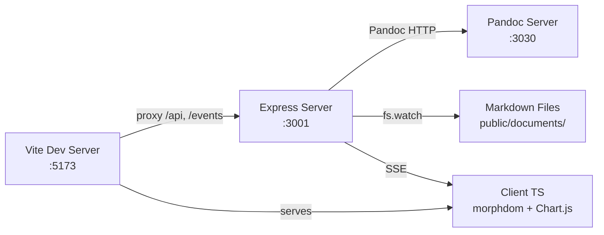

# ULFN — Codebase Review

> **Date**: June 11, 2026  
> **Scope**: Full repository — all source files in `src/`, `server/`, `scripts/`, `vite_plugins/`, config, and templates.  
> **Codebase size**: ~35 source files, ~2,300 lines of application code (excluding CSS and `node_modules`).

---

## Executive Summary

ULFN is a well-architected, purpose-built study tool that does exactly what it says — and does it with an unusually clean signal-to-noise ratio for a personal project. The codebase is small, focused, and has very few dead abstractions. The tech choices (Pandoc for rendering, EJS for server templates, morphdom for DOM patching) are pragmatic and appropriate.

That said, the project has grown organically and there are a handful of structural issues, two real bugs, and several missed opportunities for robustness that are worth addressing — especially if this codebase continues to grow or gets used by others.

**Overall assessment**: Strong fundamentals, thoughtful design decisions, a few risks hiding in the plumbing.

---

## Architecture

### What's Working Well



- **Three-process model** is clean. Pandoc runs as a separate server (2× faster than child_process, as your own benchmarks show), Express handles the API, Vite handles HMR and proxying.
- **Server-rendered HTML + morphdom** is a great choice for this app. You avoid SPA framework complexity while still getting smooth DOM updates. The SSE-based live reload is elegant.
- **Shared config file** ([config.ts](file:///c:/Users/Dell/ULFN/config.ts)) centralizes all ports, paths, and constants. Single source of truth.
- **Fail-fast startup** ([failFast.ts](file:///c:/Users/Dell/ULFN/server/failFast.ts)) validates file existence, directory creation, URL validity, and Pandoc connectivity before the server starts. This saves debugging time.
- **Zod schema** ([SRME.schema.ts](file:///c:/Users/Dell/ULFN/server/SRME.schema.ts)) defines the SRME data shape with proper nullable fields.

### Structural Concerns

| Area | Issue | Severity |
|------|-------|----------|
| No error handling middleware | Express routes have no `try/catch` or error middleware. An uncaught exception in any handler crashes the server. | 🔴 High |
| Single-threaded SRME regeneration | Every `/api/getDocumentSelectorBody` call re-reads and re-parses **all** markdown files from disk. For 284+ documents, this is O(n) I/O per request. | 🟡 Medium |
| No input validation on routes | Query params (`id`, `folder`, `discipline`, etc.) are cast with `as string` with no validation. `Number(req.query.id)` silently becomes `NaN` on bad input. | 🟡 Medium |
| Client router uses `switch` on pathname | [src/index.ts](file:///c:/Users/Dell/ULFN/src/index.ts) handles routing with a `switch` block. Adding a new page requires editing this file, but this is acceptable at the current scale. | 🟢 Low |

---

## Bugs & Correctness Issues

### 🔴 Bug 1: SSE watcher silently drops errors on async operations

In [server/index.ts:94](file:///c:/Users/Dell/ULFN/server/index.ts#L94), the `fs.watch` callback uses `async` inside a `forEach`:

```typescript
clients.forEach(async client => {  // ← fire-and-forget
    const result = await getDocumentViewerBodyHTML(client.documentId);
    client.res.write(...);
});
```

If `getDocumentViewerBodyHTML` throws (e.g., Pandoc is down, file disappeared), the error is silently swallowed — `forEach` does not await promises. The client will hang indefinitely waiting for the SSE update.

**Fix**: Use a `for...of` loop with `try/catch`, or `Promise.allSettled`.

---

### 🔴 Bug 2: `DSLA`, `PMG-D`, and `PMG-X` can display `0` as empty in EJS templates

In [documentViewer.ejs:46-54](file:///c:/Users/Dell/ULFN/server/ejs_templates/documentViewer.ejs#L46-L54), the pattern `<%- element['SRME']['DSLA'] || '&nbsp;' %>` treats `0` as falsy, so a metric value of exactly `0` renders as `&nbsp;` (blank). The same issue occurs for `LaMI`, `PMG-D`, and `PMG-X`.

The [documentCard.ejs](file:///c:/Users/Dell/ULFN/server/ejs_templates/documentCard.ejs#L52-L73) template has the identical bug in all four metric cells.

**Fix**: Use `element['SRME']['DSLA'] ?? '&nbsp;'` (nullish coalescing) or an explicit `!= null` check.

---

### 🟡 Bug 3: `snippet_expander` can clobber content when multiple macros coexist

In [snippet_expander.ts](file:///c:/Users/Dell/ULFN/vite_plugins/snippet_expander.ts#L21-L35), the `/ts` replacement runs `.replace(/\/ts/g, ...)` which will also match substrings of `/timestamp`. If a file contains both `/timestamp` and `/ts`, the `/timestamp` replacement runs first (good), but the second `.replace(/\/ts/g, ...)` will match the `ts` inside words like `https://` or any path containing `/ts`.

**Fix**: Use word-boundary-aware regex, e.g., `/(?<=\s|^)\/ts(?=\s|$)/g`.

---

### 🟡 Bug 4: `documentCard.ejs` uses `<dd>` and `<dt>` in inverted order

In [documentCard.ejs:24-33](file:///c:/Users/Dell/ULFN/server/ejs_templates/documentCard.ejs#L24-L33), `<dd>` (description) is used for the label and `<dt>` (term) is used for the value — these are semantically backwards. `<dt>` should be the term/label, `<dd>` should be the description/value.

---

## Security

| Issue | Location | Risk |
|-------|----------|------|
| **XSS via unescaped EJS** | [documentViewer.ejs](file:///c:/Users/Dell/ULFN/server/ejs_templates/documentViewer.ejs) uses `<%-` (unescaped) for `element['Classification']`, `element['Discipline']`, `element['Source']`, `element['Description']`, and `contentHTML`. Since these come from markdown files you control, the risk is low — but if you ever let users upload documents, this becomes critical. | 🟡 Low-Medium |
| **No rate limiting** | Express API has no rate limiter. Irrelevant for localhost, but matters if you ever expose this to a network. | 🟢 Low |
| **`openInVsCode` uses Vite's `__open-in-editor`** | [utils.ts](file:///c:/Users/Dell/ULFN/src/utils.ts) opens files in the editor via Vite's built-in endpoint. This is fine in dev but would be a code execution vector in production. Ensure this never reaches a production build. | 🟡 Medium |

---

## Performance

### Positives

- **KaTeX math cache** ([renderMath.ts](file:///c:/Users/Dell/ULFN/server/documentViewer/renderMath.ts#L4)) — excellent. Re-rendering the same LaTeX expression is free after the first pass.
- **Pandoc server mode** vs child_process — already benchmarked at 2× faster. Good decision.
- **Fast-path check** in `renderMath`: `if (!html.includes('math')) return html;` — avoids regex work for non-math documents.
- **Debounced fs.watch** ([server/index.ts:91-101](file:///c:/Users/Dell/ULFN/server/index.ts#L91-L101)) — 100ms debounce prevents rapid-fire re-renders on save.

### Opportunities

| Area | Current | Improvement |
|------|---------|-------------|
| **SRME generation** | Re-reads all .md files on every document selector request | Cache in memory, invalidate on `fs.watch` events. You already have `fs.watch` on the documents directory. |
| **EJS template reads** | [documentSelectorBody.ts:17](file:///c:/Users/Dell/ULFN/server/documentSelectorBody.ts#L17) reads the template file from disk on every request | Read once at startup or use `ejs.compile()` with caching. |
| **`documentViewerBody` for single doc** | [documentViewerBody.ts:18](file:///c:/Users/Dell/ULFN/server/documentViewer/documentViewerBody.ts#L18) calls `generateSRME(id)` which correctly scopes to a single file, but the lookup `SRME.find()` on the result still linear-searches the array | Minor, but you could return a single entry directly instead of wrapping in an array. |
| **SRMG weekly calculation** | [SRMG.ts:58-93](file:///c:/Users/Dell/ULFN/server/SRMG.ts#L58-L93) iterates all entries × 6 weeks × all attempts per entry. O(entries × weeks × attempts). | Pre-sort attempts once, or cache the SRMG output alongside SRME. |

---

## Code Quality & Style

### Strengths

- **Minimal abstractions** — the codebase doesn't over-abstract. Functions are short (most < 50 lines), well-named, and do one thing.
- **Good separation of concerns** — `SRME.ts` handles per-document metrics, `SRMG.ts` handles aggregation, `postProcessors.ts` handles exercise-type-specific HTML transforms. Clean boundaries.
- **Thoughtful comments** — the `getAttemptsFromMd` function has a clear explanation of the expected markdown format and regex breakdown. The Pandoc template comment explains the `standalone` workaround.
- **Performance annotations** — the commented-out `pandocRenderWithProcess` keeps the benchmarking context for future reference.

### Issues

| Issue | Severity | Details |
|-------|----------|---------|
| **Global function on `window`** | 🟡 Medium | [postProcessors.ts:106](file:///c:/Users/Dell/ULFN/server/documentViewer/postProcessors.ts#L106) generates `onclick="checkIfOptionWasSelectedCorrectly(this)"` but this function isn't defined — the client handler in [documentViewer.ts:100-107](file:///c:/Users/Dell/ULFN/src/documentViewer.ts#L100-L107) uses event delegation on `.mc-option` instead. The inline `onclick` is dead code that will silently throw `ReferenceError` in the console. |
| **`withPerformanceLog` never used** | 🟢 Low | [logger.ts:13](file:///c:/Users/Dell/ULFN/scripts/logger.ts#L13) exports `withPerformanceLog` but it's never imported anywhere. |
| **`performanceTester.ts` never used** | 🟢 Low | [performanceTester.ts](file:///c:/Users/Dell/ULFN/server/documentViewer/performanceTester.ts) exports `renderAllDocumentsWithPandoc()` but it's never called. Useful as a dev tool but could be moved to `scripts/`. |
| **`code_bundler` has empty config** | 🟢 Low | [code_bundler.ts:6-13](file:///c:/Users/Dell/ULFN/vite_plugins/code_bundler.ts#L6-L13) has empty `files` arrays — it generates empty `.txt` bundles on every build. Consider removing or populating. |
| **Inconsistent `fs` imports** | 🟢 Low | Some files use `import fs from 'fs'`, others use `import fs from 'node:fs'`. The `node:` protocol is preferred in modern Node.js. |
| **`documentValidator.ts` referenced but empty** | 🟢 Low | [src/index.ts:13-14](file:///c:/Users/Dell/ULFN/src/index.ts#L13-L14) imports `./documentValidator.ts` but the file has no size data, suggesting it may be empty or minimal. |
| **Duplicate `openAtVSCodeSpan` ID** | 🟡 Medium | [documentCard.ejs:81](file:///c:/Users/Dell/ULFN/server/ejs_templates/documentCard.ejs#L81) assigns `id="openAtVSCodeSpan"` but this template is rendered for **every** document card — producing duplicate IDs on the page. Use a class instead. |

---

## Maintainability

### What's Good

- **Excellent README** — the [README.md](file:///c:/Users/Dell/ULFN/README.md) is comprehensive with clear project structure, setup instructions, architecture docs, and exercise format specs.
- **CSS organization** — numbered CSS files in `src/styles/` (e.g., `1_global.css`, `5_documentCard.css`) make load order explicit and discoverable.
- **Zod schema as single source of truth** — the `SRME.schema.ts` defines the shape once, and the type is inferred with `z.infer<>`.

### What Could Improve

| Area | Suggestion |
|------|------------|
| **No tests at all** | The codebase has zero test files. Key candidates for unit testing: `calculateSRME()`, `getAttemptsFromMd()`, `postProcessorClozeExercise()`, `postProcessorKeywordsExercise()`, `normalizeRules()`. These are pure functions — easy to test. |
| **No TypeScript strict mode** | `tsconfig.json` does not enable `strict: true`. You have `noUnusedLocals` and `noUnusedParameters`, which is good, but you're missing `strictNullChecks`, `strictFunctionTypes`, etc. |
| **Playlist config is hardcoded** | [playlists.config.ts](file:///c:/Users/Dell/ULFN/server/playlists.config.ts) is a 165-line file of manually maintained arrays. Consider generating this from the filesystem or a simpler config format (JSON/YAML). |
| **`app.log` grows unbounded** | [logger.ts](file:///c:/Users/Dell/ULFN/scripts/logger.ts) appends to `app.log` with no rotation. The file is already 365KB. Over time this will bloat. |
| **Inline HTML in server modules** | [documentSelectorBody.ts](file:///c:/Users/Dell/ULFN/server/documentSelectorBody.ts#L93-L146) and [documentsPlaylistsBody.ts](file:///c:/Users/Dell/ULFN/server/documentsPlaylistsBody.ts) build HTML with template literals, while `documentViewerBody.ts` uses EJS templates. The inconsistency makes it harder to find where markup lives. |

---

## Dependency Health

| Package | Version | Notes |
|---------|---------|-------|
| `typescript` | `~6.0.3` | Latest stable. ✅ |
| `vite` | `^8.0.16` | Latest major. ✅ |
| `express` | `^5.2.1` | Express 5 — good, you're ahead of most projects. ✅ |
| `playwright` | `^1.60.0` | Current. Used only for PDF export. ✅ |
| `zod` | `^4.4.3` | Zod v4 — latest. ✅ |
| `katex` | `^0.17.0` | Current minor. ✅ |
| `mermaid` | `^11.15.0` | Current. ✅ |
| `chart.js` | `^4.5.1` | Current. ✅ |
| `morphdom` | `^2.7.8` | Stable, low-maintenance. ✅ |
| `ejs` | `^5.0.2` | EJS 5 — current. ✅ |

> [!TIP]
> All dependencies are current and well-maintained. The dependency tree is refreshingly small — 9 runtime deps for a feature-rich app.

---

## Prioritized Recommendations

### P0 — Fix Now (Correctness / Reliability)

1. **Add Express error handling middleware** — a single `app.use((err, req, res, next) => ...)` at the end of the route chain prevents server crashes.
2. **Fix the `0`-as-falsy bug in EJS templates** — change `||` to `??` for all SRME metric displays.
3. **Fix the async `forEach` in `fs.watch`** — use `for...of` with `try/catch`.

### P1 — Do Soon (Code Health)

4. **Remove the dead `onclick="checkIfOptionWasSelectedCorrectly(this)"`** from `postProcessors.ts` — it generates console errors on every click.
5. **Fix the `/ts` regex in `snippet_expander.ts`** to avoid false matches.
6. **Fix duplicate `id="openAtVSCodeSpan"`** — use a class instead.
7. **Fix `<dd>`/`<dt>` inversion** in `documentCard.ejs`.

### P2 — Do When Convenient (Performance / Maintainability)

8. **Cache SRME data in memory** with `fs.watch` invalidation instead of re-reading all files per request.
9. **Cache compiled EJS templates** using `ejs.compile()`.
10. **Add `strict: true`** to `tsconfig.json`.
11. **Add basic tests** for the pure functions in `SRME.ts` and `postProcessors.ts`.
12. **Implement log rotation** for `app.log` (e.g., truncate at 1MB or rotate daily).

### P3 — Nice to Have

13. Clean up unused exports: `withPerformanceLog`, `performanceTester.ts`.
14. Remove the empty `code_bundler` config or populate it.
15. Standardize `fs` imports to use `node:fs` everywhere.
16. Move inline HTML in `documentSelectorBody.ts` / `documentsPlaylistsBody.ts` to EJS templates for consistency.

---

## Summary Scorecard

| Dimension | Score | Notes |
|-----------|-------|-------|
| **Architecture** | ⭐⭐⭐⭐ | Clean three-process design, good separation, pragmatic tech choices |
| **Correctness** | ⭐⭐⭐ | Two real bugs (falsy `0`, async `forEach`), plus a dead `onclick` handler |
| **Security** | ⭐⭐⭐⭐ | Low risk for a localhost app; would need hardening for network exposure |
| **Performance** | ⭐⭐⭐ | Good micro-optimizations (math cache, Pandoc server), but SRME regeneration is wasteful |
| **Code Quality** | ⭐⭐⭐⭐ | Clean, readable, well-commented; minor inconsistencies |
| **Maintainability** | ⭐⭐⭐ | Excellent README, but no tests, no strict TS, growing log file |
| **Dependencies** | ⭐⭐⭐⭐⭐ | All current, minimal, well-chosen |
