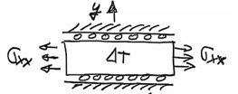

---
Classification	        :	Formula-Based Exercise
Discipline				:	EES022 Introdução à Mecânica dos Sólidos
Source					:	2025-1 Lista 3
Description				:	L3-Q5
---

# Proposition

Para a chapa ao lado, $\sigma_{xx} = 20 MPa, \varepsilon_{yy}=0, E = 2 \times 10^5 MPa, \nu=0.3 \text{ e } \alpha=10^{-6}/^{\circ}C$

a) Determine $\sigma_{yy}$ para $\Delta T=0$
b) Determine $\Delta T$ para que $\sigma_{yy}$ seja nulo. Considere $\sigma_{zz}=\sigma_{xz}=\sigma_{yz}=0$
c) Verifique se haverá escoamento do material da placa sabendo que $\sigma_{escoamento} = 400 MPa$. Faça sua verificação considerando:
c.1) Critério de TRESCA
c.2) Critério de Von Mises.

# Step-by-step

# Answer

# Attempts
