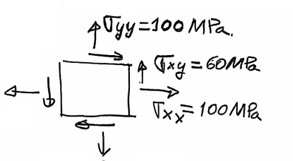

---
Classification	        :	Formula-Based Exercise
Discipline				:	EES022 Introdução à Mecânica dos Sólidos
Source					:	2025-1 Lista 3
Description				:	L3-Q6
---

# Proposition

Uma chapa de alumínio ($E=7.2 \times 10^{10} N/m^2$ e $\nu=0.33$) está submetida ao estado plano de tensões indicado na figura. Determine:
a) Componentes principais tensões.
b) Componentes principais deformação.
c) Deformação longitudinal na direção de $30^{\circ}$ (sentido anti-horário) com eixo $x$.

# Step-by-step

# Answer

# Attempts
