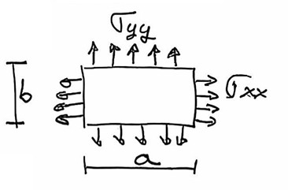

---
Classification	        :	Formula-Based Exercise
Discipline				:	EES022 Introdução à Mecânica dos Sólidos
Source					:	2025-1 Lista 3
Description				:	L3-Q7
---

# Proposition

Para a chapa da figura, determine:
a) $\sigma_{yy}$ para que a dimensão "$b$" não altere.
b) Variação $\Delta a$ da dimensão "$a$" na situação da letra (a).

Expresse seus resultados em termos de $E, \nu, \sigma_{xx}, "a"$ e "$b"$. $\sigma_{xx}$ e $\sigma_{yy}$ são uniformemente distribuídas.

# Step-by-step

# Answer

# Attempts
