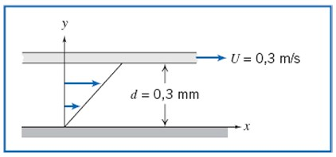

---
Classification	        :	Formula-Based Exercise
Discipline				:	EMA091 Mecânica dos fluidos
Source					:	FOX AND McDONALD’S Edição 8 - p59
Description				:	Exemplo 2.2 VISCOSIDADE E TENSÃO DE CISALHAMENTO EM UM FLUIDO NEWTONIANO
---

# Proposition

Uma placa infinita move-se sobre uma segunda placa, havendo entre elas uma camada de líquido, como mostrado. Para uma pequena altura da camada, d, podemos supor uma distribuição linear de velocidade no líquido. A viscosidade do líquido é 0,0065 g/cm · s e sua densidade relativa é 0,88.
Determine:
a) A viscosidade absoluta do líquido, em N · s/m2.
b) A viscosidade cinemática do líquido, em m2/s.
c) A tensão de cisalhamento na placa superior, em N/m2.
d) A tensão de cisalhamento na placa inferior, em Pa.
e) O sentido de cada tensão cisalhante calculada nas partes c) e d)

# Step-by-step

$$
v = \frac{1 \, \text{N} \cdot 1 \, \text{m}}{1 \, \text{m}^2 \cdot 0,001 \, \text{N s/m}^2}
$$

# Answer

a) $\mu = 0,00065 \, N·s/m²$
b) $\nu = 7,386 \cdot 10⁻⁷ m²/s$
c) $\tau_\text{superior} = 0,65 N/m²$
d) $\tau_\text{inferior} = 0,65 Pa$
e) Na placa superior: para a esquerda (sentido contrário ao movimento). Na placa inferior: para a direita (sentido do movimento do fluido).

# Attempts
