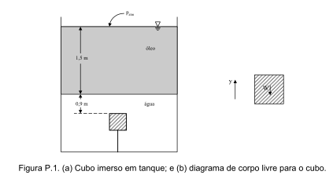
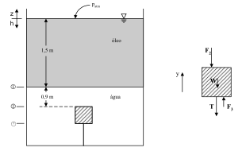

---
Classification	        :	Formula-Based Exercise
Discipline				:	EMA091 Mecânica dos fluidos
Source					:	2025-08-20 Exercícios Estática - 01
Description				:	1 - Cubo imerso
---

# Proposition

Um cubo de carvalho maciço com 30 cm de aresta é mantido submerso por um tirante, conforme mostrado na Figura P.1. Calcule a força real da água sobre a superfície inferior do cubo e a tração no tirante. Os valores das densidades são: água $\rho_{\text{água}}=1000$ kg/m$^3$, carvalho $\rho_{\text{carvalho}}=770$ kg/m$^3$, e óleo $\rho_{\text{óleo}}=800$ kg/m$^3$.

# Step-by-step

## Fórmulas

$$
\frac{dp}{dz} = -\rho g
$$

$$
\vec F = - \int \rho \, d\, \vec A
$$

## Considerações necessárias para resolver o problema com as fórmulas acima
1. Fluido estático
2. Densidade dos fluidos constantes

## Cálculos

Sendo
- $h_0$ a altura na superfície do óleo
- $h_1$ a altura na altura entre o óleo entra em contato com a água
- $h_2$ a altura na face superior do cubo
- $h_3$ a altura na face inferior do cubo

---

- $F_2$ a pressão da coluna de fluido na face superior do cubo
- $F_3$ a pressão da coluna de fluido na face inferior
- W o peso do cubo
- T a tração do tirante no cubo

---

$$
\frac{dp}{dh} = \rho g
$$

$$
dp = \rho g dh
$$

$$
\int_{p_{0}=p_{atm}}^{p_3} dp = \int_{h_0}^{h_3} \rho g dh = \int_{h_0}^{h_1} \rho_{óleo} g dh + \int_{h_1}^{h_3} \rho_{água} g dh
$$

$$
p_3 - p_{atm} = \rho_{óleo} g (h_1 - h_0) + \rho_{água} g (h_3 - h_1)
$$

$$
p_3 = p_{atm} + \rho_{óleo} g (h_1 - h_0) + \rho_{água} g (h_3 - h_1)
$$

$$
= 101,3 \cdot 10^3 + 800 \cdot 9,81(1,5 - 0) + 1000 \cdot 9,81(2,7 - 1,5)
$$

$$
= 124844 N/m^2
$$

---

$$
p_2 = p_{atm} + \rho_{óleo} g (h_1 - h_0) + \rho_{água} g (h_2 - h_1)
$$

$$
= 101,3 \cdot 10^3 + 800 \cdot 9,81(1,5 - 0) + 1000 \cdot 9,81(2,4 - 1,5)
$$

$$
= 121901 N/m^2
$$

---

$$
\vec{F} = - \int \rho d\vec{A}
$$

$$
F_3 = p_3 \int dA = 124844 \cdot 0,3^2 = 11235,96 N
$$

$$
F_2 = p_2 \int dA = 121901 \cdot 0,3^2 = 10971,09 N
$$

$$
W = \rho_{carvalho} g V = 770 \cdot 9,81 \cdot 0,3^3 = 203,95 N
$$

$$
\sum F_y = 0 = F_3 - F_2 - W - T
$$

$$
T = F_3 - F_2 - W
$$

$$
T = 11235,96 - 10971,09 - 203,95 = 60,92 N
$$

## Método 2: usando empuxo

$$
E = \rho_{\text{água}} \cdot g \cdot V_{\text{cubo}}
$$

$$
E = 1000 \frac{\text{kg}}{\text{m}^3} \cdot 9,81 \frac{\text{m}}{\text{s}^2} \cdot (0,3 \text{ m})^3
$$

$$
E = 1000 \cdot 9,81 \cdot 0,027 = 264,87 \text{ N}
$$

---

$$
E - W - T = 0
$$

$$
T = E - W
$$

$$
T = 264,87 \text{ N} - 203,95 \text{ N} = 60,92 \text{ N}
$$

# Answer

$$
F_3 = 11235,96 N
$$

$$
T = 60,92 N
$$

# Attempts

2025-08-20T19:50:54Z 0
