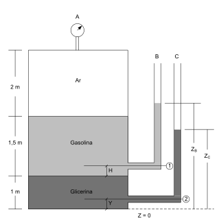

---
Classification	        :	Formula-Based Exercise
Discipline				:	EMA091 Mecânica dos fluidos
Source					:	2025-08-20 Exercícios Estática - 01
Description				:	1 - Cubo imerso
---

# Proposition

Na Figura P.4, o manômetro "A" lê a pressão de 1,5 kPa. Todos os fluidos estão a $20^{\circ}$C e os pesos específicos ($\gamma=\rho g$) dos mesmos são: $\gamma_{\text{ar}}=12$ N/m$^3$, $\gamma_{\text{gasolina}}=6670$ N/m$^3$, $\gamma_{\text{glicerina}}=12360$ N/m$^3$. Determinar as alturas (em metros) dos líquidos nos tubos abertos B e C.

# Step-by-step

# Answer

# Attempts
