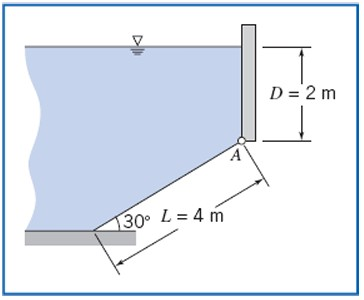
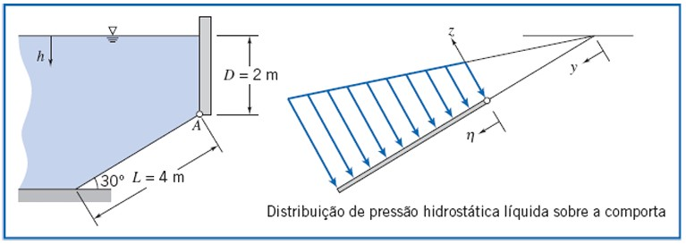

---
Classification	        :	Formula-Based Exercise
Discipline				:	EMA091 Mecânica dos fluidos
Source					:	FOX AND McDONALD’S Edição 8 - p115
Description				:	Exemplo 3.5 FORÇA RESULTANTE SOBRE UMA SUPERFÍCIE PLANA INCLINADA SUBMERSA
---

# Proposition

A superfície inclinada mostrada, articulada ao longo de $A$, tem 5 m de largura. Determine as coordenadas do centro de pressão $x'$ e $y'$, da água e do ar sobre a superfície inclinada. $F_R = 588 \text{kN}$.

Usar um sistema de coordenadas onde o eixo y se origina na superfície livre da água e segue ao longo da inclinação da comporta.

# Step-by-step

É interessante observar que enquanto a força resultante é necessária para o método usando integração, o centro de pressão pode ser determinado sem esse valor usando equações algébricas.

## Método 1: Equações algébricas

$$
x' = x_c + \frac{I_{xyc}}{y_c \cdot A}
$$

$$
y' = y_c + \frac{I_{xc}}{y_c \cdot A}
$$

---

Como a comporta retangular, apresenta simetria:

$$
I_{xyc} = 0
$$

$$
x' = x_c = 2,5 \text{ m}
$$

---

$$
y_c = y_A + \frac{L}{2}
$$

$$
A = L \times b = 4 \text{ m} \times 5 \text{ m} = 20 \text{ m}^2
$$

$$
y_A = \frac{D}{\sin(30^\circ)} = \frac{2 \text{ m}}{0.5} = 4 \text{ m}
$$

$$
y_c = y_A + \frac{L}{2} = 4 \text{ m} + \frac{4 \text{ m}}{2} = 6 \text{ m}
$$

$$
I_{xc} = \frac{b \cdot L^3}{12}
$$

$$
I_{xc} = \frac{(5 \text{ m}) \cdot (4 \text{ m})^3}{12} = \frac{80}{3} \text{ m}^4 \approx 26.67 \text{ m}^4
$$

$$
y' = 6 \text{ m} + \frac{\frac{80}{3} \text{ m}^4}{(6 \text{ m}) \cdot (20 \text{ m}^2)} = \frac{56}{9} \text{ m} \approx 6.22 \text{ m}
$$

## Método 2: Integração
O centro de pressão ($x' , y'$) é um ponto teórico no qual hipoteticamente poderiamos aplicar a força resultante para gerar o mesmo momento (ou torque) que a força distribuida causada pela pressão. Em outras palavras:

Momento total da força resultante = Momento total da força distribuída

---

Momento = (Força) x (Braço de alavanca)

Momento total da força resultante = $F_R \cdot \eta'$

Momento total da força distribuída = $\int_A \eta \, dF$

---

$$
F_R \cdot \eta' = \int_A \eta \, dF
$$

$$
F_R \cdot \eta' = \int_A \eta \, (P \,dA)
$$

$$
\eta' = \frac{1}{F_R} \cdot \int \eta \, (P \,dA)
$$

---

$$
P = (\rho \cdot g \cdot h)
$$

$$
h = D + \eta \cdot \sin(\alpha)
$$

$$
dA = w \cdot d\eta
$$

---

$$
\eta' = \frac{\rho \cdot g}{F_R} \cdot \int \eta \, h \,dA
$$

$$
\eta' = \frac{\rho \cdot g}{F_R} \cdot \int_{\eta = 0}^{\eta = L} \eta \cdot(D + \eta \cdot \sin(\alpha)) \cdot w \cdot d\eta
$$

$$
\eta' = \frac{\rho \cdot g \cdot w}{F_R} \cdot \left[\int_{\eta = 0}^{\eta = L} (\eta \cdot D) \cdot d\eta + \int_{\eta = 0}^{\eta = L} (\eta ^2 \cdot \sin(\alpha)) \cdot d\eta \right]
$$

$$
\eta' = \frac{\rho \cdot g \cdot w}{F_R} \cdot \left[\frac{L^2}{2} \cdot D + \frac{L^3}{3} \cdot \sin(\alpha)\right]
$$

$$
\eta' = \frac{1000 \cdot 9,81 \cdot 5}{588000} \cdot \left[\frac{4^2}{2} \cdot 2 + \frac{4^3}{3} \cdot \sin(30°)\right] = 2,22 m
$$

$$
y' = \frac{D}{\sin(\alpha)} + \eta' = \frac{2}{\sin(30^\circ)} + 2,22 = 4 + 2,22 = 6,22 \text{ m}
$$

---

$$
x' = \frac{1}{F_R} \int_A \frac{w}{2} p \, dA = \frac{w}{2F_R} \int_A p \, dA = \frac{w}{2} = 2,5 \text{m}
$$

# Answer

$$
x' = 2,5m \quad y' = 6,22m
$$

# Attempts

2025-09-02T21:17:01Z 0
