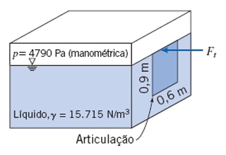
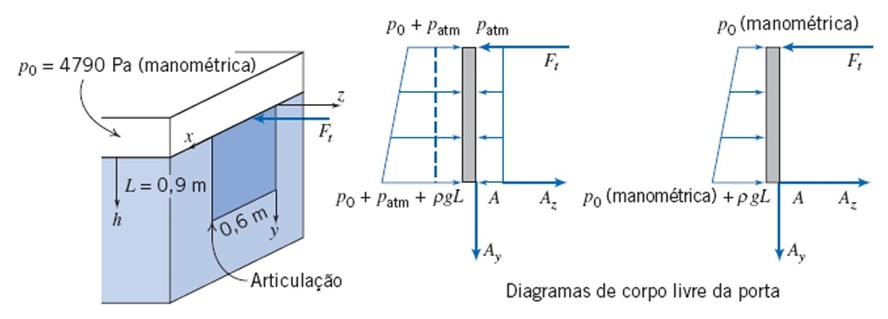
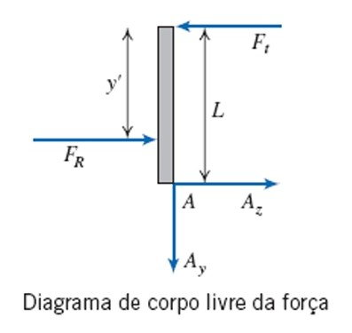

---
Classification	        :	Formula-Based Exercise
Discipline				:	EMA091 Mecânica dos fluidos
Source					:	FOX AND McDONALD’S Edição 8 - p118
Description				:	Exemplo 3.6  FORÇA SOBRE UMA SUPERFÍCIE VERTICAL PLANA, SUBMERSA, COM PRESSÃO MANOMÉTRICA DIFERENTE DE ZERO NA SUPERFÍCIE LIVRE
---

# Proposition

A porta mostrada na lateral do tanque é articulada ao longo da sua borda inferior. Uma pressão de 4790Pa (manométrica) é aplicada na superfície livre do líquido. Determine a força, $F_A$, requerida para manter a porta fechada

# Step-by-step

$$
\sum M = 0
$$

$$
F_A \cdot L = F_R \cdot (L - y')
$$

$$
F_A = \frac{F_R}{L} (L - y')
$$

---

$$
F_R = P_C A = (P_0 + \rho g h_c) A
$$

$$
A = Lw
$$

$$
h_c = L/2
$$

$$
F_R = (P_0 + \rho g L/2) Lw = (P_0 + \gamma L/2) Lw
$$

$$
= (4790 + 15715 \cdot 1 \cdot 0,9/2) 0,9 \cdot 0,6
$$

$$
= 6405,35 N
$$

---

$$
y' = y_c + \frac{\rho g \sin(\alpha) I_{xx}}{F_R}
$$

$$
y_c = L/2
$$

$$
I_{xx} = \frac{wL^3}{12}
$$

$$
y' = L/2 + \frac{\gamma \sin(\alpha) wL^3}{F_R \cdot 12}
$$

$$
= \frac{0,9}{2} + \frac{15715 \cdot \sin(90) \cdot 0,6 \cdot 0,9^3}{6405,35 \cdot 12}
$$

$$
= 0,54 m
$$

---

$$
F_A = \frac{6405,35}{0,9} (0,9 - 0,54)
$$

$$
= 2562,14 N
$$

# Answer

$$
\boxed{F_A = 2562,14 N}
$$

# Attempts

2025-09-02T23:38:39Z 0
