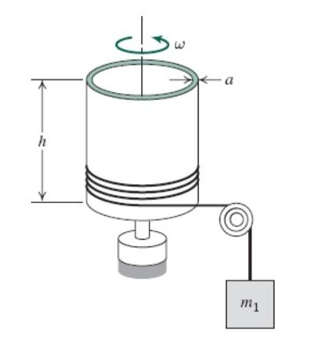

---
Classification	        :	Formula-Based Exercise
Discipline				:	EMA091 Mecânica dos fluidos
Source					:	2025-2 Lista Rudolf - Capítulo 2
Description				:
---

# Proposition

1. Um líquido viscoso é cisalhado entre dois discos paralelos: o disco superior gira e o inferior é fixo. O campo de velocidade entre os discos é dado por ${V} = \frac{\hat{e}_\theta \omega z}{h}$. (A origem das coordenadas está localizada no centro do disco inferior; o disco superior está em $z = h$.) Quais são as dimensões desse campo de velocidade? Ele satisfaz as condições físicas de fronteira apropriadas? Quais são elas?

2. Um campo de velocidade é especificado como $\vec{V} = axy\hat{i} + by^2\hat{j}$, em que $a = 2 \text{ m}^{-1}\text{s}^{-1}$, $b = -6 \text{ m}^{-1}\text{s}^{-1}$ e as coordenadas são medidas em metros. O campo de escoamento é uni, bi ou tridimensional? Por quê? Calcule as componentes da velocidade no ponto $(2, \frac{1}{2})$. Deduza uma equação para a linha de corrente que passa por esse ponto. Trace algumas linhas de corrente no primeiro quadrante incluindo aquela que passa pelo ponto $(2, \frac{1}{2})$.

3. Considere o campo de escoamento dado na descrição euleriana pela expressão $\vec{V} = A\hat{i} - Bt\hat{j}$, em que $A = 2 \text{ m/s}$, $B = 2 \text{ m/s}^2$ e as coordenadas são medidas em metros. Deduza as funções de posição lagrangiana para a partícula fluida que passou pelo ponto $(x,y)=(1,1)$ no instante $t=0$. Obtenha uma expressão algébrica para a trajetória seguida por essa partícula. Trace a trajetória e compare-a com as linhas de corrente que passam por esse mesmo ponto nos instantes $t=0, 1 \text{ e } 2 \text{ s}$.

4. A distribuição de velocidade para o escoamento laminar desenvolvido entre placas paralelas é dada por

$$
\frac{u}{u_{max}} = 1 - \left(\frac{2y}{h}\right)^2
$$

em que $h$ é a distância separando as placas e a origem está situada na linha mediana entre as placas. Considere um escoamento de água a $15^{\circ}\text{C}$, com $u_{max} = 0,20 \text{ m/s}$ e $h=0,2 \text{ mm}$. Calcule a tensão de cisalhamento na placa superior e dê o seu sentido. Esboce a variação da tensão de cisalhamento em uma seção transversal do canal.

5. O delgado cilindro externo (massa $m_2$ e raio R) de um pequeno viscosímetro portátil de cilindros concêntricos é acionado pela queda de uma massa, $m_1$, ligada a uma corda. O cilindro interno é estacionário. A folga entre os cilindros é $a$. Desprezando o atrito do mancal externo, a resistência do ar e a massa do líquido no viscosímetro, obtenha uma expressão algébrica para o torque devido ao cisalhamento viscoso que atua no cilindro à velocidade angular $\omega$. Deduza e resolva uma equação diferencial para a velocidade angular do cilindro externo como função do tempo. Obtenha uma expressão para a velocidade angular máxima do cilindro.

6. De acordo com Folsom, a elevação capilar $\Delta h$ (mm) de uma interface água-ar em um tubo é correlacionada pela seguinte expressão empírica:

$$
\Delta h = Ae^{-bD}
$$

no qual D (mm) é o diâmetro do tubo, $A=0,400$ e $b=4,37$. Você faz um experimento para medir $\Delta h$ em função de D e obtém:

D (mm) 2,5 5,0 7,5 10,0 12,5 15,0 17,5 20,0 22,5 25,0 27,5

$\Delta h$ (mm) 5,8 4,6 2,25 1,48 1,30 0,83 0,43 0,25 0,15 0,10 0,08

Quais são os valores de A e b que melhor ajustam esses dados usando a ferramenta linha de tendência do Excel? Esses valores concordam com os valores de Folsom? Os dados obtidos são bons? Quanto? Refaça os cálculos convertendo D e $\Delta h$ para polegadas. Qual a sua conclusão?

# Step-by-step

## **1**

**Dimensões do Campo de Velocidade**

$$
\vec{V} = \frac{\hat{e}_\theta \omega z}{h}
$$

$$
[\vec{V}] = [\hat{e}_\theta] [\omega] [z] [h]^{-1}
$$

$$
[\hat{e}_\theta] = 1 \text{ (adimensional)}
$$

$$
[\omega] = T^{-1}
$$

$$
[z] = L
$$

$$
[h] = L
$$

$$
[\vec{V}] = (1)(T^{-1})(L)(L^{-1}) = T^{-1}
$$

As dimensões do campo de velocidade fornecido são $T^{-1}$, o que não corresponde às dimensões de velocidade ($LT^{-1}$). O campo, como escrito, é dimensionalmente inconsistente para um campo de velocidade. Uma forma comum para este escoamento é $\vec{V} = \frac{\hat{e}_\theta r \omega z}{h}$, que é dimensionalmente correta.

**Condições de Fronteira Físicas**

1.  **Disco inferior (fixo) em $z=0$**: Condição de não escorregamento. A velocidade do fluido na parede é zero.

$$
\vec{V}(z=0) = \vec{0}
$$

2.  **Disco superior (giratório) em $z=h$**: Condição de não escorregamento. A velocidade do fluido na parede é igual à velocidade da parede.

$$
\vec{V}(z=h) = r\omega \hat{e}_\theta
$$

**Verificação das Condições de Fronteira**

1.  **Em $z=0$**:

$$
\vec{V}(z=0) = \frac{\hat{e}_\theta \omega (0)}{h} = \vec{0}
$$

    A condição no disco inferior é satisfeita.
2.  **Em $z=h$**:

$$
\vec{V}(z=h) = \frac{\hat{e}_\theta \omega (h)}{h} = \omega \hat{e}_\theta
$$

    A condição no disco superior, $\vec{V}(z=h) = r\omega \hat{e}_\theta$, não é satisfeita, exceto no raio específico $r=1$. O campo de velocidade dado é independente de $r$.

***

## **2**

**Análise do Campo de Escoamento**

$$
\vec{V} = axy\hat{i} + by^2\hat{j}
$$

Componentes da velocidade:

$$
u = axy
$$

$$
v = by^2
$$

$$
w = 0
$$

O campo de escoamento é **bidimensional** porque a componente $w$ da velocidade é nula e as componentes $u$ e $v$ são funções de apenas duas coordenadas espaciais ($x$ e $y$).

**Cálculo da Velocidade**

No ponto $(x, y) = (2, 1/2)$, com $a = 2 \text{ m}^{-1}\text{s}^{-1}$ e $b = -6 \text{ m}^{-1}\text{s}^{-1}$:

$$
u = (2)(2)(\frac{1}{2}) = 2 \text{ m/s}
$$

$$
v = (-6)(\frac{1}{2})^2 = -6(\frac{1}{4}) = -1.5 \text{ m/s}
$$

$$
\vec{V}(2, 1/2) = 2\hat{i} - 1.5\hat{j} \text{ m/s}
$$

**Equação da Linha de Corrente**

A equação diferencial para uma linha de corrente é:

$$
\frac{dy}{dx} = \frac{v}{u} = \frac{by^2}{axy} = \frac{b}{a} \frac{y}{x}
$$

Separando as variáveis:

$$
\frac{dy}{y} = \frac{b}{a} \frac{dx}{x}
$$

Integrando:

$$
\int \frac{dy}{y} = \int \frac{b}{a} \frac{dx}{x}
$$

$$
\ln(y) = \frac{b}{a} \ln(x) + C_1
$$

$$
\ln(y) = \ln(x^{b/a}) + C_1 \implies y = e^{C_1} x^{b/a}
$$

$$
y = C x^{b/a}
$$

Calculando o expoente:

$$
\frac{b}{a} = \frac{-6}{2} = -3
$$

A equação geral é $y = C x^{-3}$.
Para a linha de corrente que passa por $(2, 1/2)$:

$$
\frac{1}{2} = C (2)^{-3} = \frac{C}{8} \implies C = 4
$$

A equação da linha de corrente é:

$$
y = 4x^{-3} \quad \text{ou} \quad x^3y = 4
$$

**Esboço das Linhas de Corrente**

As linhas de corrente no primeiro quadrante são da forma $y = C/x^3$. São curvas que decaem do eixo y para o eixo x.
-   Para $C=4$ (passando por $(2, 1/2)$), a curva também passa por $(1, 4)$.
-   Para $C=1$ (passando por $(1, 1)$), a curva é $y=1/x^3$.
-   Para $C=8$ (passando por $(2, 1)$), a curva é $y=8/x^3$.
Todas as curvas se aproximam do infinito quando $x \to 0$ e se aproximam de zero quando $x \to \infty$.

***

## **3**

**Funções de Posição Lagrangiana**

Campo de velocidade euleriano:

$$
\vec{V} = u(t)\hat{i} + v(t)\hat{j} = A\hat{i} - Bt\hat{j}
$$

Para uma partícula fluida $(x_p, y_p)$:

$$
u_p = \frac{dx_p}{dt} = A
$$

$$
v_p = \frac{dy_p}{dt} = -Bt
$$

Integrando em relação ao tempo:

$$
\int_{x_0}^{x_p} dx'_p = \int_{t_0}^{t} A dt' \implies x_p(t) - x_0 = A(t - t_0)
$$

$$
\int_{y_0}^{y_p} dy'_p = \int_{t_0}^{t} -Bt' dt' \implies y_p(t) - y_0 = -\frac{B}{2}(t^2 - t_0^2)
$$

Condição inicial: em $t_0=0$, a partícula está em $(x_0, y_0) = (1, 1)$.

$$
x_p(t) - 1 = A(t - 0) \implies x_p(t) = 1 + At
$$

$$
y_p(t) - 1 = -\frac{B}{2}(t^2 - 0) \implies y_p(t) = 1 - \frac{B}{2}t^2
$$

Com $A=2 \text{ m/s}$ e $B=2 \text{ m/s}^2$:

$$
x_p(t) = 1 + 2t
$$

$$
y_p(t) = 1 - t^2
$$

**Equação da Trajetória (Pathline)**

Eliminar o tempo $t$ das equações de posição:
Da equação para $x_p$: $t = \frac{x_p - 1}{2}$.
Substituindo na equação para $y_p$:

$$
y_p = 1 - \left(\frac{x_p - 1}{2}\right)^2 = 1 - \frac{(x_p-1)^2}{4}
$$

A trajetória é a parábola $y = 1 - \frac{(x-1)^2}{4}$.

**Linhas de Corrente (Streamlines)**

A equação da linha de corrente é $\frac{dy}{dx} = \frac{v}{u}$. Em um instante fixo $t$:

$$
\frac{dy}{dx} = \frac{-Bt}{A}
$$

Esta é a equação de uma reta com inclinação $m = -Bt/A$.
-   **Em $t=0$ s**:

$$
m = 0 \implies \frac{dy}{dx} = 0 \implies y = \text{constante}
$$

    Passando por $(1,1)$, a linha de corrente é $y=1$.
-   **Em $t=1$ s**:

$$
m = \frac{-(2)(1)}{2} = -1 \implies \frac{dy}{dx} = -1 \implies y = -x + C
$$

    Passando por $(1,1)$: $1 = -1 + C \implies C=2$. A linha de corrente é $y = -x + 2$.
-   **Em $t=2$ s**:

$$
m = \frac{-(2)(2)}{2} = -2 \implies \frac{dy}{dx} = -2 \implies y = -2x + C
$$

    Passando por $(1,1)$: $1 = -2(1) + C \implies C=3$. A linha de corrente é $y = -2x + 3$.

**Comparação**
O escoamento é não permanente (depende do tempo), então as trajetórias e as linhas de corrente são diferentes.
-   A **trajetória** é uma única curva parabólica $y = 1 - (x-1)^2/4$ que descreve o caminho da partícula que partiu de $(1,1)$.
-   As **linhas de corrente** são "instantâneos" do campo de escoamento. Em $t=0, 1, 2$ s, as linhas de corrente que passam pelo ponto $(1,1)$ são as retas $y=1$, $y=-x+2$ e $y=-2x+3$, respectivamente. A trajetória é tangente à linha de corrente correspondente em cada instante de tempo na posição da partícula.

***

## **4**

**Cálculo da Tensão de Cisalhamento**

Perfil de velocidade:

$$
u(y) = u_{max} \left[1 - \left(\frac{2y}{h}\right)^2\right] = u_{max} \left(1 - \frac{4y^2}{h^2}\right)
$$

A tensão de cisalhamento é dada por $\tau_{yx} = \mu \frac{du}{dy}$.
Gradiente de velocidade:

$$
\frac{du}{dy} = \frac{d}{dy} \left[ u_{max} \left(1 - \frac{4y^2}{h^2}\right) \right] = u_{max} \left(-\frac{8y}{h^2}\right) = -\frac{8 u_{max} y}{h^2}
$$

Na placa superior, $y = h/2$:

$$
\left. \frac{du}{dy} \right|_{y=h/2} = -\frac{8 u_{max} (h/2)}{h^2} = -\frac{4 u_{max}}{h}
$$

Valores dados:
-   Fluido: água a $15^{\circ}\text{C} \implies \mu \approx 1.14 \times 10^{-3} \text{ Pa} \cdot \text{s}$.
-   $u_{max} = 0.20 \text{ m/s}$.
-   $h = 0.2 \text{ mm} = 0.2 \times 10^{-3} \text{ m}$.
A tensão de cisalhamento exercida pela placa sobre o fluido em $y=h/2$ é:

$$
\tau_{placa \to fluido} = \mu \left. \frac{du}{dy} \right|_{y=h/2} = \mu \left(-\frac{4 u_{max}}{h}\right)
$$

$$
\tau_{placa \to fluido} = (1.14 \times 10^{-3}) \left(-\frac{4 \times 0.20}{0.2 \times 10^{-3}}\right) = (1.14 \times 10^{-3}) (-4000) = -4.56 \text{ Pa}
$$

A tensão de cisalhamento na placa superior (exercida pelo fluido sobre a placa) é, pela terceira lei de Newton, igual em magnitude e oposta em sentido:

$$
\tau_{na\;placa} = - \tau_{placa \to fluido} = 4.56 \text{ Pa}
$$

O sentido desta tensão é na direção positiva de $x$ (direção do escoamento).

**Variação da Tensão de Cisalhamento**

A expressão para a tensão de cisalhamento em função de $y$ é:

$$
\tau_{yx}(y) = \mu \frac{du}{dy} = -\frac{8 \mu u_{max}}{h^2} y
$$

Esta é uma função linear de $y$.
-   No centro ($y=0$): $\tau_{yx}(0) = 0$.
-   Na placa superior ($y=h/2$): $\tau_{yx}(h/2) = -4.56 \text{ Pa}$.
-   Na placa inferior ($y=-h/2$): $\tau_{yx}(-h/2) = -\frac{8 \mu u_{max}}{h^2} (-\frac{h}{2}) = \frac{4 \mu u_{max}}{h} = 4.56 \text{ Pa}$.
O esboço da variação da tensão de cisalhamento $\tau_{yx}$ (tensão no fluido) é uma linha reta que passa pela origem, com valor $+4.56$ Pa em $y=-h/2$ e $-4.56$ Pa em $y=h/2$.

***

## **5**

**Torque Viscoso**

Assumindo um perfil de velocidade linear na pequena folga $a$:

$$
\frac{du}{dr} \approx \frac{\Delta u}{\Delta r} = \frac{v_{externo} - v_{interno}}{a} = \frac{R\omega - 0}{a} = \frac{R\omega}{a}
$$

Tensão de cisalhamento no fluido:

$$
\tau = \mu \frac{du}{dr} = \frac{\mu R \omega}{a}
$$

Área de cisalhamento (superfície lateral do cilindro de comprimento L):

$$
A = 2 \pi R L
$$

Força viscosa:

$$
F_{visc} = \tau A = \left(\frac{\mu R \omega}{a}\right) (2 \pi R L) = \frac{2 \pi \mu L R^2 \omega}{a}
$$

Torque viscoso (resistivo):

$$
T_{visc} = F_{visc} \cdot R = \left(\frac{2 \pi \mu L R^2 \omega}{a}\right) R = \frac{2 \pi \mu L R^3 \omega}{a}
$$

**Equação Diferencial para a Velocidade Angular**

Aplicando a segunda lei de Newton:
-   Para a massa em queda $m_1$: $m_1g - F_T = m_1 a_t$, onde $F_T$ é a tensão na corda e $a_t$ é a aceleração linear.
-   Para o cilindro rotativo $m_2$: $\sum T = I \alpha$, onde $I = m_2 R^2$ é o momento de inércia e $\alpha$ é a aceleração angular.
O torque resultante é $T_{net} = T_{corda} - T_{visc} = F_T R - T_{visc}$.

$$
F_T R - T_{visc} = I \alpha
$$

Relação cinemática: $a_t = R \alpha$. Da equação da massa: $F_T = m_1 g - m_1 R \alpha$.
Substituindo $F_T$ na equação de torque:

$$
(m_1 g - m_1 R \alpha) R - T_{visc} = I \alpha
$$

$$
m_1 g R - m_1 R^2 \alpha - T_{visc} = m_2 R^2 \alpha
$$

$$
m_1 g R - T_{visc} = (m_1 R^2 + m_2 R^2) \alpha = (m_1 + m_2)R^2 \alpha
$$

Substituindo $T_{visc}$ e $\alpha = d\omega/dt$:

$$
m_1 g R - \frac{2 \pi \mu L R^3 \omega}{a} = (m_1 + m_2)R^2 \frac{d\omega}{dt}
$$

Esta é a equação diferencial. Rearranjando:

$$
\frac{d\omega}{dt} + \left( \frac{2 \pi \mu L R}{a(m_1+m_2)} \right) \omega = \frac{m_1 g}{(m_1+m_2)R}
$$

**Solução da Equação Diferencial**

A equação é da forma $\frac{d\omega}{dt} + P\omega = Q$, com solução geral $\omega(t) = \frac{Q}{P} + C e^{-Pt}$.
Condição inicial: $\omega(0)=0$.

$$
0 = \frac{Q}{P} + C \implies C = -\frac{Q}{P}
$$

A solução é $\omega(t) = \frac{Q}{P} (1 - e^{-Pt})$.
Calculando o termo $\frac{Q}{P}$:

$$
\frac{Q}{P} = \frac{m_1 g / ((m_1+m_2)R)}{2 \pi \mu L R / (a(m_1+m_2))} = \frac{m_1 g a}{2 \pi \mu L R^2}
$$

A solução é:

$$
\omega(t) = \frac{m_1 g a}{2 \pi \mu L R^2} \left[ 1 - \exp\left( -\frac{2 \pi \mu L R}{a(m_1+m_2)} t \right) \right]
$$

**Velocidade Angular Máxima**

A velocidade angular máxima (terminal) ocorre quando $t \to \infty$:

$$
\omega_{max} = \lim_{t\to\infty} \omega(t) = \frac{Q}{P}
$$

$$
\omega_{max} = \frac{m_1 g a}{2 \pi \mu L R^2}
$$

***

## **6**

**Ajuste de Dados (Unidades em mm)**

O modelo é $\Delta h = Ae^{-bD}$. Para usar uma linha de tendência linear, linearizamos a equação:

$$
\ln(\Delta h) = \ln(A) - bD
$$

Esta é uma equação linear $y = c + mx$, com $y = \ln(\Delta h)$, $x = D$, $c = \ln(A)$ e $m = -b$.
Calculamos $\ln(\Delta h)$ para os dados fornecidos e realizamos uma regressão linear de $\ln(\Delta h)$ versus $D$.

| D (mm) | $\Delta h$ (mm) | $\ln(\Delta h)$ |
| :----: | :-------------: | :-------------: |
|  2.5   |      5.80       |      1.758      |
|  5.0   |      4.60       |      1.526      |
|  7.5   |      2.25       |      0.811      |
|  10.0  |      1.48       |      0.392      |
|  12.5  |      1.30       |      0.262      |
|  15.0  |      0.83       |     -0.186      |
|  17.5  |      0.43       |     -0.844      |
|  20.0  |      0.25       |     -1.386      |
|  22.5  |      0.15       |     -1.897      |
|  25.0  |      0.10       |     -2.303      |
|  27.5  |      0.08       |     -2.526      |

Usando a ferramenta de linha de tendência do Excel (ou uma calculadora de regressão linear) para os dados $(D, \ln(\Delta h))$, obtemos:
-   Inclinação (slope) $m \approx -0.1738$
-   Interseção (intercept) $c \approx 2.228$
-   Coeficiente de determinação $R^2 \approx 0.985$

A partir dos resultados da regressão:
-   $b = -m = 0.1738 \text{ mm}^{-1}$
-   $\ln(A) = c \implies A = e^c = e^{2.228} \approx 9.28 \text{ mm}$

**Comparação com os Valores de Folsom**

-   Valores do ajuste: $A = 9.28$, $b = 0.1738$.
-   Valores de Folsom: $A = 0.400$, $b = 4.37$.
Os valores não concordam.

**Qualidade dos Dados**

O valor de $R^2 \approx 0.985$ está muito próximo de 1, o que indica que os dados experimentais se ajustam muito bem a um modelo exponencial da forma proposta. Os dados são bons e consistentes.

**Recálculo em Polegadas**

Fator de conversão: $1 \text{ in} = 25.4 \text{ mm}$.
Seja $D'$ o diâmetro em polegadas e $\Delta h'$ a elevação em polegadas.
$D' = D/25.4$ e $\Delta h' = \Delta h / 25.4$.
O novo modelo é $\Delta h' = A'e^{-b'D'}$.

$$
\frac{\Delta h}{25.4} = A' e^{-b'(D/25.4)} \implies \Delta h = (25.4 A') e^{-(b'/25.4) D}
$$

Comparando com o modelo original $\Delta h = Ae^{-bD}$:

$$
A = 25.4 A' \implies A' = A/25.4
$$

$$
b = b'/25.4 \implies b' = 25.4 b
$$

Usando os valores do nosso ajuste em mm ($A=9.28, b=0.1738$):

$$
A' = \frac{9.28}{25.4} \approx 0.365 \text{ in}
$$

$$
b' = 0.1738 \times 25.4 \approx 4.415 \text{ in}^{-1}
$$

**Conclusão**

-   Valores do ajuste em polegadas: $A' \approx 0.365$, $b' \approx 4.415$.
-   Valores de Folsom: $A = 0.400$, $b = 4.37$.
Os valores agora são muito próximos. A discrepância inicial deve-se a uma inconsistência de unidades. A expressão empírica de Folsom ($A=0.400, b=4.37$) é válida quando $D$ e $\Delta h$ são medidos em **polegadas**, não em milímetros. Os dados experimentais, quando convertidos para polegadas, confirmam a correlação de Folsom com boa precisão.

# Answer

# Attempts
