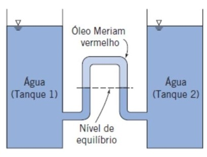
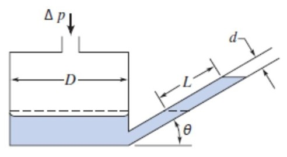
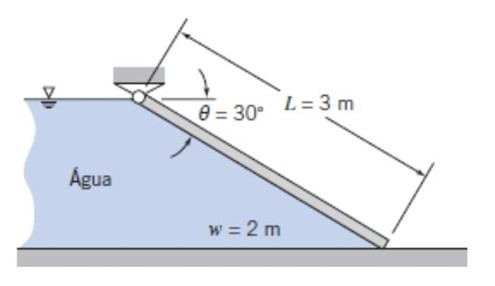
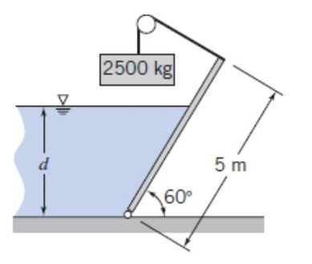
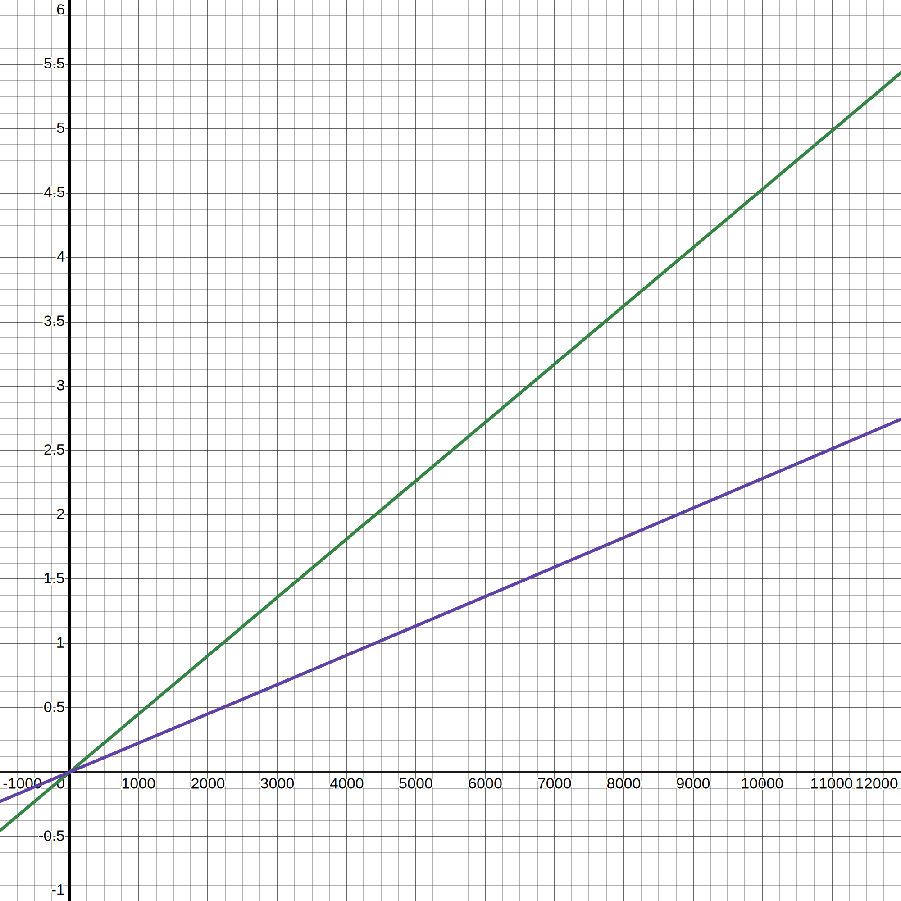
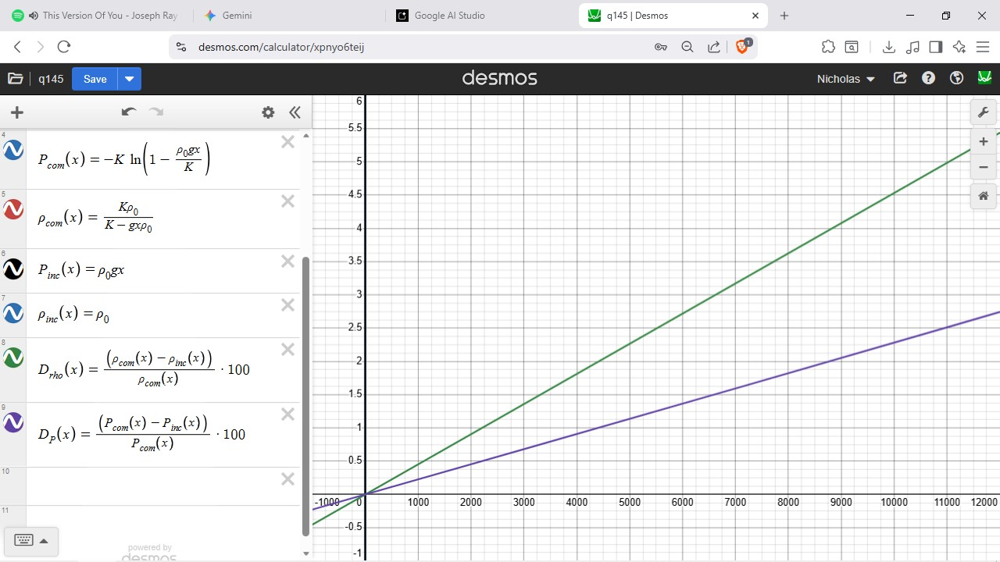
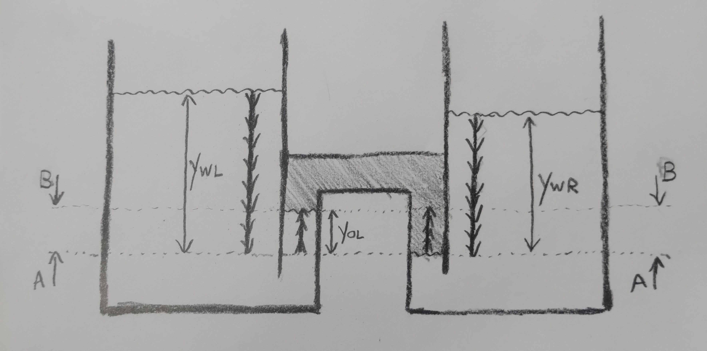
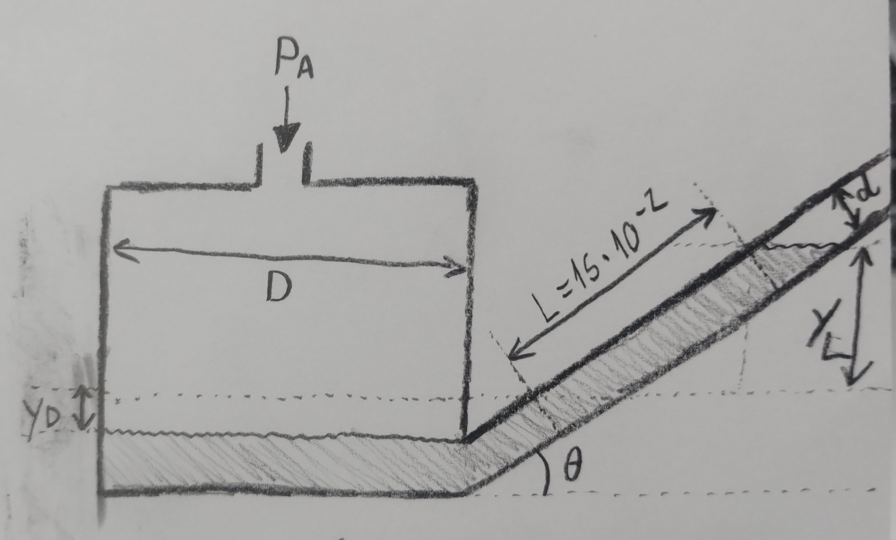
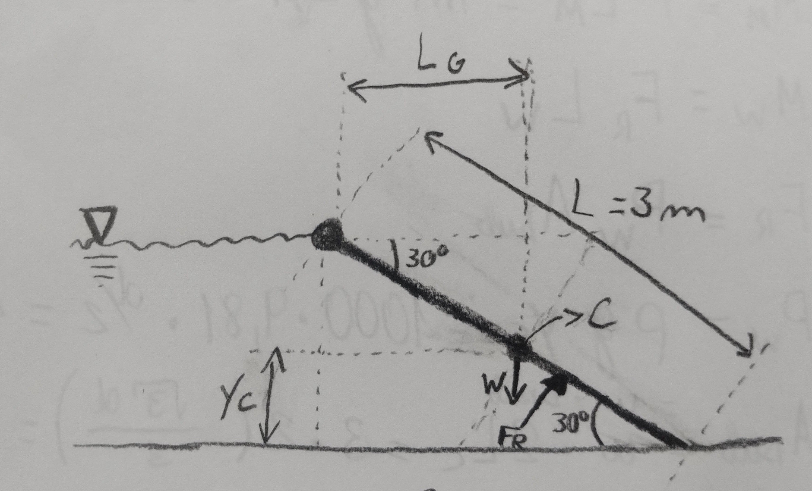
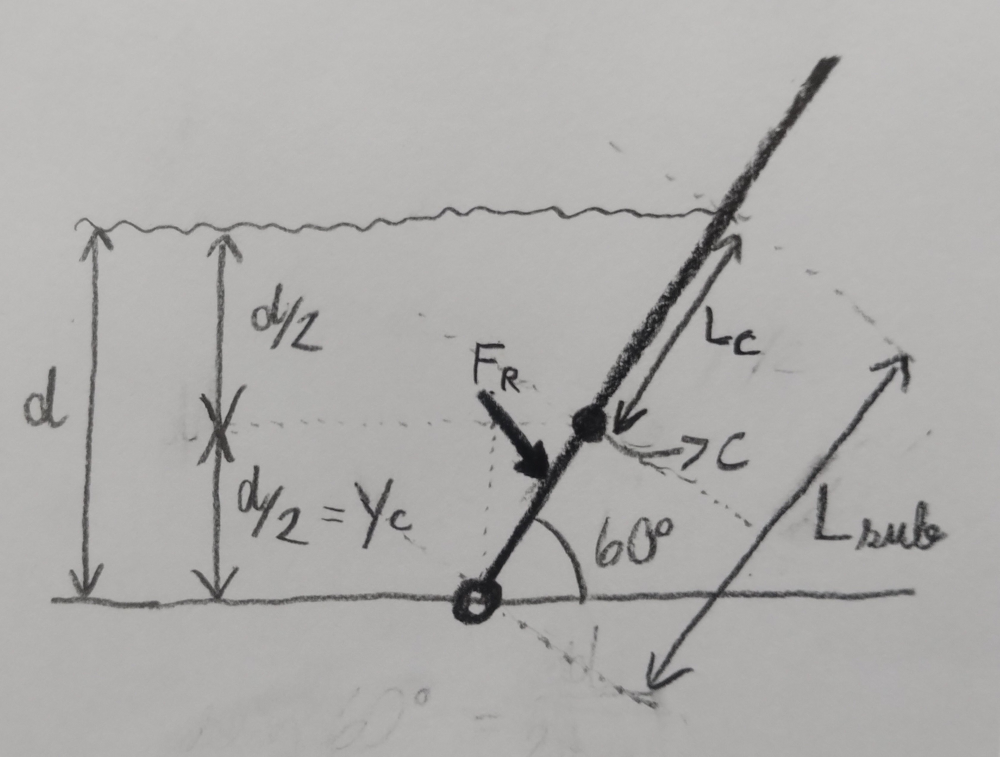

---
Classification	        :	Formula-Based Exercise
Discipline				:	EMA091 Mecânica dos fluidos
Source					:	2025-2 Lista Rudolf - Capítulo 3
Description				:
---

# Proposition

1. Veículos de pesquisa oceanográfica já desceram a 10 km abaixo do nível do mar. Nessas profundidades extremas, a compressibilidade da água do mar pode ser significativa. O comportamento da água do mar pode ser modelado supondo que o seu módulo de compressibilidade permanece constante. Usando essa hipótese, avalie, para essa profundidade, os desvios na massa específica e na pressão em relação aos valores calculados considerando a água do mar incompressível a uma profundidade, $h$, de 10 km na água do mar. Expresse as suas respostas em valores percentuais. Plote os resultados na faixa de $0 \leq h \leq 11$ km. Dados: $(\rho_{H_2O} = 1025 \frac{kg}{m^3}; K_{H_2O} = 2.2 GPa)$

2. Um departamento de engenharia de uma empresa de pesquisa está avaliando um sofisticado sistema a laser, de $80.000,00$ reais, para medir a diferença entre os níveis de água de dois grandes tanques de armazenagem. Você sugere que esta tarefa pode ser feita por um arranjo de manômetro de apenas $200,00$ reais. Para isso, um óleo menos denso que a água pode ser usado para fornecer uma ampliação significativa do movimento do menisco; uma pequena diferença de nível, entre os tanques, provocará uma deflexão muito maior nos níveis de óleo do manômetro. Se você configurar um equipamento usando o óleo Meriam vermelho como fluido manométrico, determine o fator de amplificação que será visto no equipamento. $(SG_\text{óleo} = 0.827)$

3. O manômetro de tubo inclinado mostrado tem $D = 76$ mm e $d = 8$ mm, e está cheio com óleo Meriam vermelho. Calcule o ângulo, $\theta$, que dará uma deflexão de 15 cm ao longo do tubo inclinado para uma pressão aplicada de 25 mmH2O (manométrica). Determine a sensibilidade desse manômetro. $(SG_\text{óleo} = 0.827)$

4. Uma comporta plana, de espessura uniforme, suporta uma coluna de água conforme mostrado. Determine o peso mínimo da comporta necessário para mantê-la fechada.

5. A comporta mostrada na figura tem 3 m de largura e, para fins de análise, pode ser considerada sem massa. Para qual profundidade de água esta comporta retangular ficará em equilíbrio como mostrado?

6. Quantifique o experimento realizado por Arquimedes para identificar o material da coroa do Rei Hiero. Suponha que você possa medir o peso da coroa do rei no ar, $W_a$, e também o peso na água, $W_w$. Expresse a densidade relativa da coroa como uma função desses valores medidos.

# Step-by-step

## Exercício 1
- Massa específica da água do mar na superfície ($\rho_0$): $1025 \text{ kg/m}^3$

- Aceleração da gravidade ($g$): $9.81 \text{ m/s}^2$

- Módulo de compressibilidade da água do mar ($K$): $2.2 \text{ GPa} = 2.2 \times 10^9 \text{ Pa}$

- Pressão na superfície (atmosférica, $P_{atm}$): $= 101,3 \, \text{kPa}$.

- Profundidade alvo ($h_{alvo}$): $10 \text{ km} = 10,000 \text{ m}$

- Como o exercício pede em valores percentuais, vamos calcular a pressão manométrica para simplificar os cálculos

### Modelo incompressível - Massa específica

$$
\rho_{inc}(h) = \rho_0 = 1025 \, \frac{kg}{m^3}
$$

$$
\rho_{inc}(0) = \rho_{inc}(10000) = 1025 \, \frac{kg}{m^3}
$$

### Modelo incompressível - Pressão

$$
\frac{dP}{dh} = \rho g
$$

$$
dP = \rho \cdot g \cdot dh
$$

$$
\int_{0}^{P} dP' = \int_{0}^{h} \rho \cdot g \cdot dh'
$$

$$
P_{inc}(h) = \rho_0 g h
$$

$$
P_{inc}(0) = 1025 \cdot 9,81 \cdot 0 = 0
$$

$$
P_{inc}(1000) = 1025 \cdot 9,81 \cdot 1000 = 10,06 \text{ MPa}
$$

### Modelo compressível - Massa específica

$$
\frac{dP}{dh} = \rho g \implies dP = \rho \cdot g \cdot dh
$$

$$
K = \frac{dP}{d\rho / \rho} \implies dP = K \frac{d\rho}{\rho}
$$

---

$$
dP = dP
$$

$$
\rho \cdot g \cdot dh = K \frac{d\rho}{\rho}
$$

$$
\frac{g}{K} \cdot dh = \frac{d\rho}{\rho^2}
$$

$$
\int_{0}^{h} \frac{g}{K} \cdot dh' = \int_{\rho_0}^{\rho_{com}(h)} \frac{d\rho'}{\rho'^2}
$$

$$
\frac{g}{K}\int_{0}^{h} dh' = \int_{\rho_0}^{\rho_{com}(h)} \frac{d\rho'}{\rho'^2}
$$

$$
\frac{g \cdot h}{K} = [-\rho'^{-1}]_{\rho_0}^{\rho_{com}(h)}
$$

$$
\frac{g \cdot h}{K} = \left[-\frac{1}{\rho_{com}(h)}\right] - \left[-\frac{1}{\rho_0}\right]
$$

$$
\frac{g \cdot h}{K} = -\frac{1}{\rho_{com}(h)} + \frac{1}{\rho_0}
$$

$$
\frac{1}{\rho_{com}(h)} = \frac{1}{\rho_0} - \frac{g \cdot h}{K}
$$

$$
\frac{1}{\rho_{com}(h)} = \frac{K - g \cdot h \cdot \rho_0}{K\rho_0}
$$

$$
\rho_{com}(h) = \frac{K\rho_0}{K - g \cdot h \cdot \rho_0}
$$

$$
\rho_{com}(10000) = \frac{2.2 \times 10^9 \cdot 1025}{2.2 \times 10^9 - 9.81 \cdot 10000 \cdot 1025} = 1074.09 \frac{kg}{m^3}
$$

### Modelo compressível - Pressão

$$
K = \frac{dP}{d\rho / \rho} \implies dP = K \frac{d\rho}{\rho}
$$

---

$$
\int_{0}^{P(h)} dP' = K \int_{\rho_0}^{\rho_\text{com}(h)} \frac{d\rho'}{\rho'}
$$

$$
P_{com}(h) = K [\ln(\rho')]_{\rho_0}^{\rho_\text{com}(h)} = K \ln \left( \frac{\rho_\text{com}(h)}{\rho_0} \right)
$$

$$
P_{com}(10000) = (2.2 \times 10^9) \ln\left(\frac{1074.09}{1025}\right) = 102.92 \text{ MPa}
$$

### Desvios

$$
\text{Desvio}(\%) = \frac{\text{Valor}_{\text{com}} - \text{Valor}_{\text{inc}}}{\text{Valor}_{\text{inc}}} \times 100
$$

$$
\text{Desvio}_{\rho}(\%) = \frac{1074.1 - 1025}{1025} \times 100 = \textbf{4.79\%}
$$

$$
\text{Desvio}_{P}(\%) = \frac{1.028 \times 10^8 - 1.006 \times 10^8}{1.006 \times 10^8} \times 100 = \textbf{2.19\%}
$$

### Gráfico

## Exercício 2
### Esquema e variáveis

- $P_L$ = Pressure at plane B, from the Left
- $P_R$ = Pressure at plane B, from the Right

---

- $y_{WL}$ = Height of the **W**ater surface of **L**eft Water tank, from plane A
- $y_{WR}$ = Height of the **W**ater surface of **R**ight Water tank, from plane A
- $y_{OL}$ = Height of the **O**il-water surface of the **L**eft side, from plane A
- $y_{OR}$ = Height of the **O**il-water surface of the **R**ight side, from plane A
- $\Delta y_W = y_{WL} - y_{WR}$ = Difference between the height of the water
- $\Delta y_O = y_{OL} - y_{OR}$ = Difference between the height of the oil-water interfaces

---

- $\gamma_W$ = Specific weight of Water
- $\gamma_O$ = Specific weight of Oil

---

Primeiro, algumas referências: usar um referencial externo como o "chão" é matematicamente correto, mas muitas vezes complica a álgebra. A "Regra de Ouro" da manometria é escolher o plano de referência horizontal que passe pela interface fluido-fluido na posição mais baixa.

Vamos assumir que há mais água no tanque 1 do que no 2, ou seja, $y_{WL} > y_{WR}$.
Isso gera uma pressão maior no lado esquerdo, isso vai empurrar a interface água-óleo do lado esquerdo para cima, ou seja, $y_{OL} > y_{OR}$.

Vamos determinar o plano de referência A sendo a interface água-óleo mais baixa e o plano B como a mais alta.

Usaremos a lei fundamental de que a pressão em qualquer ponto de um fluido contínuo em repouso é a mesma em qualquer ponto na mesma altura. Portanto, a pressão no plano B deve ser a mesma vindo tanto do lado esquerdo quando do direito.

### Andarilho
Vamos usar o método do andarilho, no qual caminhamos dentro dos fluidos até chegarmos no plano B, a partir tanto do tanque da esquerda quando do da direita.

Colocamos o sinal positivo $(+)$ antes do $\gamma y$ quando estamos descendo e o sinal negativo $(-)$ antes do $\gamma y$ quando estamos subindo.

$$
P_L = P_R
$$

$$
+(\gamma_W y_{WL}) - (\gamma_W y{OL}) = +(\gamma_W y_{WR}) - (\gamma_O y_{OL})
$$

$$
\gamma_W (y_{WL} - y_{OL} - y_{WR}) = -(\gamma_O y_{OL})
$$

$$
y_{WL} - y_{WR} = -\frac{\gamma_O}{\gamma_W} y_{OL} + y_{OL}
$$

---

Por definição do plano $A$, $y_{OR}$ sempre é $0$, portanto:

$$
\Delta y_O = (y_{OL} - y_{OR})
$$

$$
\Delta y_O = (y_{OL} - 0)
$$

$$
\Delta y_O = y_{OL}
$$

---

$$
\Delta y_W = \Delta y_O (1 - \frac{\gamma_O}{\gamma_W})
$$

$$
\frac{\Delta y_W}{\Delta y_O} = 1 - \frac{\gamma_O}{\gamma_W}
$$

$$
\frac{\Delta y_O}{\Delta y_W} = \frac{1}{1-\frac{\gamma_O}{\gamma_W}} = \frac{1}{1-\frac{\rho_O g}{\rho_W g}} = \frac{1}{1-\frac{827}{1000}} = 5,78
$$

Isso significa que para cada 1 cm de diferença no nível da água entre os dois tanques, o manômetro mostrará uma deflexão de 5,78 cm nos níveis de óleo. Isso confirma que o sistema de manômetro proposto oferece uma amplificação significativa, tornando a medição de pequenas diferenças de nível muito mais fácil e precisa, e validando a sugestão de uma solução de baixo custo.

## Exercício 3

### Observações e teorias iniciais
A pressão exercida por uma coluna de fluido só depende da altura da superfície dessa coluna em relação ao plano de referência, sendo essa coluna inclinada ou não.

Em um manômetro de tubo inclinado (ou qualquer manômetro de coluna líquida) em repouso, com a mesma pressão (atmosférica) agindo em ambas as superfícies livres, as superfícies do fluido no compartimento principal e no tubo inclinado estarão no mesmo plano horizontal (mesma altura vertical).

O enunciado pede para calcular um cenário no qual ocorra uma "deflexão de 15cm ao longo do tubo inclinado". Ou seja, entrará 15cm a mais de fluido dentro dele.

O enunciado afirma que a deflexão medida no tubo inclinado foi de $L = 15cm$. Isso não significa que a altura da coluna de fluido é simplesmente $y_c = L \cdot \sin \theta$, já que a altura deve ser medida em relação à superfície do fluido no reservatório principal, cujo nível desceu em relação à condição de repouso pois seu fluido foi empurrado para o tubo inclinado, ou seja, $y_c > L \cdot \sin \theta$

## Diagrama e variáveis

- $L$ = comprimento da deflexão no tubo inclinado
- $d$ = diâmetro do tubo inclinado
- $D$ = Diâmetro do reservatório principal
- $P_A$ = Pressão Aplicada
- $P_C$ = Pressão da Coluna de fluido
- $\rho_W$ = Massa específica da água
- $\rho_O$ = Massa específica da Óleo
- $y_C$ = Altura total da coluna de fluido
- $y_L$ = Altura da coluna de fluido gerada pela entrada
- $y_D$ = Altura desceu no reservatório principal
- $V_\text{desceu}$ = Volume que desceu do reservatório principal quando a pressão $P_A$ foi aplicada
- $V_\text{subiu}$ = Volume que subiu para o tubo inclinado quando a pressão $P_A$ foi aplicada

## Resolução

$$
P_A = \rho_W \cdot g \cdot y = 1000 \cdot 9,81 \cdot 25 \times 10^{-3} = 245,25 \quad [Pa]
$$

---

$$
\sin\theta = \frac{y_L}{L} \Rightarrow y_L = L \sin\theta
$$

$$
y_L = 15 \cdot 10^{-2} \sin\theta
$$

---

$$
V_\text{subiu} = \pi \left[\frac{d}{2}\right]^2 \cdot L = \pi \left(\frac{8 \cdot 10^{-3}}{2}\right)^2 \cdot 15 \cdot 10^{-2}
$$

$$
V_\text{subiu} = 7,5398 \cdot 10^{-6} \quad [m^3]
$$

$$
V_{\text{desceu}} = \pi \left[\frac{D}{2}\right]^2 y_D = \pi \left(\frac{76 \cdot 10^{-3}}{2}\right)^2 y_D
$$

---

$$
V_{\text{desceu}} = V_{\text{subiu}}
$$

$$
y_D = \frac{7,5398 \cdot 10^{-6}}{\pi \left(\frac{76 \cdot 10^{-3}}{2}\right)^2} = 1,662 \cdot 10^{-3} \quad [m]
$$

---

$$
P_C = \rho_O \cdot g \cdot y_C = \rho_O \cdot g \cdot (y_L + y_D)
$$

$$
P_C = 827 \cdot 9,81 \cdot (15 \cdot 10^{-2} \sin\theta + 1,662 \cdot 10^{-3})
$$

$$
P_C = 1216,9305 \sin\theta + 13,4836
$$

---

$$
P_C = P_A
$$

$$
245,25 = 1216,9305 \sin\theta + 13,4836
$$

$$
\theta = \sin^{-1}\left(\frac{245,25 - 13,4836}{1216,9305}\right) = 10,98^\circ
$$

### Sensibilidade
A sensibilidade de um manômetro de tubo inclinado é a razão entre a deflexão lida no tubo inclinado e a altura de deflexão que ocorreria em um manômetro de tubo em U simples (usando o mesmo fluido para a mesma pressão).

$$
P = \rho \cdot g \cdot h
$$

$$
245,25 = 828 \cdot 9,81 \cdot h
$$

$$
h = 0,03 \quad [m]
$$

---

$$
S = \frac{L}{h} = \frac{0,15}{0,03} = 5
$$

## Exercício 4

$$
\sum M = 0
$$

$$
M_W = M_G
$$

---

---

$$
\sin 30^{\circ} = \frac{2y_c}{L}
$$

$$
y_c = \frac{L \sin 30^{\circ}}{2} = \frac{3}{2} \cdot \frac{1}{2} = \frac{3}{4}
$$

$$
\cos 30^{\circ} = \frac{L_G}{\frac{L}{2}}
$$

$$
L_G = \frac{3}{2} \cdot \frac{\sqrt{3}}{2} = \frac{3\sqrt{3}}{4}
$$

---

$$
M_G = W_G \cdot L_G = W_G \cdot \frac{3\sqrt{3}}{4} \quad [Nm]
$$

---

$$
M_W = F_W \cdot L_W
$$

$$
F_W = P_W \cdot A_\text{sub}
$$

$$
P_W = \rho \cdot g \cdot y_c = 1000 \cdot 9,81 \cdot \frac{3}{4} = 7357,5 \quad [Pa]
$$

$$
A_\text{sub} = w \cdot L_\text{sub} = 2 \cdot 3 = 6 \quad [m^2]
$$

$$
F_W = 7357,5 \cdot 6 = 44145 \quad [N]
$$

$$
L_W = \frac{2}{3} L_\text{sub} = \frac{2}{3} \cdot 3 = 2 \quad [m]
$$

$$
M_W = 44145 \cdot 2 = 88290 \quad [Nm]
$$

---

$$
M_G = M_W
$$

$$
W_G \cdot \frac{3\sqrt{3}}{4} = 88290
$$

$$
W_G = \frac{4 \cdot 88290}{3 \sqrt{3}} = 67965,67 \, N
$$

---

### Explicações adicionais para o cálculo do braço de alavanca da água
Apesar do cálculo da força hidrostática utilizar a altura do centroide $y_c$, ela não atua nesse ponto, mas sim no centro de pressão $y_p$.

A força hidrostática é sempre perpendicular à superfície. Portanto, seu braço de alavanca para o cálculo de momento deve ser medido ao longo dessa mesma superfície (ou em uma direção paralela a ela), a partir do ponto de rotação. Em outras palavras, para o cálculo do braço de alavanca, usa-se $L_P$ e não $y_p$.

Em casos como esse, de uma superfície retangular submersa, o comprimento do centro de pressão, medido ao longo da peça $(L_P)$, encontra-se à $\frac{1}{3}$ do comprimento total da superfície submersa. Como o ponto de rotação está no TOPO do reservatório:

$$
L_W = \frac{2}{3} L_\text{sub}
$$

### Explicações adicionais para o cálculo do momento gerado pelo peso da comporta
- O peso da comporta é um vetor de magnitude W apontando para baixo no centro de gravidade da comporta.

- O braço de alavanca é, por definição, a distância perpendicular do eixo de rotação (articulação) até a linha de ação da força (a linha vertical que passa pelo centro de gravidade)
- A força AGE EM um ponto que está a uma distância de 1,5 m ao longo da hipotenusa. Mas o seu EFEITO DE ALAVANCA é calculado usando a distância perpendicular, que é o cateto adjacente ao ângulo de 30°, medindo 1,3 m.
- A força peso está localizada a 1,5 m da articulação, mas devido ao seu ângulo, ela produz um efeito de rotação equivalente a uma força perpendicular atuando a uma distância de 1,3 m

## Cálculo extra: espessura da comporta caso fosse de aço

$$
67915,38 \, N = 6930,14 \,kg
$$

$$
\text{Densidade aço } = 7850 \frac{kg}{m^3}
$$

$$
\frac{6930,14}{7850} = 0,88 \, m^3
$$

$$
\text{Área da comporta} = 3 \cdot 2 = 6 \, m^2
$$

$$
\text{Espessura} = \frac{0,88}{6} = 0.15 \,m
$$

## Teoria extra para exercício 4

Uma comporta plana, de espessura uniforme, suporta uma coluna de água conforme mostrado.

Sendo $\vec P$ o vetor da força peso que atua na comporta (vetor com magnitude W, na vertical, apontando para baixo)

1. Desenhe na figura o ponto de aplicação de um vetor perpendicular à comporta, com mesma magnitude que $\vec P$ e que gere um momento igual ao que $\vec P$ provoca na articulação (Dica: determine a distância que o ponto deve ser desenhado a partir da articulação da comporta)

2. Determine a magnitude do vetor perpendicular à comporta que, aplicado no mesmo ponto que $\vec P$ atua (centro da comporta), gere um efeito de rotação (momento) equivalente.

---

Resposta 1: Um ponto a 1,3 m da articulação.

$$
\frac{L}{2} \cdot cos(\alpha) = \frac{3}{2} \cdot cos(30°) = 1,3 \, m
$$

Resposta 2:

$$
W \cdot cos(30°)
$$

A força peso pode ser pensada

---

É interessante comparar os 3 seguintes cenários fisicamente equivalentes, que provocariam mesmo momento resultante na comporta de $M = W \cdot 1,3 \, m$

- Ponto de aplicação da força (distância da articulação)
- Magnitude da força
- Direção da força

**Cenário 1 (convencional)**

$$
1,5m \quad W \quad Vertical
$$

**Cenário 2 (decomposição da força peso)**

$$
1,5m \quad W \cdot cos(30°) \quad Perpendicular
$$

**Cenário 3 (magnitude da força peso, mas perpendicular à comporta)**

$$
1,3m \quad W \quad Perpendicular
$$

## Exercício 5
- $y_P$: Profundidade do centro de pressão, medido a verticalmente partir da superfície
- $y_C$: Profundidade do centroide, medido verticalmente a partir da superfície
- $L_P$: Comprimento até o centro de pressão, medido ao longo da peça
- $L_C$: Comprimento até o centroide, medido ao longo da peça
- $P_C$: Pressão no centroide da área submersa
- $F_R$ = A força hidrostática resultante sobre uma superfície plana submersa é de fato a pressão no centroide da área multiplicada pela área total submersa.

---

- $M_M$ = Momentum generated by suspended Mass
- $L_M$ = Lever arm of the suspended Mass
- $F_M$ = Force generated by suspended Mass

---

- $M_W$ = Momentum generated by Water
- $L_W$ = Lever arm of the Water
- $F_W$ = Force generated my Water
- $P_W$ = Pressure generated by Water
- $A_\text{sub}$ = Area of the gate submersed by water
- $L_\text{sub}$ = Length of the gate submersed by water
- $w$ = Width of the gate

---

- $g$ = Acceleration due to gravity

---

$$
\sum M = 0
$$

$$
M_M = M_W
$$

---

$$
\text{Momento = Força x Braço de alavanca}
$$

$$
M_M = F_M \cdot L_M
$$

$$
M_W = F_W \cdot L_W
$$

---

Pelo diagrama, a massa de 2500kg está pendurada de forma a tracionar o cabo. Como a polia direciona o cabo de forma que ele esteja perpendicular à comporta, o braço de alavanca é o comprimento inteiro da comporta.

$$
F_M = m \cdot g = 2500 \cdot 9,81 = 24525 \, N
$$

$$
L_M = 5 \, m
$$

$$
M_M = 5 \cdot 24525 = 122625 \, Nm
$$

---

---

$$
F_W = P_W \cdot A_\text{sub}
$$

$$
P_W = \rho \cdot g \cdot y_c
$$

$$
A_\text{sub} = w \cdot L_\text{sub}
$$

$$
y_c = \frac{d}{2}
$$

$$
P_W = 1000 \cdot 9,81 \cdot \frac{d}{2} = 4905 \, d
$$

---

$$
\sin(60°) = \frac{d}{L_\text{sub}}
$$

$$
L_\text{sub} = \frac{d}{\sin(60°)} = \frac{2}{\sqrt{3}} d = \frac{2\sqrt{3}}{3} d \quad [m]
$$

$$
A_\text{sub} = 3 \cdot \frac{2\sqrt{3}}{3} d = 2\sqrt{3} \, d \quad [m^2]
$$

$$
F_W = 4905 \, d \cdot 2\sqrt{3}\, d = 9810 \sqrt{3} \, d^2 \quad [N]
$$

---

Apesar do cálculo da força hidrostática utilizar a altura do centroide $y_c$, ela não atua nesse ponto, mas sim no centro de pressão $y_p$.

A força hidrostática é sempre perpendicular à superfície. Portanto, seu braço de alavanca para o cálculo de momento deve ser medido ao longo dessa mesma superfície (ou em uma direção paralela a ela), a partir do ponto de rotação.

Em casos como esse, de uma superfície retangular submersa, o comprimento do centro de pressão, medido ao longo da peça $(L_P)$, encontra-se à $\frac{1}{3}$ do comprimento total da superfície submersa. Como o ponto de rotação está no fundo do reservatório:

$$
L_W = \frac{1}{3} L_\text{sub} = \frac{1}{3}\frac{2\sqrt{3}}{3} d = \frac{2\sqrt{3}}{9} d \quad [m]
$$

---

$$
M_W = 9810 \sqrt{3} \, d^2 \cdot \frac{2\sqrt{3}}{9} d
$$

$$
M_W = 6540 d^3 \quad [Nm]
$$

---

$$
M_W = M_M
$$

$$
6540 d^3 = 122625
$$

$$
d = \sqrt[3]{\frac{122625}{6540}}
$$

$$
\boxed{d = 2,66 \,m}
$$

## Exercício 6
- $W_a$ = Weight of the crown in the air
- $W_w$ = Weight of the crown in the water
- $\rho_c$ = Specific mass of the crown
- $\rho_w$ = Specific mass of the water
- $m_c$ = Mass of the crown
- $V_c$ = Volume of the crown
- $g$ = Acceleration due to gravity
- $F_b$ = Buoyant force (weight of displaced water)

$$
W_a = \rho_c g V_c \Rightarrow V_c = \frac{W_a}{\rho_c g}
$$

$$
W_w = W_a - F_b \Rightarrow F_b = W_a - W_w
$$

$$
F_b = V_c \rho_w g = \frac{W_a}{\rho_c g} \rho_w g = W_a \frac{\rho_w}{\rho_c}
$$

---

$$
F_b = F_b
$$

$$
W_a \frac{\rho_w}{\rho_c} = W_a - W_w
$$

$$
\frac{\rho_w}{\rho_c} = \frac{W_a - W_w}{W_a}
$$

$$
\boxed{\frac{\rho_c}{\rho_w} = \frac{W_a}{W_a - W_w}}
$$

# Answer

## Exercício 1

$$
\boxed{\text{Desvio}_{\rho}(\%) = \textbf{4.79\%} \quad \text{Desvio}_{P}(\%) = \textbf{2.19\%}}
$$

## Exercício 2

$$
\boxed{A = 5,78}
$$

## Exercício 3

$$
\boxed{\theta = 10,98° \quad S = 5}
$$

## Exercício 4

$$
\boxed{W = 67965,67 \, N}
$$

## Exercício 5

$$
\boxed{d = 2,66 \,m}
$$

## Exercício 6

$$
\boxed{\frac{\rho_c}{\rho_w} = \frac{W_a}{W_a - W_w}}
$$

# Attempts

2025-09-03T14:45:18Z 0
2025-09-05T14:43:17Z 0
2025-09-08T15:21:20Z 0
