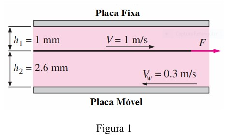
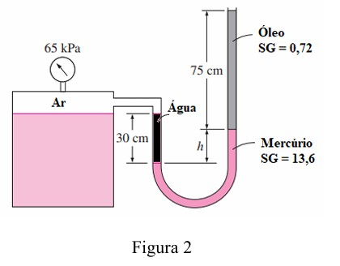
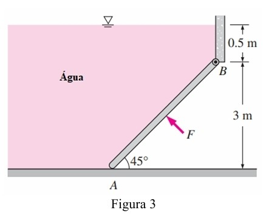
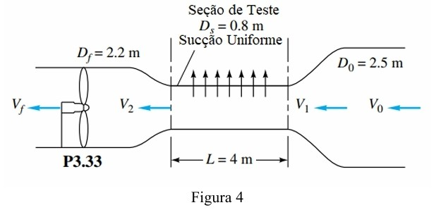
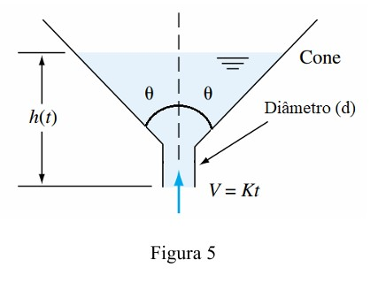

---
Classification	        :	Formula-Based Exercise
Discipline				:	EMA091 Mecânica dos fluidos
Source					:	2023-2 Prova 1 Rudolf
Description				:	2023-2 Prova 1 Rudolf
---

# Proposition

## **1**
Uma placa fina de dimensões 20 cm x 30 cm é puxada horizontalmente com velocidade de 1 m/s através de um filme de óleo com 3,6 mm de espessura o qual se encontra entre duas placas planas. A placa superior é estacionária e a placa inferior se desloca a uma velocidade de 0,3 m/s, como mostra a figura 1. A viscosidade dinâmica do óleo é 0,037 Pa.s. Admita que a velocidade do óleo varie linearmente em cada uma das duas camadas.

a) Obtenha as equações dos perfis de velocidade.

b) Determine o ponto no qual a velocidade do óleo é nula.

c) Calcule a força a ser aplicada na placa para manter seu movimento.

A imagem mostra um diagrama de um sistema com três placas paralelas horizontais e duas camadas de fluido entre elas. A placa superior é fixa ('Placa Fixa'). A placa inferior é móvel ('Placa Móvel') e se desloca para a esquerda com uma velocidade $V_w = 0.3$ m/s. Entre elas, há uma placa fina que se move para a direita com uma velocidade $V = 1$ m/s, puxada por uma força F. A camada de fluido (óleo) entre a placa fixa e a placa fina tem uma espessura $h_1 = 1$ mm. A camada de fluido entre a placa fina e a placa móvel tem uma espessura $h_2 = 2.6$ mm.

## **2**
Na figura 2, a pressão manométrica do ar no tanque é de 65 kPa. Determine a altura h, em cm, da coluna de mercúrio. Considere $\rho_{\text{água}} = 998 \text{ kg/m}^3$ e $1 \text{ atm} = 101,3 \text{ kPa}$.
Determine a altura h, em cm, da coluna de mercúrio.

A figura mostra um sistema manométrico. Um tanque fechado à esquerda contém ar ('Ar') sobre água ('Água'). Um manômetro no topo do tanque indica uma pressão de 65 kPa. Um tubo em U está conectado ao tanque. O braço esquerdo do tubo em U conecta-se ao tanque na seção de água. O nível da interface entre a água e o mercúrio no braço esquerdo está 30 cm abaixo da interface ar-água dentro do tanque. O fundo do tubo em U contém mercúrio ('Mercúrio') com $SG = 13,6$. O braço direito do tubo em U está aberto à atmosfera e contém uma coluna de óleo ('Óleo') com $SG = 0,72$ e altura de 75 cm acima do mercúrio. A altura 'h' é a diferença de nível vertical entre a superfície do mercúrio no braço esquerdo (interface água-mercúrio) e a superfície do mercúrio no braço direito (interface mercúrio-óleo).

## **3**

Na figura 3, a comporta retangular tem 200 kg de massa, 5 m de largura, uma dobradiça em B e se inclina contra o piso em A, formando um ângulo de 45º com a horizontal. A comporta deve ser aberta pelo lado seco aplicando-se uma força (F) normal ao seu centro de massa. Determine a força (F) mínima necessária para abrir a comporta. Considere $\rho_{\text{água}} = 998 \text{ kg/m}^3$ e $g = 9,81 \text{ m/s}^2$. Determine a força (F) mínima necessária para abrir a comporta.

A figura mostra uma comporta retangular inclinada que retém água. A comporta está articulada em um ponto B em uma parede vertical e apoia-se no fundo horizontal em um ponto A. O ângulo da comporta com a horizontal é de 45°. A água está do lado esquerdo da comporta. A superfície livre da água está 0,5 m acima da articulação B. A altura vertical da articulação B em relação ao fundo A é de 3 m. Uma força F é aplicada perpendicularmente ao centro da comporta, no lado seco (direito), no sentido de abrir a comporta.

## **4**

Em alguns túneis de vento, a seção de teste é perfurada para se fazer a sucção de ar e manter a camada limite viscosa delgada. Na figura 4, a parede da seção de teste contém 900 orifícios, de 5 mm de diâmetro, em cada metro quadrado de área da parede. A velocidade de sucção através de cada orifício é $V_S = 10$ m/s, e a velocidade na entrada da seção de teste é $V_1 = 35$ m/s. $D_0$ representa o diâmetro da seção à montante da seção de teste, $D_s$ o diâmetro da seção de teste e $D_f$ o diâmetro da seção do ventilador. Admitindo escoamento em regime permanente e incompressível de ar a 20°C ($\rho_{ar} = 1,2$ kg/m³).

a) Calcule $V_0$ em m/s.

b) Calcule $V_2$ em m/s.

c) Calcule $V_f$ em m/s.

A figura mostra um diagrama esquemático de um túnel de vento. O fluxo de ar se move da direita para a esquerda. O ar entra por uma seção larga com diâmetro $D_0 = 2.5$ m e velocidade $V_0$. O duto então se contrai até a entrada da seção de teste, onde a velocidade é $V_1$. A seção de teste é um duto cilíndrico com diâmetro $D_s = 0.8$ m e comprimento $L = 4$ m. As paredes desta seção são perfuradas para permitir 'Sucção Uniforme' de ar, indicada por setas saindo radialmente para cima. Na saída da seção de teste, a velocidade é $V_2$. O duto então se expande até uma seção onde um ventilador está localizado. O diâmetro na seção do ventilador é $D_f = 2.2$ m e a velocidade é $V_f$. O diagrama também é identificado como 'P3.33'.

## **5**

Na figura 5, água entra pelo fundo do cone a uma velocidade média uniformemente crescente $V = kt$. Admitindo que o diâmetro (d) é muito pequeno, obtenha uma equação para a elevação do nível de água $h(t)$ com a condição $h = 0$ para $t = 0$. Considere escoamento incompressível. Obtenha uma equação para a elevação do nível de água $h(t)$.

A figura mostra um cone invertido ('Cone') sendo preenchido com água por baixo. A água entra através de um tubo vertical com diâmetro (d) na ponta do cone. A velocidade de entrada da água é indicada por uma seta para cima e pela equação $V = Kt$. O cone tem um semi-ângulo de vértice $\\theta$. O nível da água no cone em um instante de tempo t é representado pela altura $h(t)$, medida a partir da ponta do cone.

# Step-by-step

## **1**
**a) Obtenha as equações dos perfis de velocidade.**

$$
\text{Adotando o sistema de coordenadas com origem na placa fina e } y \text{ positivo para cima.}
$$

$$
\text{Camada superior (1): } 0 \le y \le h_1
$$

$$
u_1(y) = a_1 y + b_1
$$

$$
\text{Condições de contorno:}
$$

$$
u_1(y=0) = V = 1 \text{ m/s}
$$

$$
u_1(y=h_1) = 0
$$

$$
u_1(0) = a_1(0) + b_1 = 1 \implies b_1 = 1
$$

$$
u_1(h_1) = a_1 h_1 + 1 = 0 \implies a_1 = -\frac{1}{h_1} = -\frac{1}{0.001} = -1000 \text{ s}^{-1}
$$

$$
u_1(y) = -1000y + 1 \quad (\text{para } 0 \le y \le 0.001 \text{ m})
$$

$$
\text{Camada inferior (2): } -h_2 \le y \le 0
$$

$$
u_2(y) = a_2 y + b_2
$$

$$
\text{Condições de contorno:}
$$

$$
u_2(y=0) = V = 1 \text{ m/s}
$$

$$
u_2(y=-h_2) = -V_w = -0.3 \text{ m/s}
$$

$$
u_2(0) = a_2(0) + b_2 = 1 \implies b_2 = 1
$$

$$
u_2(-h_2) = a_2(-h_2) + 1 = -0.3 \implies -a_2 h_2 = -1.3 \implies a_2 = \frac{1.3}{h_2} = \frac{1.3}{0.0026} = 500 \text{ s}^{-1}
$$

$$
u_2(y) = 500y + 1 \quad (\text{para } -0.0026 \text{ m} \le y \le 0)
$$

**b) Determine o ponto no qual a velocidade do óleo é nula.**

$$
\text{Procurando por } y \text{ tal que } u(y) = 0.
$$

$$
\text{Na camada superior:}
$$

$$
u_1(y) = -1000y + 1 = 0 \implies y = \frac{1}{1000} = 0.001 \text{ m} = 1 \text{ mm}
$$

$$
\text{Este ponto corresponde à placa superior fixa.}
$$

$$
\text{Na camada inferior:}
$$

$$
u_2(y) = 500y + 1 = 0 \implies y = -\frac{1}{500} = -0.002 \text{ m} = -2 \text{ mm}
$$

$$
\text{Como } -2.6 \text{ mm} \le -2 \text{ mm} \le 0 \text{, este ponto está dentro da camada inferior.}
$$

$$
\text{O ponto de velocidade nula no fluido está a 2 mm abaixo da placa fina.}
$$

**c) Calcule a força a ser aplicada na placa para manter seu movimento.**

$$
F = F_{superior} + F_{inferior}
$$

$$
F = \tau_{superior} A + \tau_{inferior} A
$$

$$
\tau = \mu \left| \frac{du}{dy} \right|
$$

$$
A = 0.2 \text{ m} \times 0.3 \text{ m} = 0.06 \text{ m}^2
$$

$$
\mu = 0.037 \text{ Pa.s}
$$

$$
\text{Força da camada superior:}
$$

$$
\frac{du_1}{dy} = -1000 \text{ s}^{-1}
$$

$$
\tau_{superior} = \mu \left| \frac{du_1}{dy} \right| = (0.037) \times |-1000| = 37 \text{ Pa}
$$

$$
F_{superior} = \tau_{superior} A = 37 \text{ Pa} \times 0.06 \text{ m}^2 = 2.22 \text{ N}
$$

$$
\text{Força da camada inferior:}
$$

$$
\frac{du_2}{dy} = 500 \text{ s}^{-1}
$$

$$
\tau_{inferior} = \mu \left| \frac{du_2}{dy} \right| = (0.037) \times |500| = 18.5 \text{ Pa}
$$

$$
F_{inferior} = \tau_{inferior} A = 18.5 \text{ Pa} \times 0.06 \text{ m}^2 = 1.11 \text{ N}
$$

$$
\text{Força total:}
$$

$$
F = F_{superior} + F_{inferior} = 2.22 \text{ N} + 1.11 \text{ N} = 3.33 \text{ N}
$$

## **2**

$$
\text{Equação manométrica, partindo do tanque de ar até a atmosfera:}
$$

$$
P_{\text{ar}} + \rho_{\text{água}} g h_{\text{água}} - \rho_{\text{mercúrio}} g h - \rho_{\text{óleo}} g h_{\text{óleo}} = P_{\text{atm}}
$$

$$
\text{Rearranjando a equação:}
$$

$$
(P_{\text{ar}} - P_{\text{atm}}) + \rho_{\text{água}} g h_{\text{água}} - \rho_{\text{óleo}} g h_{\text{óleo}} = \rho_{\text{mercúrio}} g h
$$

$$
\text{Onde } P_{\text{ar, manométrica}} = P_{\text{ar}} - P_{\text{atm}} = 65 \text{ kPa} = 65000 \text{ Pa}
$$

$$
\rho_{\text{óleo}} = SG_{\text{óleo}} \cdot \rho_{\text{água}} = 0.72 \times 998 \text{ kg/m}^3 = 718.56 \text{ kg/m}^3
$$

$$
\rho_{\text{mercúrio}} = SG_{\text{mercúrio}} \cdot \rho_{\text{água}} = 13.6 \times 998 \text{ kg/m}^3 = 13572.8 \text{ kg/m}^3
$$

$$
\text{Substituindo os valores na equação (com g = 9.81 m/s²):}
$$

$$
65000 \text{ Pa} + (998 \frac{\text{kg}}{\text{m}^3} \cdot 9.81 \frac{\text{m}}{\text{s}^2} \cdot 0.30 \text{ m}) - (718.56 \frac{\text{kg}}{\text{m}^3} \cdot 9.81 \frac{\text{m}}{\text{s}^2} \cdot 0.75 \text{ m}) = (13572.8 \frac{\text{kg}}{\text{m}^3} \cdot 9.81 \frac{\text{m}}{\text{s}^2}) \cdot h
$$

$$
65000 + 2937.29 - 5287.13 = 133149.17 \cdot h
$$

$$
62650.16 = 133149.17 \cdot h
$$

$$
h = \frac{62650.16}{133149.17} \text{ m}
$$

$$
h \approx 0.4705 \text{ m}
$$

$$
h \approx 47.05 \text{ cm}
$$

## **3**

$$
\text{1. Análise Geométrica e de Forças}
$$

$$
\text{A condição para abrir a comporta é que a força de reação em A seja nula, } R_A = 0.
$$

$$
\text{O equilíbrio será analisado pelo somatório de momentos em torno da dobradiça B.}
$$

$$
\sum M_B = 0
$$

$$
\text{Forças atuantes que geram momento em B: Força hidrostática } (F_R)\text{, Peso da comporta } (W)\text{, e Força aplicada } (F).
$$

$$
\text{Comprimento da comporta (L):}
$$

$$
\sin(45^\circ) = \frac{h_B}{L} \implies L = \frac{3 \text{ m}}{\sin(45^\circ)} = \frac{3}{1/\sqrt{2}} = 3\sqrt{2} \approx 4.243 \text{ m}
$$

$$
\text{Área da comporta (A):}
$$

$$
A = L \times b = (4.243 \text{ m}) \times (5 \text{ m}) = 21.215 \text{ m}^2
$$

$$
\text{2. Força Hidrostática } (F_R) \text{ e seu Ponto de Aplicação}
$$

$$
\text{A força hidrostática é dada por } F_R = P_C \cdot A = (\rho g h_C) \cdot A
$$

$$
\text{Profundidade vertical do centroide da comporta } (h_C):
$$

$$
\text{Altura total da água: } H = h_B + h_w = 3 \text{ m} + 0.5 \text{ m} = 3.5 \text{ m}
$$

$$
h_C = H - \left(\frac{L}{2}\right) \sin(45^\circ) = 3.5 \text{ m} - \left(\frac{4.243 \text{ m}}{2}\right) \sin(45^\circ) = 3.5 - 1.5 = 2.0 \text{ m}
$$

$$
F_R = (998 \frac{\text{kg}}{\text{m}^3}) (9.81 \frac{\text{m}}{\text{s}^2}) (2.0 \text{ m}) (21.215 \text{ m}^2) = 415400 \text{ N} = 415.4 \text{ kN}
$$

$$
\text{Posição do centro de pressão } (y_P) \text{ ao longo da comporta, a partir da superfície livre:}
$$

$$
y_P = y_C + \frac{I_{xC}}{y_C A}
$$

$$
\text{Posição do centroide ao longo da comporta, a partir da superfície livre } (y_C):
$$

$$
y_C = \frac{h_C}{\sin(45^\circ)} = \frac{2.0 \text{ m}}{\sin(45^\circ)} \approx 2.828 \text{ m}
$$

$$
\text{Momento de inércia da área da comporta } (I_{xC}):
$$

$$
I_{xC} = \frac{b L^3}{12} = \frac{(5 \text{ m}) (4.243 \text{ m})^3}{12} \approx 31.82 \text{ m}^4
$$

$$
y_P = 2.828 \text{ m} + \frac{31.82 \text{ m}^4}{(2.828 \text{ m})(21.215 \text{ m}^2)} = 2.828 + 0.530 = 3.358 \text{ m}
$$

$$
\text{Braço de alavanca da força hidrostática em relação a B } (d_{F_R}):
$$

$$
\text{Distância de B à superfície livre, ao longo da comporta } (y_B):
$$

$$
y_B = \frac{h_w}{\sin(45^\circ)} = \frac{0.5 \text{ m}}{\sin(45^\circ)} \approx 0.707 \text{ m}
$$

$$
d_{F_R} = y_P - y_B = 3.358 \text{ m} - 0.707 \text{ m} = 2.651 \text{ m}
$$

$$
\text{3. Peso da Comporta } (W) \text{ e seu Braço de Alavanca}
$$

$$
W = m \cdot g = (200 \text{ kg}) (9.81 \frac{\text{m}}{\text{s}^2}) = 1962 \text{ N}
$$

$$
\text{O peso atua no centro de massa, a } L/2 \text{ de B. O braço de alavanca } (d_W) \text{ é a distância horizontal de B ao centro de massa.}
$$

$$
d_W = \left(\frac{L}{2}\right) \cos(45^\circ) = \left(\frac{4.243 \text{ m}}{2}\right) \cos(45^\circ) = 1.5 \text{ m}
$$

$$
\text{4. Equilíbrio de Momentos e Cálculo de F}
$$

$$
\text{A força F é aplicada no centro de massa, perpendicular à comporta. Seu braço de alavanca é } d_F = L/2.
$$

$$
d_F = \frac{4.243 \text{ m}}{2} = 2.1215 \text{ m}
$$

$$
\text{Somatório de momentos em torno de B (sentido anti-horário como positivo):}
$$

$$
\sum M_B = F \cdot d_F - F_R \cdot d_{F_R} - W \cdot d_W = 0
$$

$$
F \cdot (2.1215) - (415400) \cdot (2.651) - (1962) \cdot (1.5) = 0
$$

$$
F \cdot (2.1215) - 1101225.4 - 2943 = 0
$$

$$
F \cdot (2.1215) = 1104168.4
$$

$$
F = \frac{1104168.4}{2.1215} \approx 520465.9 \text{ N}
$$

$$
F \approx 520.5 \text{ kN}
$$

**Ponto adicional**

A fórmula usada para calcular a posição do centro de pressão $(y_p)$ ao longo da comporta, a partir da superfície livre, foi

$$
y_P = y_C + \frac{I_{xC}}{y_C A}
$$

Essa é uma versão simplificada que se aplica quando o fluido NÃO está pressurizado, que é o caso dessa questão. A fórmula geral é

$$
y_p = y_c + \frac{I_{xx,c}}{[y_c + \frac{p_0}{\rho g \sin\theta}]A}
$$

Portanto, para esse problema, $p_0 = 0$

Agora, vamos substituir $p_0 = 0$ na fórmula geral:

$$
y_p = y_c + \frac{I_{xx,c}}{[y_c + \frac{0}{\rho g \sin\theta}]A}
$$

$$
y_p = y_c + \frac{I_{xx,c}}{[y_c + 0]A}
$$

$$
y_p = y_c + \frac{I_{xx,c}}{y_c A}
$$

## **4**
**a) Calcule $V_0$ em m/s.**

$$
\text{Aplicando a equação da continuidade entre as seções 0 e 1:}
$$

$$
Q_0 = Q_1
$$

$$
V_0 A_0 = V_1 A_1
$$

$$
V_0 \frac{\pi D_0^2}{4} = V_1 \frac{\pi D_s^2}{4}
$$

$$
V_0 = V_1 \left(\frac{D_s}{D_0}\right)^2
$$

$$
V_0 = 35 \text{ m/s} \left(\frac{0.8 \text{ m}}{2.5 \text{ m}}\right)^2
$$

$$
V_0 = 35 \times (0.32)^2 = 35 \times 0.1024
$$

$$
V_0 = 3.584 \text{ m/s}
$$

**b) Calcule $V_2$ em m/s.**

$$
\text{Aplicando a equação da continuidade para o volume de controle da seção de teste:}
$$

$$
Q_1 = Q_2 + Q_{sucção}
$$

$$
\text{Cálculo da vazão de sucção } (Q_{sucção}):
$$

$$
A_{parede} = \pi D_s L = \pi (0.8 \text{ m})(4 \text{ m}) = 3.2\pi \text{ m}^2 \approx 10.053 \text{ m}^2
$$

$$
A_{orifício} = \frac{\pi d_{orifício}^2}{4} = \frac{\pi (0.005 \text{ m})^2}{4} \approx 1.9635 \times 10^{-5} \text{ m}^2
$$

$$
N_{orifícios} = (900 \text{ orifícios/m}^2) \times A_{parede} = 900 \times 10.053 = 9047.7 \approx 9048 \text{ orifícios}
$$

$$
Q_{sucção} = N_{orifícios} \times V_S \times A_{orifício} = 9048 \times 10 \text{ m/s} \times 1.9635 \times 10^{-5} \text{ m}^2
$$

$$
Q_{sucção} \approx 1.7765 \text{ m}^3/\text{s}
$$

$$
\text{Cálculo de } V_2:
$$

$$
V_1 A_s = V_2 A_s + Q_{sucção}
$$

$$
A_s = \frac{\pi D_s^2}{4} = \frac{\pi (0.8 \text{ m})^2}{4} = 0.16\pi \text{ m}^2 \approx 0.5027 \text{ m}^2
$$

$$
V_2 = V_1 - \frac{Q_{sucção}}{A_s}
$$

$$
V_2 = 35 \text{ m/s} - \frac{1.7765 \text{ m}^3/\text{s}}{0.5027 \text{ m}^2}
$$

$$
V_2 = 35 - 3.534 = 31.466 \text{ m/s}
$$

$$
V_2 \approx 31.47 \text{ m/s}
$$

**c) Calcule $V_f$ em m/s.**

$$
\text{Aplicando a equação da continuidade entre as seções 2 e f:}
$$

$$
Q_2 = Q_f
$$

$$
V_2 A_2 = V_f A_f
$$

$$
V_2 \frac{\pi D_s^2}{4} = V_f \frac{\pi D_f^2}{4}
$$

$$
V_f = V_2 \left(\frac{D_s}{D_f}\right)^2
$$

$$
V_f = 31.466 \text{ m/s} \left(\frac{0.8 \text{ m}}{2.2 \text{ m}}\right)^2
$$

$$
V_f = 31.466 \times (0.3636)^2 \approx 31.466 \times 0.1322
$$

$$
V_f \approx 4.16 \text{ m/s}
$$

## **5**

$$
\text{Equação da conservação da massa para um volume de controle (VC) incompressível e não deformável:}
$$

$$
\frac{d}{dt} \int_{VC} d\forall + \int_{SC} \vec{V} \cdot \vec{n} dA = 0
$$

$$
\text{Onde } \forall \text{ é o volume de água no cone e SC é a superfície de controle.}
$$

$$
\frac{d\forall}{dt} - Q_{in} = 0 \implies \frac{d\forall}{dt} = Q_{in}
$$

$$
\text{Volume de água no cone em função da altura h:}
$$

$$
\text{Raio da superfície da água: } r = h \tan\theta
$$

$$
\forall = \frac{1}{3} \pi r^2 h = \frac{1}{3} \pi (h \tan\theta)^2 h = \frac{\pi \tan^2\theta}{3} h^3
$$

$$
\text{Taxa de variação do volume:}
$$

$$
\frac{d\forall}{dt} = \frac{d}{dt} \left( \frac{\pi \tan^2\theta}{3} h^3 \right) = \frac{\pi \tan^2\theta}{3} (3h^2) \frac{dh}{dt} = \pi h^2 \tan^2\theta \frac{dh}{dt}
$$

$$
\text{Vazão de entrada:}
$$

$$
Q_{in} = V \cdot A_{entrada} = (kt) \left( \frac{\pi d^2}{4} \right)
$$

$$
\text{Substituindo na equação da conservação da massa:}
$$

$$
\pi h^2 \tan^2\theta \frac{dh}{dt} = \frac{\pi k d^2}{4} t
$$

$$
\text{Separando as variáveis:}
$$

$$
h^2 dh = \frac{k d^2}{4 \tan^2\theta} t dt
$$

$$
\text{Integrando ambos os lados:}
$$

$$
\int_{0}^{h} H^2 dH = \int_{0}^{t} \frac{k d^2}{4 \tan^2\theta} \tau d\tau
$$

$$
\left[ \frac{H^3}{3} \right]_0^h = \frac{k d^2}{4 \tan^2\theta} \left[ \frac{\tau^2}{2} \right]_0^t
$$

$$
\frac{h^3}{3} = \frac{k d^2}{4 \tan^2\theta} \frac{t^2}{2}
$$

$$
h^3 = \frac{3 k d^2 t^2}{8 \tan^2\theta}
$$

$$
\text{Resolvendo para h(t):}
$$

$$
h(t) = \left( \frac{3 k d^2 t^2}{8 \tan^2\theta} \right)^{1/3}
$$

$$
h(t) = \left( \frac{3 k d^2}{8 \tan^2\theta} \right)^{1/3} t^{2/3}
$$

# Answer

# Attempts
