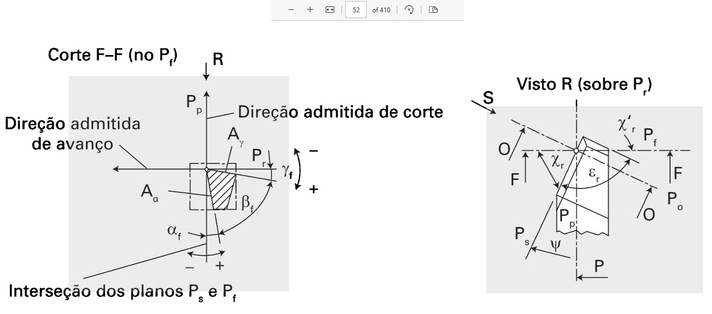
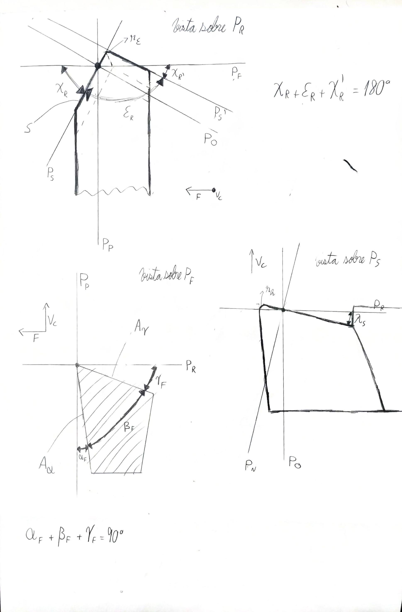

---
Classification	        :	Formula-Based Exercise
Discipline				:	EMA093 Processos de Fabricação por Usinagem
Source					:	Teoria de Usinagem dos Materiais p.43/45 a p.48/p.50
Description				:	Ângulos e planos principais
---

# Proposition

- Descreva quais são as direções, ângulos, e planos no contexto de usinagem.
- Qual a diferença entre $\alpha_o$ e $\alpha_f$.

# Step-by-step

## Sites auxiliares
- [Centro de Informação Metal Mecânica](https://www.cimm.com.br/portal/material_didatico/3357-ferramentas-de-corte-de-geometria-definida])
- [Geogebra interativo](https://www.geogebra.org/m/q2dmts53)

## Introdução
As definições se referem à um ponto escolhido na ferramenta, chamado de "ponto de corte escolhido" ou "ponto de referência".

- $S$ aresta de corte
- $S'$ aresta de corte secundária
- $A_\alpha$ superfície de folga
- $A'_\alpha$ superfície de folga secundária
- $A_\gamma$ superfície de saída: aquela na qual o cavaco vai mais atritar

## Subfixos e cognatos
- $s$ shear (**c**isalhamento / **c**orte)
- $f$ feed (avanço / trabalho)

Os subfixos vêm de palavras do inglês, mas muitas são cognatos.
- $n$ normal (normal)
- $o$ orthogonal (ortogonal). Observação: é a letra "o", não confundir com o algarismo 0.
- $r$ reference (referência)
- $e$ effective (efetivo)
- $p$ passive (passivo -> dorsal)

## Vetores de direções / velocidades
- $v_c$ Velocidade de corte

$$
v_c \quad [m/min]
$$

- $f$ Direção de avanço

$$
f \quad [mm/\text{rotação}]
$$

- $v_e$ Direção efetiva

$$
v_e = v_c + v_f
$$

**Dica:** para diferenciar a direção de corte da direção de avanço, lembre-se que, durante a operação da ferramenta, a **velocidade de corte é muito maior** que a direção de avanço.

## Planos
- $P_r$ plano de **referência** da ferramenta.

$$
P_r \perp v_c
$$

Além disso, em ferramentas de torneamento, é paralelo à superfície de apoio do cabo. Nas de fresamento ou furação, ele contém o eixo de rotação.

- $P_f$ plano de **avanço/trabalho**

$$
P_f \supset \{v_c, v_f, v_e\}
$$

- $P_s$ plano de **corte** da ferramenta

$$
P_s \supset S \quad \land \quad P_s \perp P_r
$$

- $P_p$ Plano **passivo/dorsal** da ferramenta

$$
P_p \perp P_r \quad \land \quad P_p \perp P_f
$$

Também pode ser defindo como o plano que contém a força passiva e direção de corte, já que a força passiva está contida no plano de referência.

$$
P_p \supset \{v_c, F_p\}
$$

- $P_n$ plano **normal** à aresta de corte

$$
P_n \perp S
$$

- $P'_s$ plano de **corte secundário** da ferramenta

---

Note que todos os planos definidios como ortogonais, sempre são perpendiculares ao plano de referência $(P_r)$ e algum outro plano.

- $P_o$ plano **ortogonal**

$$
P_o \perp P_s \quad \land \quad P_o \perp P_r
$$

- $P_g$ plano **ortogonal à superfície de saída**

$$
P_g \perp A_\gamma \quad \land \quad P_g \perp P_r
$$

- $P_b$ plano **ortogonal à superfície de folga**

$$
P_b \perp A_\alpha \quad \land \quad P_b \perp P_r
$$

## Ângulos

$$
\text{Medidos no } P_r
$$

- $\chi_r$ ângulo de **posição** da ferramenta
- $\varepsilon_r$ ângulo de **ponta** da ferramenta
- $\chi'_r$ ângulo de posição **secundário** da ferramenta

$$
\text{Medidos no } P_s
$$

- $\lambda_s$ ângulo de **inclinação** da ferramenta

$$
\text{Medidos no } P_o
$$

- $\alpha_o$ ângulo de **folga** da ferramenta
- $\beta_o$ ângulo de **cunha** da ferramenta
- $\gamma_o$ ângulo de **saída** da ferramenta

## Relações

$$
\alpha_o + \beta_o + \gamma_o = 90^\circ
$$

$$
\chi_r + \chi'_r + \varepsilon_r = 180^\circ
$$

## Outros atributos
- $r_\varepsilon$ raio de ponta. Raio da ponta da ferramenta vista a partir do $P_r$
- $r_h$ raio de cunha/aresta. raio da ponta da ferramenta vista a partir do $P_o$ ou $P_n$

## $\alpha_o$ vs $\alpha_f$
Ambos são o ângulo de folga da ferramenta, porém
$\alpha_o$ é medido no plano ortogonal $(P_o)$, enquanto $\alpha_f$ no plano de trabalho $(P_f)$, por isso o mesmo subfixo de seus respectivos planos de medição.

## Desenhos
Observação: note que nos desenhos aparecem as indicações dos planos como subfixo, que é a definição do plano em si, ou apenas a letra maiúscula, que é o plano perpendicular a ele naquela vista. Exemplo:
- $P_s$: plano de corte
- $S$: plano perpendicular ao plano de corte naquela vista

# Answer

# Attempts
