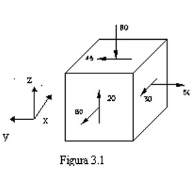
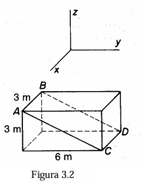
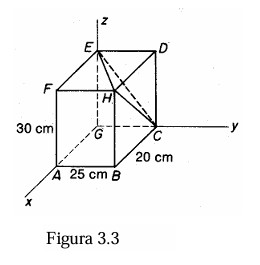
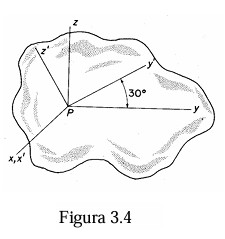

---
Classification	        :	Formula-Based Exercise
Discipline				:	EES003 Resistência dos Materiais
Source					:	2025-2 Lista 1 - Max de Castro
Description				:	2025-2 Lista 1 - Max de Castro
---

# Proposition

1) Complete as tensões que faltam no cubo infinitesimal em equilíbrio da Fig. 3.1 e escreva o tensor correspondente.

2) As componentes de tensão nos planos paralelos a xyz em um ponto são conhecidas como sendo:

$$
\sigma_{xx} = 7\text{MPa} \quad \sigma_{yy} = 4,2\text{MPa} \quad \sigma_{zz} = 0
$$

$$
\quad \sigma_{xy} = 1,4\text{MPa} \quad \sigma_{xz} = 0 \quad \sigma_{yz} = -2,8\text{MPa}
$$

Qual a tensão normal na direção $\epsilon$ tal que $\epsilon = 0,1i + 0,35j + ak$ , para “a” positivo? (Observe que “a” pode ser obtido facilmente considerando que o vetor é unitário)

3) Imagine uma distribuição de tensões uniforme em todos os pontos do corpo. Suponha que para tal distribuição, tenhamos:

$$
\sigma_{xx} = 7\text{MPa} \quad \sigma_{yy} = -7\text{MPa} \quad \sigma_{zz} = 7\text{MPa}
$$

$$
\sigma_{xy} = 0 \quad \sigma_{xz} = 3,5\text{MPa} \quad \sigma_{yz} = -3,5\text{MPa}
$$

Qual é a tensão normal no plano ABCD do paralelepípedo do corpo representado na Fig. 3.2?

4) Na Fig. 3.3, representa-se um bloco. Nas faces HDBC e AFEG, as tensões são $\sigma_{yy} = 56\text{MPa, } \sigma_{yx} = 35\text{MPa e } \sigma_{yz} = -7\text{MPa}$
. Nas faces FHAB e EDCG, as tensões são $\sigma_{xx} = 42\text{MPa, } \sigma_{xy} = 35\text{MPa} \quad \text{e} \quad \sigma_{xz} = 21\text{MPa}$ . Finalmente as tensões nas faces FEDH e AGCB, as tensões são $\sigma_{zz} = -42\text{MPa, } \sigma_{zx} = 21\text{MPa e } \sigma_{zy} = -7\text{MPa}$ . Verificar se a tensão de cisalhamento na face HEC, ao longo de HC, é igual à tensão de cisalhamento na face HDCB, ao longo de HC. A seguir, calcular essas tensões de cisalhamento e comparar os resultados.

5) As tensões em um ponto P na referência xyz são:

$$
\Sigma = \begin{pmatrix} 0 & 1,4 & 2,1 \\ 1,4 & 3,5 & 0 \\ 2,1 & 0 & 4,2 \end{pmatrix} \text{MPa.}
$$

Qual o tensor para um sistema de eixos x'y'z', obtido pela rotação de 30º em relação ao eixo dos x, conforme se mostra na Fig. 3.4?

6) O tensor de tensões em um ponto P na referência xyz está descrito abaixo. Qual o tensor para um sistema de eixos, obtidos pela rotação de 45º em relação ao eixo dos z, para quem olha na direção ao ponto(de z+ para z-)?

$$
\Sigma = \begin{pmatrix} 0,7 & 0 & 0 \\ 0 & 0 & 0 \\ 0 & 0 & 2,1 \end{pmatrix}  \text{MPa.}
$$

7) Dadas as seguintes tensões: $\sigma_{xx} = 3,5\text{MPa} \quad \sigma_{yy} = -7\text{MPa} \quad \sigma_{xy} = 1,4\text{MPa}$ , qual a tensão normal para um plano tendo a normal com a seguinte direção: $\epsilon = 0,707i + 0,707j$ ?

# Step-by-step

## 1

$$
\boxed{\sigma = \begin{pmatrix} 60 & 30 & 20 \\ 30 & 50 & 15 \\ 20 & 15 & -80 \end{pmatrix}}
$$

## 2
**Passo 1: Determinar o valor de "a"**

$$
||\epsilon|| = \sqrt{(0,1)^2 + (0,35)^2 + a^2} = 1
$$

$$
(0,1)^2 + (0,35)^2 + a^2 = 1^2
$$

$$
0,01 + 0,1225 + a^2 = 1
$$

$$
0,1325 + a^2 = 1
$$

$$
a^2 = 1 - 0,1325 = 0,8675
$$

$$
a = \sqrt{0,8675} \approx 0,9314
$$

**Passo 2: Vetor de direção normal**

$$
\vec{n} = (n_x, n_y, n_z) = (0,1, \quad 0,35, \quad 0,9314)
$$

**Passo 3: Tensor de tensões**

$$
\sigma =
\begin{pmatrix}
\sigma_{xx} & \sigma_{xy} & \sigma_{xz} \\
\sigma_{yx} & \sigma_{yy} & \sigma_{yz} \\
\sigma_{zx} & \sigma_{zy} & \sigma_{zz}
\end{pmatrix}
=
\begin{pmatrix}
7 & 1,4 & 0 \\
1,4 & 4,2 & -2,8 \\
0 & -2,8 & 0
\end{pmatrix}
\text{MPa}
$$

**Passo 4: Cálculo da tensão normal**

$$
\sigma_{\epsilon} = \sigma_{xx}n_x^2 + \sigma_{yy}n_y^2 + \sigma_{zz}n_z^2 + 2\sigma_{xy}n_x n_y + 2\sigma_{xz}n_x n_z + 2\sigma_{yz}n_y n_z
$$

$$
\sigma_{\epsilon} = (7)(0,1)^2 + (4,2)(0,35)^2 + (0)(0,9314)^2 + 2(1,4)(0,1)(0,35) + 2(0)(0,1)(0,9314) + 2(-2,8)(0,35)(0,9314)
$$

$$
\sigma_{\epsilon} = (7)(0,01) + (4,2)(0,1225) + 0 + 2(0,049) + 0 - 2(0,98)(0,9314)
$$

$$
\sigma_{\epsilon} = 0,07 + 0,5145 + 0,098 - 1,96(0,9314)
$$

$$
\sigma_{\epsilon} = 0,6825 - 1,8255
$$

$$
\sigma_{\epsilon} \approx -1,143 \text{ MPa}
$$

## 3

$$
A = (0, 0, 3) \quad B = (0, 3, 3) \quad C = (6, 3, 0) \quad D = (6, 0, 0)
$$

$$
\vec{AD} = (6, 0, -3)
$$

$$
\vec{AB} = (0, 3, 0)
$$

$$
\vec{n} = \vec{AD} \times \vec{AB} = \begin{vmatrix}
\mathbf{i} & \mathbf{j} & \mathbf{k} \\
6 & 0 & -3 \\
0 & 3 & 0
\end{vmatrix} = (9, 0, 18)
$$

$$
\mathbf{n} = \frac{\vec{n}}{|\vec{n}|} = \frac{(9, 0, 18)}{\sqrt{9^2 + 0^2 + 18^2}} = \frac{(9, 0, 18)}{\sqrt{405}} = \left(\frac{1}{\sqrt{5}}, 0, \frac{2}{\sqrt{5}}\right)
$$

$$
\sigma_n = \sigma_{xx}n_x^2 + \sigma_{yy}n_y^2 + \sigma_{zz}n_z^2 + 2\sigma_{xy}n_x n_y + 2\sigma_{xz}n_x n_z + 2\sigma_{yz}n_y n_z
$$

$$
\sigma_n = (7)\left(\frac{1}{\sqrt{5}}\right)^2 + (-7)(0)^2 + (7)\left(\frac{2}{\sqrt{5}}\right)^2 + 2(0)\left(\frac{1}{\sqrt{5}}\right)(0) + 2(3.5)\left(\frac{1}{\sqrt{5}}\right)\left(\frac{2}{\sqrt{5}}\right) + 2(-3.5)(0)\left(\frac{2}{\sqrt{5}}\right)
$$

$$
\sigma_n = 7\left(\frac{1}{5}\right) + 7\left(\frac{4}{5}\right) + 7\left(\frac{2}{5}\right) = \frac{7 + 28 + 14}{5} = \frac{49}{5}
$$

$$
\sigma_n = 9.8 \text{ MPa}
$$

## 4

$$
\sigma = \begin{pmatrix} \sigma_{xx} & \sigma_{xy} & \sigma_{xz} \\ \sigma_{yx} & \sigma_{yy} & \sigma_{yz} \\ \sigma_{zx} & \sigma_{zy} & \sigma_{zz} \end{pmatrix} = \begin{pmatrix} 42 & 35 & 21 \\ 35 & 56 & -7 \\ 21 & -7 & -42 \end{pmatrix} \text{MPa}
$$

Assumindo um sistema de coordenadas com origem em C, eixo x para a esquerda, eixo y para a frente e eixo z para cima:

$$
C = (0, 0, 0) \quad B = (-25, 0, 0) \quad G = (0, -20, 0)
$$

$$
E = (0, 0, 30) \quad D = (0, -20, 30) \quad H = (-25, -20, 30)
$$

$$
\text{1. Tensão de cisalhamento na face HDCB ao longo de HC}
$$

$$
\vec{v}_{CB} = B - C = (-25, 0, 0)
$$

$$
\vec{v}_{CD} = D - C = (0, -20, 30)
$$

$$
\vec{n}_{HDCB} = \vec{v}_{CB} \times \vec{v}_{CD} = \begin{vmatrix} \mathbf{i} & \mathbf{j} & \mathbf{k} \\ -25 & 0 & 0 \\ 0 & -20 & 30 \end{vmatrix} = (0, 750, 500)
$$

$$
|\vec{n}_{HDCB}| = \sqrt{750^2 + 500^2} = \sqrt{812500} = 250\sqrt{13}
$$

$$
\vec{n}_1 = \frac{\vec{n}_{HDCB}}{|\vec{n}_{HDCB}|} = \frac{1}{250\sqrt{13}}(0, 750, 500) = \frac{1}{\sqrt{13}}(0, 3, 2)
$$

$$
\vec{T}_1 = \sigma \cdot \vec{n}_1 = \begin{pmatrix} 42 & 35 & 21 \\ 35 & 56 & -7 \\ 21 & -7 & -42 \end{pmatrix} \frac{1}{\sqrt{13}} \begin{pmatrix} 0 \\ 3 \\ 2 \end{pmatrix} = \frac{1}{\sqrt{13}} \begin{pmatrix} 105+42 \\ 168-14 \\ -21-84 \end{pmatrix} = \frac{1}{\sqrt{13}} \begin{pmatrix} 147 \\ 154 \\ -105 \end{pmatrix}
$$

$$
\vec{d}_{HC} = C - H = (0, 0, 0) - (-25, -20, 30) = (25, 20, -30)
$$

$$
|\vec{d}_{HC}| = \sqrt{25^2 + 20^2 + (-30)^2} = \sqrt{625 + 400 + 900} = \sqrt{1925} = 5\sqrt{77}
$$

$$
\vec{u}_{HC} = \frac{\vec{d}_{HC}}{|\vec{d}_{HC}|} = \frac{1}{5\sqrt{77}}(25, 20, -30) = \frac{1}{\sqrt{77}}(5, 4, -6)
$$

$$
\tau_{HDCB, HC} = \vec{T}_1 \cdot \vec{u}_{HC} = \frac{1}{\sqrt{13}\sqrt{77}} (147 \cdot 5 + 154 \cdot 4 - 105 \cdot (-6))
$$

$$
\tau_{HDCB, HC} = \frac{1}{\sqrt{1001}} (735 + 616 + 630) = \frac{1981}{\sqrt{1001}} \approx 62.61 \text{ MPa}
$$

$$
\text{2. Tensão de cisalhamento na face HEC ao longo de HC}
$$

$$
\vec{v}_{CE} = E - C = (0, 0, 30)
$$

$$
\vec{v}_{CH} = H - C = (-25, -20, 30)
$$

$$
\vec{n}_{HEC} = \vec{v}_{CE} \times \vec{v}_{CH} = \begin{vmatrix} \mathbf{i} & \mathbf{j} & \mathbf{k} \\ 0 & 0 & 30 \\ -25 & -20 & 30 \end{vmatrix} = (600, -750, 0)
$$

$$
|\vec{n}_{HEC}| = \sqrt{600^2 + (-750)^2} = \sqrt{922500} = 150\sqrt{41}
$$

$$
\vec{n}_2 = \frac{\vec{n}_{HEC}}{|\vec{n}_{HEC}|} = \frac{1}{150\sqrt{41}}(600, -750, 0) = \frac{1}{\sqrt{41}}(4, -5, 0)
$$

$$
\vec{T}_2 = \sigma \cdot \vec{n}_2 = \begin{pmatrix} 42 & 35 & 21 \\ 35 & 56 & -7 \\ 21 & -7 & -42 \end{pmatrix} \frac{1}{\sqrt{41}} \begin{pmatrix} 4 \\ -5 \\ 0 \end{pmatrix} = \frac{1}{\sqrt{41}} \begin{pmatrix} 168-175 \\ 140-280 \\ 84+35 \end{pmatrix} = \frac{1}{\sqrt{41}} \begin{pmatrix} -7 \\ -140 \\ 119 \end{pmatrix}
$$

$$
\tau_{HEC, HC} = \vec{T}_2 \cdot \vec{u}_{HC} = \frac{1}{\sqrt{41}\sqrt{77}} (-7 \cdot 5 - 140 \cdot 4 + 119 \cdot (-6))
$$

$$
\tau_{HEC, HC} = \frac{1}{\sqrt{3157}} (-35 - 560 - 714) = \frac{-1309}{\sqrt{3157}} \approx -23.30 \text{ MPa}
$$

$$
\text{3. Verificação e Comparação}
$$

$$
\tau_{HDCB, HC} \neq \tau_{HEC, HC}
$$

$$
62.61 \text{ MPa} \neq -23.30 \text{ MPa}
$$

$$
\text{As tensões de cisalhamento não são iguais.}
$$

## 5

$$
\sigma' = L \sigma L^T
$$

$$
L = \begin{pmatrix} 1 & 0 & 0 \\ 0 & \cos(30^\circ) & \sin(30^\circ) \\ 0 & -\sin(30^\circ) & \cos(30^\circ) \end{pmatrix} = \begin{pmatrix} 1 & 0 & 0 \\ 0 & \frac{\sqrt{3}}{2} & \frac{1}{2} \\ 0 & -\frac{1}{2} & \frac{\sqrt{3}}{2} \end{pmatrix}
$$

$$
L^T = \begin{pmatrix} 1 & 0 & 0 \\ 0 & \cos(30^\circ) & -\sin(30^\circ) \\ 0 & \sin(30^\circ) & \cos(30^\circ) \end{pmatrix} = \begin{pmatrix} 1 & 0 & 0 \\ 0 & \frac{\sqrt{3}}{2} & -\frac{1}{2} \\ 0 & \frac{1}{2} & \frac{\sqrt{3}}{2} \end{pmatrix}
$$

$$
\sigma' = \begin{pmatrix} 1 & 0 & 0 \\ 0 & \frac{\sqrt{3}}{2} & \frac{1}{2} \\ 0 & -\frac{1}{2} & \frac{\sqrt{3}}{2} \end{pmatrix} \begin{pmatrix} 0 & 1,4 & 2,1 \\ 1,4 & 3,5 & 0 \\ 2,1 & 0 & 4,2 \end{pmatrix} \begin{pmatrix} 1 & 0 & 0 \\ 0 & \frac{\sqrt{3}}{2} & -\frac{1}{2} \\ 0 & \frac{1}{2} & \frac{\sqrt{3}}{2} \end{pmatrix}
$$

$$
\sigma L^T = \begin{pmatrix} 0 & 1,4(\frac{\sqrt{3}}{2}) + 2,1(\frac{1}{2}) & 1,4(-\frac{1}{2}) + 2,1(\frac{\sqrt{3}}{2}) \\ 1,4 & 3,5(\frac{\sqrt{3}}{2}) & 3,5(-\frac{1}{2}) \\ 2,1 & 4,2(\frac{1}{2}) & 4,2(\frac{\sqrt{3}}{2}) \end{pmatrix} = \begin{pmatrix} 0 & 0,7\sqrt{3} + 1,05 & -0,7 + 1,05\sqrt{3} \\ 1,4 & 1,75\sqrt{3} & -1,75 \\ 2,1 & 2,1 & 2,1\sqrt{3} \end{pmatrix}
$$

$$
\sigma' = L (\Sigma L^T) = \begin{pmatrix} 1 & 0 & 0 \\ 0 & \frac{\sqrt{3}}{2} & \frac{1}{2} \\ 0 & -\frac{1}{2} & \frac{\sqrt{3}}{2} \end{pmatrix} \begin{pmatrix} 0 & 0,7\sqrt{3} + 1,05 & -0,7 + 1,05\sqrt{3} \\ 1,4 & 1,75\sqrt{3} & -1,75 \\ 2,1 & 2,1 & 2,1\sqrt{3} \end{pmatrix}
$$

$$
\sigma'_{x'x'} = 0
$$

$$
\sigma'_{y'y'} = \frac{\sqrt{3}}{2}(1,75\sqrt{3}) + \frac{1}{2}(2,1) = \frac{1,75 \cdot 3}{2} + 1,05 = 2,625 + 1,05 = 3,675
$$

$$
\sigma'_{z'z'} = (-\frac{1}{2})(-1,75) + \frac{\sqrt{3}}{2}(2,1\sqrt{3}) = 0,875 + \frac{2,1 \cdot 3}{2} = 0,875 + 3,15 = 4,025
$$

$$
\sigma'_{x'y'} = \sigma'_{y'x'} = 0,7\sqrt{3} + 1,05 \approx 2,262
$$

$$
\sigma'_{x'z'} = \sigma'_{z'x'} = -0,7 + 1,05\sqrt{3} \approx 1,119
$$

$$
\sigma'_{y'z'} = \sigma'_{z'y'} = \frac{\sqrt{3}}{2}(-1,75) + \frac{1}{2}(2,1\sqrt{3}) = -0,875\sqrt{3} + 1,05\sqrt{3} = 0,175\sqrt{3} \approx 0,303
$$

$$
\sigma' = \begin{pmatrix} 0 & 2,262 & 1,119 \\ 2,262 & 3,675 & 0,303 \\ 1,119 & 0,303 & 4,025 \end{pmatrix} \text{MPa}
$$

## 6

$$
\sigma_{xyz} = \begin{pmatrix} 0,7 & 0 & 0 \\ 0 & 0 & 0 \\ 0 & 0 & 2,1 \end{pmatrix} \text{MPa}
$$

$$
\theta = -45^\circ
$$

$$
A = \begin{pmatrix} \cos\theta & \sin\theta & 0 \\ -\sin\theta & \cos\theta & 0 \\ 0 & 0 & 1 \end{pmatrix} = \begin{pmatrix} \cos(-45^\circ) & \sin(-45^\circ) & 0 \\ -\sin(-45^\circ) & \cos(-45^\circ) & 0 \\ 0 & 0 & 1 \end{pmatrix} = \begin{pmatrix} \frac{\sqrt{2}}{2} & -\frac{\sqrt{2}}{2} & 0 \\ \frac{\sqrt{2}}{2} & \frac{\sqrt{2}}{2} & 0 \\ 0 & 0 & 1 \end{pmatrix}
$$

$$
\sigma' = A \sigma_{xyz} A^T
$$

$$
\sigma' = \begin{pmatrix} \frac{\sqrt{2}}{2} & -\frac{\sqrt{2}}{2} & 0 \\ \frac{\sqrt{2}}{2} & \frac{\sqrt{2}}{2} & 0 \\ 0 & 0 & 1 \end{pmatrix} \begin{pmatrix} 0,7 & 0 & 0 \\ 0 & 0 & 0 \\ 0 & 0 & 2,1 \end{pmatrix} \begin{pmatrix} \frac{\sqrt{2}}{2} & \frac{\sqrt{2}}{2} & 0 \\ -\frac{\sqrt{2}}{2} & \frac{\sqrt{2}}{2} & 0 \\ 0 & 0 & 1 \end{pmatrix}
$$

$$
\sigma' = \begin{pmatrix} 0,7\frac{\sqrt{2}}{2} & 0 & 0 \\ 0,7\frac{\sqrt{2}}{2} & 0 & 0 \\ 0 & 0 & 2,1 \end{pmatrix} \begin{pmatrix} \frac{\sqrt{2}}{2} & \frac{\sqrt{2}}{2} & 0 \\ -\frac{\sqrt{2}}{2} & \frac{\sqrt{2}}{2} & 0 \\ 0 & 0 & 1 \end{pmatrix}
$$

$$
\sigma' = \begin{pmatrix} 0,7 \left(\frac{\sqrt{2}}{2}\right)^2 & 0,7 \left(\frac{\sqrt{2}}{2}\right)^2 & 0 \\ 0,7 \left(\frac{\sqrt{2}}{2}\right)^2 & 0,7 \left(\frac{\sqrt{2}}{2}\right)^2 & 0 \\ 0 & 0 & 2,1 \end{pmatrix}
$$

$$
\sigma' = \begin{pmatrix} 0,7 \left(\frac{2}{4}\right) & 0,7 \left(\frac{2}{4}\right) & 0 \\ 0,7 \left(\frac{2}{4}\right) & 0,7 \left(\frac{2}{4}\right) & 0 \\ 0 & 0 & 2,1 \end{pmatrix}
$$

$$
\sigma' = \begin{pmatrix} 0,35 & 0,35 & 0 \\ 0,35 & 0,35 & 0 \\ 0 & 0 & 2,1 \end{pmatrix} \text{MPa}
$$

## 7

$$
T = \begin{pmatrix} \sigma_{xx} & \sigma_{xy} \\ \sigma_{yx} & \sigma_{yy} \end{pmatrix} = \begin{pmatrix} 3,5 & 1,4 \\ 1,4 & -7 \end{pmatrix} \text{MPa}
$$

$$
\vec{n} = \begin{pmatrix} n_x \\ n_y \end{pmatrix} = \begin{pmatrix} 0,707 \\ 0,707 \end{pmatrix}
$$

$$
\theta = \arctan\left(\frac{n_y}{n_x}\right) = \arctan\left(\frac{0,707}{0,707}\right) = \arctan(1) = 45^\circ
$$

$$
\sigma_{n} = \frac{\sigma_{xx} + \sigma_{yy}}{2} + \frac{\sigma_{xx} - \sigma_{yy}}{2}\cos(2\theta) + \sigma_{xy}\sin(2\theta)
$$

$$
\sigma_{n} = \frac{3,5 + (-7)}{2} + \frac{3,5 - (-7)}{2}\cos(2 \cdot 45^\circ) + 1,4\sin(2 \cdot 45^\circ)
$$

$$
\sigma_{n} = \frac{-3,5}{2} + \frac{10,5}{2}\cos(90^\circ) + 1,4\sin(90^\circ)
$$

$$
\sigma_{n} = -1,75 + (5,25 \cdot 0) + (1,4 \cdot 1)
$$

$$
\sigma_{n} = -1,75 + 1,4
$$

$$
\sigma_{n} = -0,35 \text{ MPa}
$$

# Answer

## 1

$$
\boxed{\sigma = \begin{pmatrix} 60 & 30 & 20 \\ 30 & 50 & 15 \\ 20 & 15 & -80 \end{pmatrix}}
$$

## 2

$$
\boxed{\sigma_{\epsilon} \approx -1,143 \text{ MPa}}
$$

## 3

$$
\boxed{\sigma_n = 9.8 \text{ MPa}}
$$

## 4

$$
\boxed{62.61 \text{ MPa} \neq -23.30 \text{ MPa}}
$$

## 5

$$
\boxed{\sigma' = \begin{pmatrix} 0 & 2,262 & 1,119 \\ 2,262 & 3,675 & 0,303 \\ 1,119 & 0,303 & 4,025 \end{pmatrix} \text{MPa}}
$$

## 6

$$
\boxed{\sigma' = \begin{pmatrix} 0,35 & 0,35 & 0 \\ 0,35 & 0,35 & 0 \\ 0 & 0 & 2,1 \end{pmatrix} \text{MPa}}
$$

## 7

$$
\boxed{\sigma_{n} = -0,35 \text{ MPa}}
$$

# Attempts
