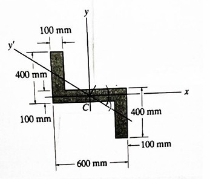

---
Classification	        :	Formula-Based Exercise
Discipline				:	EES003 Resistência dos Materiais
Source					:	2025-2 P1 Max
Description				:	2025-2 P1 Max
---

# Proposition

## 1

Determine os momentos principais de inercia para a área da seção transversal da viga mostrada na figura abaixo em relação a um eixo que passa pelo centroide.
Dados: $I_x=2,9 \times 10^9 \text{ mm}^4$; $I_y=5,6 \times 10^9 \text{ mm}^4$; $I_{xy}=-3,0 \times 10^9 \text{ mm}^4$

Descrição da Imagem
A imagem mostra a seção transversal de uma viga. Um sistema de coordenadas cartesianas, com eixos $x$ (horizontal) e $y$ (vertical), tem sua origem no centroide $C$ da seção. Um eixo $y'$ rotacionado também é mostrado passando pelo centroide. A seção é composta por 1 retângulo horizontal, 1 retângulo vertical no lado esquerdo do retângulo horizontal, na parte de cima, e 1 retângulo vertical no lado direito do retângulo horizontal.

- O retângulo horizontal tem 600mm no eixo x e 100mm no eixo y.
- Ambos retângulos verticais tem 100mm no eixo x e 400mm no eixo y.

## 2

O estado de tensões em um dado ponto de um sólido deformável é dado pelas seguintes tensões (MPa):

$$
T = \begin{bmatrix}
16.8 & 9.6 & 7.2 \\
9.6 & 29.6 & 0 \\
7.2 & 0 & 29.6
\end{bmatrix}
$$

Admitindo que o material seja isótropo e possua comportamento elástico-linear, determine:

a) o tensor das pequenas deformações no ponto;

b) a máxima distorção e o máximo alongamento possíveis de serem obtidos neste ponto;

São dados: $E=200$ GPa; $\nu=0.25$.

# Step-by-step

## 1

$$
I_{max, min} = \frac{I_x + I_y}{2} \pm \sqrt{\left(\frac{I_x - I_y}{2}\right)^2 + I_{xy}^2}
$$

$$
\frac{I_x + I_y}{2} = \frac{2,9 \times 10^9 + 5,6 \times 10^9}{2} = 4,25 \times 10^9 \text{ mm}^4
$$

$$
\frac{I_x - I_y}{2} = \frac{2,9 \times 10^9 - 5,6 \times 10^9}{2} = -1,35 \times 10^9 \text{ mm}^4
$$

$$
I_{max, min} = 4,25 \times 10^9 \pm \sqrt{\left(-1,35 \times 10^9\right)^2 + \left(-3,0 \times 10^9\right)^2}
$$

$$
I_{max, min} = 4,25 \times 10^9 \pm \sqrt{1,8225 \times 10^{18} + 9,0 \times 10^{18}}
$$

$$
I_{max, min} = 4,25 \times 10^9 \pm \sqrt{10,8225 \times 10^{18}}
$$

$$
I_{max, min} = 4,25 \times 10^9 \pm 3,29 \times 10^9 \text{ mm}^4
$$

$$
I_{max} = (4,25 + 3,29) \times 10^9 = 7,54 \times 10^9 \text{ mm}^4
$$

$$
I_{min} = (4,25 - 3,29) \times 10^9 = 0,960 \times 10^9 \text{ mm}^4
$$

## 2
**a) Tensor das pequenas deformações ($\epsilon$)**

1.  Cálculo do Módulo de Cisalhamento ($G$):

$$
G = \frac{E}{2(1 + \nu)} = \frac{200 \times 10^3 \text{ MPa}}{2(1 + 0.25)} = 80 \times 10^3 \text{ MPa} = 80 \text{ GPa}
$$

2.  Cálculo das deformações normais ($\epsilon_{xx}, \epsilon_{yy}, \epsilon_{zz}$) usando a Lei de Hooke generalizada:

$$
\epsilon_{xx} = \frac{1}{E} [\sigma_{xx} - \nu(\sigma_{yy} + \sigma_{zz})] = \frac{1}{200 \times 10^3} [16.8 - 0.25(29.6 + 29.6)] = 1 \times 10^{-5}
$$

$$
\epsilon_{yy} = \frac{1}{E} [\sigma_{yy} - \nu(\sigma_{xx} + \sigma_{zz})] = \frac{1}{200 \times 10^3} [29.6 - 0.25(16.8 + 29.6)] = 9 \times 10^{-5}
$$

$$
\epsilon_{zz} = \frac{1}{E} [\sigma_{zz} - \nu(\sigma_{xx} + \sigma_{yy})] = \frac{1}{200 \times 10^3} [29.6 - 0.25(16.8 + 29.6)] = 9 \times 10^{-5}
$$

3.  Cálculo das componentes de cisalhamento do tensor de deformação ($\epsilon_{xy}, \epsilon_{xz}, \epsilon_{yz}$):

$$
\epsilon_{xy} = \frac{\tau_{xy}}{2G} = \frac{9.6}{2 \times (80 \times 10^3)} = 6 \times 10^{-5}
$$

$$
\epsilon_{xz} = \frac{\tau_{xz}}{2G} = \frac{7.2}{2 \times (80 \times 10^3)} = 4.5 \times 10^{-5}
$$

$$
\epsilon_{yz} = \frac{\tau_{yz}}{2G} = \frac{0}{2 \times (80 \times 10^3)} = 0
$$

4.  Tensor das pequenas deformações ($\epsilon$):

$$
\epsilon = \begin{bmatrix}
\epsilon_{xx} & \epsilon_{xy} & \epsilon_{xz} \\
\epsilon_{yx} & \epsilon_{yy} & \epsilon_{yz} \\
\epsilon_{zx} & \epsilon_{zy} & \epsilon_{zz}
\end{bmatrix} = \begin{bmatrix}
1 & 6 & 4.5 \\
6 & 9 & 0 \\
4.5 & 0 & 9
\end{bmatrix} \times 10^{-5}
$$

**b) Máxima distorção ($\gamma_{max}$) e máximo alongamento ($\epsilon_{max}$)**

1.  Cálculo das tensões principais ($\sigma_1, \sigma_2, \sigma_3$) resolvendo a equação característica $\det(T - \sigma I) = 0$:

$$
\begin{vmatrix}
16.8 - \sigma & 9.6 & 7.2 \\
9.6 & 29.6 - \sigma & 0 \\
7.2 & 0 & 29.6 - \sigma
\end{vmatrix} = 0
$$

$$
(29.6 - \sigma) \left[ (16.8 - \sigma)(29.6 - \sigma) - (9.6)^2 - (7.2)^2 \right] = 0
$$

$$
(29.6 - \sigma) (\sigma^2 - 46.4\sigma + 353.28) = 0
$$

    As raízes (tensões principais) são:

$$
\sigma_1 = 36.8 \text{ MPa}
$$

$$
\sigma_2 = 29.6 \text{ MPa}
$$

$$
\sigma_3 = 9.6 \text{ MPa}
$$

2.  Cálculo das deformações principais ($\epsilon_1, \epsilon_2, \epsilon_3$) a partir das tensões principais:

$$
\epsilon_1 = \frac{1}{E}[\sigma_1 - \nu(\sigma_2 + \sigma_3)] = \frac{1}{200 \times 10^3}[36.8 - 0.25(29.6 + 9.6)] = 13.5 \times 10^{-5}
$$

$$
\epsilon_2 = \frac{1}{E}[\sigma_2 - \nu(\sigma_1 + \sigma_3)] = \frac{1}{200 \times 10^3}[29.6 - 0.25(36.8 + 9.6)] = 9 \times 10^{-5}
$$

$$
\epsilon_3 = \frac{1}{E}[\sigma_3 - \nu(\sigma_1 + \sigma_2)] = \frac{1}{200 \times 10^3}[9.6 - 0.25(36.8 + 29.6)] = -3.5 \times 10^{-5}
$$

3.  O máximo alongamento é a máxima deformação principal ($\epsilon_{max}$):

$$
\epsilon_{max} = \epsilon_1 = 13.5 \times 10^{-5}
$$

4.  A máxima distorção é a máxima deformação por cisalhamento ($\gamma_{max}$), dada pela diferença entre a máxima e a mínima deformação principal:

$$
\gamma_{max} = \epsilon_{max} - \epsilon_{min} = \epsilon_1 - \epsilon_3 = 13.5 \times 10^{-5} - (-3.5 \times 10^{-5}) = 17 \times 10^{-5}
$$

# Answer

# Attempts
