---
Classification	        :	Formula-Based Exercise
Discipline				:	EMA091 Mecânica dos fluidos
Source					:	FOX AND McDONALD’S Edição 8 - p162
Description				:	P2 - Exemplo 4.1 a 4.8 e 4.10
---

# Proposition

## 4.1 FLUXO DE MASSA EM UMA JUNÇÃO DE TUBOS

Considere o escoamento permanente de água em uma junção de tubos conforme mostrado no diagrama. As áreas das seções são: $A_1 = 0,2 \text{ m}^2$, $A_2 = 0,2 \text{ m}^2$ e $A_3 = 0,15 \text{ m}^2$. O fluido também vaza para fora do tubo através de um orifício em ④ com uma vazão volumétrica estimada em $0,1 \text{ m}^3/\text{s}$. As velocidades médias nas seções ① e ③ são $V_1 = 5 \text{ m/s}$ e $V_3 = 12 \text{ m/s}$, respectivamente. Determine a velocidade do escoamento na seção ②.

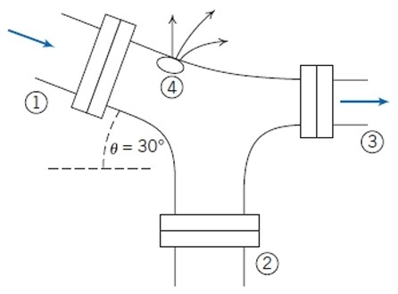

A imagem mostra uma junção de tubos com quatro seções numeradas.
A seção ① é um tubo de entrada localizado no lado esquerdo superior, inclinado para baixo. Uma seta azul indica o fluxo entrando na junção. O ângulo do tubo em relação a uma linha horizontal tracejada é $\theta = 30^{\circ}$.
A seção ② é um tubo na parte inferior, orientado verticalmente para cima, representando uma entrada ou saída para a junção.
A seção ③ é um tubo de saída no lado direito, orientado horizontalmente. Uma seta azul indica o fluxo saindo da junção.
A seção ④ é um orifício na parte superior da junção, de onde o fluido está vazando, indicado por várias setas curvas saindo.
As seções ①, ② e ③ possuem flanges em suas conexões.

## 4.2 VAZÃO MÁSSICA NA CAMADA-LIMITE
O fluido em contato direto com uma fronteira sólida estacionária tem velocidade zero; não há deslizamento na fronteira. Então, o escoamento sobre uma placa plana adere-se à superfície da placa e forma uma camada-limite, como esquematizado a seguir. O escoamento a montante da placa é uniforme com velocidade $\vec{V} = U\hat{i}$; $U = 30$ m/s. A distribuição de velocidade dentro da camada-limite ($0 \le y \le \delta$) ao longo de $cd$ é aproximada por $u/U = 2(y/\delta) - (y/\delta)^2$.

A espessura da camada-limite na posição $d$ é $\delta = 5$ mm. O fluido é ar com massa específica $\rho = 1,24$ kg/m$^3$. Supondo que a largura da placa perpendicular ao papel seja $w = 0,6$ m, calcule a vazão mássica através da superfície $bc$ do volume de controle $abcd$.

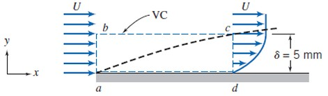

A imagem mostra o escoamento de um fluido sobre uma placa plana horizontal. Um sistema de coordenadas cartesianas é apresentado com o eixo x alinhado com a placa e o eixo y perpendicular a ela. O escoamento, vindo da esquerda, tem uma velocidade uniforme $U$ antes de atingir a placa. Sobre a placa, forma-se uma camada-limite, cuja borda é indicada por uma linha tracejada que começa na ponta da placa (ponto a) e se afasta da superfície. Um volume de controle (VC) retangular é definido pelos pontos $a$, $b$, $c$ e $d$. O lado $ab$ está na região de escoamento uniforme, o lado $ad$ está sobre a superfície da placa, e o lado $cd$ está a uma certa distância ao longo da placa, onde o perfil de velocidade não é mais uniforme, variando de zero na placa até $U$ na borda da camada-limite. O lado $bc$ é a face superior do volume de controle.

## 4.3 VARIAÇÃO DE MASSA ESPECÍFICA EM TANQUE DE VENTILAÇÃO
Um tanque, com volume de $∀ = 0,05 \text{ m}^3$, contém ar a $800 \text{ kPa}$ (absoluta) e $15^\circ\text{C}$. Em $t = 0$, o ar começa a escapar do tanque por meio de uma válvula com área de escoamento de $65 \text{ mm}^2$. O ar passando pela válvula tem velocidade de $300 \text{ m/s}$ e massa específica de $6 \text{ kg/m}^3$. Determine a taxa instantânea de variação da massa específica do ar no tanque em $t = 0$.

## 4.4 ESCOLHA DO VOLUME DE CONTROLE PARA ANÁLISE DE QUANTIDADE DE MOVIMENTO

A água sai de um bocal estacionário e atinge uma placa plana, conforme mostrado. A água deixa o bocal a $15 \text{ m/s}$; a área do bocal é $0,01 \text{ m}^2$. Considerando que a água é dirigida normal à placa e que escoa totalmente ao longo da placa, determine a força horizontal sobre o suporte.

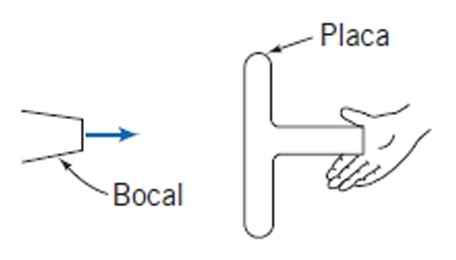

Descrição da Imagem: A imagem exibe um diagrama esquemático. À esquerda, há um "Bocal" que emite um jato de água, representado por uma seta azul, em direção a uma "Placa" plana e vertical à direita. A placa, que tem um formato semelhante a um 'T' deitado, é segurada por uma mão, que atua como suporte, contra a força do jato de água. O jato de água atinge a placa perpendicularmente em seu centro.

## 4.5 TANQUE SOBRE BALANÇA: FORÇA DE CAMPO
Um recipiente de metal, com $0,61$ m de altura e seção reta interna de $0,09 \text{ m}^2$, pesa $22,2$ N quando vazio. O recipiente é colocado sobre uma balança e a água escoa para o interior do recipiente por uma abertura no topo e para fora por meio de duas aberturas iguais nas laterais do recipiente, conforme mostrado no diagrama. Sob condições de escoamento permanente, a altura da água no tanque é $h = 0,58$ m.

O seu chefe quer que a balança leia o peso do volume de água no tanque mais o peso do tanque, isto é, que o problema seja tratado como um simples problema de estática. Você discorda, dizendo que uma análise de escoamento do fluido é necessária. Quem está certo, e que leitura a balança indica?

São fornecidos os seguintes dados:
$A_1 = 0,009 \text{ m}^2$
$\vec{V}_1 = -3\hat{j} \text{ m/s}$
$A_2 = A_3 = 0,009 \text{ m}^2$

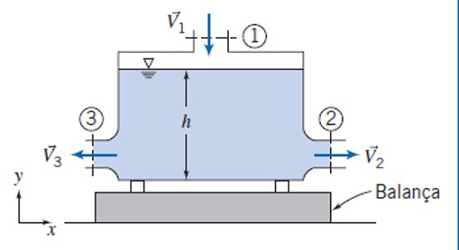

A imagem apresenta um diagrama de um sistema de escoamento de fluido. Há um tanque retangular posicionado sobre uma balança, indicada pela palavra "Balança". Um sistema de coordenadas cartesianas é mostrado no canto inferior esquerdo, com o eixo $y$ apontando para cima e o eixo $x$ para a direita. O fluido entra no tanque verticalmente por uma abertura superior, identificada como seção ①. A velocidade de entrada é representada por um vetor $\vec{V}_1$ apontando para baixo. O fluido sai do tanque por duas aberturas laterais idênticas. A abertura da direita é a seção ②, com um vetor de velocidade de saída $\vec{V}_2$ apontando para a direita. A abertura da esquerda é a seção ③, com um vetor de velocidade de saída $\vec{V}_3$ apontando para a esquerda. O nível da água dentro do tanque é indicado por uma altura $h$.

## 4.6 ESCOAMENTO ATRAVÉS DE UM COTOVELO: USO DE PRESSÕES MANOMÉTRICAS

A água escoa em regime permanente através do cotovelo redutor de $90^\circ$ mostrado no diagrama. Na entrada do cotovelo, a pressão absoluta é $220 \text{ kPa}$ e a área da seção transversal é $0,01 \text{ m}^2$. Na saída, a área da seção transversal é $0,0025 \text{ m}^2$ e a velocidade média é $16 \text{ m/s}$. O cotovelo descarrega para a atmosfera. Determine a força necessária para manter o cotovelo estático.

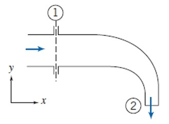

Descrição da imagem:
A imagem apresenta um diagrama de um cotovelo redutor de $90^\circ$. O fluido entra horizontalmente pela esquerda, em uma seção transversal mais larga, denominada seção 1, e sai verticalmente para baixo, em uma seção transversal mais estreita, denominada seção 2. Uma seta azul indica o sentido do escoamento na entrada. Outra seta azul indica o sentido do escoamento na saída. No canto inferior esquerdo, um sistema de coordenadas cartesianas é mostrado, com o eixo x na horizontal, apontando para a direita, e o eixo y na vertical, apontando para cima.

## 4.7 ESCOAMENTO SOB UMA COMPORTA VERTICAL: FORÇA DA PRESSÃO HIDROSTÁTICA
A água de um canal aberto escoa sob uma comporta. Compare a força horizontal da água sobre a comporta

(a) quando a comporta está fechada e

(b) quando a comporta está aberta (considerando escoamento permanente, conforme mostrado).

Considere que o escoamento nas seções e seja incompressível e uniforme e que (visto que as linhas de correntes ali são retilíneas) as distribuições de pressão são hidrostáticas.

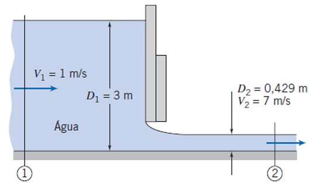

A imagem mostra um corte transversal de um canal aberto onde a água escoa da esquerda para a direita sob uma comporta vertical. Duas seções do escoamento são indicadas. Na seção 1, à montante (esquerda) da comporta, a profundidade da água é $D_1 = 3$ m e a velocidade do escoamento é $V_1 = 1$ m/s. Na seção 2, à jusante (direita) da comporta, a profundidade da água é $D_2 = 0,429$ m e a velocidade é $V_2 = 7$ m/s. O fluido é identificado como Água.

## 4.8 ENCHIMENTO DE CORREIA TRANSPORTADORA: TAXA DE VARIAÇÃO DA QUANTIDADE DE MOVIMENTO NO VOLUME DE CONTROLE
Uma correia transportadora horizontal movendo-se a $0,9$ m/s recebe areia de um carregador. A areia cai verticalmente sobre a correia com velocidade de $1,5$ m/s e vazão de $225$ kg/s (a massa específica da areia é de aproximadamente $1580$ kg/m³). A correia transportadora está inicialmente vazia e vai se enchendo gradativamente com areia. Se o atrito no sistema de acionamento e nos roletes for desprezível, determine a força de tração necessária para puxar a correia enquanto é carregada.

## 4.10 PÁ DEFLETORA MOVENDO-SE COM VELOCIDADE CONSTANTE

O esquema mostra uma pá defletora com ângulo de curvatura de $60^{\circ}$. Ela se move com velocidade constante, $U = 10$ m/s, e recebe um jato de água que deixa um bocal estacionário com velocidade $V = 30$ m/s. O bocal tem área de saída de $0,003$ m². Determine as componentes da força que age sobre a pá.

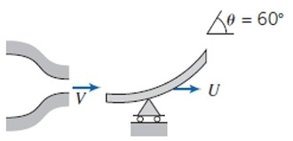

A imagem apresenta um diagrama esquemático. À esquerda, um bocal estacionário emite um jato de água horizontalmente para a direita com velocidade $V$. Este jato atinge uma pá defletora curva. A pá está montada sobre um suporte com roletes e move-se para a direita com velocidade constante $U$. A pá desvia o fluxo de água para cima. O ângulo de saída da pá em relação à horizontal é indicado como $\theta = 60^{\circ}$.

# Step-by-step

## Teorema de Transporte de Reynolds (TTR)

$$
\left(\frac{dN}{dt}\right)_{sistema} = \frac{\partial}{\partial t} \int_{VC} \eta \cdot \rho \cdot d\mathcal{V} + \int_{SC} \eta \cdot \rho \cdot \vec{V} \cdot d\vec{A}
$$

- **Termo 1 (Lado Esquerdo):** "A taxa de variação total da propriedade extensiva `N` dentro do sistema de massa fixa. É a visão Lagrangiana."
- **Termo 2 (Primeiro termo à direita):** "A taxa de variação da propriedade `N` acumulada *dentro* do volume de controle. Este termo só existe se as condições dentro do volume de controle mudarem com o tempo (escoamento transiente ou não permanente)."
- **Termo 3 (Segundo termo à direita):** "O fluxo líquido da propriedade `N` que *atravessa* a fronteira do volume de controle (a superfície de controle). Representa a quantidade de `N` que entra menos a que sai."

---

Em resumo, a equação diz:

"A variação total no sistema = Variação dentro do volume + O que atravessa as fronteiras."

---

- $N :=$ Propriedade extensiva
- $\eta :=$ Propriedade intensiva
- $t :=$ Tempo
- $\rho :=$ Massa específica / Densidade
- $\mathcal{V} :=$ Volume
- $\vec{V} :=$ Velocidade do fluido em relação à superfície de controle. Caso o volume de controle seja móvel, $\vec{V} = \vec{V}_{fluido} - \vec{V}_{VC}$
  - $\vec{V}_{fluido}$: velocidade absoluta do fluido
  - $\vec{V}_{VC}$: velocidade do volume de controle
- $\vec{A} :=$ Elemento de área diferencial orientado, cuja direção é sempre normal e apontando para fora da superfície de controle.
- $VC :=$ Volume de Controle
- $SC :=$ Superfície de Controle

---

**Observação sobre $\vec{V} \cdot d \vec{A}$**

O sinal deste produto determina se há fluxo para dentro ou para fora. Como o vetor $d\vec{A}$ aponta para fora por convenção:
*   Se $\vec{V} \cdot d\vec{A} > 0$, o fluido está saindo do volume de controle (fluxo efluente).
*   Se $\vec{V} \cdot d\vec{A} < 0$, o fluido está entrando no volume de controle (fluxo afluente).
*   Se $\vec{V} \cdot d\vec{A} = 0$, o fluxo é paralelo à superfície e não a atravessa.

---

| Extensive Property |     N     | Intensive Property                               |          $\eta$          |
| :----------------- | :-------: | :----------------------------------------------- | :----------------------: |
| Massa              |    $M$    | Massa por unidade de massa                       |           $1$            |
| Momento linear     | $\vec{P}$ | Velocidade (Momento linear por unidade de massa) |        $\vec{V}$         |
| Momento angular    | $\vec{H}$ | Momento angular por unidade de massa             | $\vec{r} \times \vec{V}$ |
| Energia            |    $E$    | Energia específica                               |           $e$            |
| Entropia           |    $S$    | Entropia específica                              |           $s$            |

## TTR aplicado à massa

$$
\boxed{\frac{\partial}{\partial t} \int_{VC} \rho \cdot d\mathcal{V} + \int_{SC} \rho \cdot \vec{V} \cdot d\vec{A} = 0}
$$

$$
\text{Equação da Continuidade}
$$

---

**Obtenção a partir do TTR**

$$
\left(\frac{dN}{dt}\right)_{sistema} = \frac{\partial}{\partial t} \int_{VC} \eta \cdot \rho \cdot d\mathcal{V} + \int_{SC} \eta \cdot \rho \cdot \vec{V} \cdot d\vec{A}
$$

 

$$
N = M \quad \eta = 1
$$

 

$$
\left(\frac{dM}{dt}\right)_{sistema} = \frac{\partial}{\partial t} \int_{VC} \rho \cdot d\mathcal{V} + \int_{SC} \rho \cdot \vec{V} \cdot d\vec{A}
$$

Podemos simplificar ainda mais a equação acima quando aplicamos o princípio de conservação de massa:

$$
\left(\frac{dM}{dt}\right)_{sistema} = 0
$$

$$
\frac{\partial}{\partial t} \int_{VC} \rho \cdot d\mathcal{V} + \int_{SC} \rho \cdot \vec{V} \cdot d\vec{A} = 0
$$

## Sistema de notação para hipóteses
Quando resolvemos problemas relacionados à mecânica dos fluidos, estamos, de maneira implícita ou explícita, fazendo algumas hipóteses sobre o comportamento dos fluidos.

Até o momento, estávamos trabalhando com o caso mais geral: escoamento de um fluido compressível, viscoso, em um escoamento transiente com perfil de velocidade não uniforme em um volume de controle deformável não fixo.

No entanto, podemos descrever as hipóteses adotadas de maneira mais legível. Em vez de escrevermos em texto corrido como acima, podemos usar uma notação simplificada:

**Categorias**
- F = Fluido
- E = Escoamento
- VC = Volume de controle

**Sub-categorias**
- FC = Fluido Compressibilidade
- FV = Fluido Viscosidade
- ER = Escoamento Regime
- EV = Escoamento Velocidade
- VCD = Volume de Controle Deformabilidade
- VCM = Volume de Controle Movimento

**Item final**

- **G** = Caso **Geral**
- **S** = Caso **Simplificado**

---

**Tabela de Códigos**

| Hipóteses Gerais                                         | Hipóteses Simplificadas                                                 |
| -------------------------------------------------------- | ----------------------------------------------------------------------- |
| **FCG** Fluido compressível                              | **FCS** Fluido incompressível                                           |
| **FVG** Fluido viscoso                                   | **FVS** Fluido não viscoso                                              |
| **ERG** Escoamento Transiente                            | **ERS** Escoamento Permanente                                           |
| **EVG** Escoamento com Perfil de Velocidade Não Uniforme | **EVS** Escoamento com Perfil de Velocidade Uniforme (Velocidade Média) |
| **VCDG** Volume de Controle Deformável                   | **VCDS** Volume de Controle Rígido                                      |
| **VCMG** Volume de Controle Móvel                        | **VCMS** Volume de Controle Fixo                                        |

---

Com essa nova notação, podemos escrever o caso mais geral como: FCG, FVG, ERG, EVG, VCMG, VCDG.

Inicialmente esse sistema pode parecer adicionar uma complexidade desnecessária, porém ele é extremamente útil por possibilitar a definição ágil das hipóteses adotadas na resolução de um problema.

---

Expansão de alguns termos:
- FCS: fluido incompressível, $\rho$ constante no tempo e no espaço
- VCDS: Volume de controle rígido, $\mathcal{V}$ não muda com o tempo
- ERS: Escoamento permanente, os parâmetros do escoamento não mudam com o tempo
- EVS: Escoamento uniforme (A velocidade média é a considerada nas entradas e saídas)

## Simplificações da Equação da Continuidade

A **Equação da continuidade**, pode ser simplificada em casos especiais adotando as seguintes hipóteses:

**Observações**
- Quando alguma consideração for omitida abaixo, assume-se que é o caso geral.

- Considerar um escoamento simultaneamente FCS, VCDS, ERS, EVS são simplificações comuns.

- Quando VCDS, ERS, tem-se a conservação da vazão mássica, ou seja: $\sum\dot{m}_{in} = \sum\dot{m}_{out}$.

- Quando FCS, VCDS, ERS, tem-se a conservação da vazão volumétrica e mássica, ou seja $\sum Q_{in} = \sum Q_{out}$ e $\sum\dot{m}_{in} = \sum\dot{m}_{out}$.

$$
\text{FCS, ERS, EVS, VCDS, VCMS} \quad \implies \quad
\sum_{i} \dot{Q} = \sum_{i} (\vec{V}_i \cdot \vec{A}_i) = 0
$$

$$
\text{FCG, ERS, EVS, VCDS, VCMS} \quad \implies \quad
\sum_{i} \dot{m} = \sum_{i} \rho_i \cdot (\vec{V}_i \cdot \vec{A}_i) = 0
$$

---

$$
\text{FCS, ERS, EVG, VCDS, VCMS} \quad \implies \quad
\int_{SC} \vec{V} \cdot d\vec{A} = 0
$$

$$
\text{FCG, ERS, EVG, VCDS, VCMS} \quad \implies \quad
\int_{SC} \rho \cdot \vec{V} \cdot d\vec{A} = 0
$$

---

$$
\text{FCS, ERG, EVG, VCDG, VCMS} \quad \implies \quad
\frac{d \mathcal{V}}{d t} + \int_{SC} \vec{V} \cdot d\vec{A} = 0
$$

$$
\text{FCS, ERG, EVS,  VCDG, VCMS} \quad \implies \quad
\frac{d \mathcal{V}}{d t} + \sum_i \left(\vec{V}_i \cdot \vec{A}_i \right) = 0
$$

$$
\text{FCG, ERG, EVS, VCDS, VCMS} \quad \implies \quad *
\mathcal{V} \cdot \frac{d \rho_{VC}}{d t} + \sum_i \rho_i \left(\vec{V}_i \cdot \vec{A}_i \right) = 0
$$

**Macetes**

$$
\rho \not\in \text{FCS} \quad \rho \in  \text{FCG}
$$

$$
\frac{\partial}{\partial t} \not\in \text{ERS} \quad \frac{\partial}{\partial t} \in \text{ERG}
$$

$$
\sum \in \text{EVS} \quad \int \in \text{EVG}
$$

$$
\text{VCDG} \implies \frac{d \mathcal{V}}{d t}
$$

$$
\text{ERG} \implies \text{VCDS ou VCDG}
$$

$$
\text{VCDG} \implies \text{ERG}
$$

$$
\text{FCG, VCDS} \implies *\mathcal{V} \cdot \frac{d \rho_{VC}}{d t}
$$

\* Uma consideração adicional que deve ser tomada para esse caso é que a massa específica é uniforme no volume de controle.

## TTR aplicado à momento linear

$$
\boxed{\frac{d}{d t} \int_{VC} \vec{V} \cdot \rho \cdot d\mathcal{V} + \int_{SC} \vec{V} \cdot \rho \cdot \vec{V} \cdot d\vec{A} = \sum \vec{F}}
$$

$$
\text{Equação do Momento Linear na Forma Integral}
$$

---

$$
\left(\frac{dN}{dt}\right)_{sistema} = \frac{d}{d t} \int_{VC} \eta \cdot \rho \cdot d\mathcal{V} + \int_{SC} \eta \cdot \rho \cdot \vec{V} \cdot d\vec{A}
$$

 

$$
N = \vec{P} \quad \eta = \vec{V}
$$

 

$$
\left(\frac{d\vec{P}}{dt}\right)_{sistema} = \frac{d}{d t} \int_{VC} \vec{V} \cdot \rho \cdot d\mathcal{V} + \int_{SC} \vec{V} \cdot \rho \cdot \vec{V} \cdot d\vec{A}
$$

Podemos aplicar a Segunda Lei de Newton na equação acima.

**Segunda Lei de Newton:** A força resultante é igual à taxa de variação do momento linear

$$
\left(\frac{d\vec{P}}{dt}\right)_{sistema} = \sum \vec{F}
$$

$$
\frac{d}{d t} \int_{VC} \vec{V} \cdot \rho \cdot d\mathcal{V} + \int_{SC} \vec{V} \cdot \rho \cdot \vec{V} \cdot d\vec{A} = \sum \vec{F}
$$

---

A equação acima da forma discreta é:

$$
\boxed{\sum \vec{F} = \sum \vec{F}_{superficie} + \sum \vec{F}_{campo}}
$$

$$
\text{Equação do Momento Linear na Forma Discreta}
$$

* $\vec{F}_{superficie}$ inclui forças de pressão, forças viscosas e forças de reação (por exemplo, a força que um bocal exerce sobre o fluido)
* $\vec{F}_{campo}$ é tipicamente a força da gravidade.

## Simplificações da Equação do Momento Linear

De forma semelhante à massa, todas as simplificações para momento linear também se aplicam. No entanto, deve-se ficar atento à multiplicação pelo termo $\vec{V}$, já que as simplificações acima foram feitas para $N = M \quad \eta = 1$, enquanto o momento linear é $N = \vec{P} \quad \eta = \vec{V}$.

$$
\text{(N=M) ERS, EVS, VCDS, VCMS} \quad \implies \quad
\sum_{i} \dot{m} = \sum_{i} \rho_i \cdot (\vec{V}_i \cdot \vec{A}_i) = 0
$$

$$
\text{(N=P) ERS, EVS, VCDS, VCMS} \quad \implies \quad
\sum_{i} \vec{V} \cdot \rho_i \cdot (\vec{V}_i \cdot \vec{A}_i) = \sum \vec{F}
$$

$$
\dot{m} = \rho \cdot V \cdot A
$$

$$
\sum \vec{F} = \sum_{i} \dot{m}_i \vec{V}_i
$$

$$
\boxed{
\text{ERS, EVS, VCDS, VCMS} \quad \implies \quad
\sum \vec{F} = \sum_{out} \dot{m}_{out} \vec{V}_{out} - \sum_{in} \dot{m}_{in} \vec{V}_{in}}
$$

## Exercitando a aplicação de hipóteses nos exemplos
- **Exemplo 4.1:** FCS FVS EVS ERS VCDS VCMS
- **Exemplo 4.2:** FCS FVG EVG ERS VCDS VCMS
- **Exemplo 4.3:** FCG FVS EVS ERG VCDS VCMS
- **Exemplo 4.4:** FCS FVS EVS ERS VCDS VCMS
- **Exemplo 4.5:** FCS FVS EVS ERS VCDS VCMS
- **Exemplo 4.6:** FCS FVS EVS ERS VCDS VCMS

**Observações:**
- Note que a consideração FCG só acontece em 4.3, pois ocorre variação da massa específica com o escape do fluido
- Note que a consideração de EVG e FVG só acontece em 4.2, pois para o que faz um fluido assumir um perfil de velocidade é sua viscosidade. Então não existe um exemplo no qual há EVG sem que também seja FVG.
- Note que a consideração de ERG só acontece em 4.3, pois as características do escoamento no problema mudam com o tempo

## 4.1
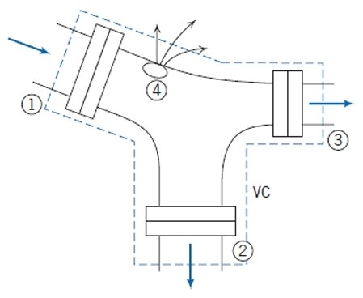

$$
\text{FCS, EVS, ERS, VCDS, VCMS} \quad \implies \quad
\sum_{i} \dot{Q} = \sum_{i} (\vec{V}_i \cdot \vec{A}_i) = 0
$$

---

Após definirmos o volume de controle acima, desenhado em azul pontilhado

$$
(\vec{V}_1 \cdot \vec{A}_1) + (\vec{V}_2 \cdot \vec{A}_2) + (\vec{V}_3 \cdot \vec{A}_3) + Q_4 = 0
$$

$$
-V_1 A_1 + V_2 A_2 + V_3 A_3 + Q_4 = 0
$$

$$
-5 \cdot 0,2 + V_2 \cdot 0,2 + 12 \cdot 0,15 + 0,1 = 0
$$

$$
V_2 = \frac{5 \cdot 0,2 - 12 \cdot 0,15 - 0,1}{0,2} = -4,5 \, m/s
$$

O sinal negativo indica que a direção real do fluxo na seção ② é **oposta** à direção assumida inicialmente. Como se assumiu que o fluxo era de saída (sinal positivo no termo $V_2 A_2$), o resultado negativo significa que o fluxo na seção ② é, na verdade, de **entrada**. A magnitude da velocidade é $|V_2| = 4,5 \, m/s$.

---

Os sinais acima são o produto escalar do vetor velocidade com vetor área. De maneira simplificada, quando os dois apontam na mesma direção, o valor é positivo. Caso contrário, negativo.

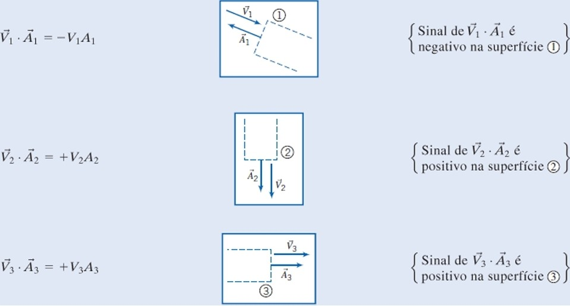

Isso acontece porque o produto escalar de dois vetores é a magnitude desses vetores vezes o cosseno do ângulo entre eles.

$$
\vec{V}_i \cdot \vec{A}_i = |V_i| \cdot |A_i| \cdot \cos(\theta)
$$

- Quando os vetores apontam no mesmo sentido, o ângulo entre eles é $0°$ e $\cos(0°) = 1$.
- Quando os vetores apontam em sentidos opostos, o ângulo entre eles é $180°$ e $\cos(180°) = -1$.

## 4.2
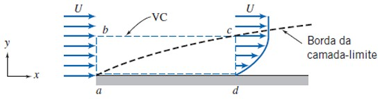

$$
\text{FCS, ERS, VCDS, VCMS} \quad \implies \quad
\int_{SC} \vec{V} \cdot d\vec{A} = 0
$$

---

- Definimos o volume de controle acima, desenhado em azul pontilhado
- Também vamos considerar escoamento bidimensional, ou seja, as propriedades independem de $z$.
- Apesar do problema ser em regime permanente (ERS), a equação apresentada não seria mais simplificada.

---

$$
\int_{SC} \vec{V} \cdot d\vec{A} = \int_{ab} \vec{V} \cdot d\vec{A} + \int_{bc} \vec{V} \cdot d\vec{A} + \int_{cd} \vec{V} \cdot d\vec{A} + \int_{ad} \vec{V} \cdot d\vec{A}
$$

$$
\int_{ab} \vec{V} \cdot d\vec{A} + \int_{bc} \vec{V} \cdot d\vec{A} + \int_{cd} \vec{V} \cdot d\vec{A} + \int_{ad} \vec{V} \cdot d\vec{A} = 0
$$

---

$$
\text{ad}
$$

Como ad é uma fronteira sólida

$$
\int_{ad} \vec{V} \cdot d\vec{A} = 0
$$

---

$$
\text{ab}
$$

Como o fluxo na fronteira $ab$ especificamente é definido como uniforme (EVS), podemos passar a velocidade para fora da integral já que ela é independente.

$$
\int_{ab} \vec{V} \cdot d\vec{A} = \vec{V} \int_{ab} d\vec{A} = \vec{V}_{ab} \cdot \vec{A}_{ab}
$$

$$
= -UA_{ab} = -Uw\delta
$$

$$
= -30 \cdot 0.6 \cdot (5 \times 10^{-3}) = -0.09 \frac{m^3}{s}
$$

**Observação**: Na face **ab**, o resultado $-UA_{ab}$ é negativo. A razão para isso é o produto escalar $\vec{V} \cdot d\vec{A}$. O vetor velocidade $\vec{V}$ aponta para dentro do VC, enquanto o vetor normal à área $d\vec{A}$ aponta para fora. O ângulo entre eles é de 180°, resultando em $\cos(180^\circ) = -1$.

---

$$
\text{cd}
$$

$$
\frac{u}{U} = 2(y/\delta) - (y/\delta)^2
$$

$$
u(y) = U \left[2 \left(\frac{y}{\delta}\right) - \left(\frac{y}{\delta}\right) ^ 2\right]
$$

$$
\int_{cd} \vec{V} \cdot d\vec{A} = \int_{cd} u(y) dA = \int_0^\delta U \left[2\left(\frac{y}{\delta}\right) - \left(\frac{y}{\delta}\right)^2\right] w \, dy
$$

$$
= U w \int_0^\delta \left(\frac{2y}{\delta} - \frac{y^2}{\delta^2}\right) dy = U w \left[ \int_0^\delta \frac{2y}{\delta} dy - \int_0^\delta \frac{y^2}{\delta^2} dy \right]
$$

$$
= U w \left[ \frac{2}{\delta} \int_0^\delta y \, dy - \frac{1}{\delta^2} \int_0^\delta y^2 dy \right]
$$

$$
= U w \left[\frac{y^2}{\delta} - \frac{y^3}{3\delta^2}\right]_0^\delta
$$

$$
= U w \left(\delta - \frac{\delta}{3}\right) = \frac{2}{3} U w \delta
$$

$$
= \frac{2}{3} 30 \cdot (0.6) \cdot (5 \times 10^{-3}) = 0.06 \frac{m^3}{s}
$$

**Observação**: O fluxo é positivo porque tanto $\vec{V}$ quanto $d\vec{A}$ apontam para fora do VC (ângulo de 0°, $\cos(0^\circ) = 1$)

---

## Extra: Análise das Condições de Contorno Físicas

Um bom perfil de velocidade aproximado para a camada-limite deve satisfazer três condições fundamentais:

$$
\boxed{\quad
u(0) = 0 \quad \quad u(\delta) = U \quad \quad \left. \frac{du}{dy} \right|_{y=\delta} = 0
\quad}
$$

1.  **Condição de não escorregamento:** Na superfície da placa ($y=0$), a velocidade do fluido é zero ($u=0$).
    * $u(0) = U \left[2 \left(\frac{0}{\delta}\right) - \left(\frac{0}{\delta}\right)^2\right] = U[0 - 0] = 0$.

2.  **Condição na borda da camada-limite:** Em $y=\delta$, a velocidade é $u=U$.
    * $u(\delta) = U$.

Pela definição da espessura da camada-limite ($\delta$), a velocidade do fluido $u$ deve atingir a velocidade da corrente livre $U$ na borda da camada-limite, ou seja, em $y = \delta$.

Vamos substituir $y = \delta$ na sua equação para confirmar:

$$
u(\delta) = U \left[2 \left(\frac{\delta}{\delta}\right) - \left(\frac{\delta}{\delta}\right) ^ 2\right]
$$

$$
u(\delta) = U \left[2(1) - (1)^2\right]
$$

$$
u(\delta) = U [2 - 1]
$$

$$
u(\delta) = U
$$

Como pode ver, a equação satisfaz perfeitamente essa condição.

3.  **Transição suave:** O gradiente de velocidade deve ser nulo na borda da camada-limite ($du/dy = 0$ em $y=\delta$), garantindo uma transição suave para a corrente livre (onde a velocidade é constante).
* Primeiro, calculamos a derivada de $u(y)$ em relação a $y$:

$$
\frac{du}{dy} = \frac{d}{dy} \left[ U \left(\frac{2y}{\delta} - \frac{y^2}{\delta^2}\right) \right] = U \left(\frac{2}{\delta} - \frac{2y}{\delta^2}\right)
$$

* Agora, avaliamos a derivada em $y=\delta$:

$$
\left. \frac{du}{dy} \right|_{y=\delta} = U \left(\frac{2}{\delta} - \frac{2\delta}{\delta^2}\right) = U \left(\frac{2}{\delta} - \frac{2}{\delta}\right) = 0
$$

---

$$
\text{bc}
$$

$$
\int_{ab} \vec{V} \cdot d\vec{A} + \int_{bc} \vec{V} \cdot d\vec{A} + \int_{cd} \vec{V} \cdot d\vec{A} + \int_{ad} \vec{V} \cdot d\vec{A} = 0
$$

$$
-0.09 + \int_{bc} \vec{V} \cdot d\vec{A} + 0.06 + 0 = 0
$$

$$
\int_{bc} \vec{V} \cdot d\vec{A} = 0.09 - 0.06 =0.03 \frac{m^3}{s}
$$

---

$$
\dot{m}_{bc} = Q_{bc} \cdot \rho
$$

$$
\dot{m}_{bc} = 0.03 \cdot 1.24 = 0.0372 \frac{kg}{s}
$$

---

**Interpretação física**

O resultado positivo indica que o fluxo de massa está saindo do volume de controle através da face superior **bc**. Como a velocidade do fluido é retardada pela fricção dentro da camada-limite (o fluxo que sai por $cd$ é menor do que se a velocidade fosse uniformemente $U$), a conservação da massa exige que parte do fluido que entra por $ab$ seja deslocada para cima e saia pela superfície $bc$.

O resultado demonstra que, devido ao atrito, a camada-limite efetivamente 'bloqueia' parte do escoamento, forçando-o a se desviar para cima. Esse efeito de deslocamento altera a forma aerodinâmica efetiva do corpo, um princípio crucial que deve ser considerado no projeto de qualquer objeto se movendo através de um fluido, de carros a aeronaves.

Este fluxo de massa para cima é a manifestação física do conceito de **espessura de deslocamento** ($\delta^*$), uma medida que quantifica o quanto as linhas de corrente do escoamento externo são 'empurradas' para longe da superfície devido ao efeito de retardamento da camada-limite. Este parâmetro é fundamental no projeto aerodinâmico de objetos como asas, fuselagens e veículos.

## 4.3

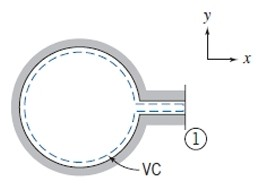

$$
\text{EVS, VCDS, VCMS} \quad \implies \quad
\mathcal{V} \cdot \frac{d \rho_{VC}}{d t} + \sum_i \rho_i \left(\vec{V}_i \cdot \vec{A}_i \right) = 0
$$

---

Após definirmos o volume de controle acima, desenhado em azul pontilhado

$$
\frac{d \rho_{VC}}{d t} = - \frac{\sum_i \rho_i \left(\vec{V}_i \cdot \vec{A}_i \right)}{\mathcal{V}} = - \frac{\rho_{out} \left(\vec{V}_{out} \cdot \vec{A}_{out} \right)}{\mathcal{V}} = - \frac{\rho_{out}  \cdot V_{out} \cdot A_{out}}{\mathcal{V}}
$$

Substituindo os valores fornecidos:
- $\mathcal{V} = 0.05 \text{ m}^3$
- $\rho_{out} = 6 \text{ kg/m}^3$
- $V_{out} = 300 \text{ m/s}$
- $A_{out} = 65 \text{ mm}^2 = 65 \times 10^{-6} \text{ m}^2$

$$
\frac{d\rho_{VC}}{dt} = -\frac{(6 \frac{\text{kg}}{\text{m}^3}) \cdot (300 \frac{\text{m}}{\text{s}}) \cdot (65 \times 10^{-6} \text{ m}^2)}{0.05 \text{ m}^3}
$$

$$
\frac{d\rho_{VC}}{dt} = -2.34 \frac{\text{kg}}{\text{m}^3 \cdot \text{s}}
$$

---

**Observação**: O fluxo é positivo porque tanto $\vec{V}$ quanto $d\vec{A}$ apontam para fora do VC (ângulo de 0°, $\cos(0^\circ) = 1$)

## 4.4
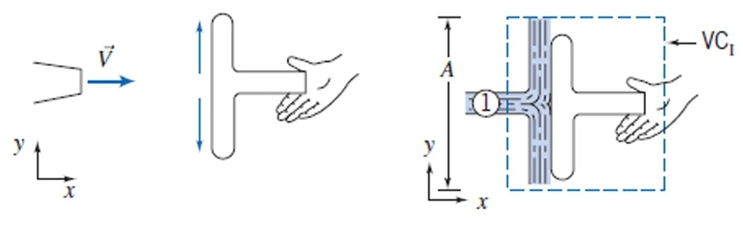
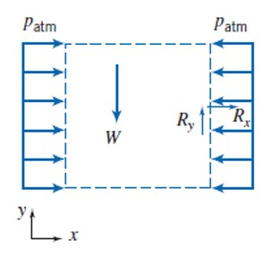

$$
\text{FCS, ERS, EVS, VCDS, VCMS} \quad \implies \quad
\sum \vec{F} = \sum_{out} \dot{m}_{out} \vec{V}_{out} - \sum_{in} \dot{m}_{in} \vec{V}_{in}
$$

---

Após definirmos o volume de controle acima, desenhado em azul pontilhado, podemos simplificar a equação acima com as seguintes considerações:
1. Existem forças apenas na direção horizontal.
2. O fluido escoa totalmente ao longo da placa, ou seja, a velocidade do fluido que sai é vertical. Portanto $\sum_{out} = 0$
3. Existe apenas um fluxo de entrada de momento linear no volume de controle, gerado pelo jato d'água.
4. Existe apenas uma única força externa na direção $x$ atuando sobre o fluido no VC, que é a força exercida pela placa. Portanto

$$
\sum \vec{F} = F_x = F_{\text{placa}\rightarrow\text{fluido}} = R_x
$$

---

$$
R_x = - \dot{m}_{in} V_{in}
$$

$$
\text{Equação simplificada}
$$

---

$$
\dot{m}_{in} = \rho A_{in} V_{in}
$$

$$
\dot{m}_{in} = (1000 \text{ kg/m}^3)(0,01 \text{ m}^2)(15 \text{ m/s}) = 150 \text{ kg/s}
$$

$$
V_{in} = 15 \frac{m}{s}
$$

$$
R_x = - 150 \cdot 15 = - 2250 \text{ N}
$$

---

Buscamos, a força horizontal sobre o suporte:

$$
F_\text{suporte} = F_{\text{fluido}\rightarrow\text{placa}}
$$

$$
F_{\text{fluido}\rightarrow\text{placa}} =  - F_{\text{placa}\rightarrow\text{fluido}} = - R_x = - (-2250) = 2250 \text{ N}
$$

Ou seja, a força horizontal sobre o suporte é $2250 \text{ N}$ na direção $X$ para direita.

## 4.5
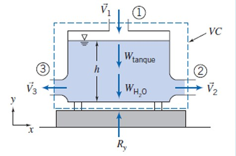

$$
\text{FCS, FVS, EVS, ERS, VCDS, VCMS} \quad \implies \quad
\sum \vec{F} = \sum_{out} \dot{m}_{out} \vec{V}_{out} - \sum_{in} \dot{m}_{in} \vec{V}_{in}
$$

-----

Após definirmos o volume de controle acima, desenhado em azul pontilhado, analisamos a componente y da equação do momento linear.

$$
\sum F_y = \sum_{out} \dot{m}_{out} v_{out} - \sum_{in} \dot{m}_{in} v_{in}
$$

As forças que atuam no volume de controle na direção y são:

1.  Força de reação da balança, $R_y$, apontando para cima.
2.  Peso do tanque, $W_t$, apontando para baixo.
3.  Peso da água no tanque, $W_a$, apontando para baixo.

$$
\sum F_y = R_y - W_t - W_a
$$

-----

Cálculo do peso da água ($W_a$):

$$
W_a = \rho \cdot g \cdot \mathcal{V}_a = \rho \cdot g \cdot (A_{tanque} \cdot h)
$$

$$
W_a = (1000 \frac{\text{kg}}{\text{m}^3}) \cdot (9.81 \frac{\text{m}}{\text{s}^2}) \cdot (0.09 \text{ m}^2 \cdot 0.58 \text{ m}) = 512.08 \text{ N}
$$

-----

Cálculo do fluxo de momento:

$$
\dot{m}_{in} = \dot{m}_1 = \rho A_1 V_1 = (1000 \frac{\text{kg}}{\text{m}^3})(0.009 \text{ m}^2)(3 \frac{\text{m}}{\text{s}}) = 27 \frac{\text{kg}}{\text{s}}
$$

$$
v_{in} = v_1 = -3 \frac{\text{m}}{\text{s}}
$$

Nas saídas ② e ③, a velocidade é puramente horizontal, então $v_{out} = 0$.

$$
\sum_{out} \dot{m}_{out} v_{out} = 0
$$

-----

Substituindo na equação do momento:

$$
R_y - W_t - W_a = (0) - (\dot{m}_1 v_1)
$$

$$
R_y - 22.2 \text{ N} - 512.08 \text{ N} = - (27 \frac{\text{kg}}{\text{s}} \cdot (-3 \frac{\text{m}}{\text{s}}))
$$

$$
R_y - 534.28 \text{ N} = 81 \text{ N}
$$

$$
R_y = 534.28 \text{ N} + 81 \text{ N} = 615.28 \text{ N}
$$

-----

**Conclusão:**

A análise estática do chefe indicaria uma leitura de:

$$
\text{Leitura estática} = W_t + W_a = 22.2 + 512.08 = 534.28 \text{ N}
$$

A leitura correta, considerando a dinâmica do fluido, é $615.28 \text{ N}$.

Você está certo. A análise de escoamento é necessária porque a mudança no momento do fluido na direção vertical exerce uma força adicional sobre o tanque. O termo de momento de $81 \text{ N}$ representa a força exercida pelo fluido sobre o fundo do tanque para desacelerar o escoamento vertical de entrada para zero.

## 4.6
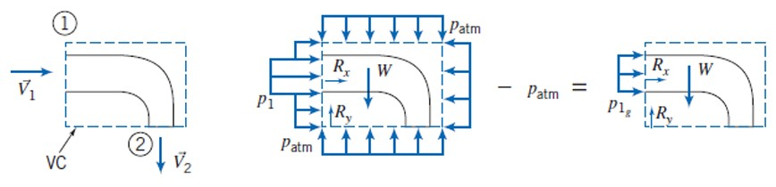

$$
\text{FCS, FVS, EVS, ERS, VCDS, VCMS} \quad \implies \quad
\sum \vec{F} = \sum_{out} \dot{m}_{out} \vec{V}_{out} - \sum_{in} \dot{m}_{in} \vec{V}_{in}
$$

-----

Após definirmos o volume de controle acima, desenhado em azul pontilhado:

**Força necessária para manter o cotovelo estático no eixo X**

$$
\sum F_x = \dot{m}(u_{out} - u_{in})
$$

$$
\text{Equação do Momento Linear}
$$

**Interpretação**

A **soma das forças** que atuam no fluido é igual à **TAXA de variação do seu momento linear**.

A unidade do momento linear é $N \cdot s$. Então a TAXA de variação de momento linear é $\frac{N \cdot s}{s} = N$.

$$
[N] = \left[\frac{kg}{s}\right] \cdot \left[\frac{m}{s}\right]
$$

$$
\left[\frac{kg \cdot m}{s^2}\right] = \left[\frac{kg \cdot m}{s^2}\right]
$$

---

**Lado esquerdo**

As forças que atuam no fluido são duas: a exercida pela pressão e a força de reação do cotovelo. Portanto:

$$
\sum F_x = P_{1,man} A_1 + F_{Rx}
$$

$$
P_{1,man} = P_{1,abs} - P_{atm} = 220 \text{ kPa} - 101 \text{ kPa} = 119 \text{ kPa} = 119000 \frac{\text{N}}{\text{m}^2}
$$

$$
\sum F_x = 119000 \cdot 0.01 + F_{Rx} = 1190 + F_{Rx}
$$

**Lado direito**

A taxa de variação do momento linear é o momento que sai menos o momento que entra.

Fazendo uma análise dos momentos lineares volume de controle, exclusivamente no eixo horizontal X, o fluido entra com uma velocidade, $\vec V_1$ e sai com velocidade $0$. Portanto:

$$
\dot{m}(u_{out} - u_{in}) = \dot{m}(u_{out}) - \dot{m}(u_{in}) = \dot{m}(0) - \dot{m}(u_{in}) = -\dot{m}(u_{in})
$$

---

$$
\dot{m} = \dot{m}_{in} = \dot{m}_{out} = A \cdot V \cdot \rho = 0,0025 \cdot 16 \cdot 1000 = 40 \frac{kg}{s}
$$

$$
\dot{m} = V \cdot A \cdot \rho
$$

$$
V = \frac{\dot{m}}{A \cdot \rho}
$$

$$
u_{in} = \frac{\dot{m}}{A_1 \cdot \rho} = \frac{40}{0.01 \cdot 1000} = 4 \frac{m}{s}
$$

---

$$
-\dot{m}(u_{in}) = - 40 \cdot 4 = -160 N
$$

**Lado esquerdo = Lado direito**

$$
1190 + F_{Rx} = -160
$$

$$
F_{Rx} = -1350 N
$$

---

**Força necessária para manter o cotovelo estático no eixo Y**

$$
\sum F_y = \dot{m}(v_{out} - v_{in})
$$

$$
\text{Equação do Momento Linear}
$$

**Interpretação**

A soma das forças que atuam no fluido é igual à TAXA de variação do seu momento linear.

A unidade do momento linear é $N \cdot s$. Então a TAXA de variação de momento linear é $\frac{N \cdot s}{s} = N$.

---

**Lado esquerdo**

As forças que atuam no fluido na direção Y são: a força de reação do cotovelo ($F_{Ry}$). A força de pressão na entrada não tem componente em Y, e a pressão na saída é a atmosférica ($P_{2,man} = 0$). O peso do fluido é considerado desprezível. Portanto:

$$
\sum F_y = F_{Ry}
$$

**Lado direito**

A taxa de variação do momento linear é o fluxo de momento que sai menos o fluxo de momento que entra.

Fazendo uma análise dos momentos lineares do volume de controle, exclusivamente no eixo vertical Y, o fluido entra com velocidade vertical nula e sai com uma velocidade $\vec V_2$ para baixo. Considerando o eixo Y positivo para cima, $v_{out} = -V_2$. Portanto:

$$
\dot{m}(v_{out} - v_{in}) = \dot{m}(-V_2 - 0) = -\dot{m}V_2
$$

---

$$
\dot{m} = 40 \frac{kg}{s} \quad \text{(calculado anteriormente)}
$$

$$
v_{in} = 0 \frac{m}{s} \quad \text{(escoamento puramente horizontal na entrada)}
$$

$$
v_{out} = -V_2 = -16 \frac{m}{s} \quad \text{(escoamento para baixo na saída)}
$$

---

$$
-\dot{m}V_2 = - 40 \cdot 16 = -640 N
$$

**Lado esquerdo = Lado direito**

$$
F_{Ry} = -640 N
$$

-----

### Força total
O vetor da força que o cotovelo exerce sobre o fluido é, então

$$
\vec{F_R} = F_{Rx} \hat{i} + F_{Rx} \hat{j} = (-1350 \hat{i} - 640 \hat{j}) \text{ N}
$$

O vetor de força necessário para manter o cotovelo estático, é igual:

$$
F_{Ancoragem} = \vec{F_R} = (-1350 \hat{i} - 640 \hat{j}) \text{ N}
$$

---

Interpretação física dos sinais das forças:
Pelo trajeto que a água realiza no cotovelo, ela tenta lancá-lo simultaneamente para direita e para cima. Por isso, para que o cotovelo permaneça estático, ele deve exercer uma força para esquerda e para baixo no fluido.
Para esquerda = X negativo
Para baixo = Y negativo

## 4.7

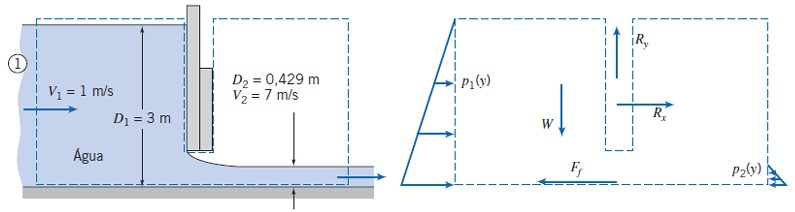

As hipóteses adotadas são: FCS, FVS, EVS, ERS, VCDS, VCMS.

**(a) Comporta Fechada (Condição Estática)**

$$
\frac{d P}{d y} = - \rho g
$$

$$
P = - \rho g y
$$

---

$$
P_{c1} = - \rho g \frac{D_1}{2} = - 1000 \cdot (-9.81) \cdot \frac{3}{2} = 14715 \text{ Pa}
$$

---

A força horizontal é a força hidrostática exercida pela água.

$$
F_{fechada} = P_{c1} \cdot A_1 = 14715 \cdot (D_1 \cdot w) = 14715 \cdot (3 \cdot w) = 44145 \cdot w
$$

A força por unidade de largura ($w$) da comporta é:

$$
\frac{F_{fechada}}{w} = 44145 \frac{\text{N}}{\text{m}} = 44,1 \frac{\text{kN}}{\text{m}}
$$

**(b) Comporta Aberta (Escoamento Permanente)**

Assim como escrito no exemplo 4.6

$$
\sum F = \dot{m}(v_{out} - v_{in})
$$

$$
\text{Equação do Momento Linear}
$$

**Interpretação**

A soma das forças que atuam no fluido é igual à TAXA de variação do seu momento linear.

A unidade do momento linear é $N \cdot s$. Então a TAXA de variação de momento linear é $\frac{N \cdot s}{s} = N$.

---

$$
\sum F = ?
$$

As forças que atuam no fluido são as hidrostáticas $F_1$ (produzida por $P_1$, já calculada), $F_2$ (produzida por $P_2$, calculada de forma equivalente); e a força de reação da comporta $F_{aberta}$, que desejamos calcular.

$F_1$ aponta para direita, portanto, positiva. $F_2$ e $F_{aberta}$ apontam para esquerda, portanto, negativas.

$$
\sum F = F_1 - F_2 - F_{aberta}
$$

$$
\rightarrow F_{1} \leftarrow
$$

$$
F_{1} = F_{fechada} = 44145 w \text{ N}
$$

$$
\rightarrow F_{2} \leftarrow
$$

$$
P_{c2} = - \rho g \frac{D_2}{2} = - 1000 \cdot (-9.81) \cdot \frac{0.429}{2} = 2104.24 \text{ Pa}
$$

$$
F_{2} = P_{c2} \cdot A_2 = P_{c2} \cdot (D_2 \cdot w) = 2104.24 \cdot (0.429 \cdot w)
$$

$$
F_{2} = 902.72 w \text{ N}
$$

---

$$
\dot{m}(v_{out} - v_{in}) = ?
$$

A taxa de variação do momento linear é o momento linear que sai menos o momento linear que entra no volume de controle.

$$
\dot{m} = \dot{Q} \cdot \rho = (V_1 \cdot D_1 \cdot w) \cdot \rho = (1 \cdot 3 \cdot w) \cdot 1000 = 3000 w
$$

$$
\dot{m}(v_{out} - v_{in}) = 3000w (7 - 1) = 18000 w
$$

---

$$
\sum F = \dot{m}(v_{out} - v_{in})
$$

$$
F_1 - F_2 - F_{aberta} = \dot{m}(v_{out} - v_{in})
$$

$$
44145 w - 902.72 w - F_{aberta} = 18000 w
$$

$$
F_{aberta} = 25242 w
$$

$$
\frac{F_{aberta}}{w} = 25242 \frac{N}{m} = 25,2 \frac{kN}{m}
$$

---

**Comparação:** A força na comporta fechada ($44,1$ kN/m) é significativamente maior do que na comporta aberta ($25,2$ kN/m).

## 4.8

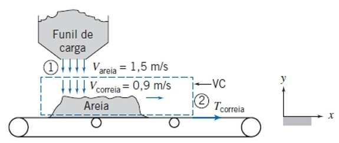

Adotamos um volume de controle estacionário que engloba a seção onde a areia cai sobre a correia. As hipóteses são: ERS, EVS, VCMS.
Aplicamos a equação do momento linear na direção horizontal (x).

$$
\sum F_x = \sum_{out} \dot{m}_{out} u_{out} - \sum_{in} \dot{m}_{in} u_{in}
$$

A única força externa horizontal atuando sobre a areia no volume de controle é a força de tração ($T_{correia}$) exercida pela correia.

$$
\sum F_x = T_{correia}
$$

A areia entra no volume de controle caindo verticalmente, então sua velocidade horizontal inicial é nula.

$$
u_{in} = 0
$$

A areia sai do volume de controle movendo-se com a velocidade da correia.

$$
u_{out} = V_{correia} = 0,9 \text{ m/s}
$$

A vazão mássica é constante e dada como $\dot{m} = 225$ kg/s.

$$
T_{correia} = \dot{m} (u_{out} - u_{in})
$$

$$
T_{correia} = (225 \frac{\text{kg}}{\text{s}}) (0,9 \frac{\text{m}}{\text{s}} - 0)
$$

$$
T_{correia} = 202,5 \text{ N}
$$

## 4.10
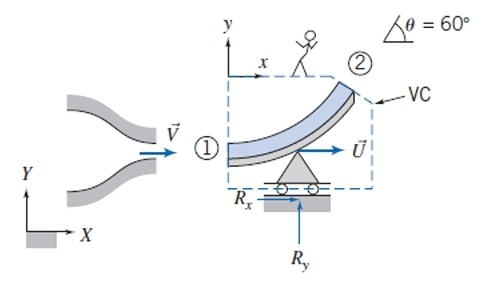

Para analisar o escoamento sobre a pá móvel, usamos um volume de controle que se move junto com a pá a uma velocidade constante $\vec{U} = U\hat{i}$. Neste referencial móvel, o escoamento é permanente.
A equação do momento linear para um VC com velocidade constante é:

$$
\sum \vec{F} = \sum_{out} \dot{m}_{out} \vec{V}_{r,out} - \sum_{in} \dot{m}_{in} \vec{V}_{r,in}
$$

onde $\vec{V}_r$ é a velocidade do fluido relativa ao VC e $\sum \vec{F}$ é a força resultante sobre o fluido no VC.

1.  **Velocidade Relativa na Entrada:**

$$
V_{r1} = V - U = 30 \text{ m/s} - 10 \text{ m/s} = 20 \text{ m/s}
$$

$$
\vec{V}_{r1} = 20\hat{i} \text{ m/s}
$$

2.  **Vazão Mássica:** A vazão que atinge a pá depende da velocidade relativa.

$$
\dot{m} = \rho A V_{r1} = (1000 \frac{\text{kg}}{\text{m}^3}) (0,003 \text{ m}^2) (20 \frac{\text{m}}{\text{s}}) = 60 \frac{\text{kg}}{\text{s}}
$$

3.  **Velocidade Relativa na Saída:** Assumindo escoamento sem atrito, a magnitude da velocidade relativa é conservada ($V_{r2} = V_{r1} = 20$ m/s). A direção é tangente à pá.

$$
\vec{V}_{r2} = (V_{r2} \cos\theta)\hat{i} + (V_{r2} \sin\theta)\hat{j}
$$

$$
\vec{V}_{r2} = (20 \cos 60^\circ)\hat{i} + (20 \sin 60^\circ)\hat{j} = (10\hat{i} + 10\sqrt{3}\hat{j}) \text{ m/s}
$$

4.  **Força sobre o Fluido ($\vec{R}$):**

$$
\vec{R} = R_x\hat{i} + R_y\hat{j} = \dot{m}(\vec{V}_{r2} - \vec{V}_{r1})
$$

**Componente x**

$$
R_x = \dot{m}(u_{r2} - u_{r1}) = 60 \frac{\text{kg}}{\text{s}} (10 \frac{\text{m}}{\text{s}} - 20 \frac{\text{m}}{\text{s}}) = -600 \text{ N}
$$

**Componente y**

$$
R_y = \dot{m}(v_{r2} - v_{r1}) = 60 \frac{\text{kg}}{\text{s}} (10\sqrt{3} \frac{\text{m}}{\text{s}} - 0) = 600\sqrt{3} \text{ N} \approx 1039 \text{ N}
$$

1.  **Força sobre a Pá ($\vec{F}_\text{pá}$):** Pela terceira lei de Newton, a força que age sobre a pá é oposta à força que age sobre o fluido.

$$
\vec{F}_\text{pá} = -\vec{R} = -R_x\hat{i} - R_y\hat{j}
$$

$$
F_{x, \text{pá}} = -(-600 \text{ N}) = 600 \text{ N}
$$

$$
F_{y, \text{pá}} = -(600\sqrt{3} \text{ N}) = -600\sqrt{3} \text{ N} \approx -1039 \text{ N}
$$

$$
\vec{F}_\text{pá} = (600\hat{i} - 1039\hat{j}) \text{ N}
$$

# Answer

## 4.1

$$
\boxed{
V_2 = -4,5 \, m/s
}
$$

## 4.2

$$
\boxed{
\dot{m}_{bc} = 0.0372 \frac{kg}{s}
}
$$

## 4.3

$$
\boxed{
\frac{d\rho_{VC}}{dt} = -2.34 \frac{\text{kg}}{\text{m}^3 \cdot \text{s}}
}
$$

## 4.4

$$
\boxed{
2250 \text{ N}
}
$$

## 4.5

$$
\boxed{
615.28 \text{ N}
}
$$

## 4.6

$$
\boxed{
\vec{R} = R_x \hat{i} + R_y \hat{j} = (1350 \hat{i} + 640 \hat{j}) \text{ N}
}
$$

## 4.7

$$
\boxed{
\frac{F_{fechada}}{w} = 44,1 \frac{\text{kN}}{\text{m}} \quad \quad
\frac{F_{aberta}}{w} =  25,2 \frac{\text{kN}}{\text{m}}
}
$$

## 4.8

$$
\boxed{
T_{correia} = 202,5 \text{ N}
}
$$

## 4.10

$$
\boxed{
\vec{F}_\text{pá} = (600\hat{i} - 1039\hat{j}) \text{ N}
}
$$

# Attempts
