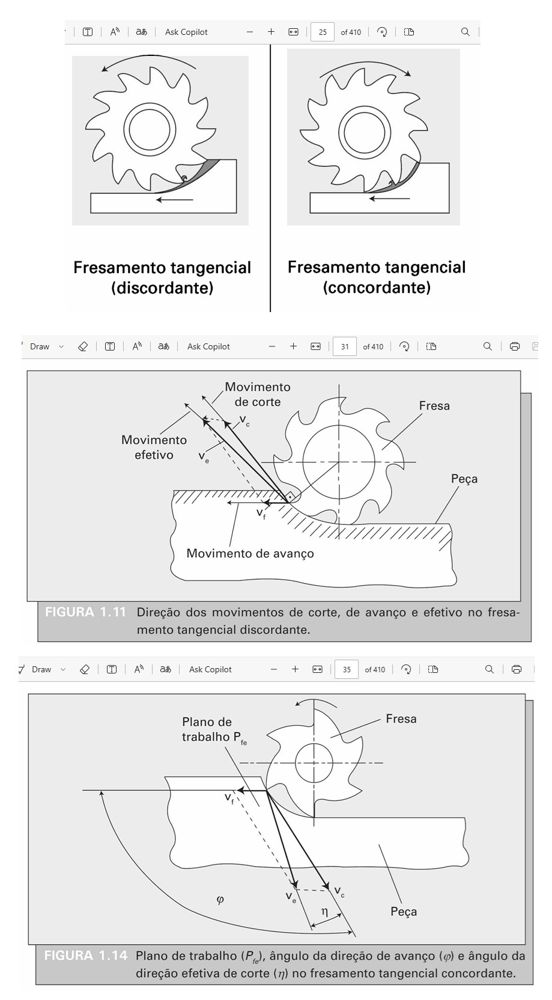
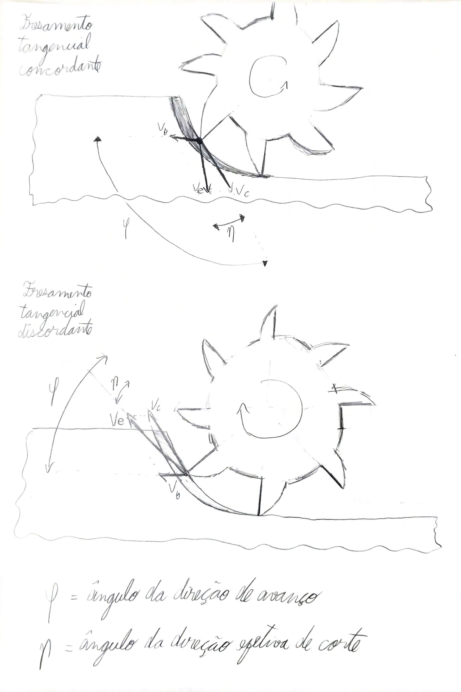
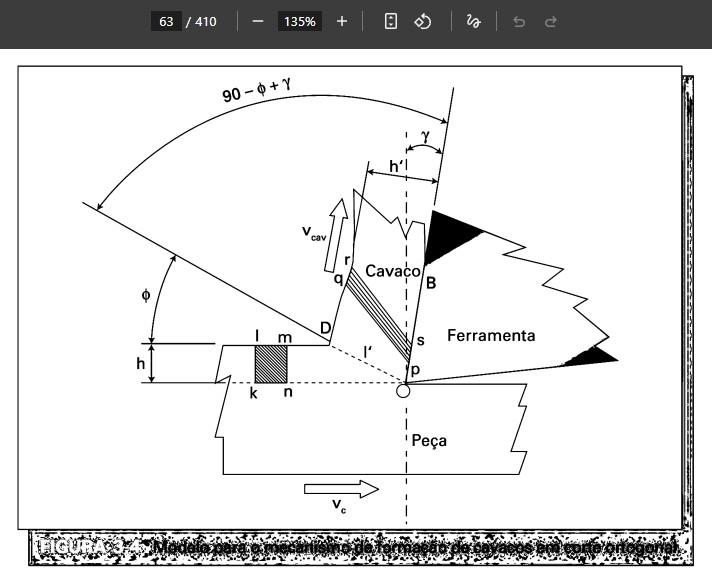
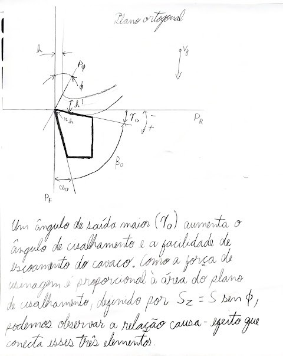
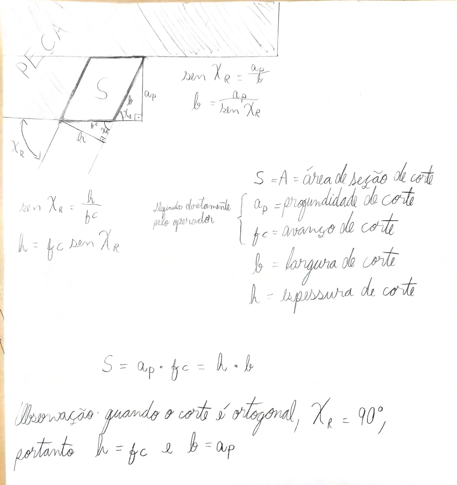
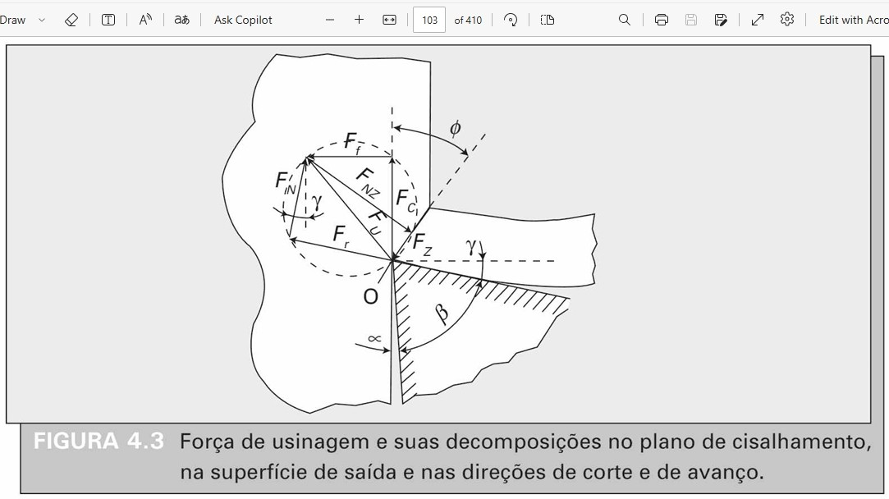
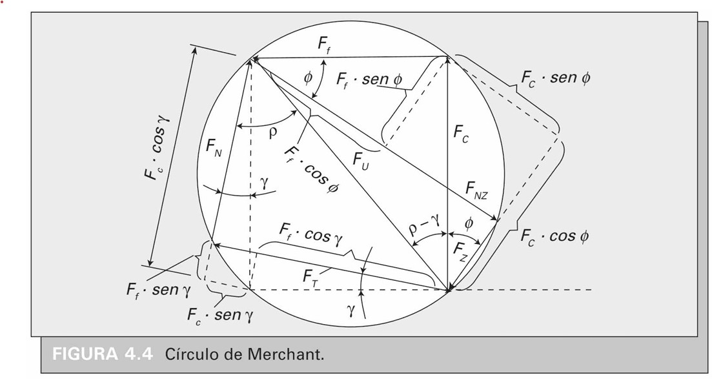

---
Classification	        :	Formula-Based Exercise
Discipline				:	EMA093 Processos de Fabricação por Usinagem
Source					:	Aulas
Description				:	Preparação P1 (Capítulos 1 a 4)
---

# Proposition

1. Desenhe os 7 ângulos principais
2. Desenhe o processo de fresamento tangencial concordante e discordante
3. Concordante vs Discordante
4. Desenho o processo de formação de cavaco na vista do plano ortogonal. Inclua no desenho $\phi, P_{\phi}, h, h', r_h, P_r, P_F$. Descreva a fórmula para $S, S' e R_c$
5. Desenho o processo de formação de cavaco na vista do plano referencial.
6. Círculo de Merchant no processo de formação do cavaco na vista do plano ortogonal.

# Step-by-step

## 7 ângulos principais

## Fresamento tangencial concordante e discordante
Em relação à nomenclatura, uma forma que acho particularmente fácil de guardar as direções:
**Concordante**:
- o movimento de avanço **concorda** com a rotação da ferramenta (vetores no mesmo sentido).
- A operação de usinagem **ajuda** o deslocamento da peça a ser fresada.
- **Estabiliza** a peça na máquina, por causa da velocidade efetiva para baixo.

**Discordante**:
- A fresa está tentando **expulsar a peça para longe**, mas não consegue por causa do movimento de avanço

**Observação**: Quando se pensa no movimento de avanço descrito acima, pense na peça se movendo, considerando a fresa estática. Porém, para desenhar o diagrama de vetores de velocidade, você deve apontar v_f no sentido em que a fresa está se movendo em relação à peça. Isso que pode gerar confusão às vezes

## Concordante vs Discordante

Em uma máquina-ferramenta de alta qualidade, rígida e sem folgas, o fresamento tangencial concordante é quase sempre a melhor escolha **tanto para o desbaste quanto para o acabamento**. Vamos detalhar o porquê:

### Acabamento

No acabamento, o objetivo principal muda da remoção de material para a obtenção de uma **qualidade de superfície superior** e **precisão dimensional rigorosa**. O fresamento concordante é superior nesta fase por várias razões críticas:

1.  **Qualidade de Superfície Superior (Baixa Rugosidade):** A forma como o cavaco é gerado é fundamental. No fresamento concordante, a aresta de corte entra no material com a espessura máxima e sai com espessura zero. Isso resulta em uma ação de corte limpa, sem o atrito e o polimento (brunimento) que ocorrem no fresamento discordante (que inicia com espessura zero). Esse atrito no método discordante gera calor excessivo e "esmaga" o material antes de cortá-lo, degradando o acabamento superficial.

2.  **Forças de Corte Favoráveis e Menor Vibração:** As forças de corte no fresamento concordante são predominantemente direcionadas para baixo e para dentro da peça, empurrando-a contra a mesa e a fixação. Isso **minimiza a vibração e a deflexão**, que são os principais inimigos de um bom acabamento. O resultado é uma superfície lisa, livre de marcas de vibração (conhecidas como "chatter marks").

3.  **Melhor Evacuação de Cavacos:** Os cavacos são ejetados para trás da fresa, longe da superfície que está sendo acabada. Isso impede que os cavacos sejam "re-cortados" na rotação seguinte, um problema comum no fresamento discordante que pode arranhar e comprometer a superfície finalizada. Manter a zona de corte limpa é essencial para um acabamento espelhado.

4.  **Menor Formação de Rebarbas:** A ação de corte limpa e a direção das forças no fresamento concordante tendem a produzir muito menos rebarbas na aresta de saída da peça. Isso reduz ou até elimina a necessidade de operações secundárias de rebarbação, economizando tempo e garantindo uma peça de maior qualidade final.

### Desbaste

1.  **Eficiência na Remoção de Material:** No desbaste, o objetivo é remover o máximo de material no menor tempo possível. As forças de corte favoráveis e a menor geração de calor do fresamento concordante permitem o uso de parâmetros de corte muito mais agressivos (maior profundidade de corte, maior avanço por dente). Isso se traduz diretamente em maiores taxas de remoção de cavaco e, consequentemente, em ciclos de usinagem mais curtos.

2.  **Vida Útil da Ferramenta:** Operações de desbaste submetem a ferramenta a um estresse mecânico e térmico intenso. Como o fresamento concordante transfere a maior parte do calor para o cavaco e inicia o corte com a espessura máxima (evitando o atrito inicial), a vida útil das pastilhas ou da fresa inteiriça é significativamente prolongada, mesmo sob condições severas. Menos trocas de ferramenta significam menos tempo de máquina parada e menor custo por peça.

3.  **Menor Consumo de Potência:** Apesar de parecer contraintuitivo, para a mesma taxa de remoção de material, o fresamento concordante tende a consumir menos potência do que o discordante. A ação de corte é mais eficiente, exigindo menos energia da máquina para cisalhar o material.

4.  **Estabilidade do Processo:** As forças que empurram a peça contra a fixação são ainda mais importantes no desbaste, onde as forças de corte gerais são muito mais elevadas. Isso garante que a peça permaneça estável, evitando vibrações que poderiam comprometer a segurança do processo e a integridade da ferramenta e da peça.

**Situações para usar o Fresamento Discordante em uma máquina de alta qualidade**

- **Usinagem de Superfícies com Casca de Fundição, Carepa ou Crosta Endurecida:** Se você estiver usinando uma peça fundida, forjada ou laminada a quente que possui uma "casca" superficial muito dura, abrasiva ou irregular, o fresamento discordante pode ser vantajoso. A aresta de corte entra por baixo dessa camada (começando com espessura de cavaco zero) e a rompe de dentro para fora. No fresamento concordante, a aresta de corte bateria de frente com essa camada abrasiva a cada rotação, o que poderia causar um desgaste muito rápido ou até mesmo a quebra da pastilha.
* **Quando a Folga é Inevitável:** Em algumas máquinas mais antigas ou em sistemas de acionamento por fusos de esferas que já apresentam um certo desgaste, pode haver uma pequena folga (backlash) que não pode ser totalmente compensada. Nesses casos, a força do fresamento concordante "puxando" a mesa pode causar instabilidade. O fresamento discordante, que sempre empurra contra a direção do avanço, elimina esse risco e se torna a escolha mais segura.
* **Acabamentos em Paredes Muito Finas e Flexíveis (Situação Específica):** Em casos muito específicos, ao fazer um passe de acabamento muito leve em uma parede extremamente fina e propensa a flexionar, a direção das forças do fresamento discordante (que tende a afastar a ferramenta da peça) pode ajudar a minimizar a deflexão da parede. No entanto, isso geralmente é um ajuste fino e depende muito da geometria da peça e da estratégia de usinagem.

## Conclusão

Em um cenário ideal, com uma máquina moderna, rígida e bem mantida, a regra geral é clara: **utilize sempre o fresamento tangencial concordante.** Ele oferece um processo mais estável, eficiente, com maior vida útil da ferramenta e melhor acabamento, tanto para desbaste quanto para acabamento.

As situações que exigem o fresamento discordante são exceções, geralmente ligadas a condições específicas da matéria-prima (como cascas de fundição) ou limitações do equipamento.

## Desenho cavaco
- $S \text{ ou } A:=$ área da seção de corte
- $S_z :=$ área do plano de cisalhamento
- $R_c :=$ = grau de recalque
- $\phi :=$ ángulo de cisalhamento

---

- $f_c :=$ avanço de corte (definido pelo operador)
- $h :=$ espessura de corte (definido geometricamente)
- $h' :=$ espessura do cavaco (definido por vários parâmetros)

---

- $a_p :=$ profundidade de corte (definida pelo operador)
- $b :=$ largura de corte (definida geometricamente)

---

$$
b = a_p \quad \text{ e } \quad h = f_c
$$

Isso é válido apenas no corte ortogonal pois, $\chi_r = 90°$. As fórmulas completas são

$$
h = f_c \cdot \sin(\chi_r) \quad \text{ e } \quad  b = \frac{a_p}{\sin(\chi_r)}
$$

---

$$
R_c = \frac{h'}{h} \left[\text{adimensional}\right]
$$

$$
S = a_p \cdot f_c = h \cdot b \left[mm^2\right]
$$

**Cavaco no plano ortogonal**

**Cavaco no plano referencial**

**Círculo de Merchant no processo de formação do cavaco na vista do plano ortogonal**

# Answer

# Attempts
