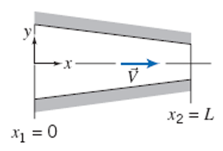
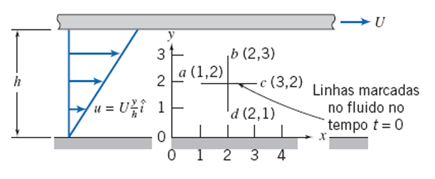
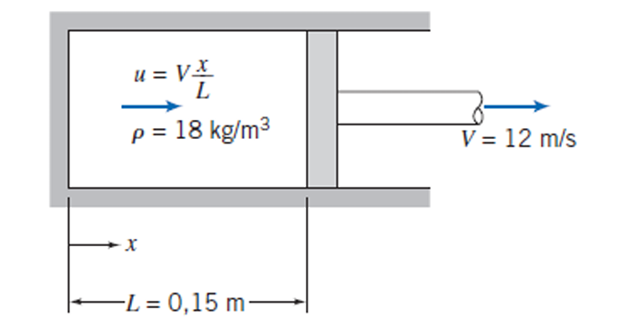
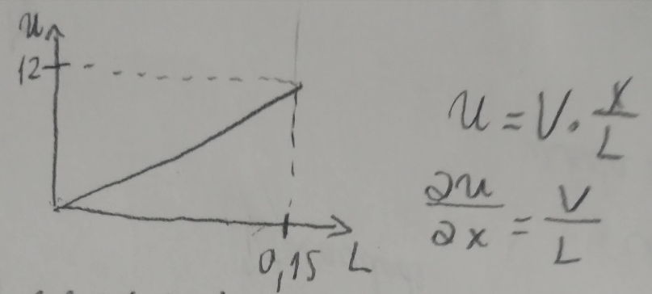
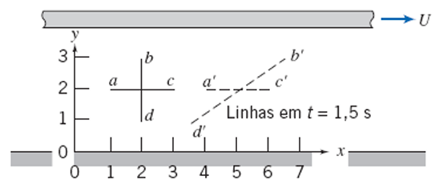
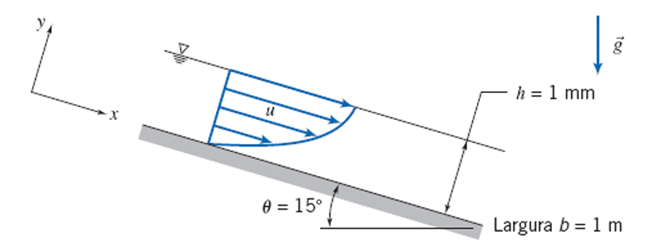

---
Classification	        :	Formula-Based Exercise
Discipline				:	EMA091 Mecânica dos fluidos
Source					:	FOX AND McDONALD’S Edição 8 - p261
Description				:	P2 - Exemplo 5.2 5.5 5.7 5.9
---

# Proposition

## 5.2 EQUAÇÃO DIFERENCIAL DA CONTINUIDADE PARA REGIME NÃO PERMANENTE
Um amortecedor a gás na suspensão de um automóvel comporta-se como um dispositivo pistão-cilindro. No instante em que o pistão está afastado de uma distância $L = 0,15$ m da extremidade fechada do cilindro, a massa específica do gás $\rho = 18$ kg/m³ é uniforme e o pistão começa a se mover, afastando-se da extremidade fechada do cilindro com uma velocidade $V = 12$ m/s. Considere como modelo simples que a velocidade do gás é unidimensional e proporcional à distância em relação à extremidade fechada; ela varia linearmente de zero, na extremidade, a $u = V$ no pistão.

a) Encontre a taxa de variação da massa específica do gás nesse instante.
b) Obtenha uma expressão para a massa específica média como uma função do tempo.

## 5.5 ACELERAÇÃO DE PARTÍCULA NAS DESCRIÇÕES EULERIANA E LAGRANGIANA
Considere o escoamento bidimensional, em regime permanente e incompressível através do canal plano convergente mostrado. A velocidade sobre a linha de centro horizontal (eixo $x$) é dada por $\vec{V} = V_1[1+(x/L)]\hat{i}$. Determine uma expressão para aceleração de uma partícula movendo-se ao longo da linha de centro usando

a) o método euleriano
b) o método lagrangiano.

c) Avalie a aceleração quando a partícula estiver no início e no final do canal.

## 5.7 ROTAÇÃO EM ESCOAMENTO VISCOMÉTRICO
Um escoamento viscométrico no espaço estreito entre duas grandes placas paralelas é mostrado na figura ao lado. O campo de velocidade na folga estreita é dado por $\vec{V} = U(y/h)\hat{i}$, em que $U = 4$ mm/s e $h = 4$ mm. Em $t = 0$, os segmentos de linhas $ac$ e $bd$ são marcados no fluido para formar uma cruz conforme mostrado. Avalie as posições dos pontos marcados em $t = 1,5$ s e faça um esquema para comparação. Calcule a taxa de deformação angular e a taxa de rotação de uma partícula fluida neste campo de velocidade. Comente sobre os seus resultados.

## 5.9 ANÁLISE DE UM ESCOAMENTO LAMINAR COMPLETAMENTE DESENVOLVIDO PARA BAIXO SOBRE UM PLANO INCLINADO
Um líquido escoa para baixo sobre uma superfície plana inclinada em um filme laminar, permanente, completamente desenvolvido e de espessura $h$. Simplifique as equações da continuidade e de Navier-Stokes para modelar este campo de escoamento. Obtenha expressões para o perfil de velocidades do líquido, a distribuição de tensões de cisalhamento, a vazão volumétrica e a velocidade média. Relacione a espessura do filme de líquido com a vazão volumétrica por unidade de profundidade da superfície normal ao escoamento. Calcule a vazão volumétrica em um filme de água com espessura $h = 1$ mm, escoando sobre uma superfície de largura $b = 1$ m, inclinada de $\theta = 15º$ em relação à horizontal.

# Step-by-step

## Teoria inicial

---

$$
\text{Operador Nabla}
$$

$$
\nabla = \hat{i} \frac{\partial}{\partial x} + \hat{j} \frac{\partial}{\partial y} + \hat{k} \frac{\partial}{\partial z}
$$

---

$$
\text{Equação da Continuidade na Forma Diferencial [p.259]}
$$

$$
\boxed{
\nabla \cdot \rho \vec{V} + \frac{\partial \rho}{\partial t} = 0
}
$$

$$
\nabla \cdot \rho \vec{V} + \frac{\partial \rho}{\partial t}
\implies
\frac{\partial \rho u}{\partial x} + \frac{\partial \rho v}{\partial y} + \frac{\partial \rho w}{\partial z} + \frac{\partial \rho}{\partial t}
$$

---

$$
\text{Simplificação com } \rho \text{ constante no espaço e tempo}
$$

$$
\boxed{
\nabla \vec{V} = 0
}
$$

$$
\frac{\partial \rho}{\partial t} = 0
$$

$$
\nabla \cdot \rho \vec{V} + \frac{\partial \rho}{\partial t} = \nabla \cdot \rho \vec{V} = \rho (\nabla \vec{V})
$$

$$
\rho (\nabla \vec{V}) = 0
$$

$$
\nabla \vec{V} = 0 =
$$

$$
\frac{\partial u}{\partial x} + \frac{\partial v}{\partial y} + \frac{\partial w}{\partial z} = 0
$$

---

$$
\text{Derivada Substancial* [p.272]}
$$

$$
\boxed{
\frac{D\vec{V}}{Dt} \equiv \vec{a}_p = u \frac{\partial \vec{V}}{\partial x} + v \frac{\partial \vec{V}}{\partial y} + w \frac{\partial \vec{V}}{\partial z} + \frac{\partial \vec{V}}{\partial t}
}
$$

$$
\frac{D\vec{V}}{Dt} = \frac{\partial\vec{V}}{\partial t} + (\vec{V} \cdot \nabla)\vec{V}
$$

*Também frequentemente chamada de derivada material ou de derivada de partícula

---

$$
\text{Equações de Navier-Stokes* [p.288]}
$$

$$
\rho \left( \frac{\partial u}{\partial t} + u \frac{\partial u}{\partial x} + v \frac{\partial u}{\partial y} + w \frac{\partial u}{\partial z} \right) = \rho g_x - \frac{\partial p}{\partial x} + μ \left\{ \frac{\partial^2 u}{\partial x^2} + \frac{\partial^2 u}{\partial y^2} + \frac{\partial^2 u}{\partial z^2} \right\}
$$

$$
\rho \left( \frac{\partial v}{\partial t} + u \frac{\partial v}{\partial x} + v \frac{\partial v}{\partial y} + w \frac{\partial v}{\partial z} \right) = \rho g_y - \frac{\partial p}{\partial y} + μ \left\{ \frac{\partial^2 v}{\partial x^2} + \frac{\partial^2 v}{\partial y^2} + \frac{\partial^2 v}{\partial z^2} \right\}
$$

$$
\rho \left( \frac{\partial w}{\partial t} + u \frac{\partial w}{\partial x} + v \frac{\partial w}{\partial y} + w \frac{\partial w}{\partial z} \right) = \rho g_z - \frac{\partial p}{\partial z} + μ \left\{ \frac{\partial^2 w}{\partial x^2} + \frac{\partial^2 w}{\partial y^2} + \frac{\partial^2 w}{\partial z^2} \right\}
$$

*Simplificadas considerando fluido incompressível com viscosidade constante

---

$$
\underbrace{
\rho \left( \frac{\partial \mathbf{V}}{\partial t} + (\mathbf{V} \cdot \nabla) \mathbf{V} \right)
}_{\text{Termos de Inércia (aceleração)}} =
\underbrace{
\rho \mathbf{g}
}_{\text{Força de Campo}} -
\underbrace{
\nabla p}_{\text{Força de Pressão}
} +
\underbrace{
\mu \nabla^2 \mathbf{V}
}_{\text{Força Viscosa}}
$$

---

### Aceleração Local e Espacial

*   $\frac{\partial \vec{V}}{\partial t}$: **Aceleração Local**. Ocorre em um ponto fixo devido à variação do campo de velocidades com o tempo.
*   $(\vec{V} \cdot \nabla)\vec{V}$: **Aceleração Espacial**. Ocorre porque a partícula se move através de um *gradiente espacial* de velocidade.

**Outros nomes**
Aceleração Local = Aceleração Temporal
Aceleração Espacial = Aceleração Advectiva = Aceleração Convectiva (por convenção)

**A aceleração é advectiva ou convectiva?**

Existem argumentos de que chamar de "convectiva" pode ser confuso, pois o fenômeno não tem necessariamente a ver com transferência de calor ou forças de empuxo, que é o contexto principal da palavra "convecção".

1.  **Advecção (Advection):** Refere-se ao transporte de uma propriedade (como calor, massa, ou momento) simplesmente pelo movimento em massa (bulk motion) de um fluido. É o ato de "carregar algo junto com o fluxo".
2.  **Convecção (Convection):** É um termo mais amplo que descreve o transporte de calor que ocorre através do movimento em massa de um fluido. Frequentemente, o termo "convecção" está associado a movimentos de fluidos gerados por diferenças de densidade (causadas por gradientes de temperatura), como o ar quente subindo.

**O Nome Mais Preciso**

O termo $(\vec{V} \cdot \nabla)\vec{V}$ na equação da aceleração representa a mudança na velocidade de uma partícula porque ela foi **transportada** para uma nova posição no campo de escoamento onde a velocidade é diferente.

*   A causa dessa aceleração é o **transporte de momento** pelo próprio escoamento.
*   Portanto, o termo mais preciso para descrever esse fenômeno é **aceleração advectiva** (advective acceleration).

Para evitar essa confusão, pode-se referir aos dois termos da aceleração da forma primeira forma: aceleração local e aceleraçaõ espacial.

---

### Abordagem Euleriana e Lagrangiana
A abordagem Lagrangiana geralmente depende da Euleriana ser conhecida primeiro. Aqui está o porquê:

**1. Como Descrevemos e Medimos o Escoamento**

*   **Ponto de Partida (Euleriano):** As equações fundamentais da mecânica dos fluidos (como as equações de Navier-Stokes) são formuladas na estrutura Euleriana. Elas descrevem como a velocidade, a pressão, etc., mudam em pontos fixos no espaço ($\partial/\partial t$, $\partial/\partial x$, etc.). Quando resolvemos um problema (analiticamente ou computacionalmente), a solução que obtemos é o **campo de escoamento** – um mapa de vetores de velocidade para cada ponto no espaço e no tempo, $\vec{V}(x, y, z, t)$.
*   **Medições Experimentais:** Da mesma forma, a maioria dos instrumentos de medição (tubos de Pitot, anemômetros, PIV - Velocimetria por Imagem de Partículas) mede as propriedades do fluido em locais fixos ou em uma região fixa. O resultado é um campo de dados Euleriano.

Portanto, nosso conhecimento fundamental de um escoamento, seja teórico ou experimental, quase sempre vem na forma de um campo Euleriano. Ele é o nosso "mapa do rio".

**2. Como Usamos a Descrição Lagrangiana**

*   **Ponto de Chegada (Lagrangiano):** A abordagem Lagrangiana é usada para responder a perguntas sobre o que acontece com *objetos individuais* dentro do escoamento. Por exemplo:
    *   Para onde uma partícula de poluente vai ser levada pelo vento?
    *   Qual é a trajetória de uma gota de chuva?
    *   Qual é a aceleração sentida por uma célula de sangue em uma artéria?

Para responder a essas perguntas, precisamos saber o caminho da partícula. Como fazemos isso? Usamos o "mapa do rio" (o campo Euleriano) que já temos.

A equação que conecta os dois mundos é:

$$
\frac{d\vec{x}_p(t)}{dt} = \vec{V}(\vec{x}_p, t)
$$

Esta equação diz: "A velocidade da partícula (Lagrangiano) é igual à velocidade do campo de escoamento (Euleriano) na posição atual da partícula".

Para encontrar a trajetória Lagrangiana, nós **integramos** o campo de velocidades Euleriano ao longo do tempo. Essencialmente, usamos o mapa para descobrir, passo a passo, para onde a partícula vai em seguida.

**3. Conclusão e Analogia**

Pense no campo de velocidades Euleriano como um **mapa de correntes de um rio**. O mapa está fixo e mostra a velocidade e a direção da água em cada ponto do rio.

*   **Abordagem Euleriana Independente:** Você pode estudar o mapa do rio por si só. Pode encontrar onde a correnteza é mais forte, onde há redemoinhos, etc., sem precisar seguir um barco específico.
*   **Abordagem Lagrangiana Dependente:** Se você quiser saber a trajetória de um **barco específico** (ou de uma folha flutuando), você *precisa* do mapa. Você olha onde o barco está, o mapa lhe diz a velocidade da correnteza naquele ponto, e você calcula onde o barco estará um instante depois. Você repete esse processo continuamente. A trajetória do barco (Lagrangiana) depende inteiramente do mapa de correntes (Euleriano).

Então, do ponto de vista da resolução de problemas em mecânica dos fluidos, nós primeiro determinamos o campo Euleriano e depois o usamos como base para calcular as propriedades Lagrangianas quando necessário.

## 5.2

$$
\text{Equação da Continuidade na Forma Diferencial}
$$

$$
\boxed{
\nabla \cdot \rho \vec{V} + \frac{\partial \rho}{\partial t} = 0
}
$$

$$
\nabla \cdot \rho \vec{V} + \frac{\partial \rho}{\partial t}
\implies
\frac{\partial \rho u}{\partial x} + \frac{\partial \rho v}{\partial y} + \frac{\partial \rho w}{\partial z} + \frac{\partial \rho}{\partial t}
$$

---

"Considere como modelo simples que a velocidade do gás é unidimensional":

$$
\frac{\partial \rho v}{\partial y} = \frac{\partial \rho w}{\partial z} = 0
$$

$$
\frac{\partial \rho u}{\partial x}  + \frac{\partial \rho}{\partial t} = 0
$$

$$
\frac{\partial \rho}{\partial t} = - \frac{\partial \rho u}{\partial x}
$$

Pela regra do produto:

$$
\frac{\partial \rho}{\partial t} = - \rho \frac{\partial u}{\partial x} - u \color{green}\frac{\partial \rho}{\partial x}
$$

"A massa específica do gás é uniforme"

$$
\frac{\partial \rho}{\partial x} = \color{green} 0
$$

$$
\frac{\partial \rho}{\partial t} = - \rho \color{blue} \frac{\partial u}{\partial x}
$$

---

"a velocidade do gás é unidimensional e proporcional à distância em relação à extremidade fechada"

$$
u = V \cdot \frac{x}{L}
$$

$$
\frac{\partial u}{\partial x} = \color{blue}\frac{V}{L}
$$

---

$$
\frac{d \rho}{d t} = - \rho \frac{V}{L}
$$

---

### a) Taxa de variação da massa específica

"Encontre a taxa de variação da massa específica do gás nesse instante."

$$
\text{"Nesse instante"} =  \quad t = 0 \quad L = L_0
$$

$$
\left. \frac{d\rho}{dt} \right|_{t=0} = -\rho_0 \frac{V}{L_0} = -(18 \, \text{kg/m}^3) \frac{12 \, \text{m/s}}{0,15 \, \text{m}}
$$

$$
\boxed{\left. \frac{d\rho}{dt} \right|_{t=0} = -1440 \, \text{kg/m}^3\text{s}}
$$

### b) Expressão para massa específica

$$
d \rho = - \rho \frac{V}{L} dt
$$

$$
\rho^{-1} d \rho = - \frac{V}{L} dt
$$

$$
\int_0^\rho \rho'^{-1} d \rho' = - \int_0^t \frac{V}{\color{green} L} dt'
$$

---

$$
L(t) = \color{green} L_0 + Vt
$$

---

$$
\int_0^\rho \rho'^{-1} d \rho' = - \color{blue} \int_0^t \frac{V}{L_0 + Vt'} dt'
$$

---

Substituição por $u$:

$$
u = L_0 + Vt'
$$

$$
\frac{du}{dt'} = V \implies dt' = \frac{1}{V} du
$$

$$
\int_0^t \frac{V}{L_0 + Vt'} dt' = \int_0^t \frac{V}{u} \frac{1}{V} du = \ln u = \color{blue} [\ln L_0 + Vt']_0^t
$$

---

$$
[\ln \rho']_0^\rho = - [\ln L_0 + Vt']_0^t
$$

$$
\ln \left( \frac{\rho(t)}{\rho_0} \right) = -(\ln(L_0 + Vt) - \ln(L_0))
$$

$$
\ln \left( \frac{\rho(t)}{\rho_0} \right) = -\ln \left( \frac{L_0 + Vt}{L_0} \right) = \ln \left( \frac{L_0}{L_0 + Vt} \right)
$$

$$
\frac{\rho(t)}{\rho_0} = \frac{L_0}{L_0 + Vt}
$$

$$
\boxed{\rho(t) = \rho_0 \frac{L_0}{L_0 + Vt}}
$$

## 5.5

**Dúvida inicial**
Se o enunciado nos fornece velocidade, não basta derivar a velocidade para obter aceleração?

Não, pois essa regra se aplica quando as equações estão em função do tempo.

O enunciado nos fornece velocidade em função da posição, não do tempo.

$$
v(t) \ne v(x)
$$

$$
a(x) \ne \frac{d v(x)}{d x}
$$

$$
a(x) = {\color{blue} \frac{d v(x)}{d x}} {\color{green} v(x)} \implies \text{Método Euleriano}
$$

**Derivadas da posição**

$$
x(t) = \text{Posição em função do tempo}
$$

$$
\frac{d x (t)}{d t} = v(t) = \text{Velocidade em função do tempo}
$$

$$
\frac{d v (t)}{d t} = a(t) = \text{Aceleração em função do tempo}
$$

---

### a) Método Euleriano (aceleração em função da posição)

$$
\text{Derivada Substancial* [p.272]}
$$

$$
\frac{D\vec{V}}{Dt} \equiv \vec{a}_p = u \frac{\partial \vec{V}}{\partial x} + v \frac{\partial \vec{V}}{\partial y} + w \frac{\partial \vec{V}}{\partial z} + \frac{\partial \vec{V}}{\partial t}
$$

Como o escoamento é em **regime permanente**, a aceleração local é zero. Portanto, $\frac{\partial \vec{V}}{\partial t} = 0$

$$
\vec{a}_p = u \frac{\partial \vec{V}}{\partial x} + v \frac{\partial \vec{V}}{\partial y} + w \frac{\partial \vec{V}}{\partial z}
$$

A frase "Determine uma expressão para aceleração de uma partícula movendo-se ao longo da linha de centro" nos indica que apenas o componente $x$ do vetor velocidate é relevante para a expressão. Portanto, $(\vec{V} \rightarrow u)$ e $(\vec{a}_p \rightarrow a_{p,x})$

$$
a_{p,x} = u \frac{\partial u}{\partial x} + v \frac{\partial u}{\partial y} + w \frac{\partial u}{\partial z}
$$

Na linha de centro, a partícula não possui velocidade no eixo $y$ nem $z$. Portanto, $v = w = 0$.

$$
a_{p,x} = \color{green} u \color{blue}\frac{\partial u}{\partial x}
$$

O vetor de velocidade fornecido nos permite obter o valor de $u$ e, consequentemente, $\frac{\partial u}{\partial x}$

$$
\vec{V} = V_1[1+(x/L)]\hat{i} \implies \color{green} u = V_1 \left[1 + \frac{x}{L} \right]
$$

$$
\color{blue} \frac{\partial u}{\partial x} = \frac{V_1}{L}
$$

$$
a_{p,x} = \color{green} V_1 \left[1 + \frac{x}{L} \right] \color{blue} \frac{V_1}{L}
$$

$$
\boxed{
a_{p,x} (x) = \frac{V_1^2}{L} \left[1 + \frac{x}{L} \right]
}
$$

---

**Observação sobre métodos Lagrangianos:** O enunciado pede "uma expressão para aceleração de uma partícula movendo-se ao longo da linha de centro", o que é ambíguo. Pode ser uma função da posição, $a(x)$, ou uma função do tempo, $a(t)$. Portanto, será feito das duas formas para o método Lagrangiano.

---

### b) Método Lagrangiano 1 - (aceleração em função da posição)

O enunciado nos fornece a velocidade em função da posição.
Como dito na **seção da teoria inicial**, a equação principal quando usamos o método Lagrangiano é

$$
{\color{magenta} \frac{d\vec{x}_p(t)}{dt}} = \color{green} \vec{V}(\vec{x}_p, t)
$$

"A velocidade da partícula (Lagrangiano) é igual à velocidade do campo de escoamento (Euleriano) na posição atual da partícula".

Para encontrar a trajetória Lagrangiana, nós **integramos** o campo de velocidades Euleriano ao longo do tempo, calculando a trajetória da párticula, ou seja, a posição em função do tempo $= \vec{x}_p(t)$.

---

O vetor de velocidade fornecido nos permite obter o valor de $u$ e, consequentemente, $\frac{\partial u}{\partial x}$

$$
\vec{V} = V_1[1+(x/L)]\hat{i} \implies \color{green} u = V_1 \left[1 + \frac{x}{L} \right]
$$

$$
\color{blue} \frac{\partial u}{\partial x} = \frac{V_1}{L}
$$

Observação: Cópia exata do trecho da solução do método Euleriano

---

1.  **Equação do Movimento:** A velocidade de uma partícula, $v_p(t)$, é a taxa de variação de sua posição, $dx_p/dt$. Essa velocidade é igual à velocidade do campo euleriano na posição atual da partícula, $u(x_p)$.

$$
\color{magenta} v_p(t) = \frac{dx_p}{dt} = \color{green} u(x_p)
$$

$$
\color{green} u(x_p) = V_1\left(1 + \frac{x_p}{L}\right)
$$

$$
\color{magenta} v_p(t) = \color{green} V_1\left(1 + \frac{x_p}{L}\right)
$$

$$
\color{magenta} \frac{dx_p}{dt} = \color{green} V_1\left(1 + \frac{x_p}{L}\right)
$$

2.  **Cálculo da Aceleração:** A aceleração da partícula, $a_p(t)$, é a derivada de sua velocidade em relação ao tempo. Usando a regra da cadeia:

$$
a_p(t) =  \frac{dv_p}{dt} = \frac{d}{dt}[{\color{green} u(x_p(t))}] = {\color{blue} \frac{du}{dx_p}} \cdot {\color{magenta}\frac {dx_p}{dt}} = {\color{blue} \frac{V_1}{L}} \cdot {\color{green} V_1\left(1 + \frac{x_p}{L}\right)}
$$

$$
\boxed{
a_{p,x} (x) = \frac{V_1^2}{L} \left[1 + \frac{x}{L} \right]
}
$$

### b) Método Lagrangiano 2 - (aceleração em função do tempo)

No método Lagrangiano, o objetivo é descrever o movimento de uma partícula individual. Para encontrar a aceleração em função do tempo, $a_p(t)$, seguimos os seguintes passos:

1.  **Relacionar a velocidade da partícula com o campo de velocidades:** Usamos a equação diferencial $\frac{dx_p}{dt} = u(x_p)$ para encontrar a posição da partícula em função do tempo, $x_p(t)$.
2.  **Derivar a posição para obter a velocidade:** Uma vez que temos $x_p(t)$, derivamos em relação ao tempo para encontrar a velocidade da partícula em função do tempo, $v_p(t) = \frac{dx_p}{dt}$.
3.  **Derivar a velocidade para obter a aceleração:** Derivamos $v_p(t)$ em relação ao tempo para encontrar a aceleração da partícula em função do tempo, $a_p(t) = \frac{dv_p}{dt}$.

**Passo 1: Encontrar a Posição em Função do Tempo, $x_p(t)$**

Começamos com a equação fundamental que conecta a descrição Lagrangiana (velocidade da partícula, $\frac{dx_p}{dt}$) com a descrição Euleriana (campo de velocidades, $u(x_p)$):

$$
\frac{dx_p}{dt} = u(x_p) = V_1 \left(1 + \frac{x_p}{L}\right)
$$

Esta é uma equação diferencial separável. Para resolvê-la, separamos as variáveis $x_p$ e $t$:

$$
\frac{dx_p}{1 + x_p/L} = V_1 dt
$$

Agora, integramos ambos os lados. Assumimos que a partícula começa na entrada do canal, $x_p = 0$, no instante $t = 0$.

$$
\int_0^{x_p} \frac{dx'}{1 + x'/L} = \int_0^t V_1 dt'
$$

Resolvendo a integral da esquerda (usando a substituição $w = 1 + x'/L$):

$$
[L \ln(1 + x'/L)]_0^{x_p} = L \ln(1 + x_p/L) - L \ln(1) = L \ln(1 + x_p/L)
$$

Resolvendo a integral da direita:

$$
[V_1 t']_0^t = V_1 t
$$

Igualando os resultados, temos:

$$
L \ln\left(1 + \frac{x_p}{L}\right) = V_1 t
$$

Agora, isolamos $x_p$ para obter a posição em função do tempo:

$$
\ln\left(1 + \frac{x_p}{L}\right) = \frac{V_1 t}{L}
$$

$$
1 + \frac{x_p}{L} = e^{(V_1 t / L)}
$$

$$
\boxed{
x_p(t) = L \left( e^{V_1 t / L} - 1 \right)
}
$$

**Passo 2: Encontrar a Velocidade em Função do Tempo, $v_p(t)$**

A velocidade da partícula é a derivada da sua posição em relação ao tempo:

$$
v_p(t) = \frac{dx_p}{dt} = \frac{d}{dt} \left[ L \left( e^{V_1 t / L} - 1 \right) \right]
$$

$$
v_p(t) = L \left( e^{V_1 t / L} \cdot \frac{V_1}{L} - 0 \right)
$$

$$
\boxed{
v_p(t) = V_1 e^{V_1 t / L}
}
$$

**Passo 3: Encontrar a Aceleração em Função do Tempo, $a_p(t)$**

Finalmente, a aceleração da partícula é a derivada da sua velocidade em relação ao tempo:

$$
a_p(t) = \frac{dv_p}{dt} = \frac{d}{dt} \left[ V_1 e^{V_1 t / L} \right]
$$

$$
a_p(t) = V_1 \left( e^{V_1 t / L} \cdot \frac{V_1}{L} \right)
$$

$$
\boxed{
a_{p,x}(t) = \frac{V_1^2}{L} e^{V_1 t / L}
}
$$

**Verificação de Consistência**

Podemos verificar se esta resposta é consistente com a encontrada anteriormente, $a_{p,x}(x) = \frac{V_1^2}{L} \left(1 + \frac{x}{L}\right)$.
Do Passo 1, sabemos que $e^{V_1 t / L} = 1 + \frac{x_p}{L}$. Substituindo isso na nossa expressão para $a_{p,x}(t)$:

$$
a_{p,x}(t) = \frac{V_1^2}{L} \underbrace{e^{V_1 t / L}}_{1 + x_p/L} = \frac{V_1^2}{L} \left(1 + \frac{x_p}{L}\right)
$$

O resultado é idêntico, confirmando que ambas as abordagens são corretas e consistentes.

### c) Avalie a aceleração no início e no final do canal.

Usaremos a expressão para a aceleração que encontramos: $\vec{a}(x) = \frac{V_1^2}{L}\left(1 + \frac{x}{L}\right)\hat{i}$.

*   **No início do canal (x = 0):**

$$
\vec{a}(0) = \frac{V_1^2}{L}\left(1 + \frac{0}{L}\right)\hat{i}
$$

$$
\vec{a}(0) = \frac{V_1^2}{L}\hat{i}
$$

*   **No final do canal (x = L):**

$$
\vec{a}(L) = \frac{V_1^2}{L}\left(1 + \frac{L}{L}\right)\hat{i}
$$

$$
\vec{a}(L) = \frac{V_1^2}{L}(1 + 1)\hat{i}
$$

$$
\vec{a}(L) = \frac{2V_1^2}{L}\hat{i}
$$

**Conclusão:** A aceleração da partícula não é constante; ela aumenta linearmente à medida que a partícula se move através do canal. No final do canal, a aceleração é o dobro da aceleração no início.

## 5.7

## 5.9

# Answer

# Attempts
