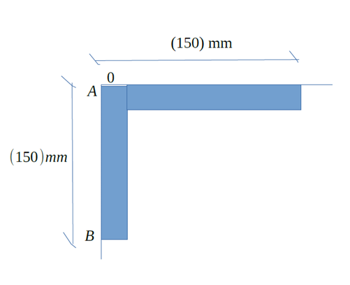
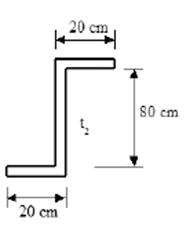

---
Classification	        :	Formula-Based Exercise
Discipline				:	EES003 Resistência dos Materiais
Source					:	2025-2 P2 Max
Description				:	2025-2 P2 Max
---

# Proposition

## 1
Uma cantoneira de $150 \text{ mm} \times 150 \text{ mm}$ e $20 \text{mm}$ de espessura está sujeita a um momento fletor $M_z=11 \text{kNm}$ no centroide da seção transversal. Determine:

a) as tensões normais nos pontos $A$ e $B$ da seção transversal
b) Orientação do eixo neutro.

## 2

Um perfil aço tem $3 \text{m}$ de comprimento e transmite um momento de torção $M_t = 25 \text{kN} \cdot \text{m}$. O valor do ângulo de torção, corresponde ao comprimento total do eixo, não deve exceder de $2,5^\circ$. A tensão admissível ao cisalhamento é igual a $84 \text{MPa}$. Sendo, $G = 84 \text{GPa}$, determinar as espessura da seção abaixo:

A imagem apresenta a seção transversal de um perfil com formato de 'Z'. A seção é composta por três partes retangulares finas, formando os flanges superior e inferior e a alma vertical.
- O flange superior é horizontal e possui um comprimento de $20 \text{cm}$.
- O flange inferior é horizontal e também possui um comprimento de $20 \text{cm}$.
- A alma é a parte vertical que conecta os dois flanges e tem uma altura de $80 \text{cm}$.
A espessura da alma é indicada na figura pela variável $t_2$. A questão pede para determinar a espessura da seção.

# Step-by-step

## 1

### Descrição da imagem e interpretação inicial
- Eixo X: Eixo longitudinal da viga, positivo entrando na página
- Eixo Y: Eixo vertical da seção transversal, positivo para cima.
- Eixo Z: Eixo horizontal da seção transversal, positivo para direita.

A imagem exibe a seção transversal de uma cantoneira em forma de 'L' no plano $YZ$.

A origem do sistema de coordenadas, ponto '0', está localizada no vértice externo do 'L'

O problema pode ser entendido como dois retângulos definidos pelas seguintes coordenadas (z,y):
- Retângulo 1: (0,0) (150,0) (0, -20) (150, -20)
- Retângulo 2: (0, -20) (20, -20) (0, -150) (20, -150)

$A: (z_a,y_a) = (0,0)$
$B: (z_b,y_b) = (0,-150)$

**Convenção da mão direita**
- Imagine o eixo em torno do qual o momento atua (no nosso caso, o eixo X).
- Aponte o polegar da sua mão direita na direção positiva desse eixo.
- A direção em que seus dedos se curvam representa a direção de um momento fletor positivo.

**Análise qualitativa da tensão normal no ponto A e B**
Com isso já podemos determinar os sinais das tensões normais nos pontos A e B.

Imaginemos que o lado esquerdo da cantoneira está fixada em uma parede por um parafuso em A e B.

A tensão normal em A será positiva, pois o momento fletor está tentando separar a cantoneira da parede. O parafuso estará sendo tracionado.

A tensão normal em B será negativa, pois o momento fletor está tentando prensar a cantoneira na parede. O parafuso estará sendo comprimido.

Além disso, podemos também comentar sobre a magnitude das forças normais. A magnitude da tensão é proporcional à distância perpendicular de cada ponto ao Eixo Neutro inclinado. Como o ponto B é um vértice extremo, é provável que ele esteja mais distante do Eixo Neutro do que o ponto A. Portanto, é esperado que **$|\sigma_B| > |\sigma_A|$**

**Note**: This analogy describes a connection with reaction forces, not the internal stress distribution due to pure bending on a cross-section. In pure bending, stresses arise internally to resist the applied moment and are distributed relative to the neutral axis, not based on a hypothetical external fixture. While the signs of the stresses determined through this flawed analogy happen to be correct for this specific problem, the underlying physical reasoning is not valid for the given conditions. However, as they work in this specific problem and are useful for understanding, they remained on the text.

### Equações governantes
A fórmula que define o comportamento de um sistema e para a qual todos os outros cálculos servem como "entradas" ou "parâmetros" é mais comumente chamada de Equação Governante

#### Item A
É requisitado a tensão normal em dois pontos. Para calcularmos isso, usaremos a seguinte fórmula:

$$
\sigma_x = \frac{(M_z I_y - M_y I_{yz})y - (M_y I_z - M_z I_{yz})z}{I_y I_z - I_{yz}^2}
$$

$$
\text{Fórmula geral para flexão assimétrica (ou biaxial)}
$$

Como $M_y = 0$, a fórmula simplifica para:

$$
\boxed{
\sigma_x = \frac{M_z (I_y \cdot y' - I_{yz} \cdot z')}{I_y I_z - I_{yz}^2}
}
$$

$$
\text{Fórmula para flexão assimétrica com } M_y = 0
$$

**Observação:** Os sinais da equação destacada acima dependem da conveção de sinais usada no problema.

### Item B

O eixo neutro (EN) é a linha onde a tensão normal é nula ($\sigma_x = 0$). Usando a fórmula de tensão simplificada, isso ocorre quando o numerador é zero:

$$
I_y \cdot y' - I_{yz} \cdot z' = 0
$$

Isolando $y'$, obtemos a equação da reta do eixo neutro no sistema de coordenadas do centroide:

$$
y' = \left(\frac{I_{yz}}{I_y}\right) z'
$$

O ângulo $\alpha$ que o eixo neutro faz com o eixo Z' é dado por:

$$
\tan(\alpha) = \frac{y'}{z'} = \frac{I_{yz}}{I_y}
$$

$$
\boxed{
\tan(\alpha) = \frac{I_{yz}}{I_y}
}
$$

### Áreas e coordenadas iniciais
#### Áreas
Área da seção da cantoneira = Área do retângulo horizontal + Área do retângulo vertical

$$
A_c = A_1 + A_2
$$

$$
A_1 = 150 \cdot 20 = 3000 \text{ mm}^2
$$

$$
A_2 = (150-20) \cdot 20 = 2600 \text{ mm}^2
$$

$$
A_c = 3000 + 2600 = 5600 \text{ mm}^2
$$

#### Centroides

$$
C_1 = (z_1, y_1) = (75, -10)
$$

$$
C_2 = (z_2, y_2) = (10, -85)
$$

$$
C_c = (z_c, y_c)
$$

$$
z_c = \frac{A_1 \cdot x_1 + A_2 \cdot x_2}{A_c} = \frac{(3000)(75) + (2600)(10)}{5600} = 44.82 \text{ mm}
$$

$$
y_c = \frac{A_1 \cdot y_1 + A_2 \cdot y_2}{A_c} = \frac{3000 \cdot (-10) + 2600 \cdot (-85)}{5600} = -44,82 \text{ mm}
$$

$$
C_c = (44.82, -44.82)
$$

**Observação**: O cálculo de $y_c$ foi feito apenas uma verificação, pois devido à simetria da cantoneira de abas iguais, os módulos das coordenadas do centroide devem ser iguais.

#### Coordenadas dos centroides locais em relação ao centroide global

$$
C_1' = (z_1', y_1') = (z_1 - z_c, y_1 - y_c) = (75-44.82, -10 - (-44.82))
$$

$$
C_2' = (z_2', y_2') = (z_2 - z_c, y_2 - y_c) = (10-44.82, -85 - (-44.82))
$$

---

$$
\boxed{
C_1' = (z_1', y_1') = (30.18, 34.82)
}
$$

$$
\boxed{
C_2' = (z_2', y_2') = (-34.82, -40.18)
}
$$

#### Coordenadas dos pontos A e B em relação ao centroide global
Pode ser pensado perguntando: "Se um novo sistema de coordenadas tiver origem no centroide, onde está o ponto A?"

$$
A: (z_a,y_a) = (0,0)
$$

$$
B: (z_b,y_b) = (0,-150)
$$

$$
C_c: (z_c, y_c) = (44.82, -44.82)
$$

$$
A_c = (z_a - z_c, y_a - y_c) = (0 - 44.82, 0 - (-44.82))
$$

$$
B_c = (z_b - z_c, y_b - y_c) = (0 - 44.82, -150 - (-44.82))
$$

---

$$
\boxed{
A_c = (z_{ac}, y_{ac}) = (-44.82, 44.82)
}
$$

$$
\boxed{
B_c = (z_{bc}, y_{bc}) = (-44.82, -105.18)
}
$$

### Momentos de inércia

Nota-se que precisaremos calcular os momentos de inércia da cantoneira. Para isso, em vez de considerar a geometria da cantoneira completa, podemos dividí-la em partes mais simples, nesse caso dois retângulos, já que o momento de inércia de um corpo é simplesmente a soma dos momentos de inércia de suas partes.

#### Teorema dos eixos paralelos
Sempre que se calcula o momento de inércia de um corpo, é necessário definir um eixo.
Quando se fala de momento de inércia sem definir um eixo explicitamente, considera-se que o eixo é simplesmente aquele que passa pelo centroide do corpo. Isso porque a equação completa para o momento de inércia de um corpo é:

$$
I_{corpo} = I_{local} + A \cdot d^2
$$

Quando o corpo em questão é um retângulo, a equação se torna

$$
I_{corpo} = \frac{b \cdot h^3}{12} + b \cdot h \cdot d^2
$$

Sendo $d$ a distância do centroide do corpo e do eixo em questão. Quando o eixo em questão é coincidente com o centroide do corpo, $d = 0 \implies I_{corpo} = I_{local}$. Dessa forma, chegamos nas seguintes equações:

---

$$
I_{z, cantoneira}
$$

$$
I_{z, cantoneira} = \sum_{i} I_{i, retângulo} = [I_1] + [I_2] = \left[ \frac{b_1 \cdot h_1^3}{12} + b_1 \cdot h_1 \cdot {\color{green} (y_1')^2} \right] + \left[ \frac{b_2 \cdot h_2^3}{12} + b_2 \cdot h_2 \cdot {\color{green} (y_2')^2} \right]
$$

$$
I_{z, cantoneira} = \left[ \frac{150 \cdot 20^3}{12} + 150 \cdot 20 \cdot 34.82 ^ 2 \right] + \left[ \frac{20 \cdot 130^3}{12} + 20 \cdot 130 \cdot (-40.18)^2 \right]
$$

$$
I_{z, cantoneira} = 3737297.2 + 7859190.91 = 11596488.11 = 11.6 \times 10^6 \text{ mm}^4
$$

$$
I_{z, cantoneira} = 11.6 \times 10^6 \text{ mm}^4
$$

Atenção, para calular o momento de inércia em $z$, a distância entre centroides é computada em $y$ e vice-versa. Isso está destacado nas fórmulas em $\color{green} \text{verde}$.

---

$$
I_{y, cantoneira}
$$

Devido à simetria da cantoneira de abas iguais:

$$
I_{y, cantoneira} = I_{z, cantoneira} = 11.6 \times 10^6 \text{ mm}^4
$$

---

$$
I_{yz, cantoneira}
$$

Para seções assimétricas, precisamos do produto de inércia. Usamos o teorema dos eixos paralelos para ele também:

$$
I_{yz} = \sum (I_{yz, local} + A \cdot z' \cdot y')
$$

Foi dito anteriormente que:

$$
I_{corpo} = I_{local} + A \cdot d^2
$$

Porém, para cada retângulo, o produto de inércia local ($I_{yz, local}$) em relação aos seus próprios eixos centroidais é zero. Portanto, a fórmula simplifica para:

$$
I_{yz} = \sum (A \cdot z' \cdot y') = (A_1 \cdot z'_1 \cdot y'_1) + (A_2 \cdot z'_2 \cdot y'_2)
$$

$$
I_{yz} = (3000 \cdot 30.18 \cdot 34.82) + (2600 \cdot (-34.82) \cdot (-40.18))
$$

$$
I_{yz} = 6790178.56 =  6.8 \times 10^6 \text{ mm}^4
$$

Como calculado anteriormente:

$$
\boxed{
A_c = (z_{ac}, y_{ac}) = (-44.82, 44.82)
}
$$

$$
\boxed{
B_c = (z_{bc}, y_{bc}) = (-44.82, -105.18)
}
$$

Substituindo os valores na primeira equação governante:

$$
M = 11 \text{ kNm} = 11 \times 10^3 \text{Nm} = 11 \times 10^6 \text{Nmm}
$$

$$
\boxed{
\sigma_x = \frac{M_z (I_y \cdot y - I_{yz} \cdot z)}{I_y I_z - I_{yz}^2}
}
$$

$$
I_y I_z - I_{yz}^2 = (11.6 \times 10^6)^2 - (6.8 \times 10^6)^2 = 8.832 \times 10^{13} \text{ mm}^8
$$

---

$$
\sigma_A = \frac{M_z (I_y \cdot y_{ac} - I_{yz} \cdot z_{ac})}{I_y I_z - I_{yz}^2}
$$

$$
\sigma_A = \frac{11 \times 10^6 (11.6 \times 10^6 \cdot 44.82 - 6.8 \times 10^6 \cdot (-44.82))}{8.832 \times 10^{13}}
$$

$$
\sigma_A = 102.6 \text{MPa (Tração)}
$$

---

$$
\sigma_B = \frac{M_z (I_y \cdot y_{bc} - I_{yz} \cdot z_{bc})}{I_y I_z - I_{yz}^2}
$$

$$
\sigma_B = \frac{11 \times 10^6 (11.6 \times 10^6 \cdot (-105.18) - 6.8 \times 10^6 \cdot (-44.82))}{8.832 \times 10^{13}}
$$

$$
\sigma_B = -113.9 \text{MPa (Compressão)}
$$

### Letra B
Substituindo os valores da segunda equação governante:

$$
\boxed{
\tan(\alpha) = \frac{I_{yz}}{I_y}
}
$$

$$
\tan(\alpha) = \frac{6.8 \times 10^6}{11.6 \times 10^6} = 0.586
$$

$$
\alpha = \arctan(0.586) \approx 30.37^\circ
$$

Isso significa que o eixo neutro está inclinado **30.37° no sentido anti-horário** em relação ao eixo Z' (o eixo horizontal que passa pelo centroide).

## 2

$$
L = 3 \text{ m}
$$

$$
M_t = 25 \text{ kN} \cdot \text{m} = 25 \times 10^3 \text{ N} \cdot \text{m}
$$

$$
\phi_{\text{adm}} = 2.5^\circ = 2.5 \cdot \frac{\pi}{180} \text{ rad} \approx 0.04363 \text{ rad}
$$

$$
\tau_{\text{adm}} = 84 \text{ MPa} = 84 \times 10^6 \text{ N/m}^2
$$

$$
G = 84 \text{ GPa} = 84 \times 10^9 \text{ N/m}^2
$$

$$
b_1 = 20 \text{ cm} = 0.2 \text{ m}
$$

$$
b_2 = 80 \text{ cm} = 0.8 \text{ m}
$$

$$
b_3 = 20 \text{ cm} = 0.2 \text{ m}
$$

$$
\sum_{i=1}^{3} b_i = b_1 + b_2 + b_3 = 0.2 + 0.8 + 0.2 = 1.2 \text{ m}
$$

$$
J = \frac{1}{3} \sum_{i=1}^{3} b_i t_i^3
$$

$$
\text{Assumindo } t_1 = t_2 = t_3 = t
$$

$$
J = \frac{1}{3} (\sum b_i) t^3 = \frac{1}{3} (1.2) t^3 = 0.4 t^3
$$

Critério da rigidez (ângulo de torção):

$$
\phi = \frac{M_t L}{G J} \le \phi_{\text{adm}}
$$

$$
\frac{(25 \times 10^3)(3)}{(84 \times 10^9)(0.4 t^3)} \le 0.04363
$$

$$
\frac{75 \times 10^3}{33.6 \times 10^9 t^3} \le 0.04363
$$

$$
t^3 \ge \frac{75 \times 10^3}{(33.6 \times 10^9)(0.04363)}
$$

$$
t^3 \ge 5.115 \times 10^{-5} \text{ m}^3
$$

$$
t \ge \sqrt[3]{5.115 \times 10^{-5}}
$$

$$
t \ge 0.0371 \text{ m} \implies t \ge 37.1 \text{ mm}
$$

Critério da resistência (tensão de cisalhamento):

$$
\tau_{\text{max}} = \frac{M_t t}{J} \le \tau_{\text{adm}}
$$

$$
\frac{(25 \times 10^3) t}{0.4 t^3} \le 84 \times 10^6
$$

$$
\frac{62.5 \times 10^3}{t^2} \le 84 \times 10^6
$$

$$
t^2 \ge \frac{62.5 \times 10^3}{84 \times 10^6}
$$

$$
t^2 \ge 7.44 \times 10^{-4} \text{ m}^2
$$

$$
t \ge \sqrt{7.44 \times 10^{-4}}
$$

$$
t \ge 0.0273 \text{ m} \implies t \ge 27.3 \text{ mm}
$$

A espessura deve satisfazer ambos os critérios:

$$
t = \max(37.1 \text{ mm}, 27.3 \text{ mm})
$$

$$
t = 37.1 \text{ mm}
$$

# Answer

$$
\boxed{
\sigma_A = 102.6 \text{MPa} \quad \sigma_B = -113.9 \text{MPa} \quad \alpha = 30.35°
}
$$

$$
\boxed{
37.1 \text{ mm}
}
$$

# Attempts
