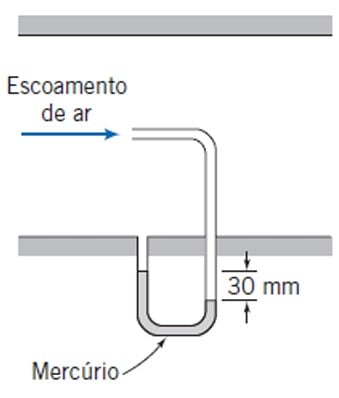

---
Classification	        :	Formula-Based Exercise
Discipline				:	EMA091 Mecânica dos fluidos
Source					:	FOX AND McDONALD’S Edição 8 - p339
Description				:	P2 - Exemplos 6.1 a 6.6
---

# Proposition

## 1

## 2
Um tubo pitot é inserido em um escoamento de ar (na condição-padrão) para medir a velocidade do escoamento. O tubo é inserido apontando para montante dentro do escoamento de modo que a pressão captada pela sonda é a pressão de estagnação. A pressão estática é medida no mesmo local do escoamento com uma tomada de pressão na parede. Se a diferença de pressão é de $30 \text{ mm}$ de mercúrio, determine a velocidade do escoamento.

A imagem anexa mostra um diagrama do escoamento de ar em um duto. Um manômetro de tubo em U contendo mercúrio está conectado a uma sonda de estagnação (apontando para o escoamento) e a uma tomada de pressão estática na parede. A diferença de altura entre os níveis de mercúrio nos dois braços do manômetro é indicada como $30 \text{ mm}$. As legendas na imagem são 'Escoamento de ar', 'Mercúrio', e '$30 \text{ mm}$'.

## 3

## 4

## 5

## 6

# Step-by-step

## Teoria inicial

$$
\text{Equação de Bernoulli p.341}
$$

$$
\boxed{
\frac{p}{\rho} + \frac{V^2}{2} + gz = \text{constante}
}
$$

Atenção, só é valida em um escoamento em escoamento:
- em regime permanente
- incompressível
- com atrito desprezível
- ao longo de uma linha de corrente

---

$$
\text{Equação hidrostática}
$$

$$
\frac{dp}{dz} = -\rho g
$$

---

## 2

### Tubo de pitot

$$
P_0 = \text{Pressão de estagnação}
$$

$$
P_s = \text{Pressão estática}
$$

$$
\Delta P = \text{Diferença de pressão}
$$

---

Observe que na imagem da questão o tubo de Pitot está aberto ao tubo principal. Por meio desse orifício, "entra" a **Pressão Estática $(P_s)$**. Essa é a mesma pressão que está presente em toda a parede do tubo principal. Ela tem esse nome porque ela estaria presente mesmo com o fluido estático.

Já pela entrada do tubo de Pitot apontada para o fluxo mede a **Pressão de Estagnação $(P_0)$**, ela representa a pressão total do escoamento. É a soma da **Pressão Estática $(P_s)$** mais a energia cinética do fluido, que é convertida em pressão quando o fluido para.

Como essas pressões vão uma contra a outra nesse exemplo, o manômetro está medindo a diferença entre elas, ou seja, a altura da coluna de fluido do manômetro representa:

$$
\Delta P = P_0 - P_s
$$

---

Vamos calcular $\Delta P$ pela equação hidrostática:

$$
\text{Equação hidrostática}
$$

$$
\frac{dp}{dz} = -\rho g
$$

$$
\Delta P = \rho g z =  13600 \cdot 9.81 \cdot 30 \times 10^{-3} = 4002.48 \text{ Pa}
$$

---

$$
\text{Equação de Bernoulli p.341}
$$

$$
\boxed{
\frac{p}{\rho} + \frac{V^2}{2} + gz = \text{constante}
}
$$

$$
\frac{P_0}{\rho_{ar}} + \frac{V_0^2}{2} + gz_0 = \frac{P_s}{\rho_{ar}} + \frac{V_s^2}{2} + gz_s
$$

---

Na equação de Bernoulli, dois estados estão sendo comparados:

* **Ponto 0 (Estagnação):** As propriedades são $P_0$ e $V_0$.
* **Ponto s (Escoamento):** As propriedades são $P_s$ e $V_s$.

Portanto, $V_s$ é simplesmente a **velocidade do escoamento** (como você mesmo definiu corretamente no seu passo a passo: $V_s = \text{Velocidade do escoamento} = v$).

* **$P_s$** é o nome de uma propriedade específica: a **Pressão Estática**.
* **$V_s$** não é um tipo específico de velocidade. No seu caso, o subscrito "$s$" está sendo usado para se referir à velocidade no *mesmo ponto ou estado* onde a pressão estática $P_s$ é medida.

Muitos livros, para evitar exatamente essa confusão, nem usam o subscrito "$_s$". Eles definem:

* **$P_0$** e **$V_0$** (Ponto de estagnação)
* **$P$** e **$V$** (Ponto de escoamento, onde $P$ é a pressão estática e $V$ é a velocidade do escoamento)

Nesse caso, a equação de Bernoulli ficaria:

$$
\frac{P_0}{\rho} + \frac{V_0^2}{2} = \frac{P}{\rho} + \frac{V^2}{2}
$$

Como $V_0 = 0$, isso simplifica para:

$$
\frac{P_0 - P}{\rho} = \frac{V^2}{2}
$$

---

$$
z_0 = z_s
$$

$$
\frac{P_0}{\rho_{ar}} + \frac{V_0^2}{2} = \frac{P_s}{\rho_{ar}} + \frac{V_s^2}{2}
$$

---

$$
V_0 = \text{Velocidade de estagnação} = 0
$$

$$
V_s = \text{Velocidade do escoamento} = v
$$

$$
\frac{P_0}{\rho_{ar}} = \frac{P_s}{\rho_{ar}} + \frac{v^2}{2}
$$

$$
\frac{P_0 - P_s}{\rho_{ar}} = \frac{v^2}{2}
$$

---

$$
P_0 - P_s = \Delta P
$$

$$
\frac{\Delta P}{\rho_{ar}} = \frac{v^2}{2}
$$

$$
v = \sqrt{\frac{2 \Delta P}{\rho_{ar}}}
$$

---

$$
v \approx 80.84 \text{ m/s}
$$

## 3

# Answer

# Attempts
