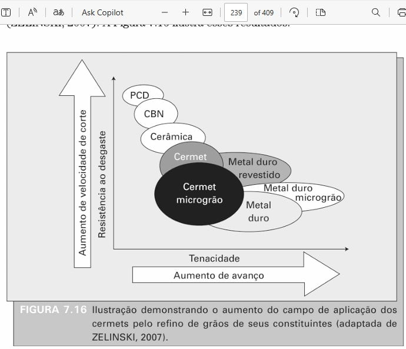
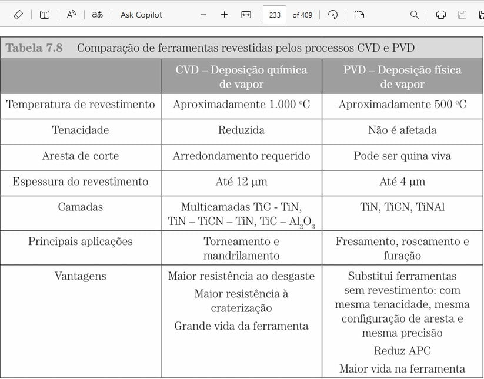
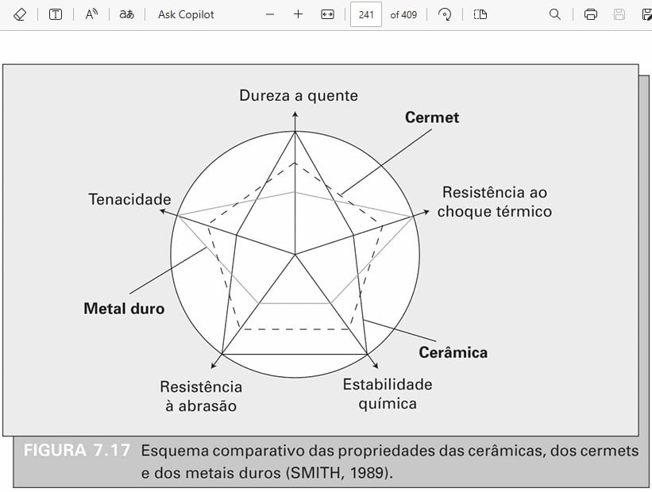
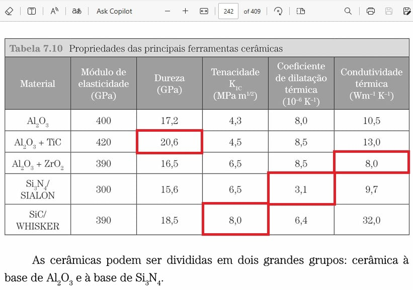
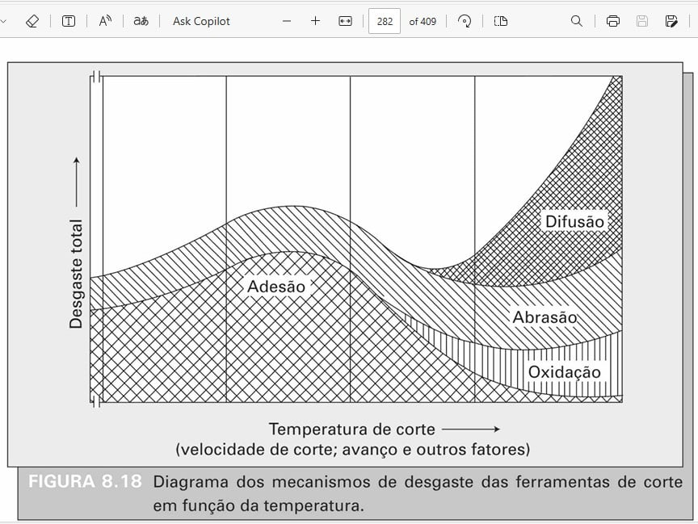

---
Classification	        :	Formula-Based Exercise
Discipline				:	EMA093 Processos de Fabricação por Usinagem
Source					:
Description				:	Preparação P2 (Capítulos 5 a 8)
---

# Proposition

## Comentários do professor em relação à avaliação

### Capítulo 5 - TEMPERATURAS NO PROCESSO DE USINAGEM
- Aula durou apenas cerca de 1 hora, provavelmente o professor não considera tão relevante.

### Capítulo 6 - FLUIDOS DE CORTE

### Capítulo 7 - MATERIAIS PARA FERRAMENTAS DE CORTE

Nesse capítulo são apresentadas diversas tabelas e gráficos. Na avaliação será pedido para classificar os materias de acordo com diferentes critérios (dureza; tenacidade; estabilidade química; etc).

Foi o capítulo que o professor aparentou dar mais importância.

**Exemplos de perguntas**
- Escreva 4 materiais em ordem decrescente de máxima temperatura de usinagem
- Dentre as diferenças entre aços rápidos e metais duros, o que significa mudar o número?
- Como o tamanho do grão influencia no material? (Exemplo de resposta: Mais duro, menos tenaz)

### Capítulo 8 - AVARIAS, DESGASTE E MECANISMOS DE DESGASTE DAS FERRAMENTAS

Professor passou relativamente rápido sobre esse assunto.

# Step-by-step

## Capítulo 5 - TEMPERATURAS NO PROCESSO DE USINAGEM

Os métodos práticos mais utilizados para a medição da temperatura na região de formação de cavacos são:
- Medição por termopares inseridos.
- Mediçãodaforçatermoelétrica entre a ferramenta e a peça (método do termopar ferramenta/peça).
- Medição por radiação de calor com sensores infravermelhos.
- Medição utilizando vernizes termossensíveis.
- Medição por propriedades metalográficas.
- Medição usando pósde sais químicos.
- Medição usando o métododo filme PVD.

## Capítulo 6 - FLUIDOS DE CORTE

### Tipos
- Gasosos
- Sólidos
- Líquidos:
  - óleos integrais
  - emulsões (água/óleo)
  - soluções

### Principais Aditivos para Fluidos de Corte

**Antiespumantes:** Evitam a formação de espumas. Geralmente ceras especiais ou óleos à base de silicone.
**Anticorrosivos:** Protegem peça, ferramenta e máquina contra corrosão. Exemplos incluem nitrito de sódio, óleos sulfurados ou sulfonados.
**Detergentes:** Reduzem a deposição de lodo e borras. Podem ser compostos organometálicos (Mg, Ba, Ca) ou alcoóis.
**Emulsificantes:** Responsáveis pela formação de emulsões estáveis de óleo em água (ou vice-versa). Reduzem a tensão superficial Exemplos: sabões de ácidos graxos, sulfonatos de petróleo, emulsificantes não iônicos.
**Surfactantes:** Ajudam a garantir a uniformidade das emulsões agindo na interface óleo/água. Exemplos: ésteres fosfatos, sulfonatos, alcoóis etoxilados.
**Biocidas:** Inibem o desenvolvimento de microrganismos (fungos e bactérias).
**Aditivos de Extrema Pressão (EP):** Conferem lubricidade adicional em operações severas. Reagem com a superfície usinada formando compostos de baixa resistência ao cisalhamento em altas temperaturas e pressões. Principais são compostos de enxofre, fósforo ou cloro. Gorduras e óleos animal/vegetal também são usados para melhorar a lubrificação.
**Agentes Umectantes:** Melhoram as propriedades refrigerantes das soluções.
**Agentes Antidesgaste:** Fósforo e matérias graxas são exemplos que atuam como antidesgaste
**Óleos Vegetais e Animais:** Embora usados como base no passado, hoje são empregados como aditivos em óleos minerais para melhorar propriedades lubrificantes

### Principais Características/Funções de um Fluido de Corte

**Lubrificação:** Principalmente a baixas velocidades de corte, para reduzir o atrito, a área de contato ferramenta/cavaco e evitar a formação da Aresta Postiça de Corte (APC) Depende da capacidade de penetrar na interface e formar um filme de baixa resistência ao cisalhamento
**Refrigeração:** Principalmente a altas velocidades de corte, para transferir calor da região de corte, reduzindo a temperatura da ferramenta e da peça
**Remoção de Cavacos:** Transportar os cavacos para fora da zona de corte, crucial em operações como furação profunda e serramento Depende da viscosidade e vazão
**Proteção Contra Oxidação/Corrosão:** Proteger a máquina-ferramenta e a peça.
**Aumento da Vida da Ferramenta:** Resultado da lubrificação e refrigeração adequadas.
**Redução das Forças e Potência de Usinagem:** Consequência da redução do atrito pela lubrificação.
**Melhoria do Acabamento Superficial da Peça:** Pela redução do atrito, prevenção da APC e controle térmico.
**Prevenção de Alterações Microestruturais:** Evitar danos à peça causados por altas temperaturas.
**Redução do Risco de Distorção da Peça:** Pelo controle térmico.
**Ser Antiespumante, Antioxidante, Antissolda (EP):** Propriedades conferidas por aditivos.
**Ter Boa Umectação e Capacidade de Absorção de Calor:** Características importantes para a refrigeração.
**Ser Transparente, Inodoro, Não Irritante à Pele e Compatível com o Meio Ambiente:** Características desejáveis relacionadas à operação e segurança.
**Ter Baixa Variação de Viscosidade:** Manter a performance em diferentes temperaturas.

## Capítulo 7 - MATERIAIS PARA FERRAMENTAS DE CORTE

**Características principais**
- Dureza
- Tenacidade
- Estabilidade térmica
- Estabilidade química
- Resistência à desgaste
- Resistência à choque térmico

---

**Dureza**
Diamante > Nitreto Cúbico de Boro > Cerâmicas > Cermets > Metal Duro > Ligas Fundidas > Aços Rápidos

**Limitações do diamante**
- Estabilidade térmica: limitada pois se torna grafite à cerca de 780°C
- Estabilidade química: reage com materiais ferrosos

**Limitações cerâmicas**
- Não resistem à choques térmicos

Com certeza! Abaixo está o texto reescrito e completo, com as descrições adicionadas com base nas funções e propriedades de cada material, conforme o livro de referência.

---

### Materiais Relevantes para Ferramentas de Corte

**Exclusivos no substrato de metais duros**

*   **WC (Carboneto de Tungstênio):** Componente principal que confere altíssima dureza e resistência ao desgaste abrasivo; são as partículas duras que formam a estrutura do metal duro.
*   **Co (Cobalto):** Metal ligante que une os grãos de WC, conferindo tenacidade (resistência a fraturas e impactos) ao metal duro. A proporção de cobalto define o balanço entre dureza e tenacidade.
*   **TaC (Carboneto de Tântalo) e NbC (Carboneto de Nióbio):** Adicionados à base WC-Co para aumentar a resistência à difusão e ao desgaste por cratera (desgaste químico) em altas temperaturas, sendo essenciais para a usinagem de aços (Classes P e M).

---

**Podem ser usados nos elementos de liga e revestimentos**

*   **TiC (Carboneto de Titânio):** Utilizado tanto como adição no substrato (aumentando a dureza a quente) quanto como camada de revestimento (CVD), onde oferece excelente resistência ao desgaste abrasivo e boa aderência.
*   **TaC (Carboneto de Tântalo)**: semelhante
*   **NbC (Carboneto de Nióbio)**: semelhante

---

**Exclusivos como revestimentos**

*   **TiN (Nitreto de Titânio):** Camada externa comum, de cor dourada. Sua principal função é reduzir o coeficiente de atrito e a afinidade química com o material usinado, diminuindo a adesão e a formação da aresta postiça de corte (APC).
*   **TiCN (Carbonitreto de Titânio):** Camada de alta dureza e resistência ao desgaste, superior ao TiN. Frequentemente usada como camada base ou intermediária devido à sua excelente aderência.
*   **Al₂O₃ (Óxido de Alumínio / Alumina):** Altamente estável quimicamente e resistente a altas temperaturas (dureza a quente). Funciona como uma excelente barreira térmica, protegendo o substrato do calor gerado no corte.
*   **TiAlN / AlTiN (Nitreto de Titânio Alumínio):** Forma uma camada de óxido de alumínio protetora em altas temperaturas, oferecendo excelente resistência à oxidação e dureza a quente. Ideal para usinagem de aços endurecidos, ferros fundidos (FoFo) e superligas.

---

**Casos especiais dos materiais ultra-duros**

Esses materiais representam o mais alto nível de dureza e resistência ao desgaste.

*   O **diamante** é o material mais duro conhecido, mas reage quimicamente com o ferro em altas temperaturas. Pode ser usado de três formas: como ferramenta inteiramente de diamante (**MCD**); como um compósito sinterizado sobre metal duro (**PCD**); ou como um **revestimento** sobre metal duro por meio de CVD.
*   O **nitreto cúbico de boro (cBN)** é o segundo material mais duro e, ao contrário do diamante, é quimicamente estável ao usinar materiais ferrosos. É usado principalmente na forma de compósito (**PcBN**).

---

*   **Revestimento de Diamante por CVD:** Camada de diamante policristalino depositada sobre ferramentas de metal duro. Oferece as vantagens de dureza do diamante com maior estabilidade térmica (por não ter ligante metálico) e a tenacidade do substrato.

*   **MCD (Diamante Monocristalino):** Ferramenta de um único cristal de diamante (natural ou sintético). Usado para obter acabamentos superficiais extremos (espelhados) em materiais não ferrosos, com baixa tenacidade e alto custo.

*   **PCD (Diamante Policristalino):** Compósito formado por partículas de diamante sintético sinterizadas sobre uma base de metal duro. É muito mais tenaz que o MCD e possui dureza e resistência ao desgaste máximas. Ideal para usinagem de materiais não ferrosos (alumínio, cobre), compósitos, plásticos e madeira.

*   **PcBN (Nitreto Cúbico de Boro Policristalino):** Compósito de partículas de cBN sinterizadas sobre metal duro. Possui dureza muito alta, excelente estabilidade térmica e é quimicamente inerte com materiais ferrosos. É a principal escolha para a usinagem de aços endurecidos (> 45 HRc), ferros fundidos (FoFo) e superligas.

### Classificação dos metais duros (p.226)
- P Aços
- M Aços inoxidáveis
- K Ferro Fundido
- N Metais não ferrosos
- S Superligas e titânio
- H Materiais duros

**Macetes para decorar as classificações acima**

“Profissionais Manipulam Kilos Na Solda Habilmente”

- P Popular (É o metal mais comum, aço normal)
- M O segundo é o popular, mas mexido
- K Kast iron
- N Non-ferrous
- S Superalloys
- H Hardest materials

**Elementos Adicionados e Composição Base**

**Resumo**: As classes P e M são ligas de metal duro complementadas pela adição de carbetos como TiC, TaC e/ou NbC para usinagem de materiais de cavaco longo. Em contraste, as classes K, N, S e H são geralmente "não ligadas", com composição primária de WC e Co. A diferenciação entre estas últimas se dá pela especialização da microestrutura, principalmente através do ajuste da proporção WC-Co (balanço dureza-tenacidade) e da granulometria (tamanho dos grãos) para atender a aplicações específicas.

*   **P (Aços):**
    *   **Composição:** `WC + Co` **+ adições de TiC, TaC e/ou NbC.**
    *   **Diferença:** É uma classe "ligada". A adição de carbetos cúbicos (TiC, TaC, NbC) aumenta a resistência à difusão e ao desgaste por cratera, que são os principais desafios ao usinar aços de cavaco longo em altas temperaturas.

*   **M (Aços Inoxidáveis/Multiuso):**
    *   **Composição:** `WC + Co` **+ adições de TiC, TaC e/ou NbC em menor quantidade que a classe P.**
    *   **Diferença:** É uma classe intermediária. Possui um balanço entre a resistência ao desgaste da classe P e a tenacidade da classe K, sendo ideal para materiais mais difíceis como aços inoxidáveis, que são gomosos e geram muito calor.

*   **K (Ferros Fundidos):**
    *   **Composição:** `WC + Co` **(sem outras adições de carbetos).**
    *   **Diferença:** É a classe "pura" ou "não ligada". Sua composição simples de carbeto de tungstênio e cobalto oferece alta resistência ao desgaste abrasivo e boa tenacidade, ideal para materiais que produzem cavacos curtos, como ferros fundidos.

*   **N (Materiais Não Ferrosos):**
    *   **Composição:** `WC + Co` **(geralmente com grãos finos ou ultrafinos).**
    *   **Diferença:** Similar à classe K em composição base, mas otimizada para materiais moles como alumínio e cobre. A granulometria fina permite a criação de arestas de corte muito afiadas, evitando a formação de rebarbas e garantindo um bom acabamento superficial.

*   **S (Superligas e Titânio):**
    *   **Composição:** `WC + Co` **(geralmente com grãos muito finos e otimização para alta tenacidade e dureza a quente).**
    *   **Diferença:** A composição é projetada para resistir a temperaturas extremamente altas e ao intenso encruamento gerado na usinagem de superligas (Inconel, etc.) e titânio. A prioridade é a tenacidade da aresta de corte para evitar o desgaste de entalhe (*notch wear*).

*   **H (Aços Endurecidos):**
    *   **Composição:** `WC + Co` **(geralmente com baixo teor de cobalto e grãos finos).**
    *   **Diferença:** Classe projetada para máxima dureza e resistência ao desgaste em materiais já tratados termicamente (acima de 45 HRc). O baixo teor de cobalto maximiza a dureza, sacrificando parte da tenacidade, sendo adequada para cortes contínuos e estáveis.

**Números que acompanham a letra de designação**
A letra de designação dos metais duros é sempre acompanhada de um número proporcioal à tenacidade, ou seja, quanto maior o número, maior a tenacidade.

$$
\uparrow \text{tenacidade} \uparrow \text{avanço} \downarrow \text{Dureza} \downarrow V_c \downarrow \text{Resistêcia ao desgaste}
$$

$$
\downarrow \text{tenacidade} \downarrow \text{avanço} \uparrow \text{Dureza} \uparrow V_c \uparrow \text{Resistêcia ao desgaste}
$$

### Campos de aplicação dos diferentes materiais (Aprender a desenhar)

### CVD e PVD

Associação mental: **Química é MAIS**
- Mais quente: $(1000°C)$ em vez de só metade $(500°C)$
- Mais **redução** da tenacidade
- Mais complexo (multi-camadas)
- Mais exigente quanto à geometria (arredondamento requerido)
- Mais espesso (até $12\mu m$) em vez de só um terço ($4\mu m$)
- Mais resistência ao desgaste
- Mais resistência à craterização

### Metal duro vs Cermet vs Cerâmica (Aprender a desenhar)

### Principais cerâmicas (Aprender a classificar)

## Capítulo 8 - AVARIAS, DESGASTE E MECANISMOS DE DESGASTE DAS FERRAMENTAS

### Classificações
**Simplificada**
- Avarias
  - De origem térmica
  - De origem mecânica
- Mecanismos de desgaste
  - Aderência
  - Abrasão
  - Oxidação
  - Difusão
- Deformação plástica
  - Superficial por cisalhamento
  - Da aresta de corte sob compressão

---

**Descritiva**
- Avarias (repentino)
  - **De origem térmica:** Trincas/Fissuras térmicas, Combcracks (**Perpendiculares** à aresta de corte)
  - **De origem mecânica:** Choques na entrada/saída, Fadiga Mecânica -> Trincas paralelas à aresta, Lascamento, Quebra. Mudança brusca no ângulo do plano de cisalhamento ao final do corte em um aplainamento por exemplo, devido à mudança rápida na ponta da ferramenta de compressão para tração.
- Mecanismos de desgaste (progressivo)
  - **Aderência e Arrastamento (Attrition):** arrancamento de microfragmentos/grãos em fluxo irregular, comum em baixas velocidades ou com APC)
  - **Abrasão:** por partículas duras da peça ou ferramenta soltas/presas - microcorte, microssulcamento
  - **Oxidação:** reação química com o ambiente, importante em altas temperaturas, contribui para desgaste de entalhe
  - **Difusão:** troca atômica entre ferramenta e peça/cavaco em altas temperaturas, favorecida pela zona de fluxo
- Deformação plástica
  - Superficial por cisalhamento a altas temperaturas
  - Da aresta de corte sob altas tensões de compressão

---

Formas nas quais o desgaste é observável
    - Degaste de cratera na superfície de saída
    - Desgaste de flanco na superfície de folga
    - Desgaste de entalhe nas extremidades da linha de profundidade de corte

### Mecanismos de desgaste em função da temperatura (Aprender a desenhar)

- Saber relacionar a curva do desgaste por adesão com a APC

### Cenário de pastilha cerâmica em usinagem interrompida
Exemplifique um cenário no qual a escolha de uma pastilha cerâmica não é o ideal para um eixo endurecido.

Caso o eixo possua um entalhe para chaveta, a interrupção abrupta da usinagem fará com que ocorra uma avaria de origem mecânica na pastilha.

### Conta da equação de Taylor

O cálculo do expoente $x$ é feito resolvendo o sistema de duas equações.

Para encontrar o valor de $x$ a partir das duas equações (que representam dois pontos na curva de vida da ferramenta), o método mais direto é dividir uma equação pela outra. Isso elimina a constante $K$, permitindo-nos isolar $x$.

**Equações dadas:**

1.  $27 = K \cdot 180^{-x}$
2.  $70 = K \cdot 120^{-x}$

**Passo 1: Dividir a Equação 2 pela Equação 1**
$$
\frac{70}{27} = \frac{K \cdot 120^{-x}}{K \cdot 180^{-x}}
$$

**Passo 2: Cancelar a constante $K$**
$$
\frac{70}{27} = \frac{120^{-x}}{180^{-x}}
$$

**Passo 3: Aplicar a propriedade dos expoentes**
Usamos a regra $\frac{a^{-x}}{b^{-x}} = (\frac{a}{b})^{-x} = (\frac{b}{a})^{x}$.
$$
\frac{70}{27} = \left(\frac{180}{120}\right)^x
$$

**Passo 4: Simplificar a base**
$$
\frac{70}{27} = (1.5)^x
$$
$$
2.5926 \approx (1.5)^x
$$

**Passo 5: Isolar $x$ usando logaritmos**
Aplicamos o logaritmo natural (ln) em ambos os lados da equação para "baixar" o expoente.
$$
\ln(2.5926) = \ln(1.5^x)
$$

Usando a propriedade $\ln(a^b) = b \cdot \ln(a)$:
$$
\ln(2.5926) = x \cdot \ln(1.5)
$$

**Passo 6: Resolver para $x$**
$$
x = \frac{\ln(2.5926)}{\ln(1.5)}
$$
$$
x = \frac{0.9526...}{0.4055...}
$$
$$
x \approx 2.349
$$

O valor do expoente de Taylor $x$ para esta ferramenta e condição de corte é aproximadamente **2.35**.

-----

## Contextualização do Resultado

O valor $x \approx 2.35$ é o **expoente de Taylor**. Frequentemente, a equação é escrita como $V_c \cdot T^n = C$, onde $n = 1/x$.

Neste caso, $n = 1 / 2.349 \approx 0.425$.

Este expoente ($n$) indica a sensibilidade da vida da ferramenta (T) a mudanças na velocidade de corte ($V_c$). Um valor de $n$ mais alto (ou $x$ mais baixo) significa que a vida da ferramenta é *menos* afetada por aumentos na velocidade de corte. [cite\_start]Os valores que você encontrou ($T=27$ min a $V_c=180$ m/min e $T=70$ min a $V_c=120$ m/min) [cite: 1106] são consistentes com os dados experimentais apresentados na Figura 8.33 do material.

# Answer

# Attempts
