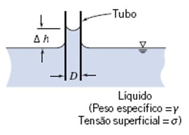
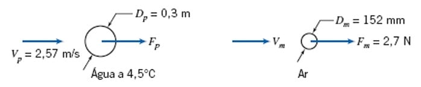

---
Classification	        :	Formula-Based Exercise
Discipline				:	EMA091 Mecânica dos fluidos
Source					:	FOX AND McDONALD’S Edição 8 - p410
Description				:	P3 - Exemplos 7.1 a 7.5
---

# Proposition

## 7.1 FORÇA DE ARRASTO SOBRE UMA ESFERA LISA

A força de arrasto, $F$, sobre uma esfera lisa depende da velocidade relativa, $V$, do diâmetro da esfera, $D$, da massa específica do fluido, $\rho$, e da viscosidade do fluido, $\mu$. Obtenha um conjunto de grupos adimensionais que podem ser usados para correlacionar dados experimentais.

## 7.2 QUEDA DE PRESSÃO NO ESCOAMENTO EM UM TUBO

A queda de pressão $\Delta p$, para escoamento em regime permanente, incompressível e viscoso, através de um tubo retilíneo horizontal, depende do comprimento do tubo, $l$, da velocidade média, $\vec{V}$, da viscosidade do fluido, $\mu$, do diâmetro do tubo, $D$, da massa específica do fluido, $\rho$, e da altura média da “rugosidade”, $e$. Determine um conjunto de grupos adimensionais que possa ser usado para correlacionar dados.

## 7.3 EFEITO CAPILAR: USO DA MATRIZ DIMENSIONAL

Quando um pequeno tubo é imerso em uma poça de líquido, a tensão superficial causa a formação de um menisco na superfície livre, para cima ou para baixo dependendo do ângulo de contato na interface líquido-sólido-gás. Experiências indicam que o módulo do efeito capilar, $\Delta h$, é uma função do diâmetro do tubo, $D$, do peso específico do líquido, $\gamma$, e da tensão superficial, $\sigma$. Determine o número de parâmetros $\Pi$ independentes que podem ser formados e obtenha um conjunto.

## 7.4 SEMELHANÇA: ARRASTO DE UM TRANSDUTOR DE SONAR

O arrasto de um transdutor de sonar deve ser previsto com base em testes em túnel de vento. O protótipo, uma esfera de $0,3 \text{ m}$ de diâmetro, deve ser rebocado a $2,57 \text{ m/s}$ na água do mar a $4,5^\circ\text{C}$. O modelo tem $152 \text{ mm}$ de diâmetro. Determine a velocidade de teste requerida no ar. Se a força de arrasto sobre o modelo nas condições de teste for $2,7 \text{ N}$, estime a força de arrasto sobre o protótipo.

As propriedades da água do mar a $4,5^\circ\text{C}$ são:
*   Massa específica: $\rho_{p} \approx 1025 \text{ kg/m}^3$
*   Viscosidade dinâmica: $\mu_{p} \approx 1,7 \times 10^{-3} \text{ N}\cdot\text{s/m}^2$

As propriedades do ar em condições padrão são:
*   Massa específica: $\rho_{m} \approx 1,204 \text{ kg/m}^3$
*   Viscosidade dinâmica: $\mu_{m} \approx 1,81 \times 10^{-5} \text{ N}\cdot\text{s/m}^2$

## 7.5 SEMELHANÇA INCOMPLETA: ARRASTO AERODINÂMICO SOBRE UM ÔNIBUS

Os seguintes dados de teste em um túnel de vento, de um modelo em escala 1:16 de um ônibus, estão disponíveis:

| Velocidade do ar (m/s) | 18,0 | 21,8 | 26,0 | 30,1 | 35,0 | 38,5 | 40,9 | 44,1 | 46,7 |
| :--------------------- | :--- | :--- | :--- | :--- | :--- | :--- | :--- | :--- | :--- |
| Força de Arrasto (N)   | 3,10 | 4,41 | 6,09 | 7,97 | 10,7 | 12,9 | 14,7 | 16,9 | 18,9 |

Usando as propriedades do ar-padrão, calcule e trace um gráfico do coeficiente adimensional de arrasto aerodinâmico,

$$
C_D = \frac{F_D}{\frac{1}{2} \rho V^2 A}
$$

*versus* o número de Reynolds, $Re = \rho Vw/\mu$, em que $w$ é a largura do modelo. Determine a velocidade mínima de teste acima da qual $C_D$ permanece constante. Estime a força de arrasto aerodinâmico e o requisito de potência para o veículo protótipo a 100 km/h. (A largura e a área frontal do protótipo são respectivamente 2,44 m e 7,8 m².)

# Step-by-step

## Número de Reynolds
O Número de Reynolds (Re) é um grupo adimensional fundamental na mecânica dos fluidos, utilizado para prever o padrão de escoamento de um fluido. Ele representa a razão entre as forças de inércia e as forças viscosas atuantes em um fluido em movimento. A obtenção do Número de Reynolds é um exemplo clássico da aplicação da análise dimensional, especificamente o Teorema Pi de Buckingham.

$$
{Re} = \frac{\rho \cdot v \cdot L}{\mu}
$$

Onde:
*   **${Re}$**: Número de Reynolds (adimensional)
*   **$\rho$** (rho): Densidade do fluido
*   **$v$**: Velocidade do fluido
*   **$L$**: Comprimento característico
*   **$\mu$** (mu): Viscosidade dinâmica do fluido

---

**$L$ - Comprimento Característico**

*   **Descrição:** É uma dimensão geométrica representativa do problema. A escolha do comprimento característico depende da situação do escoamento. Para um fluido escoando dentro de um tubo circular, o comprimento característico é geralmente o diâmetro interno do tubo (D). Para o escoamento ao redor de uma esfera, seria o diâmetro da esfera. Para uma asa de avião, poderia ser a corda da asa.
*   **Unidade no SI:** metros (m).
*   **Dimensões (MLT):** L

---

**$\mu$ - Viscosidade Dinâmica**

*   **Descrição:** A viscosidade é a medida da resistência de um fluido ao escoamento. Ela pode ser entendida como o atrito interno do fluido. A viscosidade dinâmica, também chamada de viscosidade absoluta, quantifica a força necessária para fazer uma camada de fluido deslizar sobre outra. Fluidos como o mel têm alta viscosidade, enquanto a água tem baixa viscosidade.
*   **Unidade no SI:** Pascal-segundo (Pa·s) ou kg/(m·s).
*   **Dimensões (MLT):** M L⁻¹ T⁻¹
*

---

**$\rho$ - Densidade do Fluido**

*   **Descrição:** A densidade é a propriedade que mede a quantidade de massa de uma substância contida em um determinado volume. É uma medida de quão "compacta" é a matéria. Para fluidos, a densidade pode variar com a temperatura e a pressão.
*   **Unidade no SI (Sistema Internacional):** quilograma por metro cúbico (kg/m³).
*   **Dimensões (MLT - Massa, Comprimento, Tempo):** M L⁻³

---

**$v$ - Velocidade do Fluido**

*   **Descrição:** Representa a velocidade média do escoamento do fluido em relação a um ponto de referência. Em escoamentos internos, como em um tubo, refere-se à velocidade média na seção transversal.
*   **Unidade no SI:** metros por segundo (m/s).
*   **Dimensões (MLT):** L T⁻¹

---

**Significado Físico e Aplicações**

O valor do Número de Reynolds permite classificar o regime de escoamento:

*   **Fluxo Laminar (Re baixo):** Ocorre em baixas velocidades, onde as forças viscosas são dominantes. O fluido se move em camadas suaves e paralelas, com pouca ou nenhuma mistura entre elas. Para escoamento em tubos, é geralmente considerado laminar para Re < 2300.
*   **Fluxo de Transição:** Uma região intermediária onde o escoamento pode apresentar características tanto laminares quanto turbulentas.
*   **Fluxo Turbulento (Re alto):** Ocorre em altas velocidades, onde as forças de inércia prevalecem. O escoamento é caótico, irregular e com intensa mistura, formando redemoinhos. Para escoamento em tubos, é geralmente considerado turbulento para Re > 4000.

Compreender o Número de Reynolds é crucial em diversas áreas da engenharia e da ciência, como no projeto de tubulações, asas de aeronaves, sistemas de refrigeração e até no estudo do fluxo sanguíneo.

## Dimensões dos parâmetros envolvidos

**Força**
$$
\left[F\right] = \left[\frac{kg \cdot m}{s^2}\right]
$$

**Velocidade**
$$
\left[V\right] = \left[\frac{m}{s}\right]
$$

**Massa específica**
$$
\left[\rho\right] = \left[\frac{kg}{m^3}\right]
$$

**Viscosidade dinâmica**
$$
\left[\mu\right] = \left[Pa \cdot s\right]= \left[\frac{kg}{m \cdot s}\right] = \left[\frac{N \cdot s}{m^2}\right]
$$

**Variação de pressão**
$$
\left[\Delta p\right] = \left[\frac{N}{m^2}\right] = \left[\frac{kg}{m \cdot s^2}\right]
$$

**Rugosidade**
$$
\left[e\right] = \left[m\right]
$$

**Peso específico**
$$
\left[\gamma\right] = \left[\frac{N}{m^3}\right]
$$

**Tensão superficial**
$$
\left[\sigma\right] = \left[\frac{N}{m}\right]
$$

**Tensão normal ou de cisalhamento**
$$
\left[\sigma\right] = \left[\tau\right] = \left[\frac{N}{m^2}\right]
$$

## Determinação dos grupos $\Pi$ (Teorema Pi de Buckingham)

**Resumo dos passos**
1. Liste os **n** parâmetros envolvidos
2. Escolha um sistema de **r** unidades (ex. kg m s)
3. Expresse os parâmetros envolvidos em função do sistema de unidades
4. Dentre os parâmetros envolvidos, escolha **r** parâmetros repetentes
5. Resolva **(n-r)** equações dimensionais para obter os grupos adimensionais
6. Verifique se os grupos são adimensionais

---

**Passo 1**. *Liste todos os parâmetros dimensionais envolvidos*. (Seja $n$ o número de parâmetros.) Se nem todos os parâmetros pertinentes forem incluídos, uma relação poderá ser obtida, mas ela não fornecerá a história completa do fenômeno físico. Se houver inclusão de parâmetros que na verdade não têm efeito sobre o fenômeno físico, ou o processo de análise dimensional mostrará que eles não entrarão na relação imaginada, ou então um ou mais grupos adimensionais estranhos aos fenômenos serão obtidos, conforme mostrarão os experimentos.
**Passo 2**. *Selecione um conjunto de dimensões fundamentais (primárias)*, por exemplo, $kg m s$, $MLt$ ou $FLt$. (Note que, para problemas de transferência de calor, você pode precisar também de $T$ para a temperatura, e em sistemas elétricos, de $q$ para a carga elétrica.)
**Passo 3**. *Liste as dimensões de todos os parâmetros em termos das dimensões primárias*. (Seja $r$ o número de dimensões primárias.) Tanto a força quanto a massa podem ser selecionadas como uma dimensão primária.
**Passo 4**. *Selecione da lista um conjunto de $r$ parâmetros dimensionais que inclua todas as dimensões primárias.* Estes parâmetros juntos, chamados de parâmetros repetentes, serão combinados com cada um dos parâmetros remanescentes, um de cada vez. Nenhum dos parâmetros repetentes pode ter dimensões que seja uma potência das dimensões de outro parâmetro repetente; por exemplo, que não inclua uma área ($L^2$) e um momento de inércia de área ($L^4$), como parâmetros repetentes. Os parâmetros repetentes escolhidos podem aparecer em todos os grupos adimensionais obtidos; por isso, **não inclua o parâmetro dependente** entre aqueles selecionados neste passo. **O produto dos parâmetros repetentes tem que incluir todas as dimensões** principais.
**Passo 5**. *Forme equações dimensionais, combinando os parâmetros selecionados no Passo 4 com cada um dos outros parâmetros remanescentes, um de cada vez*, a fim de formar grupos dimensionais. (Haverá $n - r$ equações). Resolva as equações dimensionais para obter os $n - r$ grupos adimensionais.
**Passo 6**. *Certifique-se de que cada grupo obtido é adimensional*. Se a massa for selecionada inicialmente como uma dimensão primária, é aconselhável verificar os grupos obtidos utilizando a força como uma dimensão primária, ou viceversa.

**Observação:** Dependendo do autor, é utilizado a letra **m** em vez de **r**

## 7.1

**Passo 1**
Lista dos $n$ parâmetros dimensionais envolvidos

$$
F, V, D, \rho, \mu
\quad
[n = 5]
$$

**Passo 2**
Conjunto de dimensões primárias

$$
[kg] [m] [s]
$$

**Passo 3**
Parâmetros dimensionais em termo das dimensões primárias

$$
\left[ F \right] = \left[ \frac{kg \cdot m}{s^2} \right]
$$

$$
\left[ V \right] = \left[ \frac{m}{s} \right]
$$

$$
\left[ D \right] = \left[ m \right]
$$

$$
\left[ \rho \right] = \left[ \frac{kg}{m^3} \right]
$$

$$
\left[ \mu \right] = \left[ \frac{kg}{m \cdot s} \right]
$$

$$
r = 3 \quad (kg, m, s)
$$

**Passo 4**. *Selecione da lista um conjunto de $r$ parâmetros dimensionais que inclua todas as dimensões primárias.*

O número de grupos adimensionais ($\Pi$) a serem determinados é $n - r = 5 - 3 = 2$.

Selecionamos $r=3$ parâmetros repetentes. Uma escolha comum envolve um parâmetro geométrico, um cinemático e uma propriedade do fluido.
*   Diâmetro, **D** (representa a geometria, dimensão $[m]$)
*   Velocidade, **V** (representa a cinemática, dimensão $[m/s]$)
*   Massa específica, **$\rho$** (representa a propriedade do fluido, dimensão $[kg/m^3]$)

Estes três parâmetros contêm todas as dimensões primárias (kg, m, s) e são dimensionalmente independentes.

**Passo 5**. *Forme equações dimensionais, combinando os parâmetros selecionados no Passo 4 com cada um dos outros parâmetros remanescentes.*

Os parâmetros remanescentes são a força de arrasto ($F$) e a viscosidade ($\mu$).

$$
\Pi_1 = D^a V^b \rho^c F
$$

$$
\Pi_2 = D^d V^e \rho^f \mu
$$

### Grupo $\Pi_1$

Para que $\Pi_1$ seja adimensional, suas dimensões devem ser $[kg]^0 [m]^0 [s]^0$.

$$
\Pi_1 = D^a V^b \rho^c F
$$

$$
[m]^a \left[\frac{m}{s}\right]^b \left[\frac{kg}{m^3}\right]^c \left[\frac{kg \cdot m}{s^2}\right] = [kg]^0 [m]^0 [s]^0
$$

$$
[kg]^{c+1} \cdot [m]^{a+b-3c+1} \cdot [s]^{-b-2} = [kg]^0 [m]^0 [s]^0
$$

---

$$
c + 1 = 0 \implies c = -1
$$

$$
-b - 2 = 0 \implies b = -2
$$

$$
a + b - 3c + 1 \implies a = -2
$$

---

$$
\Pi_1 = D^{-2} V^{-2} \rho^{-1} F = \frac{F}{\rho V^2 D^2}
$$

### Grupo $\Pi_2$

Para que $\Pi_2$ seja adimensional, suas dimensões devem ser $[kg]^0 [m]^0 [s]^0$.

$$
\Pi_2 = D^d V^e \rho^f \mu
$$

$$
[m]^d \left[\frac{m}{s}\right]^e \left[\frac{kg}{m^3}\right]^f \left[\frac{kg}{m \cdot s}\right] = [kg]^0 [m]^0 [s]^0
$$

$$
[kg]^{f+1} \cdot [m]^{d+e-3f-1} \cdot [s]^{-e-1} = [kg]^0 [m]^0 [s]^0
$$

---

$$
f + 1 = 0 \implies f = -1
$$

$$
-e - 1 = 0 \implies e = -1
$$

$$
d + e - 3f - 1 \implies d = -1
$$

---

$$
\Pi_2 = D^{-1} V^{-1} \rho^{-1} \mu = \frac{\mu}{\rho V D}
$$

---

**Passo 6**. *Certifique-se de que cada grupo obtido é adimensional*.

O grupo $\Pi_1$ é frequentemente expresso como o coeficiente de arrasto, $C_D$, que é definido como $C_D = \frac{F}{\frac{1}{2}\rho V^2 A}$, onde A é a área projetada ($\frac{\pi D^2}{4}$). O grupo $\Pi_1$ obtido, $\frac{F}{\rho V^2 D^2}$, é diretamente relacionado a $C_D$.

O grupo $\Pi_2$ é o inverso do Número de Reynolds ($Re = \frac{\rho V D}{\mu}$). Como a função de um grupo adimensional é também um grupo adimensional válido, podemos usar o inverso de $\Pi_2$ para obter a forma convencional do Número de Reynolds.

$$
\Pi_2' = \frac{1}{\Pi_2} = \frac{\rho V D}{\mu} = Re
$$

Portanto, um conjunto de grupos adimensionais para correlacionar os dados experimentais é:

$$
\frac{F}{\rho V^2 D^2} = f\left(\frac{\rho V D}{\mu}\right)
$$

## 7.2

**Passo 1**
Lista dos $n$ parâmetros dimensionais envolvidos

$$
\Delta p, l, V, \mu, D, \rho, e
\quad
[n = 7]
$$

**Passo 2**
Conjunto de dimensões primárias

$$
[kg] [m] [s]
$$

**Passo 3**
Parâmetros dimensionais em termo das dimensões primárias

$$
\left[ \Delta p \right] = \left[ \frac{F}{A} \right] = \left[ \frac{kg \cdot m}{s^2 \cdot m^2} \right] = \left[ \frac{kg}{m \cdot s^2} \right]
$$

$$
\left[ l \right] = \left[ m \right]
$$

$$
\left[ V \right] = \left[ \frac{m}{s} \right]
$$

$$
\left[ \mu \right] = \left[ \frac{kg}{m \cdot s} \right]
$$

$$
\left[ D \right] = \left[ m \right]
$$

$$
\left[ \rho \right] = \left[ \frac{kg}{m^3} \right]
$$

$$
\left[ e \right] = \left[ m \right]
$$

$$
r = 3 \quad (kg, m, s)
$$

**Passo 4**. *Selecione da lista um conjunto de $r$ parâmetros dimensionais que inclua todas as dimensões primárias.*

O número de grupos adimensionais ($\Pi$) a serem determinados é $n - r = 7 - 3 = 4$.

Selecionamos $r=3$ parâmetros repetentes. A escolha deve incluir um parâmetro geométrico, um cinemático e uma propriedade do fluido para garantir que todas as dimensões primárias sejam representadas.
*   Diâmetro, **D** (representa a geometria, dimensão $[m]$)
*   Velocidade, **V** (representa a cinemática, dimensão $[m/s]$)
*   Massa específica, **$\rho$** (representa a propriedade do fluido, dimensão $[kg/m^3]$)

Estes três parâmetros contêm todas as dimensões primárias (kg, m, s) e são dimensionalmente independentes. O parâmetro dependente, $\Delta p$, não é escolhido como um parâmetro repetente.

**Passo 5**. *Forme equações dimensionais, combinando os parâmetros selecionados no Passo 4 com cada um dos outros parâmetros remanescentes.*

Os parâmetros remanescentes são a queda de pressão ($\Delta p$), a viscosidade ($\mu$), o comprimento ($l$) e a rugosidade ($e$).

$$
\Pi_1 = D^a V^b \rho^c \Delta p
$$

$$
\Pi_2 = D^d V^e \rho^f \mu
$$

$$
\Pi_3 = D^g V^h \rho^i l
$$

$$
\Pi_4 = D^j V^k \rho^m e
$$

### Grupo $\Pi_1$

Para que $\Pi_1$ seja adimensional, suas dimensões devem ser $[kg]^0 [m]^0 [s]^0$.

$$
\Pi_1 = D^a V^b \rho^c \Delta p
$$

$$
[m]^a \left[\frac{m}{s}\right]^b \left[\frac{kg}{m^3}\right]^c \left[\frac{kg}{m \cdot s^2}\right] = [kg]^0 [m]^0 [s]^0
$$

$$
[kg]^{c+1} \cdot [m]^{a+b-3c-1} \cdot [s]^{-b-2} = [kg]^0 [m]^0 [s]^0
$$

---

Resolvendo o sistema de equações para os expoentes:
*   Para $[kg]$: $c + 1 = 0 \implies c = -1$
*   Para $[s]$: $-b - 2 = 0 \implies b = -2$
*   Para $[m]$: $a + b - 3c - 1 = 0 \implies a + (-2) - 3(-1) - 1 = 0 \implies a - 2 + 3 - 1 = 0 \implies a = 0$

---

$$
\Pi_1 = D^{0} V^{-2} \rho^{-1} \Delta p = \frac{\Delta p}{\rho V^2}
$$

### Grupo $\Pi_2$

Para que $\Pi_2$ seja adimensional, suas dimensões devem ser $[kg]^0 [m]^0 [s]^0$.

$$
\Pi_2 = D^d V^e \rho^f \mu
$$

$$
[m]^d \left[\frac{m}{s}\right]^e \left[\frac{kg}{m^3}\right]^f \left[\frac{kg}{m \cdot s}\right] = [kg]^0 [m]^0 [s]^0
$$

$$
[kg]^{f+1} \cdot [m]^{d+e-3f-1} \cdot [s]^{-e-1} = [kg]^0 [m]^0 [s]^0
$$

---

Resolvendo o sistema de equações para os expoentes:
*   Para $[kg]$: $f + 1 = 0 \implies f = -1$
*   Para $[s]$: $-e - 1 = 0 \implies e = -1$
*   Para $[m]$: $d + e - 3f - 1 = 0 \implies d + (-1) - 3(-1) - 1 = 0 \implies d - 1 + 3 - 1 = 0 \implies d = -1$

---

$$
\Pi_2 = D^{-1} V^{-1} \rho^{-1} \mu = \frac{\mu}{\rho V D}
$$

### Grupo $\Pi_3$

Para que $\Pi_3$ seja adimensional, suas dimensões devem ser $[kg]^0 [m]^0 [s]^0$.

$$
\Pi_3 = D^g V^h \rho^i l
$$

$$
[m]^g \left[\frac{m}{s}\right]^h \left[\frac{kg}{m^3}\right]^i [m]^1 = [kg]^0 [m]^0 [s]^0
$$

$$
[kg]^{i} \cdot [m]^{g+h-3i+1} \cdot [s]^{-h} = [kg]^0 [m]^0 [s]^0
$$

---

Resolvendo o sistema de equações para os expoentes:
*   Para $[kg]$: $i = 0$
*   Para $[s]$: $-h = 0 \implies h = 0$
*   Para $[m]$: $g + h - 3i + 1 = 0 \implies g + 0 - 3(0) + 1 = 0 \implies g = -1$

---

$$
\Pi_3 = D^{-1} V^{0} \rho^{0} l = \frac{l}{D}
$$

### Grupo $\Pi_4$

O parâmetro $e$ (rugosidade) tem a mesma dimensão de comprimento que $l$. Portanto, a análise para $\Pi_4$ é idêntica à de $\Pi_3$.

$$
\Pi_4 = \frac{e}{D}
$$

---

**Passo 6**. *Certifique-se de que cada grupo obtido é adimensional*.

O grupo $\Pi_2$ é o inverso do Número de Reynolds. É convencional usar o Número de Reynolds em sua forma padrão.

$$
\Pi_2' = \frac{1}{\Pi_2} = \frac{\rho V D}{\mu} = Re
$$

Os grupos adimensionais obtidos são:
*   $\Pi_1 = \frac{\Delta p}{\rho V^2}$ (Relacionado ao Coeficiente de Pressão ou Fator de Atrito de Fanning)
*   $\Pi_2' = Re = \frac{\rho V D}{\mu}$ (Número de Reynolds)
*   $\Pi_3 = \frac{l}{D}$ (Comprimento relativo)
*   $\Pi_4 = \frac{e}{D}$ (Rugosidade relativa)

Portanto, um conjunto de grupos adimensionais que pode ser usado para correlacionar os dados é expresso pela relação funcional:

$$
\frac{\Delta p}{\rho V^2} = f\left(\frac{\rho V D}{\mu}, \frac{l}{D}, \frac{e}{D}\right)
$$

## 7.3 (Minha versão resumida)

**Passo 1**
$$
\Delta h = f(D, \gamma, \sigma)
$$

**Passo 2**
$$
N, m
$$

**Passo 3**
$$
\left[\Delta h\right] = \left[m\right]
$$
$$
\left[D\right] = \left[m\right]
$$
$$
\left[\gamma\right] = \left[\frac{\text{peso}}{\text{volume}}\right] = \left[\frac{N}{m^3}\right]
$$
$$
\left[\sigma\right] = \left[\frac{\text{força}}{\text{comprimento}}\right] = \left[\frac{N}{m}\right]
$$

**Passo 4**
$$
D, \gamma
$$

**Passo 5**

$$
\Pi_1: D^a \gamma^b \Delta h
$$
$$
\Pi_2: D^c \gamma^d \sigma
$$

---

$$
\Pi_1
$$

$$
\left[m\right]^a \left[\frac{N}{m^3}\right]^b \left[m\right] = \left[N\right]^0 \left[m\right]^0
$$
$$
\left[N\right]^b \left[m\right]^{a-3b+1} \Rightarrow b=0 ; a=-1
$$
$$
\Pi_1 = D^{-1} \Delta h
$$

---

$$
\Pi_2
$$
$$
\left[m\right]^c \left[\frac{N}{m^3}\right]^d \left[\frac{N}{m}\right] = \left[N\right]^0 \left[m\right]^0
$$
$$
\left[N\right]^{d+1} \left[m\right]^{c-3d-1} \Rightarrow d=-1 ; c=-2
$$
$$
\Pi_2= D^{-2} \gamma^{-1} \sigma
$$

---

**Passo 6**
$$
\Pi_1: \left[m\right]^{-1} \left[m\right] = \left[\frac{m}{m}\right]
$$
$$
\Pi_2: \left[m\right]^{-2} \left[\frac{N}{m^3}\right]^{-1} \left[\frac{N}{m}\right] = \left[\frac{N m^3}{N m^3}\right]
$$

$$
\frac{\Delta h}{D} = f\left(\frac{\sigma}{D^2 \gamma}\right)
$$

## 7.3 (Versão Gemini expandida)
### Teorema Pi de Buckingham: Efeito Capilar

**Equações Fundamentais**

O Teorema Pi de Buckingham estabelece que se uma equação física envolve $n$ variáveis físicas, e essas variáveis são expressas em termos de $r$ dimensões fundamentais, então a equação pode ser reescrita em termos de $k = n - r$ parâmetros adimensionais independentes ($\Pi_1, \Pi_2, ..., \Pi_k$).

A relação funcional entre as variáveis é dada por:
$$
f(\Delta h, D, \gamma, \sigma) = 0
$$

**Hipóteses**
1. As variáveis $\Delta h, D, \gamma, \sigma$ são suficientes para descrever o fenômeno.
2. As dimensões fundamentais são massa (kg), comprimento (m) e tempo (s).

**Simplificação**
A relação funcional pode ser expressa em termos de grupos adimensionais:
$$
g(\Pi_1, \Pi_2, ..., \Pi_{n-r}) = 0
$$

---

### **Passo 1. Liste todos os parâmetros dimensionais envolvidos**
Os parâmetros dimensionais envolvidos no problema são:
1.  Módulo do efeito capilar, $\Delta h$
2.  Diâmetro do tubo, $D$
3.  Peso específico do líquido, $\gamma$
4.  Tensão superficial, $\sigma$

O número total de parâmetros é $n=4$.

### **Passo 2. Liste as dimensões de todos os parâmetros em termos das dimensões primárias**
As dimensões dos parâmetros em termos de massa (kg), comprimento (m) e tempo (s) são:
-   $\Delta h \doteq \text{m}$
-   $D \doteq \text{m}$
-   $\gamma = \frac{\text{Peso}}{\text{Volume}} = \frac{\text{massa} \cdot \text{aceleração}}{\text{Volume}} \doteq \frac{\text{kg} \cdot \frac{\text{m}}{\text{s}^2}}{\text{m}^3} = \text{kg} \cdot \text{m}^{-2} \cdot \text{s}^{-2}$
-   $\sigma = \frac{\text{Força}}{\text{Comprimento}} = \frac{\text{massa} \cdot \text{aceleração}}{\text{Comprimento}} \doteq \frac{\text{kg} \cdot \frac{\text{m}}{\text{s}^2}}{\text{m}} = \text{kg} \cdot \text{s}^{-2}$

### **Passo 3. Determine o número de dimensões primárias**
As dimensões primárias necessárias para descrever os parâmetros são kg, m, e s.
Portanto, o número de dimensões primárias é $r=3$.

O número de grupos $\Pi$ independentes é:
$$
k = n - r = 4 - 3 = 1
$$
Haverá um único grupo adimensional.

### **Passo 4. Selecione os parâmetros repetentes**
Selecionamos $r=3$ parâmetros repetentes que incluem todas as dimensões primárias (kg, m, s). O parâmetro dependente, $\Delta h$, não pode ser um parâmetro repetente.
Os parâmetros repetentes escolhidos são:
-   $D$ (para a dimensão m)
-   $\gamma$ (para a dimensão kg)
-   $\sigma$ (para a dimensão s)

Verificação das dimensões dos parâmetros repetentes:
-   $D \doteq \text{m}$
-   $\gamma \doteq \text{kg} \cdot \text{m}^{-2} \cdot \text{s}^{-2}$
-   $\sigma \doteq \text{kg} \cdot \text{s}^{-2}$

O produto dos parâmetros repetentes inclui todas as dimensões primárias.

### **Passo 5. Forme a equação dimensional para o grupo $\Pi$**
O grupo $\Pi_1$ é formado combinando os parâmetros repetentes com o parâmetro restante, $\Delta h$.
$$
\Pi_1 = \Delta h^a D^b \gamma^c \sigma^d
$$
Como $\Pi_1$ é adimensional, a soma dos expoentes de cada dimensão primária deve ser zero. Por convenção, o expoente do parâmetro não repetente é definido como 1, então $a=1$.
$$
\Pi_1 = \Delta h^1 D^b \gamma^c \sigma^d
$$
$$
(\text{m})^0 (\text{kg})^0 (\text{s})^0 \doteq (\text{m})^1 (\text{m})^b (\text{kg} \cdot \text{m}^{-2} \cdot \text{s}^{-2})^c (\text{kg} \cdot \text{s}^{-2})^d
$$
$$
(\text{m})^0 (\text{kg})^0 (\text{s})^0 \doteq \text{m}^{1+b-2c} \cdot \text{kg}^{c+d} \cdot \text{s}^{-2c-2d}
$$

Montando o sistema de equações para os expoentes:
1.  Para a dimensão de massa (kg): $c + d = 0$
2.  Para a dimensão de comprimento (m): $1 + b - 2c = 0$
3.  Para a dimensão de tempo (s): $-2c - 2d = 0$

Resolvendo o sistema:
Da equação (1), $d = -c$. Substituindo em (3) resulta em $-2c - 2(-c) = 0$, o que é $0=0$. Isso indica que o sistema é indeterminado com esta escolha de parâmetros repetentes.

**Revisão da Escolha dos Parâmetros Repetentes**
O problema surge porque as dimensões de $\gamma$ e $\sigma$ não são independentes.
$\text{dim}(\gamma) = \text{kg} \cdot \text{m}^{-2} \cdot \text{s}^{-2}$
$\text{dim}(\sigma) = \text{kg} \cdot \text{s}^{-2}$
$\text{dim}(\gamma) = \text{dim}(\sigma) \cdot \text{dim}(D^{-2})$
Vamos escolher um novo conjunto de parâmetros repetentes: $D$, $\gamma$. No entanto, precisamos de 3 parâmetros para cobrir as 3 dimensões. A questão é que as dimensões de força (N) e massa (kg) estão relacionadas pela segunda lei de Newton ($F=ma$). Vamos reavaliar as dimensões usando Força (N), Comprimento (m), Tempo (s).

**Reanálise com Dimensões {N, m, s}**
-   $\Delta h \doteq \text{m}$
-   $D \doteq \text{m}$
-   $\gamma = \frac{\text{Peso}}{\text{Volume}} \doteq \frac{\text{N}}{\text{m}^3} = \text{N} \cdot \text{m}^{-3}$
-   $\sigma = \frac{\text{Força}}{\text{Comprimento}} \doteq \frac{\text{N}}{\text{m}} = \text{N} \cdot \text{m}^{-1}$

As dimensões primárias são N e m. Portanto, $r=2$.
O número de grupos $\Pi$ é $k = n - r = 4 - 2 = 2$.

**Passo 3 (Revisado).** $r=2$ (N, m).
**Passo 4 (Revisado).** Selecionar $r=2$ parâmetros repetentes. Escolhemos $D$ e $\gamma$.
-   $D \doteq \text{m}$
-   $\gamma \doteq \text{N} \cdot \text{m}^{-3}$

**Passo 5 (Revisado).** Formar os grupos $\Pi$.
Os parâmetros restantes são $\Delta h$ e $\sigma$.

**Grupo $\Pi_1$ (com $\Delta h$):**
$$
\Pi_1 = \Delta h^1 D^a \gamma^b
$$
$$
(\text{m})^0 (\text{N})^0 \doteq (\text{m})^1 (\text{m})^a (\text{N} \cdot \text{m}^{-3})^b
$$
$$
(\text{m})^0 (\text{N})^0 \doteq \text{m}^{1+a-3b} \cdot \text{N}^{b}
$$
Sistema de equações:
1.  Para N: $b = 0$
2.  Para m: $1 + a - 3b = 0 \implies 1 + a = 0 \implies a = -1$
$$
\Pi_1 = \Delta h \cdot D^{-1} = \frac{\Delta h}{D}
$$

**Grupo $\Pi_2$ (com $\sigma$):**
$$
\Pi_2 = \sigma^1 D^c \gamma^d
$$
$$
(\text{m})^0 (\text{N})^0 \doteq (\text{N} \cdot \text{m}^{-1})^1 (\text{m})^c (\text{N} \cdot \text{m}^{-3})^d
$$
$$
(\text{m})^0 (\text{N})^0 \doteq \text{N}^{1+d} \cdot \text{m}^{-1+c-3d}
$$
Sistema de equações:
1.  Para N: $1 + d = 0 \implies d = -1$
2.  Para m: $-1 + c - 3d = 0 \implies -1 + c - 3(-1) = 0 \implies -1 + c + 3 = 0 \implies c = -2$
$$
\Pi_2 = \sigma \cdot D^{-2} \cdot \gamma^{-1} = \frac{\sigma}{\gamma D^2}
$$

### **Passo 6. Certifique-se de que cada grupo obtido é adimensional**
Verificação para $\Pi_1$:
$$
\frac{\Delta h}{D} \doteq \frac{\text{m}}{\text{m}} = \text{m}^0
$$
O grupo é adimensional.

Verificação para $\Pi_2$:
$$
\frac{\sigma}{\gamma D^2} \doteq \frac{\text{N} \cdot \text{m}^{-1}}{(\text{N} \cdot \text{m}^{-3}) \cdot (\text{m}^2)} = \frac{\text{N} \cdot \text{m}^{-1}}{\text{N} \cdot \text{m}^{-1}} = (\text{N})^0 (\text{m})^0
$$
O grupo é adimensional.

A relação funcional pode ser escrita como:
$$
f\left(\frac{\Delta h}{D}, \frac{\sigma}{\gamma D^2}\right) = 0
$$
ou
$$
\frac{\Delta h}{D} = g\left(\frac{\sigma}{\gamma D^2}\right)
$$

O número de parâmetros $\Pi$ independentes é 2. Um conjunto possível é:
$$
\boxed{\Pi_1 = \frac{\Delta h}{D}, \quad \Pi_2 = \frac{\sigma}{\gamma D^2}}
$$

## 7.4 (Minha versão resumida)
Esses cálculos consideram desprezíveis qualquer efeito de cavitação no protótipo e compressibilidade do fluido no modelo
A semelhança é válida quando $Re_{\text{protótipo}} = Re_{\text{modelo}}$
$$
Re = \frac{\rho V D}{\mu}
$$
$$
Re_{\text{protótipo}} = \frac{1025 \cdot 2,57 \cdot 0,3}{1,7 \cdot 10^{-3}} = 464 867,65
$$
$$
Re_{\text{modelo}} = \frac{1,204 \cdot V \cdot 0,152}{1,81 \cdot 10^{-5}} = 10 110,94 V
$$
$$
V = \frac{464867,65}{10110,94} = 45,98 \text{ m/s}
$$

Valores de Reynolds iguais indicam coeficientes de arrasto iguais

$$
C_D = \frac{F_D}{\frac{1}{2} \rho V^2 A}
$$
$$
C_{D, \text{protótipo}} = \frac{F_D}{\frac{1}{2} \cdot 1025 \cdot 2,57^2 \cdot \pi \cdot \frac{0,3^2}{4}} = \frac{F_D}{239,27}
$$
$$
C_{D, \text{modelo}} = \frac{2,7}{\frac{1}{2} \cdot 1,204 \cdot 45,98^2 \cdot \pi \cdot \frac{0,152^2}{4}} = 0,1169
$$
$$
F_D = 27,97 \text{ N}
$$

## 7.4 (Versão Gemini expandida)
Para resolver este problema, utilizaremos o conceito de similaridade dinâmica, que exige que os grupos adimensionais relevantes sejam os mesmos para o modelo e o protótipo. Para o escoamento em torno de uma esfera, os grupos adimensionais pertinentes são o número de Reynolds ($Re$) e o coeficiente de arrasto ($C_D$).

## **Equações Fundamentais**

O número de Reynolds, que representa a razão entre as forças de inércia e as forças viscosas, é dado por:
$$
Re = \frac{\rho V D}{\mu}
$$
O coeficiente de arrasto, que relaciona a força de arrasto com a pressão dinâmica e a área de referência, é dado por:
$$
C_D = \frac{F_D}{\frac{1}{2} \rho V^2 A}
$$
onde $A = \frac{\pi D^2}{4}$ é a área frontal da esfera.

## **Hipóteses**

1.  O escoamento é incompressível para ambos os fluidos (ar e água do mar).
2.  A similaridade dinâmica entre o modelo e o protótipo é alcançada quando os números de Reynolds são iguais.
3.  Quando a similaridade dinâmica é alcançada ($Re_{modelo} = Re_{protótipo}$), os coeficientes de arrasto também são iguais ($C_{D, modelo} = C_{D, protótipo}$).
4.  As propriedades do ar são consideradas em condições padrão (aproximadamente $20^\circ\text{C}$ e $1 \text{ atm}$).
5.  As propriedades da água do mar a $4,5^\circ\text{C}$ são:
    *   Massa específica: $\rho_{p} \approx 1025 \text{ kg/m}^3$
    *   Viscosidade dinâmica: $\mu_{p} \approx 1,7 \times 10^{-3} \text{ N}\cdot\text{s/m}^2$
6.  As propriedades do ar em condições padrão são:
    *   Massa específica: $\rho_{m} \approx 1,204 \text{ kg/m}^3$
    *   Viscosidade dinâmica: $\mu_{m} \approx 1,81 \times 10^{-5} \text{ N}\cdot\text{s/m}^2$

## **Determinação da Velocidade de Teste no Ar**

Para garantir a similaridade dinâmica, o número de Reynolds do modelo ($m$) deve ser igual ao do protótipo ($p$).

$$
Re_m = Re_p
$$
$$
\left(\frac{\rho V D}{\mu}\right)_m = \left(\frac{\rho V D}{\mu}\right)_p
$$
$$
\frac{\rho_m V_m D_m}{\mu_m} = \frac{\rho_p V_p D_p}{\mu_p}
$$
Isolando a velocidade do modelo, $V_m$:
$$
V_m = V_p \left(\frac{\rho_p}{\rho_m}\right) \left(\frac{D_p}{D_m}\right) \left(\frac{\mu_m}{\mu_p}\right)
$$
Substituindo os valores conhecidos:
*   $V_p = 2,57 \text{ m/s}$
*   $D_p = 0,3 \text{ m}$
*   $D_m = 152 \text{ mm} = 0,152 \text{ m}$
*   $\rho_p = 1025 \text{ kg/m}^3$
*   $\rho_m = 1,204 \text{ kg/m}^3$
*   $\mu_p = 1,7 \times 10^{-3} \text{ N}\cdot\text{s/m}^2$
*   $\mu_m = 1,81 \times 10^{-5} \text{ N}\cdot\text{s/m}^2$

$$
V_m = (2,57 \text{ m/s}) \left(\frac{1025}{1,204}\right) \left(\frac{0,3}{0,152}\right) \left(\frac{1,81 \times 10^{-5}}{1,7 \times 10^{-3}}\right)
$$
$$
V_m = (2,57) (851,33) (1,974) (0,01065) \text{ m/s}
$$
$$
\boxed{V_m \approx 45,9 \text{ m/s}}
$$

## **Estimativa da Força de Arrasto no Protótipo**

Com a similaridade de Reynolds garantida, os coeficientes de arrasto são iguais.
$$
C_{D,m} = C_{D,p}
$$
$$
\frac{F_{D,m}}{\frac{1}{2} \rho_m V_m^2 \frac{\pi D_m^2}{4}} = \frac{F_{D,p}}{\frac{1}{2} \rho_p V_p^2 \frac{\pi D_p^2}{4}}
$$
Simplificando a equação:
$$
\frac{F_{D,m}}{\rho_m V_m^2 D_m^2} = \frac{F_{D,p}}{\rho_p V_p^2 D_p^2}
$$
Isolando a força de arrasto do protótipo, $F_{D,p}$:
$$
F_{D,p} = F_{D,m} \left(\frac{\rho_p}{\rho_m}\right) \left(\frac{V_p}{V_m}\right)^2 \left(\frac{D_p}{D_m}\right)^2
$$
Substituindo os valores:
*   $F_{D,m} = 2,7 \text{ N}$
*   $V_p = 2,57 \text{ m/s}$
*   $V_m = 45,9 \text{ m/s}$
*   $D_p = 0,3 \text{ m}$
*   $D_m = 0,152 \text{ m}$
*   $\rho_p = 1025 \text{ kg/m}^3$
*   $\rho_m = 1,204 \text{ kg/m}^3$

$$
F_{D,p} = (2,7 \text{ N}) \left(\frac{1025}{1,204}\right) \left(\frac{2,57}{45,9}\right)^2 \left(\frac{0,3}{0,152}\right)^2
$$
$$
F_{D,p} = (2,7) (851,33) (0,05599)^2 (1,974)^2 \text{ N}
$$
$$
F_{D,p} = (2,7) (851,33) (0,003135) (3,897) \text{ N}
$$
$$
\boxed{F_{D,p} \approx 28,0 \text{ N}}
$$

## 7.5 (Versão Gemini expandida)
Esta solução aborda o cálculo do coeficiente de arrasto e número de Reynolds para dados experimentais de um modelo, a determinação da região de independência do número de Reynolds e a subsequente extrapolação desses dados para estimar a força de arrasto e a potência do protótipo.

---

## 1. Cálculo de $C_D$ e $Re$ para o Modelo

### Equações Fundamentais
Os grupos adimensionais (parâmetros $\Pi$) relevantes são dados:
Coeficiente de Arrasto (dependente):
$$
C_D = \frac{F_D}{\frac{1}{2} \rho V^2 A}
$$
Número de Reynolds (independente):
$$
Re = \frac{\rho V w}{\mu}
$$

### Hipóteses e Parâmetros
1.  O fluido é ar-padrão (nível do mar, $T=15^\circ$C):
    * Massa específica: $\rho = 1,225 \text{ kg/m}^3$
    * Viscosidade dinâmica: $\mu = 1,789 \times 10^{-5} \text{ Pa}\cdot\text{s}$
2.  A escala do modelo é de 1:16.
3.  Parâmetros do protótipo (p):
    * Largura: $w_p = 2,44 \text{ m}$
    * Área frontal: $A_p = 7,8 \text{ m}^2$
4.  Parâmetros do modelo (m), baseados na escala $L_m/L_p = 1/16$:
    * Largura: $w_m = \frac{w_p}{16} = \frac{2,44 \text{ m}}{16} = 0,1525 \text{ m}$
    * Área frontal: $A_m = \frac{A_p}{16^2} = \frac{7,8 \text{ m}^2}{256} = 0,03046875 \text{ m}^2$

### Simplificação e Cálculo
Calculamos $C_{D,m}$ e $Re_m$ para cada ponto de dados do modelo ($V_m$, $F_{D,m}$).

* **Cálculo de $Re_m$**:
    $Re_m = \frac{(1,225 \text{ kg/m}^3) V_m (0,1525 \text{ m})}{1,789 \times 10^{-5} \text{ Pa}\cdot\text{s}} \approx (10448) V_m$
* **Cálculo de $C_{D,m}$**:
    $C_{D,m} = \frac{F_{D,m}}{\frac{1}{2} (1,225 \text{ kg/m}^3) V_m^2 (0,03046875 \text{ m}^2)} = \frac{F_{D,m}}{(0,01866) V_m^2}$

A tabela a seguir mostra os resultados calculados:

| $V_m$ (m/s) | $F_{D,m}$ (N) | $Re_m$ ($\times 10^5$) | $C_{D,m}$ |
| :---------- | :------------ | :--------------------- | :-------- |
| 18,0        | 3,10          | 1,88                   | 0,513     |
| 21,8        | 4,41          | 2,28                   | 0,498     |
| 26,0        | 6,09          | 2,72                   | 0,483     |
| 30,1        | 7,97          | 3,14                   | 0,471     |
| 35,0        | 10,7          | 3,66                   | 0,468     |
| 38,5        | 12,9          | 4,02                   | 0,466     |
| 40,9        | 14,7          | 4,27                   | 0,471     |
| 44,1        | 16,9          | 4,61                   | 0,465     |
| 46,7        | 18,9          | 4,88                   | 0,464     |

---

## 2. Gráfico e Determinação da Velocidade Mínima de Teste

O gráfico de $C_{D,m}$ *versus* $Re_m$ mostraria que o $C_D$ diminui e depois se estabiliza.

Observando a tabela, os valores de $C_D$ para as últimas cinco medições (de $V_m = 35,0$ m/s em diante) são: 0,468, 0,466, 0,471, 0,465 e 0,464. Estes valores são muito próximos, indicando que o coeficiente de arrasto tornou-se **essencialmente independente do número de Reynolds** nessa faixa.

A velocidade mínima de teste acima da qual $C_D$ permanece constante é:
$$
\boxed{V_{m, \text{min}} \approx 35,0 \text{ m/s}}
$$

O valor constante de $C_D$ (média dos últimos 5 pontos) é:
$$
C_{D, \text{constante}} = \frac{0,468 + 0,466 + 0,471 + 0,465 + 0,464}{5} \approx 0,467
$$

---

## 3. Estimativa para o Protótipo

### Equações Fundamentais
Para estimar o arrasto no protótipo, usamos o princípio da **semelhança incompleta**. Não podemos igualar $Re_m = Re_p$, mas podemos usar a independência de Reynolds.

1.  Força de Arrasto: $F_{D,p} = C_{D,p} \left( \frac{1}{2} \rho_p V_p^2 A_p \right)$
2.  Potência de Arrasto: $P_p = F_{D,p} \cdot V_p$

### Hipóteses e Parâmetros
1.  Velocidade do protótipo: $V_p = 100 \text{ km/h} = 100 \cdot \frac{1000 \text{ m}}{3600 \text{ s}} \approx 27,78 \text{ m/s}$
2.  Propriedades do protótipo: $A_p = 7,8 \text{ m}^2$, $w_p = 2,44 \text{ m}$
3.  Fluido do protótipo (ar-padrão): $\rho_p = 1,225 \text{ kg/m}^3$, $\mu_p = 1,789 \times 10^{-5} \text{ Pa}\cdot\text{s}$

### Verificação da Hipótese de Independência de Reynolds
Calculamos o $Re$ do protótipo:
$$
Re_p = \frac{\rho_p V_p w_p}{\mu_p} = \frac{(1,225)(27,78)(2,44)}{1,789 \times 10^{-5}} \approx 4,64 \times 10^6
$$
O $Re$ crítico do modelo (correspondente a $V_{m, \text{min}} = 35,0$ m/s) é:
$$
Re_{m, \text{crit}} = (10448) \cdot (35,0) \approx 3,66 \times 10^5
$$
Como $Re_p (4,64 \times 10^6)$ é muito maior que $Re_{m, \text{crit}} (3,66 \times 10^5)$, a suposição de que o protótipo opera na região de $C_D$ constante é válida.
Portanto: $C_{D,p} = C_{D, \text{constante}} \approx 0,467$.

### Cálculo
Calculamos a força de arrasto do protótipo:
$$
F_{D,p} = (0,467) \cdot \left( \frac{1}{2} (1,225 \text{ kg/m}^3) (27,78 \text{ m/s})^2 (7,8 \text{ m}^2) \right)
$$
$$
F_{D,p} = (0,467) \cdot (3680,7 \text{ N})
$$
$$
\boxed{F_{D,p} \approx 1719 \text{ N}}
$$

Calculamos a potência necessária para vencer o arrasto aerodinâmico:
$$
P_p = F_{D,p} \cdot V_p = (1719 \text{ N}) \cdot (27,78 \text{ m/s})
$$
$$
P_p \approx 47750 \text{ W}
$$
$$
\boxed{P_p \approx 47,8 \text{ kW}}
$$

# Answer

## 7.1
$$
\boxed{
\frac{F}{\rho V^2 D^2} = f\left(\frac{\rho V D}{\mu}\right)
}
$$

## 7.2
$$
\boxed{
\frac{\Delta p}{\rho V^2} = f\left(\frac{\rho V D}{\mu}, \frac{l}{D}, \frac{e}{D}\right)
}
$$

## 7.3
$$
\boxed{
\frac{\Delta h}{D} = f\left(\frac{\sigma}{D^2 \gamma}\right)
}
$$

## 7.4

$$
\boxed{
V = 45,98 \text{ m/s}
\quad \quad
F_D = 27,97 \text{ N}
}
$$

## 7.5
$$
\boxed{
F_{D,p} \approx 1719 \text{ N}
\quad \quad
P_p \approx 47,8 \text{ kW}
}
$$

# Attempts
