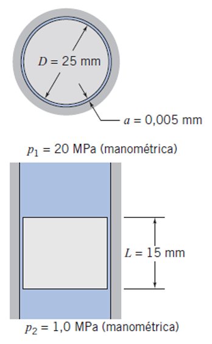
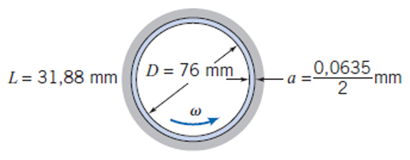
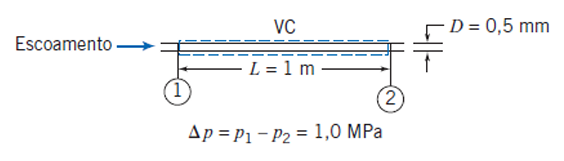
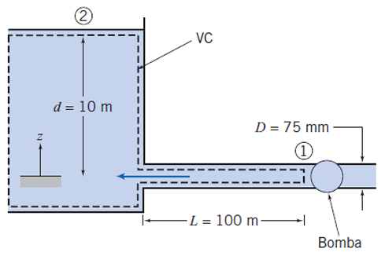
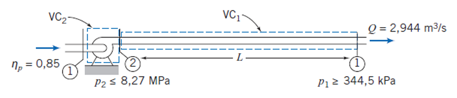
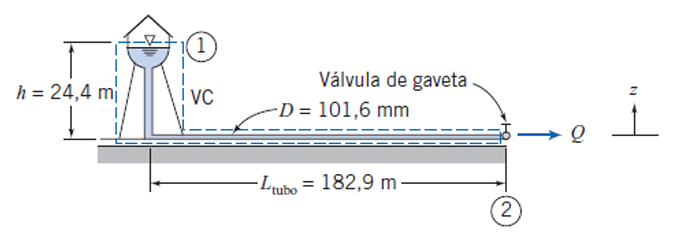
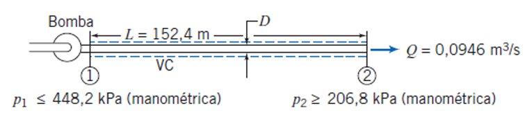

---
Classification	        :	Formula-Based Exercise
Discipline				:	EMA091 Mecânica dos fluidos
Source					:	FOX AND McDONALD’S Edição 8 - p457
Description				:	P3 - Exemplos 8.1 a 8.8 (com exceção do 8.3)
---

# Proposition

## 8.1 VAZAMENTO EM TORNO DE UM PISTÃO

Um sistema hidráulico opera em uma pressão manométrica de 20 MPa e 55°C. O fluido hidráulico é óleo SAE 10W. Uma válvula de controle consiste em um pistão, com diâmetro de 25 mm, introduzido em um cilindro com uma folga radial média de 0,005 mm. Determine a vazão volumétrica de vazamento, se a pressão manométrica sobre o lado de baixa pressão do pistão for 1,0 MPa. (O pistão tem 15 mm de comprimento.)

Use $\mu = 1.8 \times 10^{-2} \text{ N} \cdot \text{s/m}^2$

A imagem anexa mostra dois diagramas esquemáticos do pistão e cilindro.
O primeiro diagrama é uma vista de seção transversal superior, mostrando o pistão circular central com um diâmetro $D = 25 \text{ mm}$. Há uma folga anular entre o pistão e a parede do cilindro, com a folga radial indicada como $a = 0,005 \text{ mm}$.
O segundo diagrama é uma vista de seção transversal lateral. Ele mostra o pistão de comprimento $L = 15 \text{ mm}$ dentro do cilindro. A pressão na parte superior é $p_1 = 20 \text{ MPa (manométrica)}$ e a pressão na parte inferior é $p_2 = 1,0 \text{ MPa (manométrica)}$. O fluido preenche o espaço entre o pistão e o cilindro.

## 8.2 TORQUE E POTÊNCIA EM UM MANCAL DE DESLIZAMENTO

Um mancal de virabrequim em um motor de automóvel é lubrificado por óleo SAE 30 a $99^\circ\text{C}$. O diâmetro do cilindro interno é $76 \text{ mm}$, a folga diametral é $0,0635 \text{ mm}$ e o eixo gira a $3600 \text{ rpm}$; o seu comprimento é $31,8 \text{ mm}$. O mancal não está sob carga, de modo que a folga é simétrica. Determine o torque requerido para girar o eixo e a potência dissipada.

Use $\mu = 0,01 \text{ N}\cdot\text{s/m}^2$

A imagem apresenta um diagrama esquemático de um mancal de deslizamento visto em corte transversal, cercado por uma moldura azul. O desenho mostra um eixo circular central girando no sentido anti-horário, movimento indicado por uma seta azul curva na parte inferior com o símbolo de velocidade angular $\omega$. O diâmetro do cilindro é cotado internamente como $D = 76 \text{ mm}$. À esquerda do desenho, uma cota vertical indica o comprimento do mancal como $L = 31,88 \text{ mm}$. À direita, uma seta horizontal aponta para o espaço anular (a folga) entre o eixo e a parede do mancal, sendo esta dimensão definida pela expressão $a = \frac{0,0635}{2} \text{mm}$.

## 8.4 VISCOSÍMETRO CAPILAR

Um viscosímetro simples e preciso pode ser feito com um tubo capilar. Se a vazão em volume e a queda de pressão forem medidas, e a geometria do tubo for conhecida, a viscosidade de um fluido newtoniano poderá ser calculada a partir da Eq. 8.13c. Um teste de certo líquido em um viscosímetro capilar forneceu os seguintes dados:

Vazão em volume: $880 \text{ mm}^3/\text{s}$
Comprimento do tubo: $1 \text{ m}$
Diâmetro do tubo: $0,50 \text{ mm}$
Queda de pressão: $1,0 \text{ MPa}$

Determine a viscosidade do líquido.

A imagem apresenta um diagrama esquemático de um escoamento em um tubo horizontal.
Uma seta azul rotulada "Escoamento" aponta para a direita, indicando a entrada do fluido no tubo.
O tubo possui duas seções marcadas: a entrada (ponto 1) e a saída (ponto 2).
Uma linha tracejada azul delimita um volume de controle, rotulado como "VC", no interior do tubo.
As dimensões geométricas são fornecidas: o comprimento entre os pontos 1 e 2 é indicado como $L = 1 \text{ m}$, e o diâmetro interno é mostrado à direita como $D = 0,5 \text{ mm}$.
Abaixo do diagrama, a queda de pressão entre a entrada e a saída é dada pela equação $\Delta p = p_1 - p_2 = 1,0 \text{ MPa}$.

## 8.5 ESCOAMENTO NO TUBO DE ENTRADA DE UM RESERVATÓRIO: QUEDA DE PRESSÃO DESCONHECIDA

Um tubo liso horizontal, de $100 \text{ m}$ de comprimento, está conectado a um grande reservatório. Uma bomba é ligada ao final do tubo para bombear água **para o** reservatório a uma vazão volumétrica de $0,01 \text{ m}^3/\text{s}$. Que pressão (manométrica) a bomba deve produzir para gerar essa vazão? O diâmetro interno do tubo liso é $75 \text{ mm}$.

**Descrição da Imagem:**
O diagrama exibe um reservatório conectado a uma tubulação horizontal com uma bomba na extremidade.
1.  **Reservatório (Esquerda):** Um grande tanque contendo líquido, com a superfície livre marcada como ponto 2. A profundidade da água acima da entrada do tubo é $d = 10 \text{ m}$. O eixo $z$ aponta verticalmente para cima a partir do fundo.
2.  **Tubulação:** Um tubo entra horizontalmente da parte inferior direita do reservatório. O comprimento do tubo é $L = 100 \text{ m}$ e o diâmetro é $D = 75 \text{ mm}$. O fluxo ocorre da direita para esquerda.
3.  **Bomba (Direita):** Uma bomba está instalada na extremidade final do tubo (ponto 1), sugando o fluido.
4.  **Volume de Controle (VC):** Uma linha tracejada define o volume de controle, contornando o interior do reservatório e do tubo até a entrada da bomba.

## 8.6 ESCOAMENTO EM UMA TUBULAÇÃO: COMPRIMENTO DESCONHECIDO

Petróleo cru escoa através de um trecho horizontal do oleoduto do Alasca a uma taxa de $2,944 \text{ m}^3/\text{s}$. O diâmetro interno do tubo é $1,22 \text{ m}$; a rugosidade do tubo é equivalente à do ferro galvanizado. A pressão máxima admissível é $8,27 \text{ MPa}$; a pressão mínima requerida para manter os gases dissolvidos em solução no petróleo cru é $344,5 \text{ kPa}$. O petróleo cru tem $\text{SG} = 0,93$; sua viscosidade à temperatura de bombeamento de $60^\circ\text{C}$ é $\mu = 0,0168 \text{ N}\cdot\text{s}/\text{m}^2$. Para estas condições, determine o espaçamento máximo possível entre estações de bombeamento. Se a eficiência da bomba é de 85%, determine a potência que deve ser fornecida a cada estação de bombeamento.

**Descrição da Imagem:**
O diagrama representa uma seção horizontal de um oleoduto com uma estação de bombeamento.
1.  **Fluxo:** O fluxo ocorre da esquerda para a direita, com vazão $Q = 2,944 \text{ m}^3/\text{s}$.
2.  **Estação de Bombeamento (Esquerda):** Uma bomba está localizada no início do trecho (ponto 2). A eficiência da bomba é indicada como $\eta_p = 0,85$. A pressão na descarga da bomba é $p_2 \le 8,27 \text{ MPa}$. Há um volume de controle $VC_2$ ao redor da bomba.
3.  **Tubulação:** O tubo se estende horizontalmente por um comprimento $L$.
4.  **Extremidade do Trecho (Direita):** O final da seção é marcado como ponto 1. A pressão neste ponto deve ser $p_1 \ge 344,5 \text{ kPa}$.
5.  **Volume de Controle Principal:** O volume de controle $VC_1$ engloba o fluido dentro do tubo ao longo do comprimento $L$, entre a descarga da bomba (2) e o final do trecho (1).

## 8.7 ESCOAMENTO PROVENIENTE DE UMA TORRE DE ÁGUA: VAZÃO EM VOLUME DESCONHECIDA

Um sistema de proteção contra incêndio é suprido por um tubo vertical de $24,4 \text{ m}$ de altura, a partir de uma torre de água. O tubo mais longo no sistema tem $182,9 \text{ m}$ e é feito de ferro fundido com cerca de 20 anos de uso. O tubo contém uma válvula de gaveta; outras perdas menores podem ser desprezadas. O diâmetro do tubo é $101,6 \text{ mm}$. Determine a vazão máxima de água através desse tubo.

**Descrição da Imagem:**
O diagrama ilustra um sistema hidráulico composto por uma torre de água elevada à esquerda e uma tubulação que se estende para a direita.
1.  **Torre de Água:** Há um reservatório elevado com a superfície da água marcada como ponto 1. A altura vertical da tubulação que desce da torre até o nível do solo é indicada como $h = 24,4 \text{ m}$.
2.  **Tubulação:** Um tubo horizontal se estende ao longo do solo com comprimento total indicado como $L_{\text{tubo}} = 182,9 \text{ m}$. O diâmetro do tubo é $D = 101,6 \text{ mm}$.
3.  **Componentes:** Existe uma válvula de gaveta próxima à extremidade direita do tubo.
4.  **Saída:** A água sai pela extremidade direita, marcada como ponto 2, com uma vazão $Q$ para a atmosfera.
5.  **Volume de Controle (VC):** Uma linha tracejada azul define o volume de controle, englobando a água desde a superfície no reservatório até a saída do tubo.

## 8.8 ESCOAMENTO EM UM SISTEMA DE IRRIGAÇÃO: DIÂMETRO DESCONHECIDO

As cabeças borrifadoras (*sprinklers*) de um sistema de irrigação agrícola devem ser supridas com água proveniente de uma bomba acionada por motor de combustão interna, através de $152,4 \text{ m}$ de tubos de alumínio trefilado. Na sua faixa de operação de maior eficiência, a descarga da bomba é $0,0946 \text{ m}^3/\text{s}$ a uma pressão não superior a $448,2 \text{ kPa}$ (manométrica). Para operação satisfatória, os borrifadores devem operar a $206,8 \text{ kPa}$ (manométrica) ou mais. Perdas menores e variações de elevação podem ser desprezadas. Determine o menor diâmetro de tubo-padrão que pode ser empregado.

**Descrição da Imagem:**
O diagrama mostra um esquema linear de um sistema de bombeamento horizontal.
1.  **Entrada (Esquerda):** Uma bomba, marcada como ponto 1, impulsiona o fluido. A pressão neste ponto é indicada como $p_1 \le 448,2 \text{ kPa}$ (manométrica).
2.  **Tubulação:** Um tubo horizontal conecta a bomba à saída. O comprimento do tubo é $L = 152,4 \text{ m}$ e o diâmetro $D$ é a variável desconhecida.
3.  **Saída (Direita):** A extremidade do tubo é marcada como ponto 2. A vazão de saída é $Q = 0,0946 \text{ m}^3/\text{s}$. A pressão requerida neste ponto é $p_2 \ge 206,8 \text{ kPa}$ (manométrica).
4.  **Volume de Controle (VC):** Linhas tracejadas azuis delimitam o volume de controle ao redor do fluido dentro do tubo entre os pontos 1 e 2.

# Step-by-step

## Equações de Bernoulli

## 1. Introdução ao Conceito

A Equação de Bernoulli original descreve o princípio de conservação de energia para um fluido ideal (sem viscosidade e incompressível). Ela estabelece que a soma da energia de pressão, energia cinética e energia potencial gravitacional é constante ao longo de uma linha de corrente.

No entanto, para **fluidos reais**, existe atrito interno (viscosidade) e atrito com as paredes da tubulação. Isso dissipa energia na forma de calor, exigindo o uso da **Equação da Energia** (ou Bernoulli Estendida), que adiciona termos para compensar essas perdas.

---

## 2. As Equações Fundamentais

Abaixo estão as formulações conforme solicitado, distinguindo o caso ideal do caso real.

### Equação de Bernoulli (Fluido Ideal)
Utilizada apenas para aproximações teóricas onde o atrito é desprezível.

$$
\frac{p_1}{\rho g} + \frac{V_1^2}{2g} + z_1 = \frac{p_2}{\rho g} + \frac{V_2^2}{2g} + z_2
$$

### Equação de Bernoulli Estendida (Fluido Real)
Utilizada em engenharia para dimensionamento de sistemas reais. A energia no ponto 1 é igual à energia no ponto 2 mais o que foi "perdido" no caminho.

$$
\frac{p_1}{\rho g} + \frac{V_1^2}{2g} + z_1 = \frac{p_2}{\rho g} + \frac{V_2^2}{2g} + z_2 + H_f + H_{lm}
$$

> **Legenda:**
> * $p$: Pressão estática do fluido.
> * $\rho$: Massa específica (densidade) do fluido.
> * $g$: Aceleração da gravidade.
> * $V$: Velocidade média do escoamento.
> * $z$: Cota ou elevação geométrica.
> * $H_f$: Perda de carga maior (devido ao atrito no tubo).
> * $H_{lm}$: Perda de carga menor (devido a acessórios).

---

## 3. Detalhamento das Perdas de Carga

Para aplicar a equação estendida, é necessário calcular os termos de perda de energia ($H$). Essas perdas são divididas em duas categorias:

### A. Perdas Maiores ($H_f$)
Também chamadas de **perdas distribuídas**. Ocorrem devido ao atrito do fluido com as paredes internas do tubo ao longo de seu comprimento. A fórmula mais comum utilizada é a Equação de Darcy-Weisbach:

$$
H_f = f \cdot \frac{L}{D} \cdot \frac{V^2}{2g}
$$

* **$f$**: Fator de atrito (adimensional, obtido via Diagrama de Moody ou equações como a de Colebrook-White, dependendo do Número de Reynolds e da rugosidade relativa).
* **$L$**: Comprimento do tubo.
* **$D$**: Diâmetro interno do tubo.
* **$V$**: Velocidade média do fluido.

### B. Perdas Menores ($H_{lm}$)
Também chamadas de **perdas localizadas**. Ocorrem em pontos específicos onde há mudança na geometria do escoamento, gerando turbulência adicional (ex: válvulas, cotovelos, curvas, reduções, entradas e saídas de reservatórios).

A forma geral para calcular cada perda localizada individual é:

$$
H_{lm} = K \cdot \frac{V^2}{2g}
$$

* **$K$**: Coeficiente de perda de carga localizada (valor tabelado experimentalmente, específico para cada tipo de acessório).

> **Nota:** Em um sistema complexo, o termo $H_{lm}$ na equação da energia é a soma de todas as perdas localizadas individuais ($\sum K \frac{V^2}{2g}$).

## Equações do fator de atrito

### 1. Para Escoamento Laminar ($Re < 2300$)

**Equação:**
$$
f_{laminar} = \frac{64}{Re}
$$

*   **Quando usar:** Exclusivamente quando o Número de Reynolds ($Re$) for baixo (escoamento laminar).
*   **Características:**
    *   É uma solução analítica exata derivada das equações de Navier-Stokes.
    *   O fator de atrito depende **apenas** da velocidade/viscosidade ($Re$).
    *   A rugosidade do tubo **não influencia** o atrito neste regime (a camada limite viscosa cobre as imperfeições da parede).

---

### 2. Para Escoamento Turbulento ($Re > 4000$)

Neste regime, o fluido está caótico e a rugosidade da parede do tubo ($e/D$) passa a ser fundamental, além do número de Reynolds. Existem duas opções para calcular o $f$:

#### A. Equação de Colebrook-White (A "Exata")
**Equação:**
$$
\frac{1}{\sqrt{f}} = -2,0 \log \left( \frac{e/D}{3,7} + \frac{2,51}{Re\sqrt{f}} \right)
$$

*   **O que é:** A correlação empírica padrão usada para construir o famoso **Diagrama de Moody**. É considerada a referência mais precisa.
*   **Problema:** É uma equação **implícita**. O termo $f$ aparece dos dois lados da igualdade (dentro e fora do logaritmo).
*   **Como resolver:** Requer métodos numéricos (iterativos) ou uma calculadora com função "Solver". Não dá para isolar o $f$ no papel.

#### B. Equação de Haaland (A Aproximação Prática)
**Equação:**
$$
\frac{1}{\sqrt{f}} = -1,8 \log \left[ \left( \frac{e/D}{3,7} \right)^{1,11} + \frac{6,9}{Re} \right]
$$

*   **O que é:** Uma aproximação matemática explícita da equação de Colebrook.
*   **Vantagem:** O termo $f$ aparece apenas de um lado. Permite calcular o valor **diretamente** na calculadora comum, sem precisar de iterações.
*   **Precisão:** A diferença em relação à equação de Colebrook é geralmente menor que 2%, o que é perfeitamente aceitável para a maioria das aplicações de engenharia.

---

### Resumo da Estratégia de Uso na Prova

1.  Calcule o **Número de Reynolds** ($Re = \frac{\rho V D}{\mu}$).
2.  **Se $Re < 2300$:** Use $f = 64/Re$.
3.  **Se $Re > 4000$ (Turbulento):**
    *   Se tiver calculadora simples ou pressa: Use **Haaland**.
    *   Se o problema pedir precisão absoluta ou você tiver uma HP Prime/Casio avançada: Use **Colebrook**.

## 8.1
### Equações Fundamentais

O problema trata do escoamento de um fluido viscoso através de uma folga anular muito estreita entre um pistão e um cilindro. Dado que a folga radial $a$ é muito menor que o diâmetro do pistão $D$ ($a \ll D$), o escoamento pode ser aproximado como o escoamento entre duas placas planas paralelas infinitas (Escoamento de Poiseuille Plano).

As equações governantes são a Equação da Continuidade e as Equações de Navier-Stokes. Para coordenadas cartesianas $(x, y, z)$, onde $x$ é a direção do escoamento (axial), $y$ é a direção perpendicular às paredes (radial) e $z$ é a direção da largura (tangencial), temos:

**Equação da Continuidade (Incompressível):**
$$
\frac{\partial u}{\partial x} + \frac{\partial v}{\partial y} + \frac{\partial w}{\partial z} = 0
$$

**Equação de Navier-Stokes (Direção x):**
$$
\rho \left( \frac{\partial u}{\partial t} + u \frac{\partial u}{\partial x} + v \frac{\partial u}{\partial y} + w \frac{\partial u}{\partial z} \right) = -\frac{\partial p}{\partial x} + \rho g_x + \mu \left( \frac{\partial^2 u}{\partial x^2} + \frac{\partial^2 u}{\partial y^2} + \frac{\partial^2 u}{\partial z^2} \right)
$$

### Hipóteses Simplificadoras

1.  **Regime Permanente** ($\frac{\partial}{\partial t} = 0$)
2.  **Fluido Incompressível**  ($\rho$ constante)
3.  **Escoamento Laminar** (Reynolds < 2500>).
4.  **Escoamento Totalmente Desenvolvido** $\left(\frac{\partial u}{\partial x} = 0\right)$
5.  **Escoamento unidirecional** $\left( v = 0, w = 0 \right)$
6.  **Escoamento bidimensional (Placas paralelas infinitas)** $\left( \frac{\partial}{\partial z} = 0 \right)$
7.  **Efeitos gravitacionais desprezíveis** $\left( \rho g_x \approx 0 \right)$.
8.  **Condição de Não-Deslizamento** A velocidade do fluido nas paredes é zero (pistão estacionário em relação ao cilindro para fins de cálculo de vazamento).

### Simplificação das Equações

Aplicando as hipóteses à Equação da Continuidade:
$$
\underbrace{\frac{\partial u}{\partial x}}_{4} + \frac{\partial v}{\partial y} + \underbrace{\frac{\partial w}{\partial z}}_{5} = 0 \implies \frac{\partial v}{\partial y} = 0
$$

Aplicando as hipóteses à Equação de Navier-Stokes (direção $x$):
$$
\rho \left( \underbrace{\frac{\partial u}{\partial t}}_{1} + \underbrace{u \frac{\partial u}{\partial x}}_{4} + \underbrace{v \frac{\partial u}{\partial y}}_{5} + \underbrace{w \frac{\partial u}{\partial z}}_{5} \right) = -\frac{\partial p}{\partial x} + \underbrace{\rho g_x}_{7} + \mu \left( \underbrace{\frac{\partial^2 u}{\partial x^2}}_{4} + \frac{\partial^2 u}{\partial y^2} + \underbrace{\frac{\partial^2 u}{\partial z^2}}_{6} \right)
$$

$$
0 = -\frac{dp}{dx} + \mu \frac{d^2 u}{dy^2}
$$

$$
\frac{d^2 u}{dy^2} = \frac{1}{\mu} \frac{dp}{dx}
$$

---

$$
\int \frac{d^2 u}{dy^2} dy = \int \frac{1}{\mu} \frac{dp}{dx} dy
$$

$$
\int \frac{du}{dy} dy = \int \frac{1}{\mu} \frac{dp}{dx} y + C_1 \, dy
$$

$$
u(y) = \frac{1}{2\mu} \frac{dp}{dx} y^2 + C_1 y + C_2
$$

Aplicamos as condições de contorno para a folga de espessura $a$. Definindo $y=0$ em uma parede e $y=a$ na outra:
$$
u(0) = 0 \implies C_2 = 0
$$

$$
u(a) = 0 \implies \frac{1}{2\mu} \frac{dp}{dx} a^2 + C_1 a = 0 \implies C_1 = -\frac{1}{2\mu} \frac{dp}{dx} a
$$

$$
u(y) = \frac{1}{2\mu} \frac{dp}{dx} (y^2 - ay)
$$

---

A vazão volumétrica $Q$ é obtida integrando o perfil de velocidade na área da seção transversal ($dA = W dy$, onde $W = \pi D$):
$$
Q = \int_0^a u(y) W dy = \frac{\pi D}{2\mu} \frac{dp}{dx} \int_0^a (y^2 - ay) dy
$$
$$
Q = \frac{\pi D}{2\mu} \frac{dp}{dx} \left[ \frac{y^3}{3} - \frac{ay^2}{2} \right]_0^a
$$
$$
Q = \frac{\pi D}{2\mu} \frac{dp}{dx} \left( \frac{a^3}{3} - \frac{a^3}{2} \right) = \frac{\pi D}{2\mu} \frac{dp}{dx} \left( -\frac{a^3}{6} \right)
$$
$$
Q = -\frac{\pi D a^3}{12\mu} \frac{dp}{dx}
$$

---

Considerando que o gradiente de pressão é linear ao longo do comprimento $L$:

$$
\frac{dp}{dx} = \frac{p_2 - p_1}{L} = -\frac{\Delta p}{L}
$$

---

$$
Q = \frac{\pi D a^3 \Delta p}{12 \mu L}
$$

### Cálculo

**Dados fornecidos:**
*   Diâmetro do pistão ($D$): $25 \text{ mm} = 25 \times 10^{-3} \text{ m}$
*   Folga radial ($a$): $0,005 \text{ mm} = 5 \times 10^{-6} \text{ m}$
*   Comprimento ($L$): $15 \text{ mm} = 0,015 \text{ m}$
*   Pressão alta ($p_1$): $20 \text{ MPa} = 20 \times 10^6 \text{ Pa}$
*   Pressão baixa ($p_2$): $1,0 \text{ MPa} = 1,0 \times 10^6 \text{ Pa}$
*   Diferença de pressão ($\Delta p$): $(20 - 1,0) \times 10^6 = 19 \times 10^6 \text{ Pa}$
*   Viscosidade dinâmica ($\mu$): $1,8 \times 10^{-2} \text{ N} \cdot \text{s/m}^2$

Substituindo os valores na equação:

$$
Q = \frac{\pi (25 \times 10^{-3}) (5 \times 10^{-6})^3 (19 \times 10^6)}{12 (1,8 \times 10^{-2}) (0,015)}
$$

$$
\boxed{Q = 5,76 \times 10^{-8} \text{ m}^3/\text{s}}
$$

## 8.2

### Equações Fundamentais e Hipóteses

Para solucionar este problema de escoamento viscoso em um mancal de deslizamento, partimos da definição de tensão de cisalhamento para um fluido Newtoniano e das definições mecânicas de torque e potência.

**Equações Fundamentais:**

1.  **Lei da Viscosidade de Newton:**

$$
\tau = \mu \frac{du}{dy}
$$
2.  **Torque ($T$):**

$$
T = F \cdot R
$$
3.  **Potência ($P$):**

$$
P = T \cdot \omega
$$

**Hipóteses Simplificadoras:**

1.  **Escoamento Laminar:** Devido à pequena folga e à viscosidade do óleo.
2.  **Fluido Newtoniano:** O óleo SAE 30 comporta-se como tal nas condições dadas.
3.  **Perfil de Velocidade Linear (Escoamento de Couette):** Como a folga ($a$) é muito menor que o diâmetro ($a \ll D$), assumimos que o gradiente de velocidade é constante ao longo da folga radial.
4.  **Viscosidade Constante:** Assumimos propriedades uniformes a $99^\circ\text{C}$.
5.  **Folga Simétrica (Sem Carga):** O eixo está centralizado (concêntrico).

-----

### Dados do Problema e Propriedades

Primeiro, convertemos todas as unidades para o Sistema Internacional (SI) e definimos a viscosidade.

  * **Diâmetro do eixo ($D$):** $76 \text{ mm} = 0,076 \text{ m}$
  * **Raio do eixo ($R$):** $D/2 = 0,038 \text{ m}$
  * **Comprimento ($L$):** $31,8 \text{ mm} = 0,0318 \text{ m}$
  * **Folga diametral ($2a$):** $0,0635 \text{ mm} = 6,35 \times 10^{-5} \text{ m}$
  * **Folga radial ($a$):** $\frac{6,35 \times 10^{-5}}{2} \text{ m} = 3,175 \times 10^{-5} \text{ m}$
  * **Rotação ($N$):** $3600 \text{ rpm}$
  * **Velocidade angular ($\omega$):**

$$
\omega = 3600 \times \frac{2\pi}{60} = 120\pi \approx 376,99 \text{ rad/s}
$$
  * **Viscosidade Dinâmica ($\mu$):** Para óleo SAE 30 a $99^\circ\text{C}$ (aprox. $210^\circ\text{F}$), utilizamos o valor típico obtido em diagramas de viscosidade (ex: Gráfico de Viscosidade vs. Temperatura):

$$
\mu \approx 0,01 \text{ N}\cdot\text{s/m}^2 \quad (\text{ou } 0,01 \text{ Pa}\cdot\text{s})
$$

-----

$$
U = \omega R = 376,99 \times 0,038 \approx 14,326 \text{ m/s}
$$

$$
\tau = \mu \frac{U}{a} = 0,01 \frac{14,326}{3,175 \times 10^{-5}} = 4512,1 \text{ N/m}^2 \text{ (Pa)}
$$

$$
F = \tau A = \tau (\pi D L) = 34,25 \text{ N}
$$

$$
T = F R = 34,25 \times 0,038 = 1,3 \text{ N}\cdot\text{m}
$$

$$
P = T \omega = 1,3015 \times 376,99 = 490,6 \text{ W}
$$

## 8.4

### Equações Fundamentais

O problema envolve o escoamento interno viscoso em um tubo circular. A equação fundamental que relaciona a vazão, a queda de pressão, a geometria e a viscosidade para este cenário é a **Lei de Hagen-Poiseuille**.

$$
Q = \frac{\pi D^4 \Delta p}{128 \mu L}
$$

Onde:
*   $Q$ é a vazão volumétrica.
*   $D$ é o diâmetro interno do tubo.
*   $\Delta p$ é a queda de pressão ao longo do comprimento $L$.
*   $\mu$ é a viscosidade dinâmica do fluido.
*   $L$ é o comprimento do tubo.

### Hipóteses Simplificadoras

Para que a Lei de Hagen-Poiseuille seja válida, as seguintes condições devem ser atendidas:

1.  **Fluido Newtoniano**: A tensão de cisalhamento é linearmente proporcional à taxa de deformação.
2.  **Escoamento Laminar**: O número de Reynolds é baixo ($Re < 2300$), característico de viscosímetros capilares.
3.  **Regime Permanente**: As propriedades do escoamento não variam com o tempo ($\partial/\partial t = 0$).
4.  **Fluido Incompressível**: A massa específica é constante.
5.  **Escoamento Plenamente Desenvolvido**: O perfil de velocidade não se altera ao longo do comprimento $L$ (efeitos de entrada desprezíveis ou comprimento $L$ refere-se à região desenvolvida).
6.  **Tubo Horizontal**: Efeitos gravitacionais não influenciam a medição direta da diferença de pressão estática ou estão compensados na medição.

### Solução

O objetivo é encontrar a viscosidade dinâmica $\mu$. Isolando $\mu$ na equação governante:

$$
\mu = \frac{\pi D^4 \Delta p}{128 L Q}
$$

Antes de substituir os valores, converte-se todas as variáveis para o Sistema Internacional de Unidades (SI):

*   Vazão ($Q$): $880 \text{ mm}^3/\text{s} = 880 \times (10^{-3} \text{ m})^3/\text{s} = 880 \times 10^{-9} \text{ m}^3/\text{s} = 8,8 \times 10^{-7} \text{ m}^3/\text{s}$
*   Diâmetro ($D$): $0,50 \text{ mm} = 0,50 \times 10^{-3} \text{ m} = 5,0 \times 10^{-4} \text{ m}$
*   Queda de pressão ($\Delta p$): $1,0 \text{ MPa} = 1,0 \times 10^6 \text{ Pa} = 1,0 \times 10^6 \text{ N}/\text{m}^2$
*   Comprimento ($L$): $1 \text{ m}$

Substituindo os valores na equação isolada:

$$
\mu = \frac{\pi (5,0 \times 10^{-4} \text{ m})^4 (1,0 \times 10^6 \text{ N}/\text{m}^2)}{128 (1 \text{ m}) (8,8 \times 10^{-7} \text{ m}^3/\text{s})}
$$

Calculando o termo do diâmetro elevado à quarta potência:

$$
(5,0 \times 10^{-4})^4 = 625 \times 10^{-16} = 6,25 \times 10^{-14} \text{ m}^4
$$

Substituindo no numerador:

$$
\text{Numerador} = \pi \times (6,25 \times 10^{-14}) \times (1,0 \times 10^6) \approx 1,9635 \times 10^{-7} \text{ N}\cdot\text{m}^2
$$

Calculando o denominador:

$$
\text{Denominador} = 128 \times 1 \times (8,8 \times 10^{-7}) = 1,1264 \times 10^{-4} \text{ m}^4/\text{s}
$$

Calculando a viscosidade final:

$$
\mu = \frac{1,9635 \times 10^{-7}}{1,1264 \times 10^{-4}} \approx 1,743 \times 10^{-3} \text{ N}\cdot\text{s}/\text{m}^2
$$

$$
\boxed{\mu = 1,74 \times 10^{-3} \text{ Pa}\cdot\text{s}}
$$

## 8.5

**Usando**

$$
\rho = 1000 \frac{kg}{m^3}
$$
$$
\mu = 1 \times 10^{-3} \frac{kg}{m \cdot s}
$$
$$
e = 0 \text{ (tubo liso)}
$$
$$
K=1
$$

**Área de seção do tubo**

$$
A = \pi \cdot \frac{D^2}{4} = \pi \cdot \frac{(75 \times 10^{-3})^2}{4} = 4.418 \times 10^{-3} m^2
$$

**Velocidade do fluido**
$$
V = \frac{Q}{A} = \frac{0.01}{4.418 \times 10^{-3}} = 2.264 \frac{m}{s}
$$

**Reynolds**
$$
Re = \frac{\rho \cdot V \cdot l}{\mu} = \frac{\rho \cdot V \cdot D}{\mu} = \frac{1000 \cdot 2.264 \cdot (75 \times 10^{-3})}{1 \times 10^{-3}} = 1.698 \times 10^5
$$

**Fator de atrito (Equação de Haaland)**
$$
\frac{1}{\sqrt{f}} = -1,8 \log \left[ \left( \frac{e/D}{3,7} \right)^{1,11} + \frac{6,9}{Re} \right]
$$
$$
f = \left[-1,8 \log \left[ \left( \frac{e/D}{3,7} \right)^{1,11} + \frac{6,9}{Re} \right]\right]^{-2}
$$
$$
f = \left[-1,8 \log \left[ \left( \frac{0/(75 \times 10^{-3})}{3,7} \right)^{1,11} + \frac{6,9}{1.698 \times 10^5} \right]\right]^{-2}
$$
$$
f = \left[-1,8 \log \left[ \frac{6,9}{1.698 \times 10^5} \right]\right]^{-2} = 0.016
$$

---

$$
H_f = f \cdot \frac{L}{D} \cdot \frac{V^2}{2g} = 0.016 \cdot \frac{100}{(75 \times 10^{-3})} \cdot \frac{2.264^2}{2 \cdot 9.81} = 5.573
$$

$$
H_{lm} = K \cdot \frac{V^2}{2g} = 1 \cdot \frac{2.264^2}{2 \cdot 9.81} =
0.261
$$

---

**Equação de Bernoulli estendida**

$$
\frac{p_1}{\rho g} + \frac{V_1^2}{2g} + z_1 = \frac{p_2}{\rho g} + \frac{V_2^2}{2g} + z_2 + H_f + H_{lm}
$$

**Hipóteses simplificadoras**
1. Bomba como referência de altura $(z_1 = 0; z_2 = d)$
2. Tanque aberto à atmosfera $(p_2 = 0)$
3. Velocidade do fluido no topo do tanque desprezível $(V_2 = 0)$
4. Fluido incompressível ($\rho$ constante)
5. Tubo liso (e = 0)
6. Regime permanente

$$
\frac{p_1}{\rho g} + \frac{V_1^2}{2g} + \underbrace{\cancel{z_1}}_{1} = \underbrace{\cancel{\frac{p_2}{\rho g}}}_{2} + \underbrace{\cancel{\frac{V_2^2}{2g}}}_{3} + z_2 + H_f + H_{lm}
$$

$$
p_1 = \left( -\frac{V_1^2}{2 \cdot g} + d + H_f + H_{lm} \right) \cdot \rho \cdot g
$$

$$
p_1 = \left( -\frac{2.264^2}{2 \cdot 9.81} + 10 + 5.573 + 0.261 \right) \cdot 1000 \cdot 9.81
$$

$$
\boxed{
p_1 = 152,771 \, kPa
}
$$

## 8.6

**Usando**

$$
\rho = SG \cdot \rho_{H_2O} = 0,93 \cdot 1000 = 930 \frac{kg}{m^3}
$$
$$
\mu = 0,0168 \frac{N \cdot s}{m^2} = 0,0168 \frac{kg}{m \cdot s}
$$
$$
e = 0,15 \text{ mm} = 0,15 \times 10^{-3} \text{ m (ferro galvanizado)}
$$
$$
K = 0 \text{ (perdas menores desprezíveis neste comprimento)}
$$

**Área de seção do tubo**

$$
A = \pi \cdot \frac{D^2}{4} = \pi \cdot \frac{1,22^2}{4} = 1,169 \, m^2
$$

**Velocidade do fluido**

$$
V = \frac{Q}{A} = \frac{2,944}{1,169} = 2,518 \frac{m}{s}
$$

**Reynolds**

$$
Re = \frac{\rho \cdot V \cdot D}{\mu} = \frac{930 \cdot 2,518 \cdot 1,22}{0,0168} = 1,70 \times 10^5
$$

**Fator de atrito (Equação de Haaland)**

$$
\frac{1}{\sqrt{f}} = -1,8 \log \left[ \left( \frac{e/D}{3,7} \right)^{1,11} + \frac{6,9}{Re} \right]
$$
$$
f = \left[-1,8 \log \left[ \left( \frac{0,15 \times 10^{-3}/1,22}{3,7} \right)^{1,11} + \frac{6,9}{1,70 \times 10^5} \right]\right]^{-2}
$$
$$
f = \left[-1,8 \log \left[ \left( 3,32 \times 10^{-5} \right)^{1,11} + 4,06 \times 10^{-5} \right]\right]^{-2}
$$
$$
f = \left[-1,8 \log \left[ 4,63 \times 10^{-5} \right]\right]^{-2} = 0,0164
$$

---

**Equação de Bernoulli estendida**

$$
\frac{p_2}{\rho g} + \frac{V_2^2}{2g} + z_2 = \frac{p_1}{\rho g} + \frac{V_1^2}{2g} + z_1 + H_f
$$

**Hipóteses simplificadoras**
1. Tubulação horizontal ($z_1 = z_2$)
2. Diâmetro constante ($V_1 = V_2$)
3. Escoamento em regime permanente
4. Fluido incompressível
5. Perdas localizadas desprezíveis ($H_{lm} \approx 0$)

$$
\frac{p_2}{\rho g} + \underbrace{\cancel{\frac{V_2^2}{2g}}}_{2} + \underbrace{\cancel{z_2}}_{1} = \frac{p_1}{\rho g} + \underbrace{\cancel{\frac{V_1^2}{2g}}}_{2} + \underbrace{\cancel{z_1}}_{1} + H_f
$$

$$
\frac{p_2 - p_1}{\rho g} = H_f
$$

Substituindo a definição de perda de carga maior ($H_f = f \cdot \frac{L}{D} \cdot \frac{V^2}{2g}$):

$$
\frac{p_2 - p_1}{\rho g} = f \cdot \frac{L}{D} \cdot \frac{V^2}{2g}
$$

**Cálculo do espaçamento máximo (L)**

Isolando $L$:

$$
L = \frac{(p_2 - p_1) \cdot D}{\rho \cdot f \cdot \frac{V^2}{2}}
$$

Onde a queda de pressão disponível é $\Delta p = p_{max} - p_{min} = 8,27 \text{ MPa} - 344,5 \text{ kPa} = 7.925.500 \text{ Pa}$.

$$
L = \frac{7.925.500 \cdot 1,22}{930 \cdot 0,0164 \cdot \frac{2,518^2}{2}}
$$

$$
L = \frac{9.669.110}{48,34}
$$

$$
\boxed{
L \approx 200.023 \, m \quad (ou \approx 200 \, km)
}
$$

---

**Cálculo da Potência da Bomba**

A bomba deve fornecer energia para restaurar a pressão de $p_1$ para $p_2$ a fim de bombear para a próxima estação.

$$
\dot{W}_{bomba} = \frac{\rho \cdot g \cdot Q \cdot H_b}{\eta} = \frac{Q \cdot \Delta p}{\eta}
$$

$$
\dot{W}_{bomba} = \frac{2,944 \cdot (8,27 \times 10^6 - 0,3445 \times 10^6)}{0,85}
$$

$$
\dot{W}_{bomba} = \frac{2,944 \cdot 7.925.500}{0,85}
$$

$$
\boxed{
\dot{W}_{bomba} = 27,45 \, MW
}
$$

## 8.7

**Usando**

$$
\rho = 1000 \frac{kg}{m^3}
$$
$$
\mu = 1 \times 10^{-3} \frac{kg}{m \cdot s}
$$
$$
e = 0,52 \text{ mm} = 5,2 \times 10^{-4} \text{ m}
$$
$$
g = 9,81 \frac{m}{s^2}
$$
$$
K_{\text{valvula}} = 0,2 \text{ (Válvula de gaveta totalmente aberta)}
$$

**Área de seção do tubo**

$$
A = \pi \cdot \frac{D^2}{4} = \pi \cdot \frac{(101,6 \times 10^{-3})^2}{4} = 8,107 \times 10^{-3} m^2
$$

---

**Equação de Bernoulli estendida**

$$
\frac{p_1}{\rho g} + \frac{V_1^2}{2g} + z_1 = \frac{p_2}{\rho g} + \frac{V_2^2}{2g} + z_2 + H_f + H_{lm}
$$

**Hipóteses simplificadoras**
1. Escoamento da superfície livre da torre $(z_1 = 24,4 \text{ m})$ para a saída do tubo $(z_2 = 0)$.
2. Pressões iguais à atmosférica $(p_1 = p_2 = 0)$.
3. Velocidade na superfície do tanque desprezível $(V_1 = 0)$.
4. Fluido incompressível.
5. Saída como jato livre (a energia cinética $\frac{V_2^2}{2g}$ permanece na equação).
6. Perdas menores desprezíveis exceto a válvula.

$$
\underbrace{\cancel{\frac{p_1}{\rho g}}}_{2} + \underbrace{\cancel{\frac{V_1^2}{2g}}}_{3} + z_1 = \underbrace{\cancel{\frac{p_2}{\rho g}}}_{2} + \frac{V_2^2}{2g} + z_2 + H_f + H_{lm}
$$

Substituindo as definições de perda de carga ($H_f = f \frac{L}{D} \frac{V_2^2}{2g}$) e perda menor ($H_{lm} = K \frac{V_2^2}{2g}$):

$$
z_1 - z_2 = \frac{V_2^2}{2g} + f \frac{L}{D} \frac{V_2^2}{2g} + K \frac{V_2^2}{2g}
$$

$$
\Delta z = \frac{V^2}{2g} \left( 1 + f \frac{L}{D} + K \right)
$$

Isolando a velocidade $V$:

$$
V = \sqrt{\frac{2g \Delta z}{1 + K + f \frac{L}{D}}}
$$

Substituindo os valores conhecidos ($L = 182,9 \text{ m}$, $D = 0,1016 \text{ m}$, $\Delta z = 24,4 \text{ m}$):

$$
V = \sqrt{\frac{2 \cdot 9,81 \cdot 24,4}{1 + 0,2 + f \left( \frac{182,9}{0,1016} \right)}} = \sqrt{\frac{478,73}{1,2 + 1800,2 \cdot f}} \quad (*\text{Eq. A})
$$

---

**Processo Iterativo**

Como o fator de atrito $f$ depende do número de Reynolds ($Re$), que por sua vez depende da velocidade $V$, precisamos iterar.

**Rugosidade relativa:**
$$
\frac{e}{D} = \frac{0,52}{101,6} \approx 0,00512
$$

**Iteração 1:**
Chute inicial assumindo regime totalmente turbulento (Re muito alto). Pelo diagrama de Moody ou fórmula simplificada para turbulência plena:
$$
f_{inicial} \approx 0,03
$$

Calculando $V$ na *Eq. A*:
$$
V = \sqrt{\frac{478,73}{1,2 + 1800,2 \cdot (0,03)}} = \sqrt{\frac{478,73}{55,2}} \approx 2,94 \frac{m}{s}
$$

Calculando Reynolds:
$$
Re = \frac{\rho \cdot V \cdot D}{\mu} = \frac{1000 \cdot 2,94 \cdot 0,1016}{1 \times 10^{-3}} = 2,98 \times 10^5
$$

Recalculando $f$ (Haaland):
$$
\frac{1}{\sqrt{f}} = -1,8 \log \left[ \left( \frac{0,00512}{3,7} \right)^{1,11} + \frac{6,9}{2,98 \times 10^5} \right]
$$
$$
f \approx 0,0317
$$

**Iteração 2 (Refinamento):**
Usando $f = 0,0317$ na *Eq. A*:

$$
V = \sqrt{\frac{478,73}{1,2 + 1800,2 \cdot (0,0317)}} = \sqrt{\frac{478,73}{1,2 + 57,06}} = \sqrt{\frac{478,73}{58,26}} = 2,866 \frac{m}{s}
$$

Verificando novo Reynolds:
$$
Re = \frac{1000 \cdot 2,866 \cdot 0,1016}{1 \times 10^{-3}} = 2,91 \times 10^5
$$

O novo $f$ para este $Re$ permanece aproximadamente $0,0317$. Convergência atingida.

---

**Vazão Volumétrica Máxima**

$$
Q = V \cdot A
$$

$$
Q = 2,866 \cdot (8,107 \times 10^{-3})
$$

$$
\boxed{
Q = 0,0232 \, m^3/s \quad (\text{ou } 23,2 \, L/s)
}
$$

## 8.8
## Equações Fundamentais e Hipóteses

Para resolver o problema de escoamento viscoso interno, utilizaremos a **Equação de Bernoulli Estendida** (Conservação da Energia para fluido real) e a equação para **Perdas Maiores** (Darcy-Weisbach).

$$
\frac{p_1}{\rho g} + \frac{V_1^2}{2g} + z_1 = \frac{p_2}{\rho g} + \frac{V_2^2}{2g} + z_2 + H_f + H_{lm}
$$

$$
H_f = f \cdot \frac{L}{D} \cdot \frac{V^2}{2g}
$$

Onde o fator de atrito $f$ depende do Número de Reynolds ($Re = \frac{\rho V D}{\mu}$) e da rugosidade relativa ($\frac{\epsilon}{D}$), determinado pela Equação de Colebrook ou Diagrama de Moody.

[Image of Moody diagram]

### Hipóteses
1.  **Escoamento Permanente:** As propriedades não mudam com o tempo.
2.  **Fluido Incompressível:** A densidade $\rho$ da água é constante.
3.  **Tubo Horizontal:** A elevação na entrada e saída é a mesma ($z_1 = z_2$).
4.  **Diâmetro Constante:** Pela conservação da massa em fluido incompressível, a velocidade é constante ao longo do tubo ($V_1 = V_2 = V$).
5.  **Perdas Menores Desprezíveis:** Conforme enunciado ($H_{lm} \approx 0$).

---

## Simplificação das Equações

Aplicando as hipóteses à Equação de Bernoulli Estendida:

$$
\frac{p_1}{\rho g} + \underbrace{\cancel{\frac{V_1^2}{2g}}}_{\text{4}} + \underbrace{\cancel{z_1}}_{\text{3}} = \frac{p_2}{\rho g} + \underbrace{\cancel{\frac{V_2^2}{2g}}}_{\text{4}} + \underbrace{\cancel{z_2}}_{\text{3}} + H_f + \underbrace{\cancel{H_{lm}}}_{\text{5}}
$$

Resultando na relação entre a queda de pressão e a perda de carga maior:

$$
\frac{p_1 - p_2}{\rho g} = H_f
$$

Substituindo a definição de $H_f$:

$$
\frac{p_1 - p_2}{\rho g} = f \cdot \frac{L}{D} \cdot \frac{V^2}{2g}
$$

Como precisamos encontrar o diâmetro $D$, devemos expressar a velocidade $V$ em termos da vazão $Q$ ($V = \frac{4Q}{\pi D^2}$):

$$
p_1 - p_2 = \rho g \cdot \left( f \frac{L}{D} \frac{1}{2g} \left( \frac{4Q}{\pi D^2} \right)^2 \right)
$$

Isolando $D$ (notando que $g$ se cancela ao multiplicar a equação por $\rho g$):

$$
\Delta p = f \cdot \frac{L}{D} \cdot \frac{\rho}{2} \cdot \frac{16 Q^2}{\pi^2 D^4}
$$

$$
\Delta p = \frac{8 f L \rho Q^2}{\pi^2 D^5}
$$

Rearranjando para o diâmetro:

$$
D^5 = \frac{8 L \rho Q^2}{\pi^2 \Delta p} \cdot f
$$

$$
\boxed{D = \left( \frac{8 L \rho Q^2}{\pi^2 \Delta p} \right)^{1/5} \cdot f^{1/5}}
$$

---

## Solução Numérica Passo a Passo

### 1. Dados do Problema e Propriedades da Água
Assume-se água a $20^\circ\text{C}$:
* Densidade ($\rho$): $998 \text{ kg/m}^3$
* Viscosidade Dinâmica ($\mu$): $1,002 \times 10^{-3} \text{ Pa}\cdot\text{s}$
* Vazão ($Q$): $0,0946 \text{ m}^3/\text{s}$
* Comprimento ($L$): $152,4 \text{ m}$
* Pressão disponível ($\Delta p = p_1 - p_2$): $448,2 - 206,8 = 241,4 \text{ kPa} = 241.400 \text{ Pa}$
* Rugosidade do Alumínio Trefilado ($\epsilon$): $1,5 \times 10^{-6} \text{ m}$ (Tubos muito lisos)

### 2. Cálculo da Constante do Sistema
Vamos calcular o termo constante da equação do diâmetro para facilitar as iterações.

$$
C = \frac{8 L \rho Q^2}{\pi^2 \Delta p} = \frac{8 (152,4) (998) (0,0946)^2}{\pi^2 (241.400)}
$$

$$
C = \frac{10.892,5}{2.382.564} \approx 4,571 \times 10^{-3} \text{ m}^5
$$

Logo, a equação iterativa é:
$$
D = (4,571 \times 10^{-3} \cdot f)^{1/5} \approx 0,3406 \cdot f^{0,2}
$$

### 3. Processo Iterativo
Como $f$ depende de $D$ (através de $Re$ e $\epsilon/D$), precisamos iterar.

**Iteração 1:**
* **Chute inicial:** Assumimos um fator de atrito turbulento típico, $f_0 = 0,02$.
* **Calcular $D$:**

$$
D_0 = 0,3406 \cdot (0,02)^{0,2} = 0,3406 \cdot 0,4573 \approx 0,1558 \text{ m}
$$
* **Calcular Reynolds ($Re$):**

$$
Re = \frac{4 \rho Q}{\pi \mu D} = \frac{4 (998) (0,0946)}{\pi (1,002 \times 10^{-3}) (0,1558)} \approx 769.500
$$
* **Calcular Rugosidade Relativa ($\epsilon/D$):**

$$
\frac{\epsilon}{D} = \frac{1,5 \times 10^{-6}}{0,1558} \approx 9,6 \times 10^{-6} \approx 0
$$
*(O tubo é hidraulicamente liso)*.
* **Novo $f$ (Fórmula de Haaland ou Moody para tubo liso):**

$$
\frac{1}{\sqrt{f}} \approx -1,8 \log \left( \left( \frac{\epsilon/D}{3,7} \right)^{1,11} + \frac{6,9}{Re} \right)
$$

Para $Re \approx 7,7 \times 10^5$ e tubo liso, $f_{novo} \approx 0,0122$.

**Iteração 2:**
* **Usar $f_1 = 0,0122$:**
* **Calcular $D$:**

$$
D_1 = 0,3406 \cdot (0,0122)^{0,2} = 0,3406 \cdot 0,4137 \approx 0,1409 \text{ m}
$$
* **Verificação rápida:**

Com $D \approx 0,14 \text{ m}$, o Reynolds aumenta ligeiramente ($Re \propto 1/D$), mas $f$ para tubo liso muda muito pouco nesta faixa elevada de Re. O valor convergido calculado é aproximadamente **140,9 mm**.

### 4. Seleção do Diâmetro Comercial
O cálculo indica que o diâmetro interno *mínimo* para que a perda de carga não exceda a pressão disponível é $140,9 \text{ mm}$.

Para tubos padrão (Schedule 40, por exemplo), um tubo de **6 polegadas** tem diâmetro interno de aproximadamente $154 \text{ mm}$ ($0,154 \text{ m}$).

$$
\boxed{D_{\text{nominal}} = 6 \text{ polegadas}}
$$

# Answer

## 8.1
$$
\boxed{Q = 5,76 \times 10^{-8} \text{ m}^3/\text{s}}
$$

## 8.2

$$
\boxed{
T \approx 1,30 \text{ N}\cdot\text{m}
\quad
\quad
P \approx 491 \text{ W}
}
$$

## 8.4
$$
\boxed{\mu = 1,74 \times 10^{-3} \text{ Pa}\cdot\text{s}}
$$

## 8.5
$$
\boxed{
p_1 = 152,771 \, kPa
}
$$

## 8.6
$$
\boxed{
L = 200 \, km
\quad
\dot{W}_{bomba} = 27,45 \, MW
}
$$

## 8.7
$$
\boxed{
Q = 0,0232 \, m^3/s \quad (\text{ou } 23,2 \, L/s)
}
$$

## 8.8
$$
\boxed{D_{\text{nominal}} = 6 \text{ polegadas}}
$$

# Attempts
