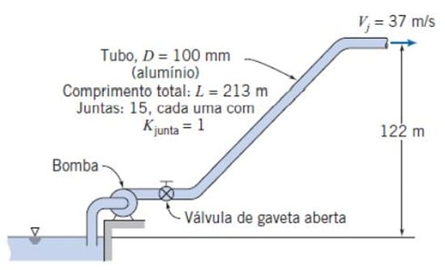

---
Classification	        :	Formula-Based Exercise
Discipline				:	EMA091 Mecânica dos fluidos
Source					:	2025-2 Lista Rudolf - Capítulo 8
Description				:	P3
---

# Proposition

## 8.39
Considere, primeiro, água e, em seguida, óleo lubrificante SAE 10W fluindo a $40^{\circ}\text{C}$ em um tubo de $6 \text{ mm}$ de diâmetro. Determine, para cada fluido, a máxima vazão (e o correspondente gradiente de pressão, $\partial p/\partial x$) para a qual ainda seria esperado escoamento laminar

## 8.52
A queda de pressão entre duas tomadas separadas de $9 \text{ m}$, em um duto horizontal conduzindo água em escoamento completamente desenvolvido, é $6,9 \text{ kPa}$. A seção transversal do duto é um retângulo de $25 \text{ mm} \times 240 \text{ mm}$. Calcule a tensão de cisalhamento média na parede.

## 8.60
Água escoa em um tubo horizontal de área transversal constante; o diâmetro do tubo é $75 \text{ mm}$ e a velocidade média do escoamento é $5 \text{ m/s}$. Na entrada do tubo, a pressão manométrica é $275 \text{ kPa}$ e a saída é à pressão atmosférica. Determine a perda de carga no tubo. Se o tubo estiver alinhado agora de modo que a saída fique $15 \text{ m}$ acima da entrada, qual será a pressão na entrada necessária para manter, a mesma, vazão? Se o tubo estiver alinhado agora de modo que a saída fique $15 \text{ m}$ abaixo da entrada, qual será a pressão na entrada necessária para manter, a mesma, vazão? Finalmente, quão mais baixa deve estar a saída do tubo em relação à entrada para que a mesma vazão seja mantida, se ambas as extremidades estão à pressão atmosférica (isto é, campo gravitacional)?

## 8.104
Uma furadeira a ar comprimido requer $0,25 \text{ kg/s}$ de ar a $650 \text{ kPa}$ (manométrica) na broca. A mangueira que conduz ar do compressor até a furadeira tem $40 \text{ mm}$ de diâmetro interno. A pressão manométrica máxima na descarga do compressor é $670 \text{ kPa}$; o ar deixa o compressor a $40^{\circ}\text{C}$. Despreze variações na massa específica e quaisquer efeitos decorrentes da curvatura da mangueira. Calcule o comprimento máximo de mangueira que pode ser usado.

## 8.129
Água para resfriamento de perfuratrizes de rocha é bombeada de um reservatório para um canteiro de obras, usando o sistema de tubos mostrado. A vazão deve ser de 38 L/s e a água deve deixar o bocal de resfriamento (spray) a 37 m/s. Calcule a mínima pressão necessária na saída da bomba. Estime a potência de acionamento requerida, sendo a eficiência da bomba de 70%.

A imagem mostra um diagrama esquemático de um sistema de tubulação.
- Um reservatório de água está à esquerda em um nível de referência mais baixo.
- Uma bomba retira água do reservatório.
- Imediatamente após a bomba, há uma válvula de gaveta aberta.
- A tubulação sobe inclinada para a direita.
- Os detalhes da tubulação são:
    - Tubo, $D = 100 \text{ mm}$ (alumínio)
    - Comprimento total: $L = 213 \text{ m}$
    - Juntas: 15, cada uma com $K_{\text{junta}} = 1$
- A saída da tubulação (bocal) está a uma altura vertical de 122 m acima do nível do reservatório.
- A água sai do bocal com uma velocidade $V_j = 37 \text{ m/s}$.

# Step-by-step

## 8.39

### Fundamental Equations
The problem involves laminar flow in a circular pipe. The fundamental requirements for laminar flow are governed by the Reynolds number and the Hagen-Poiseuille equations for fully developed laminar flow.

**Reynolds Number:**
$$
Re = \frac{\rho V D}{\mu}
$$

**Hagen-Poiseuille Equation (Volumetric Flow Rate):**
$$
Q = V A = \frac{\pi D^4}{128 \mu} \frac{\Delta p}{L}
$$

**Pressure Gradient:**
$$
\frac{\partial p}{\partial x} = -\frac{\Delta p}{L}
$$

### Simplified Equations and Hypotheses
**Hypotheses:**
1.  Steady flow.
2.  Incompressible flow.
3.  Fully developed laminar flow.
4.  Critical Reynolds number for transition is $Re_{crit} \approx 2300$.

**Simplified Equations:**
To maintain laminar flow, $Re \leq 2300$.
$$
V_{max} = \frac{2300 \mu}{\rho D}
$$

$$
Q_{max} = V_{max} \frac{\pi D^2}{4}
$$

$$
\left| \frac{\partial p}{\partial x} \right| = \frac{128 \mu Q_{max}}{\pi D^4} = \frac{32 \mu V_{max}}{D^2}
$$

### Solution
**Data:**
* Diameter $D = 6 \text{ mm} = 0.006 \text{ m}$.
* Temperature $T = 40^{\circ}\text{C}$.
* Critical Reynolds $Re = 2300$.

**Properties (at 40°C):**

* **Water:** $\rho_w \approx 992 \text{ kg/m}^3$, $\mu_w \approx 6.53 \times 10^{-4} \text{ Pa}\cdot\text{s}$.
* **SAE 10W Oil:** $\rho_o \approx 870 \text{ kg/m}^3$, $\mu_o \approx 0.034 \text{ Pa}\cdot\text{s}$ (Typical values for SAE 10W).

#### 1. Water
Calculate maximum velocity:
$$
V_{max,w} = \frac{2300 (6.53 \times 10^{-4})}{992 (0.006)} \approx 0.252 \text{ m/s}
$$

Calculate maximum flow rate:
$$
Q_{max,w} = 0.252 \times \frac{\pi (0.006)^2}{4} = 7.12 \times 10^{-6} \text{ m}^3/\text{s}
$$

Calculate pressure gradient:
$$
\left| \frac{\partial p}{\partial x} \right|_w = \frac{32 (6.53 \times 10^{-4}) (0.252)}{(0.006)^2} \approx 146 \text{ Pa/m}
$$

#### 2. SAE 10W Oil
Calculate maximum velocity:
$$
V_{max,o} = \frac{2300 (0.034)}{870 (0.006)} \approx 14.98 \text{ m/s}
$$

Calculate maximum flow rate:
$$
Q_{max,o} = 14.98 \times \frac{\pi (0.006)^2}{4} = 4.24 \times 10^{-4} \text{ m}^3/\text{s}
$$

Calculate pressure gradient:
$$
\left| \frac{\partial p}{\partial x} \right|_o = \frac{32 (0.034) (14.98)}{(0.006)^2} \approx 452,730 \text{ Pa/m}
$$

**Results:**
Water:
$$
\boxed{Q = 7.12 \times 10^{-6} \text{ m}^3/\text{s}, \quad \frac{\partial p}{\partial x} = -146 \text{ Pa/m}}
$$

Oil SAE 10W:
$$
\boxed{Q = 4.24 \times 10^{-4} \text{ m}^3/\text{s}, \quad \frac{\partial p}{\partial x} = -453 \text{ kPa/m}}
$$

---

## 8.52

### Fundamental Equations
For fully developed flow in a duct of constant cross-section, the force balance between pressure and wall shear stress is fundamental.

**Momentum Balance (Control Volume):**
$$
\sum F_x = 0 \implies \Delta p A_{cross} - \bar{\tau}_w A_{surface} = 0
$$

**Geometric Definitions:**
* Hydraulic Diameter: $D_h = \frac{4A}{P}$
* $A_{cross} = a \cdot b$
* $A_{surface} = P \cdot L = 2(a+b)L$

### Simplified Equations and Hypotheses
**Hypotheses:**
1.  Steady, fully developed flow.
2.  Horizontal duct (gravity acts perpendicular to flow).
3.  Uniform wall shear stress average.

**Simplified Equation:**
$$
\bar{\tau}_w = \frac{\Delta p A_{cross}}{P L} = \frac{\Delta p}{L} \frac{A}{P}
$$

### Solution
**Data:**
* $\Delta p = 6.9 \text{ kPa} = 6900 \text{ Pa}$.
* $L = 9 \text{ m}$.
* Section: $a = 0.025 \text{ m}$, $b = 0.240 \text{ m}$.

**Calculations:**
Area:
$$
A = 0.025 \times 0.240 = 0.006 \text{ m}^2
$$

Perimeter:
$$
P = 2(0.025 + 0.240) = 0.53 \text{ m}
$$

Shear Stress:
$$
\bar{\tau}_w = \frac{6900}{9} \left( \frac{0.006}{0.53} \right)
$$

$$
\bar{\tau}_w = 766.67 \times 0.01132
$$

$$
\boxed{\bar{\tau}_w \approx 8.68 \text{ Pa}}
$$

---

## 8.60

### Fundamental Equations
**The Energy Equation (Bernoulli with head loss):**
$$
\frac{P_1}{\gamma} + \frac{V_1^2}{2g} + z_1 = \frac{P_2}{\gamma} + \frac{V_2^2}{2g} + z_2 + h_L
$$

### Simplified Equations and Hypotheses
**Hypotheses:**
1.  Steady, incompressible flow.
2.  Constant diameter pipe ($V_1 = V_2$).
3.  Fully developed turbulent flow.

**Simplified Equation:**
Canceling velocity terms ($\cancel{\frac{V^2}{2g}}$):
$$
\frac{P_1 - P_2}{\gamma} + (z_1 - z_2) = h_L
$$

### Solution
**Data:**
* $D = 75 \text{ mm}$, $V = 5 \text{ m/s}$.
* $\gamma = 9800 \text{ N/m}^3$ (Water).
* Initial State: $P_{1,gage} = 275 \text{ kPa}$, $P_{2,gage} = 0$ (Atm).

#### Part A: Horizontal Pipe ($z_1 = z_2$)
$$
h_L = \frac{275000 - 0}{9800}
$$
$$
\boxed{h_L = 28.06 \text{ m}}
$$

#### Part B: Outlet 15 m above inlet ($z_2 - z_1 = 15 \text{ m}$)
Maintain same flow $\implies$ same $h_L$.
$$
\frac{P_1}{\gamma} - \frac{P_2}{\gamma} = (z_2 - z_1) + h_L
$$
$$
\frac{P_1}{9800} - 0 = 15 + 28.06
$$
$$
P_1 = 9800 (43.06)
$$
$$
\boxed{P_1 = 422 \text{ kPa}}
$$

#### Part C: Outlet 15 m below inlet ($z_2 - z_1 = -15 \text{ m}$)
$$
\frac{P_1}{9800} = -15 + 28.06 = 13.06
$$
$$
P_1 = 9800 (13.06)
$$
$$
\boxed{P_1 = 128 \text{ kPa}}
$$

#### Part D: Gravity Flow ($P_1 = P_2 = 0$)
$$
0 + (z_1 - z_2) = h_L
$$
$$
\Delta z = 28.06 \text{ m}
$$
$$
\boxed{\text{Outlet must be } 28.1 \text{ m below inlet}}
$$

---

## 8.104

### Fundamental Equations
**Ideal Gas Law:**
$$
\rho = \frac{P}{RT}
$$

**Darcy-Weisbach Equation (Pressure Drop):**
$$
\Delta p = f \frac{L}{D} \frac{\rho V^2}{2}
$$

**Mass Flow Rate:**
$$
\dot{m} = \rho A V
$$

### Simplified Equations and Hypotheses
**Hypotheses:**
1.  Steady flow.
2.  Negligible density variation (Incompressible assumption per problem statement). We will use average pressure for density.
3.  Isothermal flow ($T \approx 40^{\circ}\text{C}$).
4.  Smooth pipe (hose).

**Simplified Equation for Length:**
$$
L = \frac{\Delta p \cdot 2 D}{f \rho V^2}
$$

### Solution
**Data:**
* $\dot{m} = 0.25 \text{ kg/s}$.
* $D = 0.040 \text{ m}$.
* $T = 40^{\circ}\text{C} = 313 \text{ K}$.
* $P_{in} = 670 \text{ kPa (gage)}$, $P_{out} = 650 \text{ kPa (gage)}$.
* $\Delta p = 20 \text{ kPa} = 20000 \text{ Pa}$.
* $P_{atm} \approx 101 \text{ kPa}$.

**Properties of Air:**
Average Pressure $P_{avg} = 660 \text{ kPa (gage)} = 761 \text{ kPa (abs)}$.
$$
\rho = \frac{761000}{287 \times 313} \approx 8.47 \text{ kg/m}^3
$$
Viscosity $\mu_{air, 40C} \approx 1.91 \times 10^{-5} \text{ Pa}\cdot\text{s}$.

**Velocity:**
$$
V = \frac{\dot{m}}{\rho A} = \frac{0.25}{8.47 \times \frac{\pi (0.04)^2}{4}} = \frac{0.25}{8.47 \times 0.001257} \approx 23.48 \text{ m/s}
$$

**Reynolds Number:**
$$
Re = \frac{8.47 \times 23.48 \times 0.04}{1.91 \times 10^{-5}} \approx 4.16 \times 10^5
$$

**Friction Factor ($f$):**
For smooth pipe at $Re = 4.16 \times 10^5$, using the Haaland or Moody equation:
$$
f \approx \frac{0.316}{Re^{0.25}} \quad (\text{Blasius, slightly low for this Re})
$$
Using explicit approx for smooth pipe:
$$
\frac{1}{\sqrt{f}} = 2.0 \log(Re\sqrt{f}) - 0.8 \implies f \approx 0.0136
$$

**Calculate Maximum Length:**
$$
L = \frac{20000 \times 2 \times 0.04}{0.0136 \times 8.47 \times (23.48)^2}
$$
$$
L = \frac{1600}{0.0136 \times 8.47 \times 551.3} = \frac{1600}{63.5}
$$

$$
\boxed{L \approx 25.2 \text{ m}}
$$

---

## 8.129

### Fundamental Equations
**Extended Bernoulli Equation (Pump Head):**
$$
\frac{P_1}{\gamma} + \frac{V_1^2}{2g} + z_1 + H_{pump} = \frac{P_2}{\gamma} + \frac{V_2^2}{2g} + z_2 + h_L
$$

**Head Loss:**
$$
h_L = \left( f \frac{L}{D} + \sum K_L \right) \frac{V_{pipe}^2}{2g}
$$

**Pump Power:**
$$
\dot{W}_{motor} = \frac{\gamma Q H_{pump}}{\eta}
$$

### Simplified Equations and Hypotheses
**Hypotheses:**
1.  Steady, incompressible flow.
2.  Water at standard temperature ($20^{\circ}\text{C}$ assumed, $\nu = 10^{-6} \text{ m}^2/\text{s}$).
3.  Control Volume 1: Pump Outlet (1) to Nozzle Exit (2).
4.  Control Volume 2: Reservoir Surface (A) to Nozzle Exit (2).
5.  Valve is fully open ($K_{valve} \approx 0.2$).

### Solution
**Data:**
* $Q = 0.038 \text{ m}^3/\text{s}$.
* $D = 0.1 \text{ m}$.
* $L = 213 \text{ m}$.
* $\Delta z = 122 \text{ m}$.
* $V_{nozzle} = V_j = 37 \text{ m/s}$.
* Pipe Material: Aluminum ($\epsilon \approx 0.0015 \text{ mm} = 1.5 \times 10^{-6} \text{ m}$).
* Minor Losses: 15 Joints ($K=1$ each) + 1 Gate Valve ($K \approx 0.2$).

**Kinematics:**
$$
V_{pipe} = \frac{Q}{A} = \frac{0.038}{\frac{\pi (0.1)^2}{4}} = 4.84 \text{ m/s}
$$

**Reynolds Number:**
$$
Re = \frac{V D}{\nu} = \frac{4.84 \times 0.1}{10^{-6}} = 4.84 \times 10^5
$$

**Friction Factor ($f$):**
Relative roughness: $\frac{\epsilon}{D} = \frac{1.5 \times 10^{-6}}{0.1} = 0.000015$ (Essentially smooth).
Using Moody/Colebrook for smooth pipe at $Re = 4.84 \times 10^5$:
$$
f \approx 0.013
$$

**Head Loss Calculation:**
$$
\sum K = 15(1) + 0.2 = 15.2
$$
$$
h_L = \left( 0.013 \frac{213}{0.1} + 15.2 \right) \frac{(4.84)^2}{2(9.81)}
$$
$$
h_L = (27.69 + 15.2) (1.19) = 42.89 \times 1.19 \approx 51.0 \text{ m}
$$

#### Part A: Minimum Pressure at Pump Output ($P_1$)
Apply Energy Eq from Pump Out (1) to Nozzle Jet (2):
$z_1 \approx 0$ (datum at pump), $z_2 = 122$. $P_2 = 0$ (atm).
$$
\frac{P_1}{\gamma} + \frac{V_{pipe}^2}{2g} + 0 = 0 + \frac{V_j^2}{2g} + z_2 + h_L
$$
$$
\frac{P_1}{\gamma} = \frac{37^2}{2(9.81)} - \frac{4.84^2}{2(9.81)} + 122 + 51.0
$$
$$
\frac{P_1}{\gamma} = 69.77 - 1.19 + 122 + 51.0 = 241.58 \text{ m}
$$
$$
P_1 = 9800 \times 241.58 = 2.367 \times 10^6 \text{ Pa}
$$

$$
\boxed{P_{out,pump} = 2.37 \text{ MPa}}
$$

#### Part B: Pump Power
Apply Energy Eq from Reservoir (A) to Nozzle Jet (2).
$V_A \approx 0$, $P_A = 0$, $z_A = 0$ (if pump is level with reservoir, though diagram suggests pump is near reservoir. Let's assume suction head is negligible or included in the "pump requirement").
Actually, $H_{pump}$ represents the energy added to the fluid.
$$
H_{pump} = \frac{P_1}{\gamma} + \frac{V_1^2}{2g} \quad (\text{Total head at discharge})
$$
Assuming negligible suction head ($H_{in} \approx 0$):
$$
H_{pump} \approx 241.58 + 1.19 = 242.77 \text{ m}
$$
*Correction:* The pump must lift from the reservoir level. If the reservoir is the datum, the Total Dynamic Head (TDH) is the energy at the nozzle minus the energy at the reservoir plus losses.
$$
H_p = \frac{V_j^2}{2g} + z_{nozzle} + h_{L, total}
$$
$$
H_p = 69.77 + 122 + 51.0 = 242.8 \text{ m}
$$

Power Required:
$$
\dot{W}_{shaft} = \frac{\rho g Q H_p}{\eta} = \frac{1000 \times 9.81 \times 0.038 \times 242.8}{0.70}
$$
$$
\dot{W}_{shaft} = \frac{90506}{0.70} = 129,294 \text{ W}
$$

$$
\boxed{\dot{W} = 129 \text{ kW}}
$$

# Answer

# Attempts
