---
Classification	        :	Formula-Based Exercise
Discipline				:	EMA093 Processos de Fabricação por Usinagem
Source					:
Description				:	Preparação P3 (Capítulos 9 e 11)
---

# Proposition

## Capítulo 9 - Integridade superficial (p.308)

### Classificação da integridade superficial (saber desenhar)
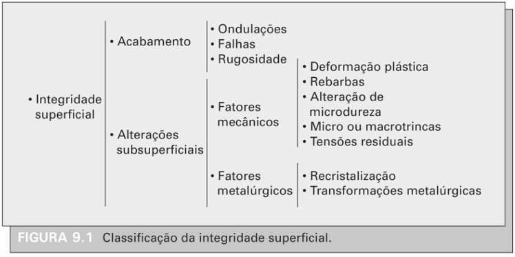

### Parâmetros para a quantificação da rugosidade
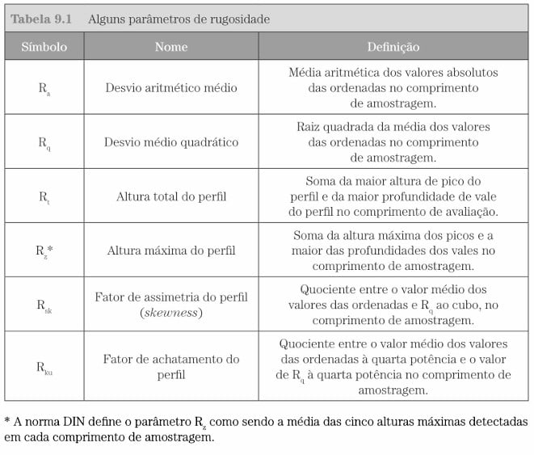

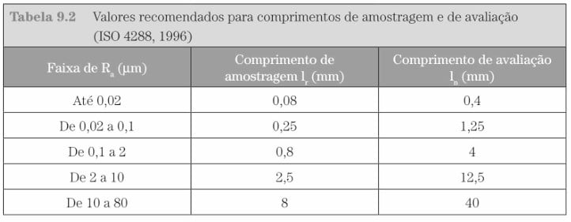

### Representação gráfica dos parâmetros de rugosidade (saber desenhar)
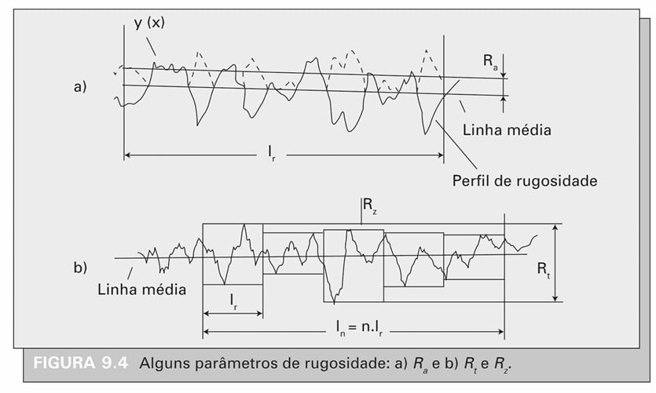

É importante saber representar os seguintes elementos:
- Linha média: média comum. Soma-se todas as medições (positivas ou negativas) e divide-se pela quantidade de medições.
- $R_a$: média dos valores **absolutos** das medições. Como se todos os valores negativos fossem invertidos. Isso faz com que $R_a$ sempre esteja acima da linha média.
- $R_zn$: diferença máxima de altura dentro de cada um dos $n$ comprimentos de amostragem($l_n$)
- $R_z$: média das diferença máxima de altura entre cada comprimento amostragem ($l_r$)
- $R_t$: diferença máxima de altura considerando-se todo o comprimento de avaliação ($l_n$)

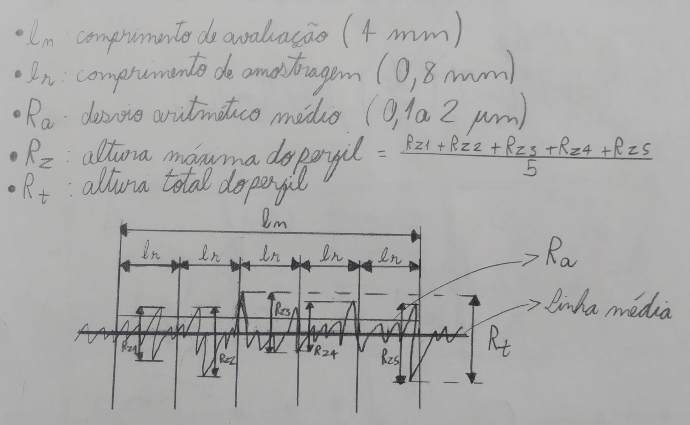

## Capítulo 11 - Usinagem por abrasão (p.352)

### Estrutura do rebolo
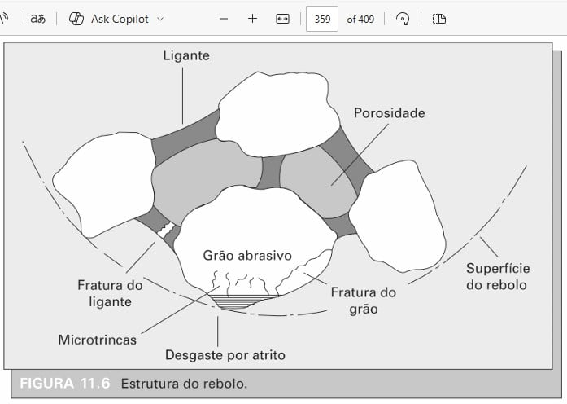

### Código para identificação de rebolo
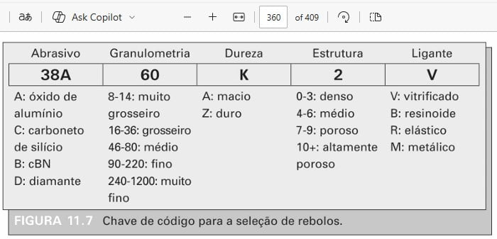

### Propriedades e aplicações de cada tipo de abrasivo
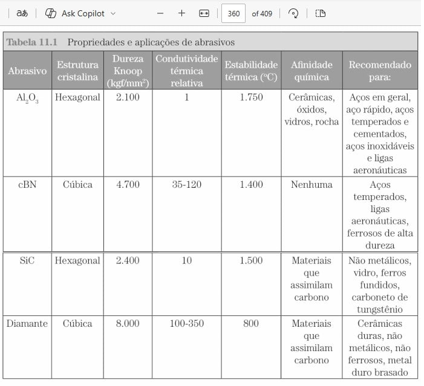

### Diagrama ternário da composição de um rebolo
**Saber desenhar e identificar as zonas principais**

- $V_g$: Volume of Grains = Abrasivo
- $V_b$: Volume of Binding = Ligante
- $V_p$: Volume of Pores = Poros

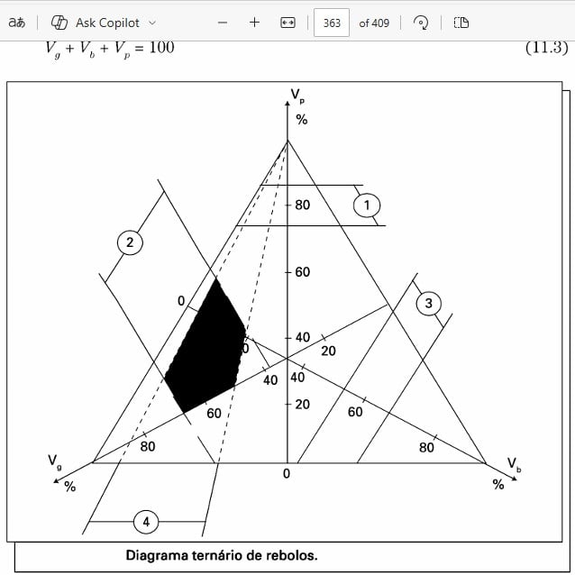

A área escura indica a faixa de composição de rebolos vitrificados

---

### Grau de recobrimento
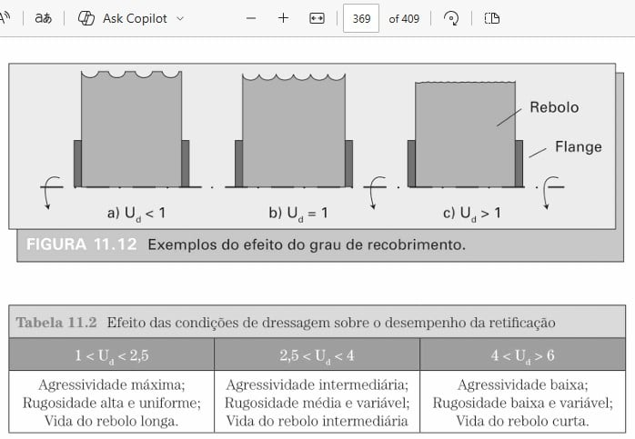

### 11.6 Temperatura de retificação
**Principais fatores que contribuem para a elevação de temperatura no processo de retificação**
- A pequena massa e natureza descontínua dos cavacos, que limitam a dissipação de calor por essa via
- A natureza refratária dos materiais do rebolo, que dificulta a absorção de calor pela ferramenta
- A extensa área de contato rebolo/peça, que dificulta o acesso do fluido de corte à interface.

**Principais consequências**
- Expansão térmica do material, afetando a precisão dimensional (uma vez que o sobremetal é centesimal)
- Alterações microestruturais severas, como a formação de martensita não revenida (camada branca) e revenida
- Indução de tensões residuais de tração
- Surgimento de trincas superficiais, fenômeno conhecido como "queima da peça"

#### Influência de temperatura de retificação abusiva vs suave
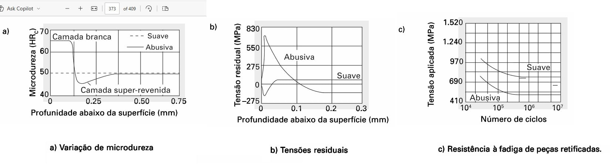

# Step-by-step

# Answer

# Attempts
