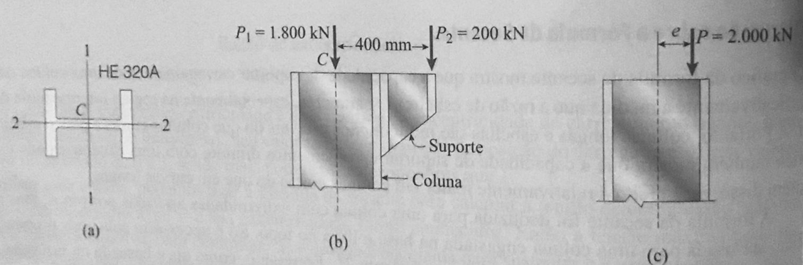
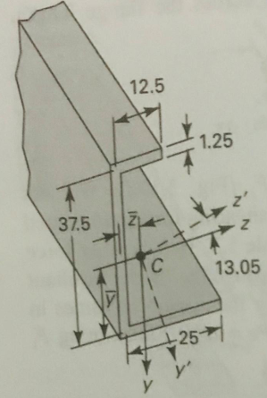

---
Classification	        :	Formula-Based Exercise
Discipline				:	EES003 Resistência dos Materiais
Source					:	2025-2 P3 Max
Description				:	2025-2 P3 Max
---

# Proposition

## 1
Uma coluna de flange largo de aço com perfil HE-320A, está apoiada por pinos nas extremidades e tem comprimento de $7,5 \text{ m}$. A coluna suporta um carregamento aplicado no centroide $P_1=1800 \text{ kN}$ e um carregamento aplicado excentricamente $P_2= 200 \text{ kN}$. A flexão ocorre sobre o eixo 1-1 da seção transversal e o carregamento excêntrico age no eixo 2-2 a uma distância de $400 \text{ mm}$ a partir do centroide C. a) Usando a fórmula da secante e assumindo $E=210 \text{ GPa}$, calcule a tensão de compressão máxima na coluna; b) Se a tensão de escoamento para o aço é $300 \text{ MPa}$, qual é o fator de segurança com relação ao escoamento?

Dados: $A$ (área da seção): $124,4 \text{ cm}^2$;
$r$ (raio de giração) $= 13,58 \text{ cm}$
$h$ (Distância entre os topos das mesas) $= 310 \text{ mm}$

**Descrição da Imagem:**

A imagem apresenta três esquemas técnicos rotulados como (a), (b) e (c) ilustrando a configuração de carga em uma coluna de aço.

* **Esquema (a):** Mostra a seção transversal de um perfil em I identificado como "HE 320A". Um sistema de coordenadas cruza o centro da seção, denominado $C$ (centroide). O eixo vertical é rotulado como "1" e o eixo horizontal como "2".
* **Esquema (b):** Mostra uma vista lateral do topo da coluna. Uma carga vertical $P_1 = 1.800 \text{ kN}$ é aplicada diretamente sobre o eixo central da coluna (passando pelo centroide $C$). À direita, existe um suporte triangular (mísula) soldado à coluna, onde é aplicada uma segunda carga vertical $P_2 = 200 \text{ kN}$. A distância horizontal entre o eixo central da coluna e o ponto de aplicação da carga $P_2$ é indicada como $400 \text{ mm}$.
* **Esquema (c):** Representa um diagrama simplificado de carga equivalente. Mostra uma única força resultante vertical $P = 2.000 \text{ kN}$ atuando para baixo, deslocada do eixo central da coluna por uma distância de excentricidade indicada pela letra $e$.

## 2
Localize o centro de cisalhamento para uma seção transversal assimétrica, onde a espessura da viga é constante e igual a 1.25mm. As direções principais correspondem aos eixos $y'$ e $z'$, onde $\theta$ é o ângulo principal igual a 13,05 graus.

# Step-by-step

## 1
### Equações Fundamentais e Geometria

Para determinar a tensão máxima em uma coluna submetida a carregamento excêntrico, utiliza-se a Fórmula da Secante. As equações fundamentais que regem o comportamento da coluna sob essas condições são:

1.  **Carga Axial Total e Excentricidade Equivalente:**
    O sistema de forças original é substituído por uma força resultante $P$ atuando com uma excentricidade equivalente $e$ tal que o momento fletor seja preservado.

$$
P = \sum P_i
$$

$$
P \cdot e = \sum M_i = \sum (P_i \cdot d_i)
$$

2.  **Fórmula da Secante (Tensão Máxima):**
    Esta equação relaciona a tensão máxima de compressão ($\sigma_{max}$) com a carga aplicada, a geometria da seção e as propriedades do material, considerando a deflexão lateral da coluna.

$$
\sigma_{max} = \frac{P}{A} \left[ 1 + \frac{ec}{r^2} \sec \left( \frac{L_e}{2r} \sqrt{\frac{P}{EA}} \right) \right]
$$

3.  **Fator de Segurança (Escoamento):**

$$
FS = \frac{\sigma_{escoamento}}{\sigma_{max}}
$$

---

### Hipóteses Simplificadoras

* **Comportamento do Material:** O aço comporta-se como um material linear elástico e homogêneo até o ponto de tensão máxima calculado (necessário para a validade da fórmula da secante baseada em Euler).
* **Condições de Contorno:** A coluna é biapoiada (pinos nas extremidades), logo o comprimento efetivo $L_e$ é igual ao comprimento real $L$ ($K=1$).
* **Plano de Flexão:** A flexão ocorre exclusivamente em torno do eixo principal de inércia associado ao raio de giração $r$ fornecido.
* **Efeitos de Cisalhamento:** As deformações por cisalhamento são desprezíveis em comparação com as deformações por flexão.

---

### Solução Passo a Passo

#### 1. Determinação dos Parâmetros de Carga e Geometria

Primeiramente, convertemos todas as unidades para o Sistema Internacional (N, m, Pa) e calculamos a carga equivalente e a excentricidade.

**Dados:**
* $P_1 = 1800 \text{ kN} = 1.800.000 \text{ N}$
* $P_2 = 200 \text{ kN} = 200.000 \text{ N}$
* Distância da carga $P_2$ ao centroide ($d_2$) = $400 \text{ mm} = 0,4 \text{ m}$
* Comprimento ($L_e = L$) = $7,5 \text{ m}$
* Área ($A$) = $124,4 \text{ cm}^2 = 124,4 \times 10^{-4} \text{ m}^2$
* Módulo de Elasticidade ($E$) = $210 \text{ GPa} = 210 \times 10^9 \text{ Pa}$
* Raio de giração ($r$) = $13,58 \text{ cm} = 0,1358 \text{ m}$

**Cálculo da Carga Resultante ($P$):**
$$
P = P_1 + P_2 = 1.800.000 + 200.000 = 2.000.000 \text{ N}
$$

**Cálculo da Excentricidade Equivalente ($e$):**
O momento gerado pela carga excêntrica $P_2$ deve ser igual ao momento gerado pela carga total $P$ na excentricidade $e$.
$$
P \cdot e = P_2 \cdot d_2
$$
$$
2.000.000 \cdot e = 200.000 \cdot 0,4
$$
$$
e = \frac{80.000}{2.000.000} = 0,04 \text{ m}
$$

**Distância da Linha Neutra à Fibra Extrema ($c$):**
Dado que o raio de giração $r \approx 13,6 \text{ cm}$ corresponde ao eixo forte de um perfil HE 320A, a flexão ocorre em torno do eixo de maior inércia. Portanto, $c$ é a metade da altura da seção ($h$).
$$
c = \frac{h}{2} = \frac{310 \text{ mm}}{2} = 155 \text{ mm} = 0,155 \text{ m}
$$

#### 2. Cálculo dos Termos da Fórmula da Secante

Calculamos os termos individuais da equação para simplificar a substituição final.

**Tensão Média ($\frac{P}{A}$):**
$$
\frac{P}{A} = \frac{2.000.000}{124,4 \times 10^{-4}} \approx 160,77 \times 10^6 \text{ Pa} = 160,77 \text{ MPa}
$$

**Razão de Excentricidade ($\frac{ec}{r^2}$):**
$$
\frac{ec}{r^2} = \frac{0,04 \cdot 0,155}{(0,1358)^2} = \frac{0,0062}{0,0184416} \approx 0,3362
$$

**Argumento da Secante ($\theta$ em radianos):**
$$
\theta = \frac{L_e}{2r} \sqrt{\frac{P}{EA}}
$$
$$
\theta = \frac{7,5}{2(0,1358)} \sqrt{\frac{2.000.000}{(210 \times 10^9)(124,4 \times 10^{-4})}}
$$
$$
\theta = 27,614 \sqrt{\frac{2.000.000}{2.612.400.000}}
$$
$$
\theta = 27,614 \sqrt{0,00076558} \approx 27,614 \cdot 0,02767
$$
$$
\theta \approx 0,7641 \text{ rad}
$$

Convertendo para graus para facilitar a verificação (opcional, mas o cálculo da secante deve usar o modo correto da calculadora):
$$
\theta_{graus} = 0,7641 \cdot \left(\frac{180}{\pi}\right) \approx 43,78^{\circ}
$$

Valor da Secante:
$$
\sec(0,7641) = \frac{1}{\cos(43,78^{\circ})} \approx \frac{1}{0,722} \approx 1,385
$$

#### 3. a) Cálculo da Tensão Máxima de Compressão

Substituindo os valores na Fórmula da Secante:

$$
\sigma_{max} = \frac{P}{A} \left[ 1 + \frac{ec}{r^2} \sec(\theta) \right]
$$
$$
\sigma_{max} = 160,77 \text{ MPa} \left[ 1 + (0,3362)(1,385) \right]
$$
$$
\sigma_{max} = 160,77 \left[ 1 + 0,4656 \right]
$$
$$
\sigma_{max} = 160,77 \cdot 1,4656
$$
$$
\sigma_{max} \approx 235,6 \text{ MPa}
$$

$$
\boxed{\sigma_{max} \approx 235,6 \text{ MPa}}
$$

#### 4. b) Fator de Segurança

Com a tensão de escoamento $\sigma_y = 300 \text{ MPa}$:

$$
FS = \frac{\sigma_y}{\sigma_{max}}
$$
$$
FS = \frac{300}{235,6}
$$
$$
FS \approx 1,273
$$

$$
\boxed{FS \approx 1,27}
$$

## 2
### Vértices da seção
(0,0)
(0, 38.75)
(13.125, 38.75)
(13.125, 37.5)
(1.25, 37.5)
(1.25, 1.25)
(25.625, 1.25)
(25.625, 0)

### Cálculo do centroide
**Mesa superior**
- Centroide em relação à origem: $(z_1, y_1) = (6.5625, 38.125)$
- Área: $(12.5 + (1.25 / 2)) \cdot 1.25 = 16.40625$

**Mesa inferior**
- Centroide em relação à origem: $(z_2, y_2) = (12.8125, 0.625)$
- Área: $(25 + (1.25 / 2)) \cdot 1.25 = 32.03125$

**Alma**
- Centroide em relação à origem: $(z_3, y_3) = (0.625, 19.375)$
- Área: $(37.5 - 1.25) \cdot 1.25 = 45.3125$

**Seção completa**
- Área: $\sum A = 93.75 \text{ mm}^2$
- Centroide em relação à origem:

$$
(C_z, C_y) = \left( \frac{\sum (A_i \cdot z_i)}{\sum A_i} , \frac{\sum (A_i \cdot y_i)}{\sum A_i} \right)
$$
$$
\frac{\sum (A_i \cdot z_i)}{\sum A_i} = \frac{16.40625 \cdot 6.5625 + 32.03125 \cdot 12.8125 + 45.3125 \cdot 0.625}{93.75}
$$

$$
\frac{\sum (A_i \cdot y_i)}{\sum A_i} = \frac{16.40625 \cdot 38.125 + 32.03125 \cdot 0.625 + 45.3125 \cdot 19.375}{93.75}
$$

$$
(C_z, C_y) = (5.828125, 16.25)
$$

---

Distância do centroide de cada peça até o centroide global.

**Mesa Superior**
* $\bar{z}_1 = z_1 - C_z = 6.5625 - 5.8281 \approx \mathbf{0.734}$
* $\bar{y}_1 = y_1 - C_y = 38.125 - 16.250 = \mathbf{21.875}$

**Mesa Inferior**
* $\bar{z}_2 = z_2 - C_z = 12.8125 - 5.8281 \approx \mathbf{6.984}$
* $\bar{y}_2 = y_2 - C_y = 0.625 - 16.250 = \mathbf{-15.625}$

**Alma**
* $\bar{z}_3 = z_3 - C_z = 0.625 - 5.8281 \approx \mathbf{-5.203}$
* $\bar{y}_3 = y_3 - C_y = 19.375 - 16.250 = \mathbf{3.125}$

---

### Momentos de inércia

**Teorema dos Eixos Paralelos (Steiner)**:
$$
I_{novo} = I_{local} + A \cdot d^2
$$

$$
I_{zz} = \sum \left( \frac{b h^3}{12} + A \cdot \bar{y}^2 \right)
$$

$$
I_{yy} = \sum \left( \frac{h b^3}{12} + A \cdot \bar{z}^2 \right)
$$

$$
I_{zy} = \sum (I_{zy,local} + A \cdot \bar{z} \cdot \bar{y}) = \sum (A \cdot \bar{z} \cdot \bar{y})
$$

$$
I_{zy,local} \text{ é zero para retângulos alinhados aos eixos}
$$

---

$$
I_{zz,1} = \frac{13.125 \cdot (1.25)^3}{12} + 16.406 \cdot (21.875)^2 = \mathbf{7853.19}
$$

$$
I_{zz,2} = \frac{25.625 \cdot (1.25)^3}{12} + 32.031 \cdot (-15.625)^2 = 4.17 + 7820.07 = \mathbf{7824.24}
$$

$$
I_{zz,3} = \frac{1.25 \cdot (36.25)^3}{12} + 45.312 \cdot (3.125)^2 = \mathbf{5404.09}
$$

$$
I_{zz} = 7853.19 + 7824.24 + 5404.09 = \mathbf{21081.52 \text{ mm}^4}
$$

---

$$
I_{yy,1} = \frac{1.25 \cdot (13.125)^3}{12} + 16.406 \cdot (0.734)^2 = \mathbf{244.37}
$$

$$
I_{yy,2} = \frac{1.25 \cdot (25.625)^3}{12} + 32.031 \cdot (6.984)^2 = 1752.74 + 1562.35 = \mathbf{3315.09}
$$

$$
I_{yy,3} = \frac{36.25 \cdot (1.25)^3}{12} + 45.312 \cdot (-5.203)^2 = 5.90 + 1226.65 = \mathbf{1232.55}
$$

$$
I_{yy} = 244.37 + 3315.09 + 1232.55 = \mathbf{4792.01 \text{ mm}^4}
$$

---

$$
I_{zy,1} = 0 + 16.406 \cdot (0.734) \cdot (21.875) = \mathbf{263.42}
$$

$$
I_{zy,2} = 0 + 32.031 \cdot (6.984) \cdot (-15.625) = \mathbf{-3495.34}
$$

$$
I_{zy,3} = 0 + 45.312 \cdot (-5.203) \cdot (3.125) = \mathbf{-736.75}
$$

$$
I_{zy} = 263.42 - 3495.34 - 736.75 = \mathbf{-3968.67 \text{ mm}^4}
$$

---

$$
I_{zz}  = 21.081,5 \text{ mm}^4
$$
$$
I_{yy}  = 4792,0 \text{ mm}^4
$$
$$
I_{zy}  = -3968.7 \text{ mm}^4
$$

---

### $S_z$

**Fórmula do Fluxo de Cisalhamento ($q$)**

$$
q(s) = \frac{-V_y}{D} \left( I_{yy} \cdot Q_z(s) - I_{zy} \cdot Q_y(s) \right)
$$

$$
Q_z(s) = \int_0^s y \cdot t \, ds
$$

$$
Q_y(s) = \int_0^s z \cdot t \, ds
$$

---

$$
D = I_{zz} I_{yy} - I_{zy}^2 = (21081.52) \cdot (4792.01) - (-3968.67)^2 = \mathbf{85272551 \text{ mm}^8}
$$

---

Cálculo das funções de momento estático $Q_z(s)$ e $Q_y(s)$ para a **Mesa Superior**, pois é onde calculamos a força $F_{sup}$.

Para realizar a integração, definimos uma variável auxiliar $s$:
* **Origem ($s=0$):** Na ponta livre da mesa superior (direita).
* **Direção:** Cresce da direita para a esquerda, em direção à alma.
* **Intervalo:** $0 \leq s \leq 13.125$ mm (comprimento total da mesa).
* **Espessura ($t$):** $1.25$ mm.
* **Comprimento da mesa ($L$):** = $13.125$ mm

$$
(\bar{z}_1, \bar{y}_1) = (0.734,  21.875)
$$

$$
(C_z, C_y) = (5.828125, 16.25)
$$

$$
\bar{z}_{ponta} = L - C_z = 13.125 - 5.828 = 7.297
$$

* Como $s$ aponta para a esquerda (diminuindo $z$):

$$
\bar{z}(s) = 7.297 - s
$$

---

$$
Q_z(s) = \int_0^s \bar{y} \cdot t \, ds = \bar{y} \cdot t \cdot \int_0^s ds
$$
$$
Q_z(s) = (21.875) \cdot (1.25) \cdot [s]_0^s = 27.344 \cdot s \quad (\text{mm}^3)
$$

---

$$
Q_y(s) = \int_0^s \bar{z}(s) \cdot t \, ds
$$

$$
Q_y(s) = \int_0^s (7.297 - s) \cdot 1.25 \, ds
$$

$$
Q_y(s) = 1.25 \left[ \int_0^s 7.297 \, ds - \int_0^s s \, ds \right]
$$

$$
Q_y(s) = 1.25 \left[ 7.297s - \frac{s^2}{2} \right]
$$

$$
Q_y(s) = 9.121s - 0.625s^2 \quad (\text{mm}^3)
$$

---

$$
F_{sup} = \int_0^L q(s) \, ds
$$

$$
F_{sup} = \int_0^L \frac{-V_y}{D} \left( I_{yy} \cdot Q_z(s) - I_{zy} \cdot Q_y(s) \right) \, ds
$$

$$
F_{sup} = \frac{-V_y}{D} \int_0^{L} \left( I_{yy} \cdot Q_z(s) - I_{zy} \cdot Q_y(s) \right) ds
$$

$$
F_{sup} = \frac{-V_y}{D} \left[ \green{\int_0^{L}  I_{yy} \cdot Q_z(s) \, ds} - \blue{\int_0^{L}  I_{zy} \cdot Q_y(s) \, ds} \right]
$$

---

$$
I_{zz}  = 21.081,5 \text{ mm}^4
$$
$$
I_{yy}  = 4792,0 \text{ mm}^4
$$
$$
I_{zy}  = -3968.7 \text{ mm}^4
$$

---

$$
\green{\int_0^{L}  I_{yy} \cdot Q_z(s) \, ds} = I_{yy} \int_0^{L} (27.344s) \, ds = 4792,0 \cdot 27.344 \cdot \left[\frac{s^2}{2}\right]_0^{13.125}
$$
$$
= 4792.0 \cdot 27.344 \cdot \frac{13.125^2}{2} = 11286193.275
$$

$$
\blue{\int_0^{L}  I_{zy} \cdot Q_y(s) \, ds} = I_{zy} \int_0^{L} (9.121s - 0.625s^2) \, ds = -3968.7 \cdot \left[ 9.121 \frac{s^2}{2} - 0.625 \frac{s^3}{3} \right]_0^{13.125}
$$
$$
= -3968.7 \cdot \left( 9.121 \frac{13.125^2}{2} - 0.625 \frac{13.125^3}{3} \right) = -1248467.94874
$$

---

$$
F_{sup} = \frac{-V_y}{85272551} \left(11286193.275 - (-1248467.94874) \right)
$$

$$
F_{sup} = -0.147 \cdot V_y
$$

---

$$
M_{externo} = M_{interno}
$$
$$
V_y \cdot e_z = |F_{superior}| \cdot h
$$
$$
1 \cdot e_z = 0.147 \cdot 37.5
$$
$$
e_z = 5.5125
$$
$$
S_z = z_{alma} - e_z = 0.625 - 5.5125 = -4.8875 \text{ mm}
$$

### $S_y$
Cálculo das funções de momento estático $Q_z(s)$ e $Q_y(s)$ para a **Mesa Superior**.
As funções geométricas $Q(s)$ permanecem as mesmas calculadas anteriormente.

**Fórmula do Fluxo de Cisalhamento ($q$) para carga $V_z$**

$$
q(s) = \frac{-V_z}{D} \left( I_{zz} \cdot Q_y(s) - I_{zy} \cdot Q_z(s) \right)
$$

---

$$
F_{sup} = \int_0^L q(s) \, ds
$$

$$
F_{sup} = \frac{-V_z}{D} \int_0^{L} \left( I_{zz} \cdot Q_y(s) - I_{zy} \cdot Q_z(s) \right) ds
$$

$$
F_{sup} = \frac{-V_z}{D} \left[ \green{\int_0^{L} I_{zz} \cdot Q_y(s) \, ds} - \blue{\int_0^{L} I_{zy} \cdot Q_z(s) \, ds} \right]
$$

---

$$
I_{zz}  = 21.081,5 \text{ mm}^4
$$
$$
I_{yy}  = 4792,0 \text{ mm}^4
$$
$$
I_{zy}  = -3968.7 \text{ mm}^4
$$

---

$$
\green{\int_0^{L} I_{zz} \cdot Q_y(s) \, ds} = I_{zz} \int_0^{L} (9.121s - 0.625s^2) \, ds
$$
$$
= 21081.5 \cdot \left[ 9.121 \frac{13.125^2}{2} - 0.625 \frac{13.125^3}{3} \right]
$$
$$
= 21081.5 \cdot (785.61 - 471.04) = 21081.5 \cdot 314.57 = 6631607.45
$$

$$
\blue{\int_0^{L} I_{zy} \cdot Q_z(s) \, ds} = I_{zy} \int_0^{L} (27.344s) \, ds
$$
$$
= -3968.7 \cdot 27.344 \cdot \left[\frac{13.125^2}{2}\right]
$$
$$
= -3968.7 \cdot 2355.21 = -9347116.92
$$

---

$$
F_{sup} = \frac{-V_z}{85272551} \left( 6631607.45 - (-9347116.92) \right)
$$

$$
F_{sup} = \frac{-V_z}{85272551} (15978724.37)
$$

$$
F_{sup} = -0.1874 \cdot V_z
$$

---

**Equilíbrio de Momentos**
Tomando momentos em relação à interseção da **Alma com a Mesa Inferior** (ponto $(0.625, 0.625)$):
* As forças na alma e na mesa inferior passam pelo ponto (momento nulo).
* A força externa $V_z$ atua na altura $S_y$. O braço de alavanca é $(S_y - y_{ref})$.

$$
V_z \cdot (S_y - y_{ref}) = |F_{sup}| \cdot h
$$
$$
V_z \cdot (S_y - 0.625) = (0.1874 \cdot V_z) \cdot 37.5
$$
$$
S_y - 0.625 = 7.0275
$$
$$
S_y = 7.6525 \text{ mm}
$$

**Localização Final do Centro de Cisalhamento:**
$$
(S_z, S_y) = (-4.89, 7.65) \text{ mm}
$$

## Centroide

Coordenadas do centroide em relação à origem
$$
(5.82813, 16.25)
$$

## Centro de cisalhamento

Coordenadas do centro de cisalhamento em relação à origem:
$$
(-4.39, 7.22)
$$

Coordenadas do centro de cisalhamento em relação ao centroide
$$
(-10.2163, 9.02952)
$$

# Answer

# Attempts
