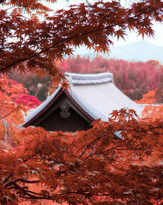
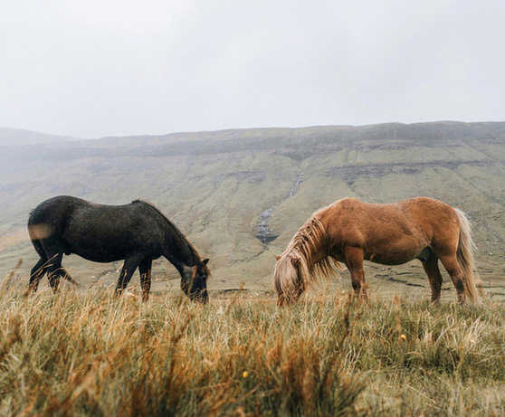
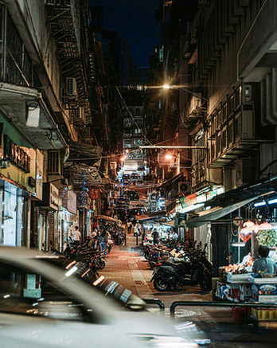
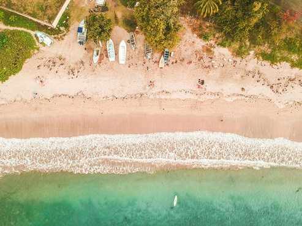
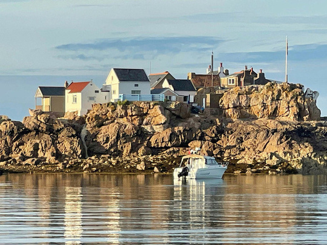
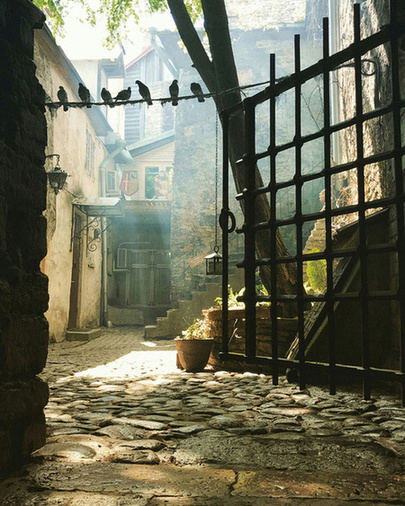
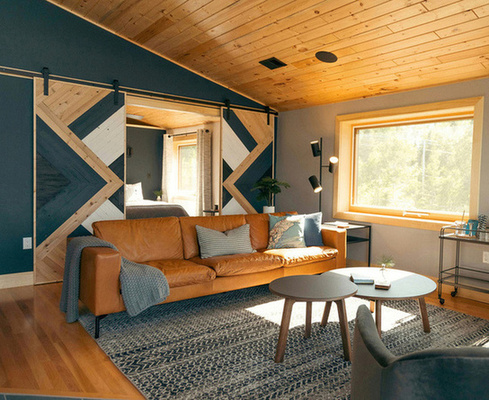

---
Classification	        :	Keywords Exercise
Discipline              :   Duolingo English Test
Source					:	englishtest.duolingo.com
Description				:	Write About the Photo
---

# Proposition
Write a description of the image below for 1 minute

## 1

**Duolingo answer**
I believe the photo depicts a peaceful scene with bright red tree leaves, which suggests it’s autumn. In the background, I can see the roof of a building through the leaves. The colors are mostly warm, with bright reds and soft oranges. The leaves in the front look slightly out of focus, and that makes the photo feel even more beautiful.

## 2

**Duolingo answer**
In the picture, I see two horses eating grass in a big green field. There’s some light fog in the background. One horse is dark and stands on the left side, while the other is light brown and stands on the right. Behind them, I notice some hills and a cloudy sky, which together create a peaceful feeling. Overall, I think it looks like a quiet and calm countryside scene.

## 3

**Duolingo answer**
I see a narrow street at night in the photo. It’s lit up by bright lights coming from shops and street stalls. I can also see some parked motorcycles and a few people walking along the street. There are buildings on both sides, and I notice air conditioning units attached to them. I think the whole scene feels lively and busy.

## 4

**Duolingo answer**
The picture shows a beautiful beach from above. You can see the sand meeting the blue-green water, with small waves coming to the shore. There are a few boats by the beach, and some trees and plants that make it look even prettier. The beach is full of life with people enjoying themselves.

## 5

**Duolingo answer**
The photo shows a small village with houses sitting on rocky ground near the sea. The houses all look a bit different, with some painted white and others in bright colors. They have sloped roofs and chimneys, which makes them look very cozy. Behind them, the sky is clear and bright, making the whole scene look very picturesque. At the front, I can see a small boat. This peaceful image makes me imagine the calm and quiet life of the people who live there.

## 6

**Duolingo answer**
The photo shows a peaceful alley or courtyard with stone paths. I see a metal gate in the front, with some birds sitting on it. Behind the gate, there are a few old buildings and stairs going up. The light is soft, coming through the trees, which makes the whole scene look calm and welcoming.

## 7

**Duolingo answer**
Well, this photo shows a cozy, modern living room with a tall wooden ceiling and stylish decor. I see a leather sofa with some decorative pillows on it. Natural light comes in through large windows, brightening up the whole space. In the background, I notice a large sliding door that leads to another room, which also looks spacious and full of light.

### 2026-02-15T20:48:27Z v1
The photo shows a living room with a sofa in the middle. There's a window at the right side that let's the sunlight come inside the room. It feels very cozy becaus

## 8

## 9

## 10

