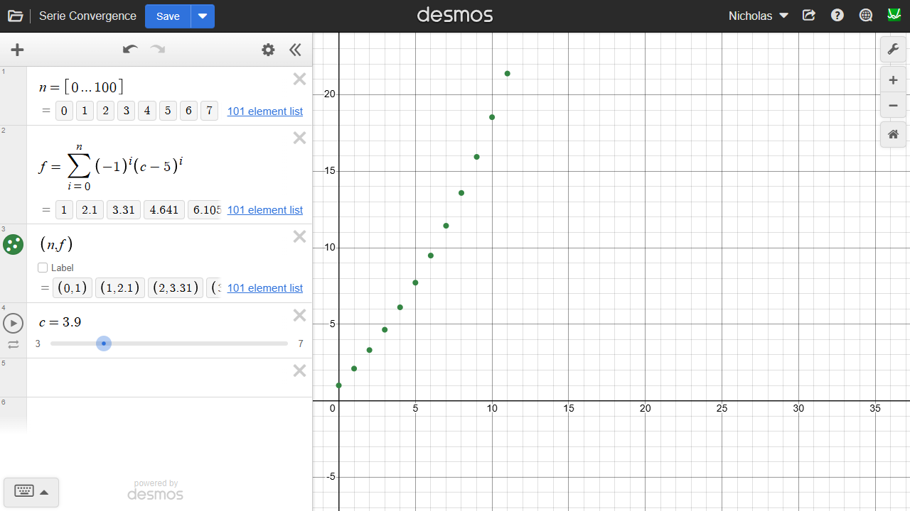
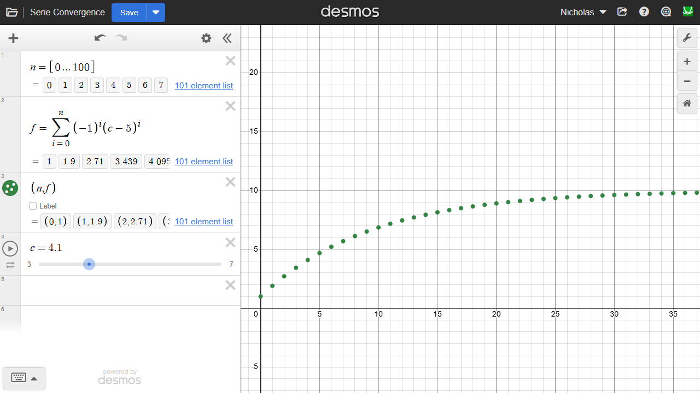
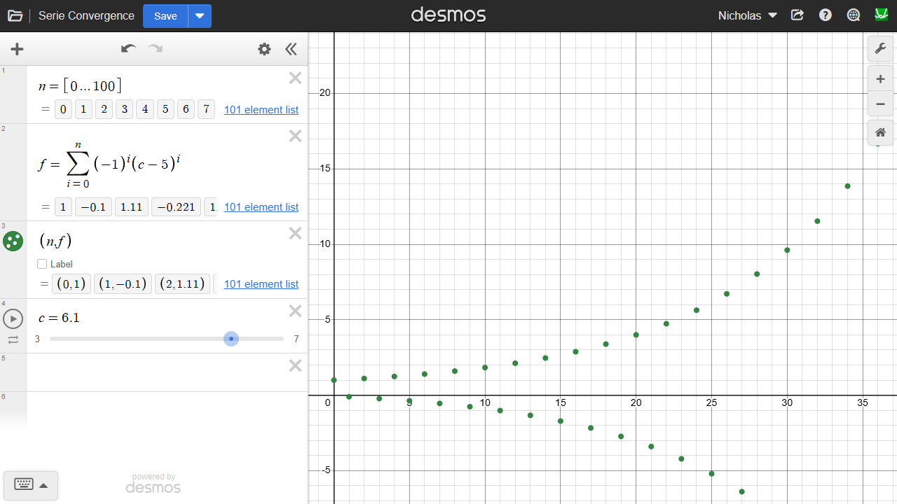

---
Classification	        :	Formula-Based Exercise
Discipline				:	MAT015 Equações Diferenciais A
Source					:	Workbook for Dummies - Chapter 8
Description				:	Q1-4
---

# Proposition
Check if the following series converges. If so, find its interval of convergence.

a) $\sum_{n=0}^{\infty} (-1)^n (x-5)^n$

b) $\sum_{n=0}^{\infty} (-1)^n (x-1)^n$

c) $\sum_{n=0}^{\infty} (x-2)^{-n}$

d) $\sum_{n=0}^{\infty} (x-1)^{-n}$

# Step-by-step
## General
$$\sum_{n=0}^{\infty} a_n(x-x_0)^n$$
$$\text{Se} \lim_{n \to \infty} \left| \frac{a_{n+1}(x-x_0)^{n+1}}{a_n(x-x_0)^n} \right| < 1 \text{ , a série converge}$$

---

$| \text{expression} | < \text{number}$ yields a single interval ("between").
$$|f(x)| < c \implies -c < f(x) < c$$

$| \text{expression} | > \text{number}$ yields two separate intervals ("outside").
$$|f(x)| > c \implies f(x) < -c \quad \cup \quad f(x) > c$$

## d 
$$\sum_{n=0}^{\infty} (x-1)^{-n} = \sum_{n=0}^{\infty} \left(\frac{1}{x-1}\right)^n$$
$$\text{Se} \lim_{n \to \infty} \left| \frac{1^{n+1}\left(\frac{1}{x-1}\right)^{n+1}}{1^n\left(\frac{1}{x-1}\right)^n} \right| < 1 \text{ , a série converge}$$
$$\lim_{n \to \infty} \left| \frac{1^{n+1}\left(\frac{1}{x-1}\right)^{n+1}}{1^n\left(\frac{1}{x-1}\right)^n} \right| = \left| \frac{1}{x-1} \right|$$
$$\left| \frac{1}{x-1} \right| < 1$$
$$\left[\left| \frac{1}{x-1} \right| < 1\right]^{-1}$$
$$|x-1| > 1$$
$$x-1 < -1 \quad \cup \quad x-1 > 1$$
$$x-1+1 < -1+1 \quad \cup \quad x-1+1 > 1+1$$
$$x < 0 \quad \cup \quad x > 2$$

### Graphical representation of the series

# Answers
a) Converges. Interval of convergence: $4 < x < 6$.

b) Converges. Interval of convergence: $0 < x < 2$.

c) Converges. Interval of convergence: $x < 1 \cup x > 3$.

d) Converges. Interval of convergence: $x < 0 \cup x > 2$.

# Attempts
2026-03-08T16:15:28Z 0
2026-03-09T12:59:22Z 1
2026-03-10T18:01:09Z 1
2026-03-12T14:34:11Z 1
2026-03-16T14:50:00Z 1
2026-03-26T15:49:03Z 1
2026-04-13T15:31:24Z 1
