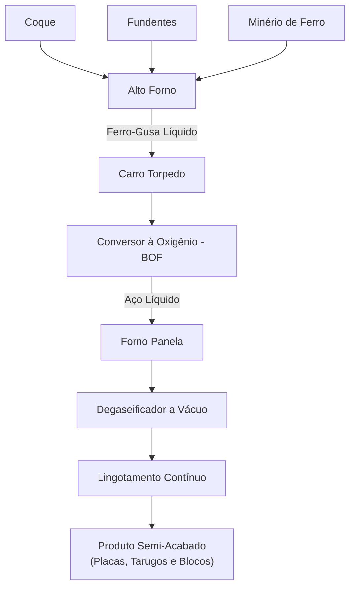
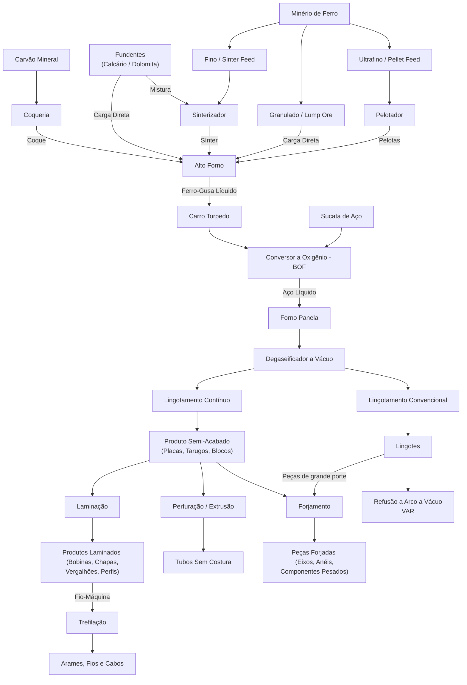
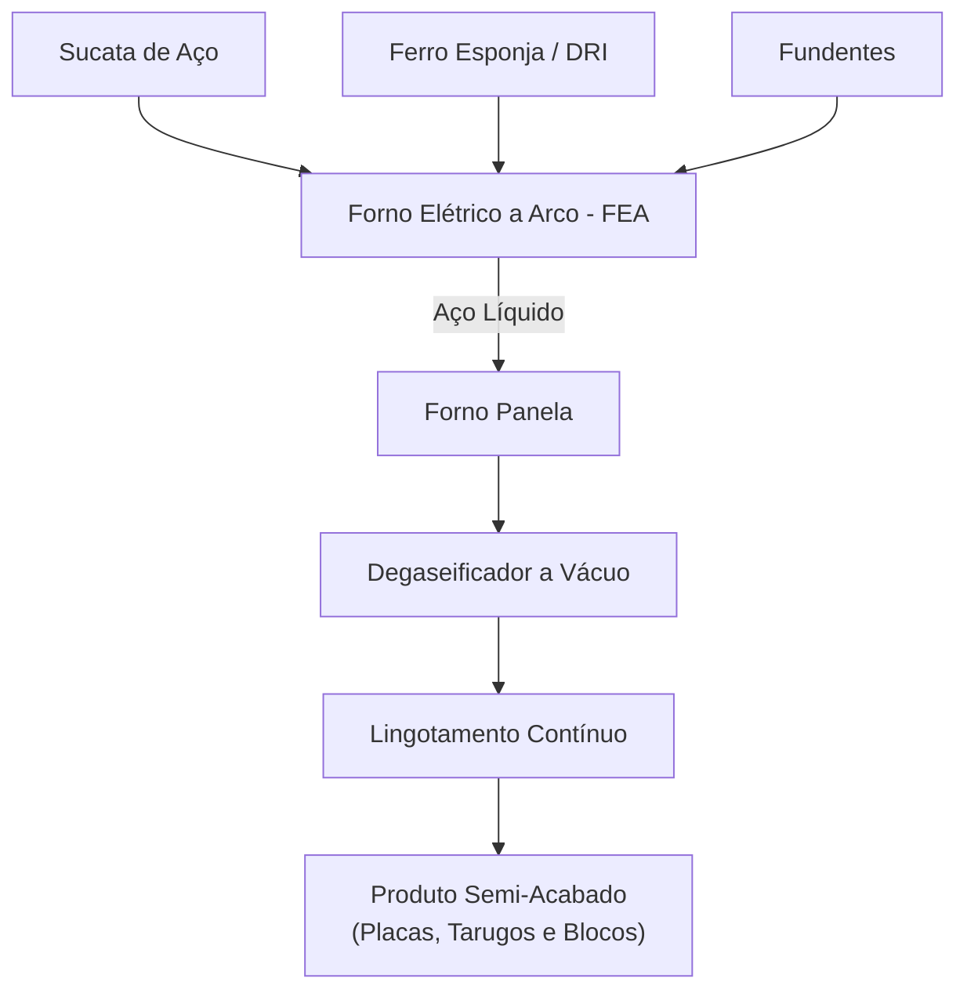

---
Classification	        :	Notes
Discipline				:	EMA090 Processos Primários de Fabricação
Source					:	Aula 1 - 2026-03-02
Description				:	Diagramas de processo de fabricação de aço
---

# No metal líquido

**Pelotização**
- Etapa: preparo de carga
- Entrada: minério de ferro em pó (partículas menores que 0,15mm)
- Saída: pelotas

**Sinterização**
- Etapa: preparo de carga
- Entrada: minério de ferro em pó (partículas de 0,15mm a 6,3mm)
- Saída: sínter

**Coqueria**
- Etapa: preparo de carga
- Entrada: carvão mineral
- Saída: coque

**Alto forno**
- Etapa: redução
- Entrada: minério de ferro (em forma de sínter, pelotas ou minério bruto), coque e fundentes.
- Saída: ferro-gusa, escória e gases

Observação sobre o minério de ferro: o minério de ferro que entra no alto forno deve possuir um tamanho específico. Durante a extração do minério, é obtido pedaços no tamanho ideal, que são inseridos diretamente no alto forno, mas também em pó, que precisa ser sinterizado antes de entrar no alto forno

Observação sobre o aquecimento do alto forno: o alto forno não é aquecido externamente. O ar superaquecido reage com o coque, gerando calor (combustão) e monóxido de carbono. Esse gás é o agente redutor que reage com o minério de ferro, removendo seu oxigênio e transformando-o em ferro metálico (ferro-gusa).

Observação sobre o coque: algumas siderurgias (minoria) utilizam o carvão vegetal, não necessitando a coqueria.

**Carro torpedo**
- Etapa: transporte do alto forno para o conversor de oxigênio
- Entrada: ferro-gusa líquido
- Saída: ferro-gusa líquido
- Processos possíveis: remoção de impurezas grosseira (dessulfuração)

**Conversor à oxigênio (Basic Oxygen Furnace - BOF)**
- Etapa: metalurgia primária
- Entrada: ferro-gusa líquido, sucata de aço, oxigênio puro e fundentes
- Saída: aço líquido altamente oxidado e escória (composta principalmente por óxidos de ferro e silício, além de fósforo)
- Processos possíveis: controle de temperatura, ajuste de composição química (correção grosseira do teor de carbono. Não há adição de elementos de liga), remoção de impurezas sólidas (desfosforação apenas, pois remoção de fósforo necessita de muita oxidação)

**Forno panela**
- Etapa: metalurgia secundária
- Entrada: aço líquido oxidado
- Saída: aço líquido melhorado
- Processos possíveis: controle de temperatura, ajuste de composição química (correção fina do teor de carbono e adição dos elementos de liga), remoção de impurezas sólidas (dessulfuração apenas, pois remoção de enxofre necessita de baixa oxidação) e remoção de gases dissolvidos (oxigênio) por via química (adição de elementos desoxidantes metálicos, como alumínio)

**Degaseificador a vácuo (etapa opcional)**
- Etapa: metalurgia secundária
- Entrada: aço líquido
- Saída: aço líquido
- Processos possíveis: remoção de gases dissolvidos (hidrogênio, nitrogênio e oxigênio) por via física (redução da pressão)

**Lingotamento contínuo ou convencional**
- Etapa: solidificação
- Entrada: aço líquido
- Saída: produtos semiacabados (definidos pelo formado, como placas, tarugos ou blocos) no caso do lingotamento contínuo, ou lingotes no caso do lingotamento convencional

**Forno VAR (etapa opcional)**
- Etapa: refusão especial
- Entrada: lingotes de aço
- Saída: lingotes de aço de alta qualidade

Observação: o forno VAR utiliza os lingotes produzidos no lingotamento convencional como eletrodos para a refusão do aço, o que permite a obtenção de lingotes de aço de alta qualidade, com baixo teor de impurezas e gases dissolvidos, e microestrutura homogênea.

**Glossário**
- **Ferro-gusa:** ferro bruto que pode ser utilizado para fabricação de ferro fundido ou aço
- **Coque:** carvão mineral purificado, utilizado como combustível e agente redutor na produção de ferro-gusa
- **Carro torpedo:** veículo com isolamento térmico que anda sobre trilhos. É utilizado para transportar o ferro-gusa líquido do alto forno para o conversor à oxigênio.
- **Desoxidação:** processo de remoção de oxigênio do aço líquido
- **Dessulfuração:** processo de remoção de enxofre do aço líquido
- **Desfosforação:** processo de remoção de fósforo do aço líquido
- **Fundentes:** também chamados de limpadores, tem a função de reagir com as impurezas para gerar escória. Geralmente calcário ou dolomita.
- **Segregação:** concentração desigual de elementos de liga

## Relações entre Impurezas e Propriedades Mecânicas

* **Fósforo (P) e Tenacidade a Frio:** O fósforo tende a se segregar nos contornos de grão do aço, enrijecendo a matriz metálica de forma prejudicial e causando o que a metalurgia chama de "fragilidade a frio". A remoção do fósforo (desfosforação no conversor BOF) aumenta diretamente a **tenacidade** do material, impedindo que a peça sofra fraturas frágeis (quebradiças) quando exposta a baixas temperaturas.
* **Enxofre (S) e Ductilidade (Fragilidade a Quente):** O enxofre reage com o ferro formando sulfeto de ferro ($FeS$). Esse composto tem baixo ponto de fusão e se concentra nos contornos de grão. Quando o aço é aquecido para ser trabalhado ou entra em serviço em alta temperatura, esse sulfeto derrete, causando a "fragilidade a quente" (o aço trinca facilmente). A remoção do enxofre no forno panela melhora substancialmente a **ductilidade** e a resistência à tração.
* **Hidrogênio (H) e Integridade Estrutural:** O hidrogênio dissolvido no aço líquido causa dois problemas distintos dependendo da etapa do processo: durante a solidificação, a queda drástica na capacidade do metal de reter o gás faz com que ele seja expulso, formando bolhas que ficam aprisionadas e geram **porosidades** na peça fundida; já no aço totalmente sólido, os minúsculos átomos de hidrogênio que restaram conseguem se mover (difundir) pela estrutura cristalina até se acumularem em microcavidades, onde se recombinam formando o gás hidrogênio ($H_2$), gerando uma pressão interna colossal que rasga o material de dentro para fora e causa **trincas** internas conhecidas como flocos (fragilização por hidrogênio).
* **Oxigênio (O) / Nitrogênio (N) e Resistência à Fadiga:** O oxigênio e o nitrogênio reagem com outros elementos do aço para formar inclusões não metálicas (como óxidos e nitretos, que são partículas duras e estranhas à matriz metálica). Essas inclusões funcionam como pontos de concentração de tensão (microfissuras em potencial). Retirar esses gases reduz essas inclusões, o que aumenta drasticamente a **resistência à fadiga**, permitindo que a peça suporte ciclos repetitivos de carga por muito mais tempo sem falhar.
* **Defeitos de Solidificação e Isotropia (Processo VAR):** Processos de fundição normais geram porosidade no centro do lingote e "segregação". O processo de refusão VAR elimina esses buracos e uniformiza a química do material. O resultado é a obtenção de **propriedades isotrópicas**, ou seja, o aço terá a mesma excelente resistência, ductilidade e tenacidade independentemente da direção em que a força for aplicada.

# Diagrama simplificado (🔥alto forno)

**Em 1 linha**
(Coque + Fundentes + Minério de Ferro) ➔ Alto Forno ➔ Carro Torpedo ➔ Conversor à Oxigênio (BOF) ➔ Forno Panela ➔ Degaseificador a Vácuo ➔ Lingotamento Contínuo

# Diagrama completo (🔥alto forno)

# Diagrama simplificado (⚡forno elétrico)
