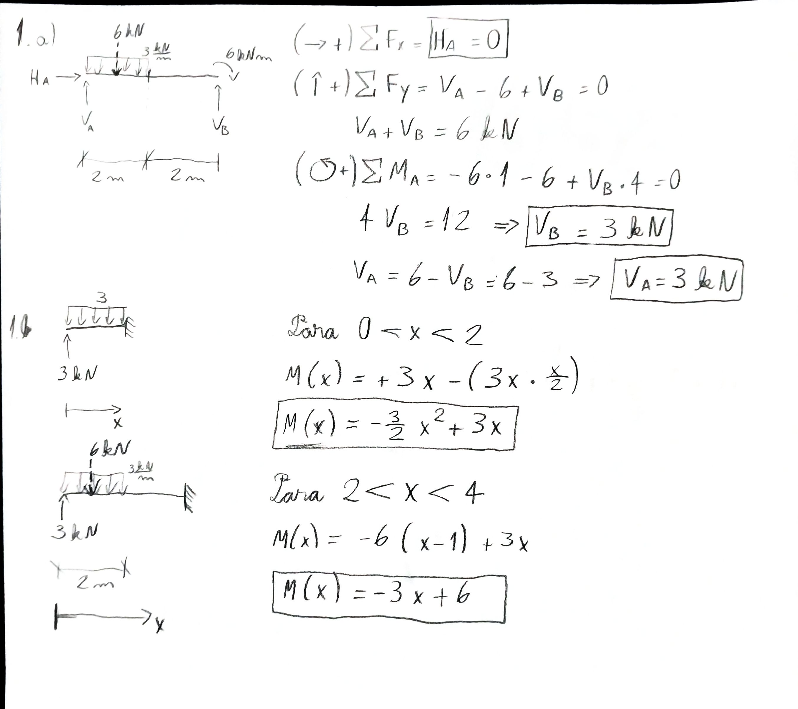
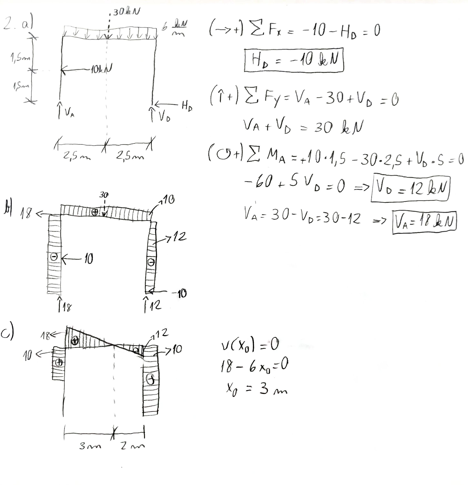
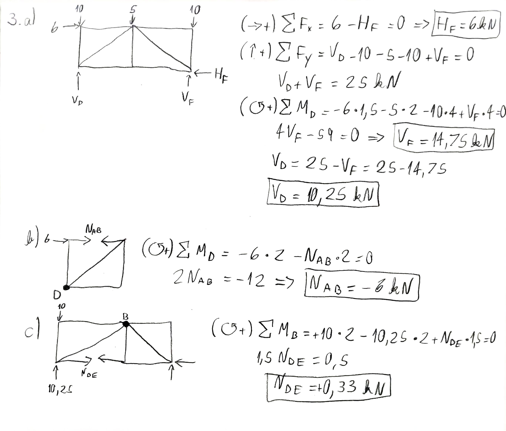

---
Classification	        :	Formula-Based Exercise
Discipline				:	EES039 Análise Estrutural
Source					:	2024-2_P1
Description				:	
---

# Proposition
## Questão 1
Para a viga indicada na figura:

a) Calcular as reações de apoio;
b) Formular a(s) equação(ões) de momentos fletores tomando-se como referência a coordenada $x$.

Descrição da imagem:
O diagrama exibe uma viga horizontal apoiada nas extremidades. Na extremidade esquerda, há um apoio fixo nomeado A. Na extremidade direita, há um apoio móvel nomeado B. Sobre a viga atua uma carga distribuída uniforme de $3\text{ kN/m}$ direcionada verticalmente para baixo, com início no apoio A e estendendo-se por um trecho de $2\text{ m}$. O trecho adjacente, que vai do fim da carga distribuída até o apoio B, não possui cargas transversais e também mede $2\text{ m}$ de comprimento. No apoio B, é aplicado um momento concentrado no sentido horário com a magnitude de $6\text{ kN.m}$. Abaixo do esquema, uma seta horizontal indica a coordenada $x$ com origem no apoio A e sentido positivo para a direita.

## Questão 2
Para o pórtico plano da figura:

a) Calcular as reações de apoio; 
b) Traçar o diagrama de forças axiais ($N$); 
c) Traçar o diagrama de esforço cortante ($V$).

Descrição da imagem:
O diagrama apresenta a estrutura de um pórtico plano com quatro nós identificados por A, B, C e D. O nó A encontra-se na base esquerda e é representado por um apoio móvel, possuindo restrição apenas na direção vertical. A partir do nó A, eleva-se um pilar vertical até o nó B. Há uma força pontual horizontal de $10 \text{ kN}$ aplicada da direita para a esquerda no ponto médio deste pilar. As cotas indicam que a distância vertical do nó A até o ponto de aplicação da força é de $1,5 \text{ m}$, e deste ponto até o nó B é de mais $1,5 \text{ m}$. Conectada ao nó B, uma viga horizontal estende-se para a direita até o nó C, apresentando um vão de $5 \text{ m}$. Ao longo de todo o comprimento da viga BC, atua uma carga uniformemente distribuída de $6 \text{ kN/m}$ com direção vertical e sentido para baixo. A partir do nó C, um pilar vertical desce até o nó D, localizado no mesmo nível do nó A. O nó D é representado por um apoio fixo na base.

## Questão 3
Para a treliça plana da figura:

a) Calcular as reações de apoio;
b) Determinar a força axial na barra AB;
c) Determinar a força axial na barra DE.

Descrição da imagem:
A imagem exibe um diagrama de uma treliça plana retangular composta por seis nós, rotulados de A a F.
Os nós A, B e C estão localizados na parte superior da estrutura, ordenados da esquerda para a direita.
Os nós D, E e F estão localizados na parte inferior da estrutura, ordenados da esquerda para a direita e alinhados verticalmente abaixo dos nós A, B e C, respectivamente.
A treliça é formada pelas seguintes barras estruturais: barras horizontais superiores AB e BC; barras horizontais inferiores DE e EF; barras verticais AD, BE e CF; e barras diagonais conectando B a D e B a F.
A distância horizontal da barra DE é de $2\text{ m}$, e a distância da barra EF também é de $2\text{ m}$. A altura vertical da treliça, especificada ao lado da barra CF, é de $1,5\text{ m}$.
A estrutura possui dois apoios em sua base. No nó D, há um apoio móvel e no nó F, há um apoio fixo.
As cargas externas aplicadas à treliça são as seguintes: uma carga horizontal de $6\text{ kN}$ aplicada no nó A, com sentido para a direita; uma carga vertical de $10\text{ kN}$ aplicada no nó A, com sentido para baixo; uma carga vertical de $5\text{ kN}$ aplicada no nó B, com sentido para baixo; e uma carga vertical de $10\text{ kN}$ aplicada no nó C, com sentido para baixo.

# Step-by-step
## Questão 1

## Questão 2

## Questão 3

## Gemini
### Questão 1
#### Equações Fundamentais
As equações gerais de equilíbrio estático para um corpo rígido no plano estabelecem que a soma das forças e a soma dos momentos devem ser nulas:
$$\sum F_x = 0$$
$$\sum F_y = 0$$
$$\sum M = 0$$

#### Hipóteses e Considerações
* Corpo rígido plano em equilíbrio estático.
* Ausência de cargas ativas na direção horizontal.
* O apoio A ( $x = 0$ ) é de 2º gênero: restringe translações horizontais ($H_A$) e verticais ($V_A$).
* O apoio B ( $x = 4\text{ m}$ ) é de 1º gênero: restringe apenas a translação vertical ($V_B$).
* A força resultante da carga distribuída é equivalente à área do carregamento e atua no centroide dessa área.

#### Equações Simplificadas
Aplicando as considerações acima ao nosso sistema, obtemos as equações de equilíbrio específicas para esta viga:
$$H_A = 0$$
$$V_A + V_B - q \cdot L_1 = 0$$
$$V_B \cdot L - (q \cdot L_1) \cdot \frac{L_1}{2} - M_B = 0$$

#### (a) Reações de Apoio

Avaliando o equilíbrio de forças na direção horizontal. Como não há cargas horizontais atuando, a reação no apoio fixo é zero:
$$\sum F_x = 0$$
$$\boxed{H_A = 0\text{ kN}}$$

Avaliando o equilíbrio de momentos adotando o ponto A como polo. A carga distribuída gera uma força concentrada equivalente de $(3 \cdot 2)\text{ kN}$ atuando no centroide do carregamento (distância de $1\text{ m}$ de A). Adiciona-se o momento concentrado no ponto B (sentido horário, logo, com mesmo sinal da carga distribuída):
$$\sum M_A = 0$$
$$V_B (4) - (3 \cdot 2)\left(\frac{2}{2}\right) - 6 = 0$$
Desenvolvendo a equação para isolar e encontrar $V_B$:
$$4 V_B - 6(1) - 6 = 0$$
$$4 V_B - 12 = 0$$
$$4 V_B = 12$$
$$\boxed{V_B = 3\text{ kN}}$$

Avaliando o equilíbrio de forças verticais. A soma das reações de apoio deve igualar a força total da carga distribuída:
$$\sum F_y = 0$$
$$V_A + V_B - (3 \cdot 2) = 0$$
Substituindo o valor encontrado para $V_B$ ($3\text{ kN}$):
$$V_A + 3 - 6 = 0$$
$$\boxed{V_A = 3\text{ kN}}$$

#### (b) Equações de Momentos Fletores

**Trecho 1: $0 \leq x \leq 2\text{ m}$**

Realizando um corte genérico na seção dentro do trecho com carga distribuída e impondo o equilíbrio de momentos internos:
$$\sum M_{\text{seção}} = 0$$
O momento fletor interno $M(x)$ equilibra o momento gerado pela reação $V_A$ e o momento gerado pela parcela da carga distribuída até o ponto de corte $x$:
$$M(x) - V_A \cdot x + (3 \cdot x)\left(\frac{x}{2}\right) = 0$$
Substituindo $V_A = 3\text{ kN}$ e simplificando:
$$M(x) - 3x + 1.5x^2 = 0$$
Isolando $M(x)$:
$$\boxed{M(x) = 3x - 1.5x^2 \quad (\text{kN}\cdot\text{m})}$$

**Trecho 2: $2 < x \leq 4\text{ m}$**

Realizando um corte no segundo trecho da viga (sem carga distribuída). O equilíbrio de momentos considera a totalidade da carga distribuída, cuja resultante $(3 \cdot 2)$ encontra-se a uma distância $(x - 1)$ do corte:
$$\sum M_{\text{seção}} = 0$$
$$M(x) - V_A \cdot x + (3 \cdot 2)(x - 1) = 0$$
Substituindo $V_A = 3\text{ kN}$ e distribuindo a multiplicação:
$$M(x) - 3x + 6(x - 1) = 0$$
$$M(x) - 3x + 6x - 6 = 0$$
Agrupando os termos semelhantes de $x$:
$$M(x) + 3x - 6 = 0$$
Isolando $M(x)$ para obter a equação final do segundo trecho:
$$\boxed{M(x) = 6 - 3x \quad (\text{kN}\cdot\text{m})}$$

### Questão 2
####(a) Reações de Apoio

**Equações Fundamentais:**
> **Comentário:** As três equações da estática garantem que o pórtico não translade nem rotacione no plano.
$$\sum F_x = 0$$
$$\sum F_y = 0$$
$$\sum M = 0$$

**Hipóteses/Considerações:**
* Estrutura plana em equilíbrio estático.
* Apoio A (móvel): $H_A = 0$, $V_A \neq 0$.
* Apoio D (fixo): $H_D \neq 0$, $V_D \neq 0$.
* Convenção de sinais: Forças para a direita ($\rightarrow$) e para cima ($\uparrow$) são positivas. Momentos no sentido anti-horário ($\circlearrowleft$) são positivos.
* Carga pontual no pilar AB: $F = 10\text{ kN}$ aplicada a $1,5\text{ m}$ da base, sentido da direita para a esquerda ($\leftarrow$).
* Carga distribuída na viga BC: $q = 6\text{ kN/m}$ aplicada ao longo de $5\text{ m}$, sentido para baixo ($\downarrow$).

**Cálculos:**
> **Comentário:** Utilizando o nó D como polo de referência para o somatório de momentos, eliminamos as incógnitas do apoio fixo e isolamos a reação vertical do apoio A. Consideramos o braço de alavanca de $5\text{ m}$ para $V_A$, $1,5\text{ m}$ para a carga $F$, e a resultante da carga distribuída concentrada no meio do vão da viga ($2,5\text{ m}$).
$$\sum M_D = 0$$
$$-V_A(5) + F(1,5) + (q \cdot 5)(2,5) = 0$$
$$-5V_A + 10(1,5) + (6 \cdot 5)(2,5) = 0$$
$$-5V_A + 15 + 75 = 0$$
$$5V_A = 90$$
$$\boxed{V_A = 18\text{ kN} (\uparrow)}$$

> **Comentário:** O somatório de forças horizontais opõe a reação do apoio D à carga pontual $F$ que atua no pilar esquerdo.
$$\sum F_x = 0$$
$$H_A + H_D - F = 0$$
$$0 + H_D - 10 = 0$$
$$\boxed{H_D = 10\text{ kN} (\rightarrow)}$$

> **Comentário:** O somatório de forças verticais equilibra as reações verticais em A e D com a resultante da carga retangular distribuída atuante na viga BC.
$$\sum F_y = 0$$
$$V_A + V_D - (q \cdot 5) = 0$$
$$18 + V_D - (6 \cdot 5) = 0$$
$$18 + V_D - 30 = 0$$
$$\boxed{V_D = 12\text{ kN} (\uparrow)}$$

####(b) Diagrama de Forças Axiais ($N$)

**Equações Fundamentais:**
> **Comentário:** O esforço axial em uma seção é o somatório de todas as forças com direção paralela ao eixo longitudinal da barra até aquela seção.
$$N = \sum F_{\text{axial}}$$

**Hipóteses/Considerações:**
* Esforços de tração são positivos ($+$).
* Esforços de compressão são negativos ($-$).
* A análise segue o caminhamento A $\rightarrow$ B $\rightarrow$ C $\rightarrow$ D.

**Cálculos:**
> **Comentário:** No pilar AB, a força axial é constante e igual à reação vertical que "empurra" o pilar contra o nó B, gerando compressão.
$$N_{AB} = -V_A$$
$$\boxed{N_{AB} = -18\text{ kN}}$$

> **Comentário:** Na viga BC, a força axial é a soma das forças horizontais à direita (ou à esquerda). A força $H_D$ é equilibrada pela força pontual $F$, resultando em compressão constante de $10\text{ kN}$ ao longo da viga.
$$N_{BC} = -H_D + F$$
$$N_{BC} = -10 + 0$$
$$\boxed{N_{BC} = -10\text{ kN}}$$

> **Comentário:** No pilar CD, a força axial é resistida pela reação vertical $V_D$, que comprime este trecho.
$$N_{CD} = -V_D$$
$$\boxed{N_{CD} = -12\text{ kN}}$$

####(c) Diagrama de Esforço Cortante ($V$) 

**Equações Fundamentais:**
> **Comentário:** O esforço cortante em uma seção é igual ao cortante inicial somado à integral da carga transversal distribuída ao longo do trecho.
$$V(x) = V(x_0) + \int_{x_0}^{x} q(s) \, ds$$

**Hipóteses/Considerações:**
* A coordenada local acompanha o eixo longitudinal de cada barra.
* Cargas transversais determinam a variação do esforço cortante.

**Cálculos:**

**Pilar AB ($0 \le y \le 3\text{ m}$):**
> **Comentário:** O pilar esquerdo não possui carga distribuída transversal, mas possui uma carga pontual no meio. Separamos em dois trechos.
$$V_{AB}(y) = H_A + \int_{0}^{y} q_{\text{transversal}}(s) \, ds$$

Para $0 \le y < 1,5\text{ m}$:
> **Comentário:** Antes da carga de $10\text{ kN}$, o cortante é nulo pois $H_A = 0$.
$$V_{AB} = 0 + \int_{0}^{y} 0 \, ds$$
$$V_{AB} = 0$$

Para $1,5 < y \le 3,0\text{ m}$:
> **Comentário:** Após a aplicação da carga horizontal, ocorre um salto no diagrama de cortante, mantendo-se constante até o nó B.
$$V_{AB} = 0 + 10 + \int_{1,5}^{y} 0 \, ds$$
$$\boxed{V_{AB}(y) = \begin{cases} 0, & 0 \le y < 1,5\text{ m} \\ 10\text{ kN}, & 1,5 < y \le 3,0\text{ m} \end{cases}}$$

**Viga BC ($0 \le x \le 5\text{ m}$):**
> **Comentário:** A viga horizontal possui uma carga transversal constante para baixo, o que resulta em um esforço cortante com variação linear (uma reta inclinada).
$$q(x) = -6\text{ kN/m}$$
$$V_{BC}(0) = V_A = 18\text{ kN}$$
$$V_{BC}(x) = 18 + \int_{0}^{x} (-6) \, ds$$
$$V_{BC}(x) = 18 + \left[ -6s \right]_{0}^{x}$$
$$\boxed{V_{BC}(x) = 18 - 6x \text{ (em kN)}}$$

> **Comentário:** Calculando os valores nas extremidades da viga para facilitar o traçado do diagrama:
$$V_{BC}(0) = 18\text{ kN}$$
$$V_{BC}(5) = 18 - 6(5) = -12\text{ kN}$$

**Pilar CD ($0 \le y \le 3\text{ m}$, sentido C $\rightarrow$ D):**
> **Comentário:** O pilar direito sofre cisalhamento constante provocado unicamente pela reação horizontal do apoio fixo D, pois não há cargas aplicadas diretamente ao longo de sua extensão.
$$V_{CD} = H_D$$
$$\boxed{V_{CD} = 10\text{ kN}}$$

### Questão 3
#### Equações Fundamentais e Forma Geral
As equações gerais de equilíbrio estático estabelecem que a resultante das forças e a resultante dos momentos em relação a qualquer ponto devem ser nulas para garantir que a estrutura não esteja transladando nem rotacionando.
$$\sum \vec{F} = \vec{0}$$
$$\sum \vec{M}_O = \vec{0}$$

**Hipóteses e Considerações:**
- O sistema encontra-se em equilíbrio estático.
- Treliça plana ideal: rótulas sem atrito e cargas aplicadas exclusivamente nos nós.
- As barras estão sujeitas apenas a esforços axiais de tração ou compressão.
- O apoio D é móvel (restringe a translação vertical: $R_{Dy}$).
- O apoio F é fixo (restringe a translação vertical e horizontal: $R_{Fy}$, $R_{Fx}$).
- Convenção de sinais: forças para a direita e para cima são positivas; momentos no sentido anti-horário são positivos.

#### Equações Simplificadas
A partir das considerações acima, as equações vetoriais se reduzem a três equações escalares de equilíbrio no plano cartesiano (eixos x e y).
$$\sum F_x = 0$$
$$\sum F_y = 0$$
$$\sum M_z = 0$$

#### (a) Reações de apoio

Iniciamos aplicando o equilíbrio de forças na direção horizontal. Como há apenas a carga externa de 6 kN aplicada no nó A e a reação horizontal no apoio fixo F, podemos determinar o valor de $R_{Fx}$ diretamente.
$$\sum F_x = 0$$
$$6 + R_{Fx} = 0$$
$$R_{Fx} = -6\text{ kN}$$

Em seguida, aplicamos o somatório de momentos em relação ao apoio D. Escolher este ponto elimina a variável $R_{Dy}$ da equação, permitindo determinar a reação vertical no apoio F ($R_{Fy}$). As forças externas geram momentos no sentido horário (negativos), equilibrados pela reação em F.
$$\sum M_D = 0$$
$$-6(1,5) - 5(2) - 10(4) + R_{Fy}(4) = 0$$
$$-9 - 10 - 40 + 4R_{Fy} = 0$$
$$4R_{Fy} = 59$$
$$R_{Fy} = 14,75\text{ kN}$$

Agora, aplicamos o equilíbrio de forças verticais. Com $R_{Fy}$ já conhecida, subtraímos as cargas aplicadas verticalmente de cima para baixo nos nós para encontrar a reação restante no apoio móvel D ($R_{Dy}$).
$$\sum F_y = 0$$
$$R_{Dy} - 10 - 5 - 10 + R_{Fy} = 0$$
$$R_{Dy} - 25 + 14,75 = 0$$
$$R_{Dy} = 10,25\text{ kN}$$

O sinal negativo em $R_{Fx}$ indica que a força reativa aponta para a esquerda.
$$\boxed{R_{Fx} = -6\text{ kN}, \quad R_{Fy} = 14,75\text{ kN}, \quad R_{Dy} = 10,25\text{ kN}}$$

#### (b) Força axial na barra AB

Equilíbrio do nó A. Assumindo esforços de tração como positivos:
Para encontrar o esforço na barra horizontal AB, isolamos o nó A. Analisando a direção x, percebemos que apenas a carga externa de 6 kN e o esforço interno da barra atuam horizontalmente neste nó.
$$\sum F_x = 0$$
$$6 + F_{AB} = 0$$
$$F_{AB} = -6\text{ kN}$$

O sinal negativo revela que a barra está empurrando o nó A, portanto, está sob compressão.
$$\boxed{F_{AB} = -6\text{ kN} \text{ (Compressão)}}$$

#### (c) Força axial na barra DE

Método de Ritter (seção cortando AB, BD e DE). Analisando a porção à esquerda da seção e calculando o momento em relação ao nó B:
Para encontrar o esforço na barra DE de maneira eficiente, utilizamos uma seção que a atravesse e usamos o ponto B (onde as outras barras cortadas, AB e BD, se encontram) como pólo para somar os momentos. Isso anula o momento dessas duas barras, deixando apenas a força $F_{DE}$ e as forças conhecidas na equação.
A reação em D causa um momento negativo, a carga de 10 kN causa um momento positivo e a força da barra DE, atuando no braço de alavanca de 1,5 m, equilibra o sistema.
$$\sum M_B = 0$$
$$-R_{Dy}(2) + 10(2) + 6(0) + F_{DE}(1,5) = 0$$
Substituindo o valor de $R_{Dy}$ calculado anteriormente:
$$-10,25(2) + 20 + 1,5F_{DE} = 0$$
$$-20,5 + 20 + 1,5F_{DE} = 0$$
$$-0,5 + 1,5F_{DE} = 0$$
Isolando o termo da força da barra DE:
$$1,5F_{DE} = 0,5$$
$$F_{DE} = \frac{0,5}{1,5}$$
$$F_{DE} = \frac{1}{3}\text{ kN}$$

O valor positivo obtido confirma a premissa inicial do esforço como positivo, caracterizando tração.
$$\boxed{F_{DE} \approx 0,333\text{ kN} \text{ (Tração)}}$$

# Answer

# Attempts