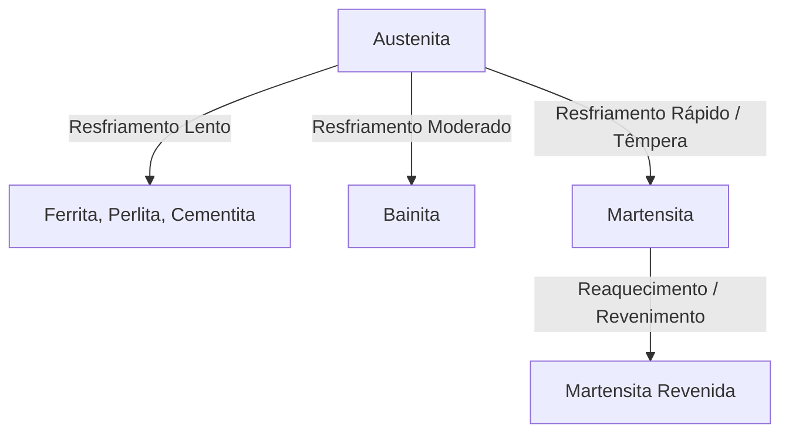
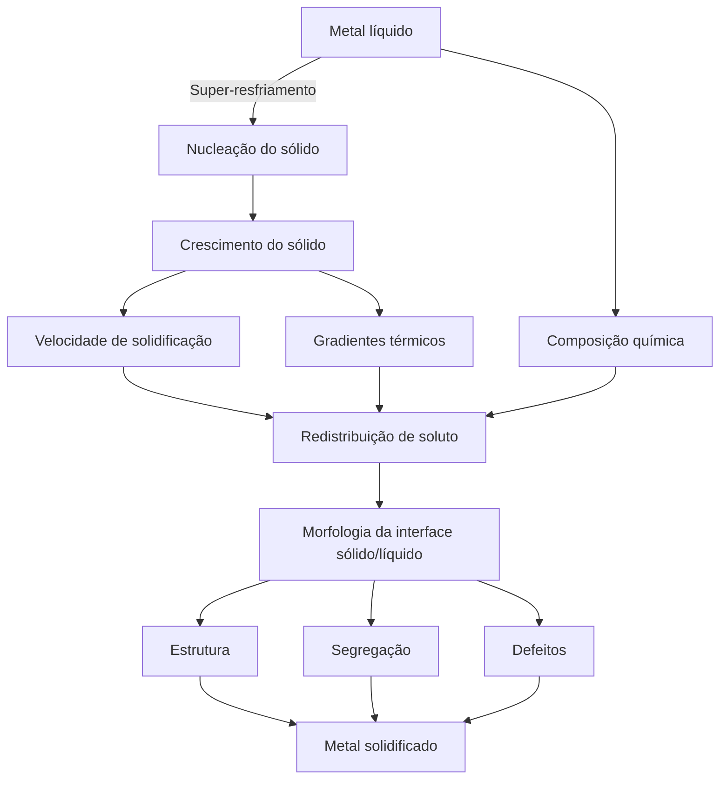

---
Classification	        :	Notes
Discipline				:	EMA090 Processos Primários de Fabricação
Source					:	Aula 2 - 2026-03-23
Description				:	Solidificação de metais
---

# Fases
Uma fase é uma porção do material que é homogênea tanto em estrutura cristalina quanto em composição química. 
- ferrita $(\alpha)$
- austenita $(\gamma)$
- cementita $(Fe_3C)$
- martensita (é uma fase metaestável)

## Arranjos cristalinos das fases
O fator de empacotamento das diferentes fases exercem grande influência em sua resistência mecânica. Isso porque ele representa a densidade do metal. Mesmo apresentando exatamante a mesma composição química, se eu pegar um bloco de ferrita e outro bloco de austenita com mesma massa, o bloco de austenita vai ser menor, por ter os átomos mais compactados. Mais precisamente, o arranjo CFC apresenta 2 átomos a mais por célula.

É por isso que quando a austenita, mais densa por possuir estrutura cristalina CFC, é resfriada, o metal expande por ter assumido uma estrutura CCC, com menor massa específica.

**$\alpha$**
- CCC (Cúbica de Corpo Centrado)
- Fator de empacotamento = 68%

**$\gamma$**
- CFC (Cúbica de Face Centrado)
- Fator de empacotamento = 74%

**Martensita**
- TCC (Tetragonal de Corpo centrado)
- Fator de empacotamento = 68%
- Note que o fator de empacotamento da TCC é o mesmo da CCC. Isso porque durante o resfriamento brusco, o carbono não tem tempo de se difundir para fora da rede (que está tentando mudar de CFC para CCC). O carbono fica "preso" nos interstícios, distorcendo a rede CCC e transformando-a em TCC. É exatamente essa distorção que gera a altíssima dureza e fragilidade da martensita.
- A austenita ($\gamma$) consegue dissolver até cerca de 2,14% de carbono em seus interstícios, enquanto a ferrita ($\alpha$) dissolve no máximo 0,022%. Durante o resfriamento brusco, o carbono que estava confortável na austenita tenta fugir, mas não há tempo. Como a ferrita não tem espaço para ele, a rede distorce.

# Microconstituintes (Misturas de fases)
Um microconstituinte é uma estrutura observável no microscópio que pode ser formada por mais de uma fase misturada.
- perlita: estrutura lamelar composta por $\alpha$ e $Fe_3C$. As lamelas possuem cerca de $0.1 \text{ a } 20 \mu m$
- bainita: matriz de $\alpha$ com ripas de $Fe_3C$. As ripas possuem cerca de $0.1 nm \text{ a } 1000 nm$
  - bainita superior: formada em temperaturas mais altas, ripas mais grossas, menor resistência mecânica
  - bainita inferior: formada em temperaturas mais baixas, ripas mais finas, maior resistência mecânica

**Como desenhar os microconstituintes**
- Perlita: desenhe o grão como um quadrado com bordas onduladas. Desenha várias faixas uniformemente espaçadas, como faixas de zebra. Elas devem ser escuras e claras. As faixas escuras devem ter uma seta indicando a cementita e as claras a ferrita.
- Bainita: desenhe o grão como um quadrado com bordas onduladas. Desenhe riscos de vários tamanhos e direções. O fundo branco deve ser indicado por uma seta como ferrita e os riscos como cementita.

**Resistência mecânica da perlita vs bainita**
A bainita apresenta dureza e limite de escoamento muito superior à perlita, tanto por causa do tamanho de seus componentes (as ripas por serem muito menores e mais dispersas que as lamelas, são muito mais eficientes na movimentação de discordâncias) e da orientação, pois direção aleatória das ripas de cementita da bainita dificulta distorções, lembrando concreto reforçado com fibra de vidro.

# Transformação de fases

Existem dois tipos de transformação de fases:
1. Nucleação e crescimento
2. Displaciva

## Nucleação e crescimento
É um processo **difusional**, ou seja, é térmico e temporal (depende da temperatura inicial e do tempo)

$$\text{Equação de Johnson-Mehl-Avrami-Kolmogorov (JMAK)}$$

$$f(t) = 1 - \exp(-kt^n)$$

**De qual para qual** 
Da Austenita $(\gamma)$ para Perlita, Bainita ou Ferrita/Cementita.

**Como funciona**
Você resfria a austenita até uma certa temperatura e espera o tempo $t$ passar (a equação de JMAK modela apenas transformações isotérmicas). O $k$ e o $n$ são constantes que dependem da temperatura de patamar.

## Displaciva
É um processo **não difusional**, ou seja, é atérmico e atemporal (não depende da temperatura inicial ou do tempo).
Os termos atérmico e atemporal podem causar confusão. 'Atérmico' indica que o processo depende da variação da temperatura $\Delta T$ e não da temperatura $t$ como nas transformações por nucleação e crescimento. Enquanto 'atemporal' indica que o processo acontece extremamente rápido $(< 0.1s)$

$$\text{Equação de Koistinen-Marburger}$$

$$f(\Delta T) = 1 - \exp(-1.1 \cdot 10^{-2} \Delta T)$$

**De qual para qual**
Da Austenita $(\gamma)$ exclusiva e diretamente para Martensita.

**Como funciona**
Aqui, o tempo não importa. O que importa é o quanto você resfriou abaixo da temperatura de início da transformação martensítica (chamada de $M_s$).

**O que é o $\Delta T$**
$\Delta T = M_s - T$ (onde $T$ é a temperatura atual). A cada grau que a temperatura cai abaixo de $M_s$, uma nova fração de martensita se forma instântaneamente pelo cisalhamento da rede.

## Observações
- Note que a fórmula para nucleação e crescimento depende dp tempo $t$, enquanto a displaciva depende da variação de temperatura $\Delta T$.
- As funções $f(t)$ e $f(\Delta T)$ representam a fração transformada de uma fase em outra

# Diagramas relevantes
**Diagrama de equilíbrio FeC**

**Diagrama TTT (Tempo-Temperatura-Transformação)**

**Diagrama TRC (Transformação por Resfriamento Contínuo)**

# Algoritmo de solidificação de um metal líquido
