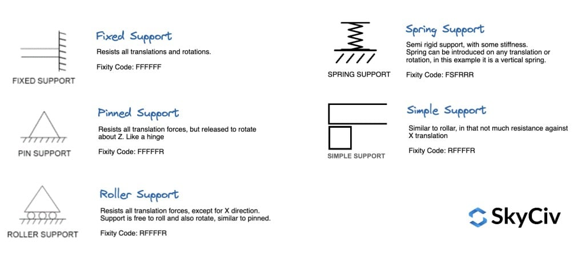
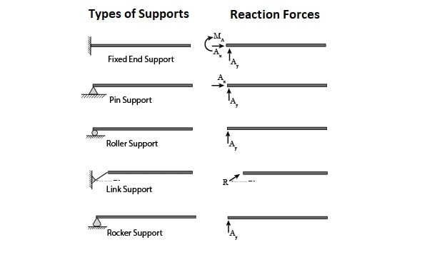
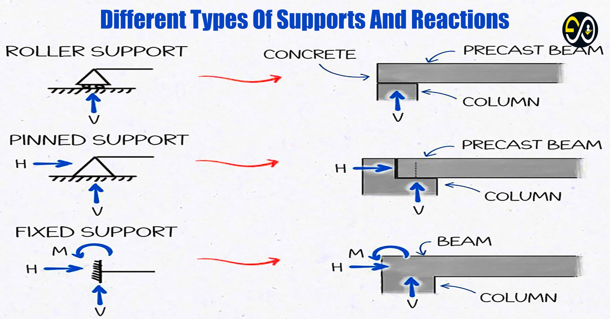

---
Classification	        :	Notes
Discipline				:	EES039 Análise Estrutural
Source					:	Aula 3 - 2026-03-19
Description				:	
---

- [https://skyciv.com/docs/tutorials/beam-tutorials/types-of-supports-in-structural-analysis/](https://skyciv.com/docs/tutorials/beam-tutorials/types-of-supports-in-structural-analysis/)

