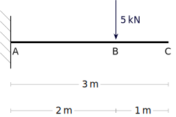
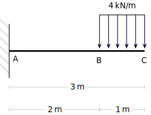
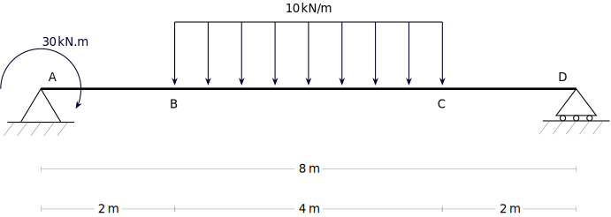

---
Classification	        :	Formula-Based Exercise
Discipline				:	EES039 Análise Estrutural
Source					:	Aula 4 - 2026-03-24
Description				:	
---

# Proposition

Calcule as reações de apoio:

## Viga em balanço 1

## Viga em balanço 2

## Viga bi-apoiada

# Step-by-step

## Considerações iniciais / Hipóteses simplificadoras por tipo de estrutura
- A estrutura é do tipo viga, ou seja, $\sum F_x = \sum F_z = \sum M_x = \sum M_y = 0$
- A estrutura é do tipo treliça plana, ou seja, $\sum F_z = \sum M_x = \sum M_y = 0$
- A estrutura é do tipo pórtico plano, ou seja, $\sum F_z = \sum M_x = \sum M_y = 0$
- A estrutura é do tipo grelha, ou seja, $\sum F_x = \sum F_y = \sum M_z = 0$

## Passo a passo
1. Identificar os apoios e as cargas aplicadas na estrutura.
2. Desenhar o diagrama de corpo livre para cálculo de reações de apoio. Isso envolve
    - Substituir os apoios fixos por forças de reação em X e Y
    - Substituir os apoios móveis por forças de reação apenas em Y
    - Substituir os apois engastados por forças de reação em X e Y e um momento de reação
3. Substituir cargas distribuídas (de formar retangular ou triangular) por cargas pontuais equivalentes, aplicadas no centro de massa da distribuição.

Ponto importante: o comprimento do braço ao calcular o momento é a distância entre duas linhas paralelas, uma passando pelo ponto onde o momento é calculado e outra passando pela linha de ação da força. Em outras palavras, se a força está na horizontal, a distância é medida na vertical, e vice-versa.

## Definições
**Vetores deslizantes e livres**
As forças podem são classificadas como vetores deslizantes, enquanto os momentos são classificados como vetores livres.
Durante a análise dos diagramas de carga e de corpo livre esses conceitos são úteis para entender as reações e os momentos de apoio. Para fazer isso, basta imaginar as forças deslizando no eixo que elas se originam ou os momentos se movendo livremente na estrutura que eles atuam.

Atenção: esse conceito só se aplica quando estamos fazendo cálculos de equilíbrio (reação de apoio), mas não cálculos de esforços internos (cortante, momento fletor, etc).

**Momentos são compostos por vetores binários**
Um momento é composto por um par de forças iguais, opostas e desfasadas. Por exemplo, um momento $M_x$ é composto por um par de forças $F_A$ e $F_B$, onde $F_A$ é igual a $-F_B$.

**Cargas com braço de alavanca igual a 0**
No somatório dos momentos, todas as forças são consideradas mas, geralmente, as que possuem braço de alavanca igual a 0 são omitidas.

**Regra da mão direita**
Um momento no plano xy gera um momento resultante na direção z. Isso pode ser verificado usando a regra da mão direita: se você fizer um jóia com a mão direita e colocar os 4 dedos no sentido de giro do momento, o polegar apontará para a direção do momento resultante.

**Equações de Equilíbrio**
$$\sum \vec{F} = 0 \qquad \sum \vec{M} = 0$$
$$\vec{F} = F_x \hat{i} + F_y \hat{j} + F_z \hat{k}$$ 
$$\vec{M} = M_x \hat{i} + M_y \hat{j} + M_z \hat{k}$$
$$\sum F_x = 0, \sum F_y = 0, \sum F_z = 0$$
$$\sum M_x = 0, \sum M_y = 0, \sum M_z = 0$$

**Do diagrama de cargas para o de corpo livre**
Enquanto o diagrama de cargas mostra os apoios, o diagrama de corpo livre é uma simplificação, onde os apoios são substituídos por forças de reação

## Considerações iniciais / Hipóteses simplificadoras
- Eixo X na horizontal, positivo para direita
- Eixo Y na vertical, positivo para cima.
- Eixo Z perpendicular ao plano xy, positivo para fora do plano. 
- Sentido anti-horário positivo para rotações e momentos, conforme a regra da mão direita em relação ao sentido positivo de cada eixo.

- Estrutura isostática
- O peso e o deslocamento dos elementos estruturais e apoios são desprezíveis.
- A estrutura é do tipo viga, ou seja, $\sum F_x = \sum F_z = \sum M_x = \sum M_y = 0$

## Viga em balanço 1
$$\sum F_x = H_A = 0$$
$$H_A = 0$$

---

$$\sum F_y = V_A + (-5[kN]) = 0$$
$$V_A = 5 \text{ kN}$$

---

$$\sum M_{z,A} = M_A + (-5[kN] \cdot 2[m]) = 0$$
$$M_A = 10 \text{ kN.m}$$

## Viga em balanço 2
$$\sum F_x = H_A = 0$$
$$H_A = 0$$

---

$$\sum F_y = V_A + (-4[kN]) = 0$$
$$V_A = 4 \text{ kN}$$

---

$$\sum M_{z,A} = M_A + (-4[kN] \cdot 2,5[m]) = 0$$
$$M_A = 10 \text{ kN.m}$$

## Viga bi-apoiada
$$\sum F_x = H_A = 0$$
$$H_A = 0$$

---

$$\sum F_y = V_A + V_B - 40[kN] = 0$$
$$V_A + V_B = 40 [kN]$$

---

$$\sum M_{z,A} = -30[kNm] - 40[kN] \cdot 5[m] + V_B \cdot 10[m] = 0$$
$$V_B = \frac{30[kNm] + 200[kNm]}{10[m]} = 23 [kN]$$
$$V_A = 40[kN] - V_B = 40[kN] - 23[kN] = 17 [kN]$$

# Answer

# Attempts
2026-03-24T23:00:00Z 0
2026-03-26T23:00:00Z 1
2026-04-07T17:26:21Z 1