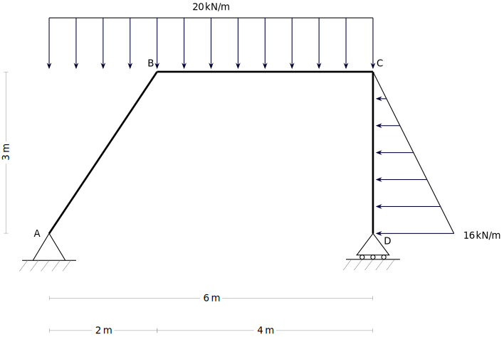
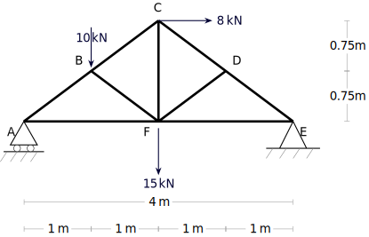

---
Classification	        :	Formula-Based Exercise
Discipline				:	EES039 Análise Estrutural
Source					:	Aula 5 - 2026-03-26
Description				:	
---

# Proposition

Calcule as reações de apoio:

## Questão 1

## Questão 2

# Step-by-step
A força pontual equivalente de uma carga triangular, assim como uma carga retangular é simplesmente a área da forma que representa a distribuição da carga.

## Questão 1

$$\sum F_x = H_A = 0$$
$$H_A = 0$$

---

$$\sum F_y = V_A + V_D - 120 [kN] = 0$$
$$V_A + V_D = 120 [kN]$$

---

$$\sum M_{z,A} = (-120 [kN] \cdot 3 [m]) + (+ 24 [kN] \cdot 1 [m]) + (+V_D \cdot 6 [m]) = 0$$
$$V_D = \frac{360 [kNm] - 24 [kNm]}{6 [m]} = 56 [kN]$$
$$V_A = 120 [kN] - V_D = 120 [kN] - 56 [kN] = 64 [kN]$$

## Questão 2

$$\sum F_x = (+8 [kN]) + (-H_E) = 0$$
$$H_E = 8 [kN]$$

---

$$\sum F_y = (+V_A) + (+V_E) + (-10 [kN]) + (-15 [kN]) = 0$$
$$V_A + V_E = 25 [kN]$$

---

$$\sum M_{z,E} = (-V_A \cdot 4 [m]) + (+10 [kN] \cdot 3 [m]) + (+15 [kN] \cdot 2 [m]) + (-8 [kN] \cdot 1,5 [m]) = 0$$
$$V_A = 12 [kN]$$
$$V_E = 25 [kN] - V_A = 25 [kN] - 12 [kN] = 13 [kN]$$

# Answer

# Attempts
2026-03-26T23:00:00Z 0
2026-03-27T19:48:24Z 1
2026-04-07T17:48:26Z 1