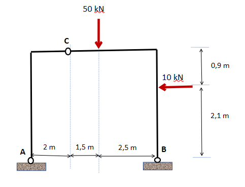
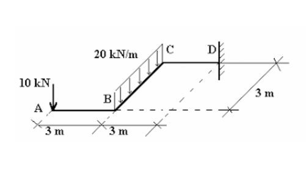
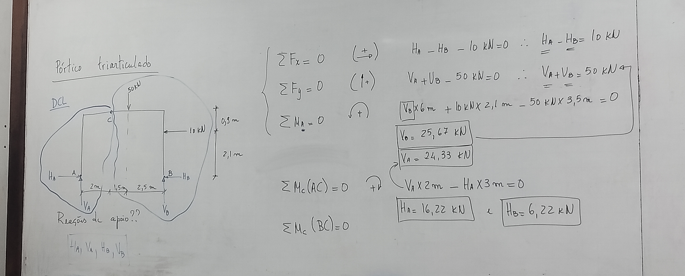
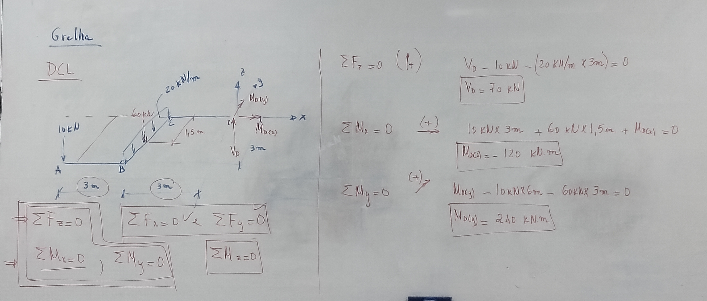

---
Classification	        :	Formula-Based Exercise
Discipline				:	EES039 Análise Estrutural
Source					:	Aula 6 - 2026-03-31
Description				:	
---

# Proposition
Calcule as reações de apoio:

## Questão 1

## Questão 2

# Step-by-step

## Questão 1

$$(+ \rightarrow) \sum F_x = (+H_A) + (-H_B) + (-10 [kN]) = 0$$
$$H_A = H_B + 10 [kN]$$

---

$$(+ \uparrow) \sum F_y = (+V_A) + (+V_B) + (-50 [kN]) = 0$$
$$V_A + V_B = 50 [kN]$$

---

$$(+ \circlearrowleft) \sum M_{zA} = (-50 [kN] \cdot 3,5 [m]) + (+10 [kN] \cdot 2,1 [m]) + (+V_B \cdot 6 [m]) = 0$$
$$V_B = \frac{50 \cdot 3,5 - 10 \cdot 2,1}{6} = \frac{175 - 21}{6} = \frac{154}{6} = 25,67 [kN]$$
$$V_A = 50 [kN] - V_B = 50 [kN] - 25,67 [kN] = 24,33 [kN]$$

---

$$(+ \circlearrowleft) \sum M_{zC} = (+H_A \cdot 3 [m]) + (-V_A \cdot 2 [m]) = 0$$
$$H_A = \frac{V_A \cdot 2}{3} = \frac{24,33 \cdot 2}{3} = 16,22 [kN]$$
$$H_B = H_A - 10 [kN] = 16,22 [kN] - 10 [kN] = 6,22 [kN]$$

## Questão 2

$$(+ \uparrow) \sum F_z = (-10 [kN]) + (-60 [kN]) + (+V_D) = 0$$
$$V_D = 70 [kN]$$

---

$$(+ \circlearrowleft) \sum M_{xD} = (+10 [kN] \cdot 3 [m]) + (+60 [kN] \cdot 1,5 [m]) + M_{RxD} = 0$$
$$M_{RxD} = -(10 \cdot 3 + 60 \cdot 1,5) = -(30 + 90) = -120 [kNm]$$

---

$$(+ \circlearrowleft) \sum M_{yD} = (-10 [kN] \cdot 6 [m]) + (-60 [kN] \cdot 3 [m]) + M_{RyD} = 0$$
$$M_{RyD} = 10 \cdot 6 + 60 \cdot 3 = 60 + 180 = 240 [kNm]$$

# Answer
a) $\boxed{H_A = 16,22 [kN], V_A = 24,33 [kN], H_B = 6,22 [kN], V_B = 25,67 [kN]}$

b) $\boxed{V_D = 70 [kN], M_{RxD} = -120 [kNm], M_{RyD} = 240 [kNm]}$

# Attempts
2026-03-31T23:00:00Z 0
2026-04-07T18:17:03Z 0
2026-04-13T18:23:15Z 1
