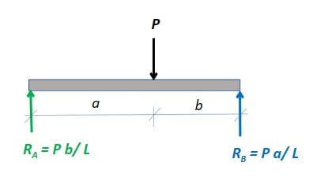
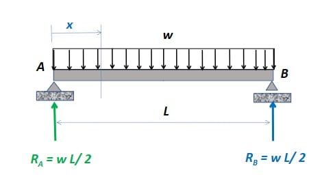
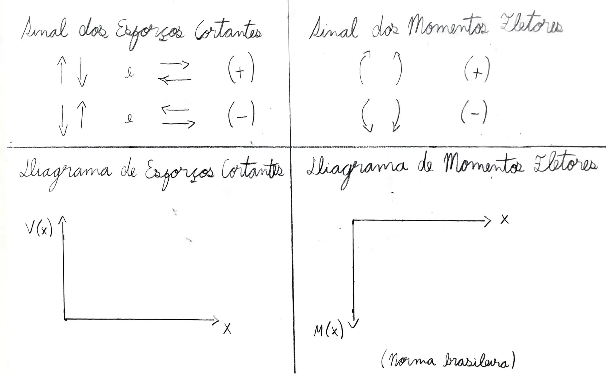
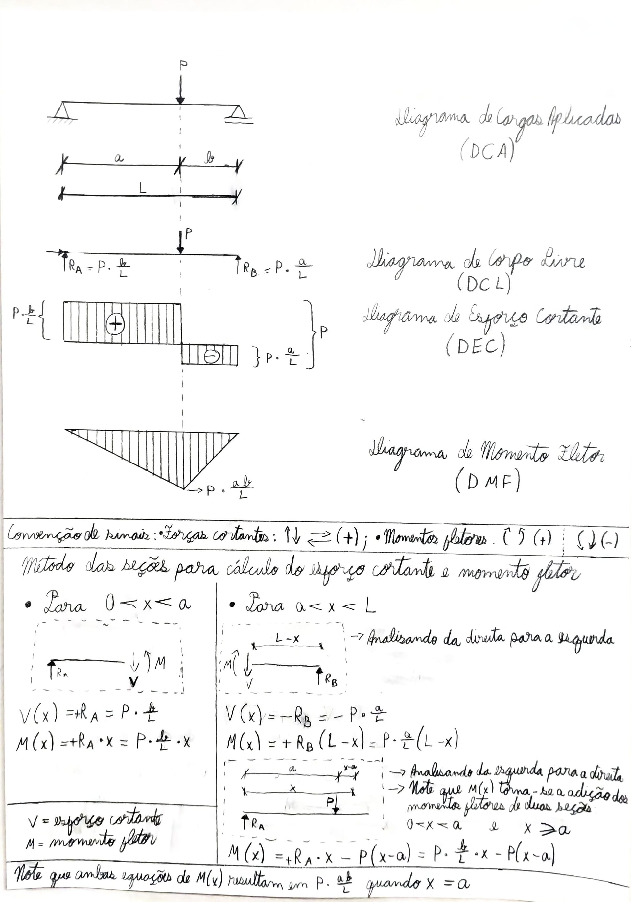
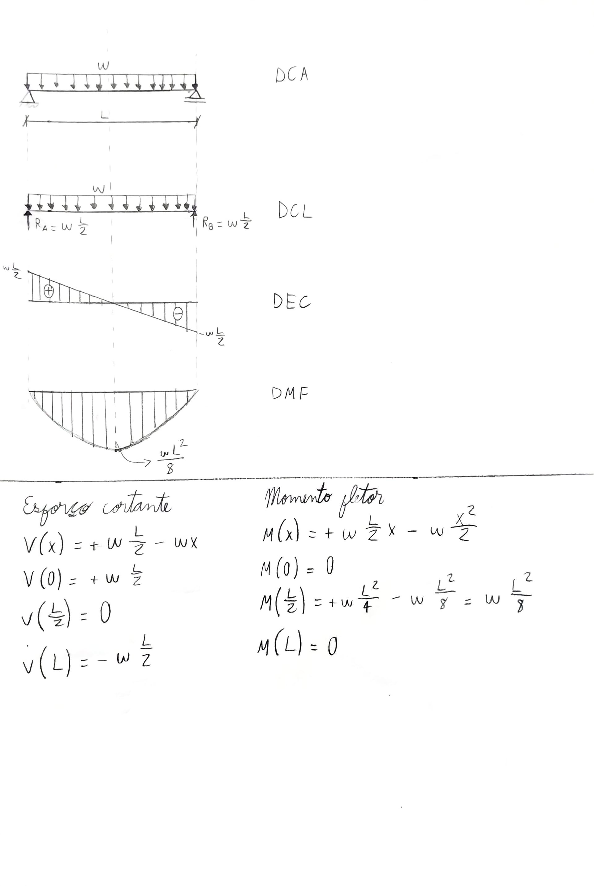

---
Classification	        :	Formula-Based Exercise
Discipline				:	EES039 Análise Estrutural
Source					:	Aula 8 - 2026-04-07
Description				:	
---

# Proposition

Desenhe os diagramas de esforços cortantes e momentos fletores para as seguintes vigas biapoiadas:

## Viga biapoiada com carga pontual

## Viga biapoiada com carga distribuída

# Step-by-step 
(para desenhar os diagramas de esforços internos solicitantes)

## Geral
1. Descrever as cargas em função da posição $x$ ao longo da viga
2. Descrever as condições de contorno para determinar as constantes de integração. (Exemplo: $V(0) = R_1$, $M(0) = 0$, $V(L) = -R_2$, $M(L) = 0$)
3. Integrar a função da carga para obter a função do esforço cortante, lembrando de adicionar a constante de integração
4. Integrar a função do esforço cortante para obter a função do momento fletor, lembrando de adicionar a constante de integração

$$w(x) = \text{cargas em função da posição } x$$

$$\frac{dV}{dx} = -w(x) \implies V(x) = -\int w(x) dx + c_1$$

$$\frac{d^2M}{dx^2} = -w(x) \implies M(x) = +\int V(x) dx + c_2$$

$$M(x) = \int \left( -\int w(x) dx + c_1 \right) dx + c_2 = - \iint w(x) dx^2 + c_1 x + c_2$$

O valor físico dessas constante dependem inteiramente do tipo de apoio ou das condições de contorno onde você colocou a origem do seu eixo $x$. Por exemplo, $c_1$, no caso de uma viga biapoiada, é a reação do apoio esquerdo, enquanto $c_2$ é o momento de reação do apoio esquerdo. Como a viga é biapoiada, o momento de reação é zero, ou seja, $c_2 = 0$. Em contraste à isso, em uma viga engastada, $c_1$ seria a reação vertical do apoio engastado, enquanto $c_2$ seria o momento de reação do apoio engastado, que não é zero.

**Cargas pontuais**
Se houver **cargas pontuais** ou **momentos concentrados** aplicados no meio do vão da viga, a função $w(x)$ sofre uma descontinuidade. Nesses casos, há duas opções: dividir a viga em trechos (integrando e achando constantes novas para cada trecho antes e depois da carga) ou utilizar as **Funções de Singularidade (Funções de Macaulay)**, que permitem descrever a viga inteira em uma única equação de integração.

## Análise geral dos diagramas de esforços internos
**Diagramas**
- DCA = Diagrama de Cargas Aplicadas
- DCL = Diagrama de Corpo Livre
- DEC = Diagrama de Esforços Cortantes
- DMF = Diagrama de Momentos Fletores

- Quando a carga é pontual:
  - DEC constante
  - DMF linear
- Quando a carga é distribuída:
  - DEC linear
  - DMF quadrático
- Quando a carga é triangular:
  - DEC quadrático
  - DMF cúbico

## Convenções

**Sinais dos esforços cortantes e momentos fletores**
Observação: Não há distinção entre as convenções norte-americana e brasileira.

**Diagrama de Momentos Fletores**
Enquanto a convenção norte-americana desenha o eixo Y, dos momentos fletores, com sentido positivo para cima, a convenção brasileira desenha o eixo Y com sentido positivo para baixo.

Em outras palavras, na convenção brasileira, o momento fletor é sempre desenhado do lado das fibras tracionadas (lado que sofre tração).

## Outras anotações

A curvatura de uma viga em qualquer ponto é proporcional ao momento fletor naquele ponto. A equação simplificada (para pequenas deflexões) é:

$$M(x) = EI \frac{d^2v}{dx^2}$$

Onde:
* **$E$**: Módulo de elasticidade do material.
* **$I$**: Momento de inércia da seção transversal.
* **$v$**: Deflexão (deslocamento vertical).
* **$M(x)$**: Momento fletor na posição $x$.

### 1. The Point Load: The "Staircase" Effect
When you have a point load in the middle of a beam, there is **zero load** acting on the sections between the support and that point.

* **Mathematically:** Since $w(x) = 0$, the change in shear ($\frac{dV}{dx}$) is zero. If the rate of change is zero, the value must remain constant.
* **Physically:** Imagine walking across a bridge. If no one is standing on the first half of the bridge, the internal "stress" (shear) doesn't change because no new weight is being added to your "running total" until you reach that person standing in the middle.

### 2. The Distributed Load: The "Ramp" Effect
With a Uniformly Distributed Load (UDL), the weight is added **continuously** at every single point along the beam.

* **Mathematically:** The load $w$ is a constant value (e.g., $5\text{ lb/ft}$). Because $\frac{dV}{dx} = -w$, the shear force has a constant slope. A constant slope creates a linear (diagonal) line.
* **Physically:** Every inch you move to the right, you are "picking up" a little more weight. If the load is $10\text{ lbs}$ per foot, then after $1\text{ foot}$ the shear has dropped by $10\text{ lbs}$. After $2\text{ feet}$, it has dropped by $20\text{ lbs}$ .This steady, relentless addition of weight causes the shear to decline in a straight, diagonal line.

### Comparison Table

+--------------------------+---------------------------------------------------+-----------------------------------------+
| Feature                  | Point Load                                        | Distributed Load (UDL)                  |
+==========================+===================================================+=========================================+
| **Load Intensity ($w$)** | Zero (between loads)                              | Constant ($w$)                          |
+--------------------------+---------------------------------------------------+-----------------------------------------+
| **Shear Diagram Shape**  | **Horizontal** (Constant)                         | **Sloped** (Linear)                     |
+--------------------------+---------------------------------------------------+-----------------------------------------+
| **Analogy**              | Walking on flat ground, then jumping off a ledge. | Walking down a steady, continuous ramp. |
+--------------------------+---------------------------------------------------+-----------------------------------------+
| **Moment Diagram**       | Linear (Triangle)                                 | Parabolic (Curve)                       |
+--------------------------+---------------------------------------------------+-----------------------------------------+

### The "Step Up" Rule
In calculus terms, every time you move from **Load $\rightarrow$ Shear $\rightarrow$ Moment**, you are integrating, which increases the "degree" of the line:
1.  **Point Load** is a singularity (Degree -1) $\rightarrow$ **Shear** is Constant (Degree 0) $\rightarrow$ **Moment** is Linear (Degree 1).
2.  **Distributed Load** is Constant (Degree 0) $\rightarrow$ **Shear** is Linear (Degree 1) $\rightarrow$ **Moment** is Quadratic (Degree 2).

Does the "running total" analogy help you visualize why the shear drops gradually for the distributed load versus all at once for the point load?

## 1
### Pelo método matemático
Descrição do problema: viga biapoiada de comprimento $L$ com carga pontual em $x=a$, sendo $L = a + b$.

$$w(x) = \text{cargas em função da posição } x$$

$$
\boxed{
w(x) =
\begin{cases} 
  0 & 0 < x < a \\
  P & x = a \\
  0 & a < x < L
\end{cases}
}
$$

---

$$\frac{dV}{dx} = -w(x) \implies V(x) = -\int w(x) dx + c_i$$

$$
V(x) =
\begin{cases} 
  \int 0 \, dx = c_1 & 0 < x < a \\
  \text{descontinuidade} & x = a \\
  \int 0 \, dx = c_2 & a < x < L
\end{cases}
$$

Condições de contorno:
- $V(0) = R_a \implies c_1 = R_a$
- $V(L) = -R_b \implies c_2 = -R_b$

$$
\boxed{
V(x) =
\begin{cases} 
  R_a & 0 < x < a \\
  \text{descontinuidade} & x = a \\
  -R_b & a < x < L
\end{cases}
}
$$

---

$$\frac{d^2M}{dx^2} = -w(x) \implies M(x) = +\int V(x) dx + c_i$$

$$
M(x) =
\begin{cases} 
  \int R_a \, dx = R_a x + c_3 & 0 < x \le a \\
  \int -R_b \, dx = -R_b x + c_4 & a < x < L \\
\end{cases}
$$

Condições de contorno:
- $M(0) = 0 \implies c_3 = 0$
- $M(L) = 0 \implies -R_b L + c_4 = 0 \implies c_4 = R_b L$

$$
\boxed{
M(x) =
\begin{cases} 
  R_a x & 0 < x \le a \\
  -R_b x + R_b L & a < x < L \\
\end{cases}
}
$$

---

**Verificação da Continuidade do Momento**
Uma ótima forma de validar o resultado é verificar se as duas equações de $M(x)$ se encontram no ponto $x = a$:

* **Pela esquerda:** $M(a) = R_a \cdot a$
* **Pela direita:** $M(a) = -R_b(a) + R_b L = R_b(L - a) = R_b \cdot b$
* **Pelo equilíbrio da viga:** $R_a = \frac{Pb}{L}$ e $R_b = \frac{Pa}{L}$
$$M(a) = \left(\frac{Pb}{L}\right)a = \left(\frac{Pa}{L}\right)b$$

* **Cortante ($V$):** O salto no ponto $x=a$ será de $V_{esq} = R_a$ para $V_{dir} = -R_b$. O "tamanho" desse salto é $R_a - (-R_b) = R_a + R_b = P$, o que está fisicamente coerente com a carga aplicada.

---

**Observação:** para ser matematicamente preciso, é necessário utilizar as funções de Macaulay(Função Delta de Dirac e a Função de Degrau de Heaviside) para descrever a carga pontual, o que torna a função $w(x)$ contínua e permite integrar normalmente sem precisar dividir a viga em trechos. No entanto, no estágio de aprendizado que estou, a abordagem de dividir a viga em trechos é mais intuitiva e fácil de seguir.

### Pelo método das seções
O gráfico de esforço cortante está invertido o valor absoluto do positivo com negativo

## 2
### Pelo método matemático
Descrição do problema: viga biapoiada de comprimento $L$ com carga uniformemente distribuída de magnitude $q$ ao longo de toda a sua extensão.

$$w(x) = \text{cargas em função da posição } x$$

$$
\boxed{
w(x) = q \quad (0 < x < L)
}
$$

---

$$\frac{dV}{dx} = -w(x) \implies V(x) = -\int w(x) dx + c_1$$

$$
V(x) = \int -q \, dx = -qx + c_1
$$

Condições de contorno e equilíbrio:
- Pela simetria da viga e do carregamento, as reações de apoio são iguais: $R_a = R_b = \frac{qL}{2}$
- $V(0) = R_a \implies -q(0) + c_1 = R_a \implies c_1 = \frac{qL}{2}$

Verificação pelo outro lado:
- $V(L) = -R_b \implies -qL + c_1 = -\frac{qL}{2} \implies c_1 = \frac{qL}{2}$

$$
\boxed{
V(x) = - qx + \frac{qL}{2}
}
$$

---

$$\frac{d^2M}{dx^2} = -w(x) \implies M(x) = \int V(x) dx + c_2$$

$$
M(x) = \int \left(- qx + \frac{qL}{2} \right) dx = -\frac{qx^2}{2} + \frac{qL}{2}x + c_2
$$

Condições de contorno:
- $M(0) = 0 \implies c_2 = 0$

Verificação pelo outro lado:
- $M(L) = 0 \implies -\frac{qL^2}{2} + \frac{qL}{2}(L) + c_2 = -\frac{qL^2}{2} + \frac{qL^2}{2} + c_2 = 0  \implies c_2 = 0 \quad$

$$
\boxed{
M(x) = \frac{qx}{2}(L - x) \quad \text{ou} \quad M(x) = - \frac{qx^2}{2} + \frac{qLx}{2} 
}
$$

---

**Verificação e Pontos de Interesse**

Como a função da carga $w(x)$ é constante, não precisamos dividir a análise da viga em trechos. As equações de $V(x)$ e $M(x)$ são contínuas e válidas para todo o domínio $0 \le x \le L$.

* **Ponto de Momento Máximo:** Ocorre exatamente onde a força cortante cruza o eixo zero ($V(x) = 0$).
    $$V(x) = 0 \implies \frac{qL}{2} - qx = 0 \implies x = \frac{L}{2}$$
* **Valor do Momento Máximo:** Substituindo $x = L/2$ na equação de $M(x)$:
    $$M_{max} = M\left(\frac{L}{2}\right) = \frac{q}{2}\left(\frac{L}{2}\right)\left(L - \frac{L}{2}\right) = \frac{qL}{4}\left(\frac{L}{2}\right) = \frac{qL^2}{8}$$
* **Cortante nos apoios:**
  * Pela esquerda $(x=0): V(0) = \frac{qL}{2} = R_a$
  * Pela direita $(x=L): $V(L) = \frac{qL}{2} - q(L) = -\frac{qL}{2} = -R_b$

**Observação:** Diferente do caso da carga pontual, a carga uniformemente distribuída não gera descontinuidades (saltos abruptos) no diagrama de esforço cortante. A função do cortante $V(x)$ se torna linear (uma reta inclinada), o que consequentemente faz com que a função do momento fletor $M(x)$ seja parabólica (uma curva de 2º grau). Por ser uma função contínua, o uso das funções de Macaulay não é necessário para este caso em específico.

### Pelo método das seções

# Answer

# Attempts
2026-04-07T23:00:00Z 0
2026-04-08T18:01:59Z 0
2026-04-13T21:41:16Z 1
