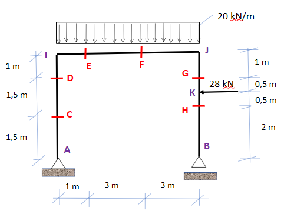
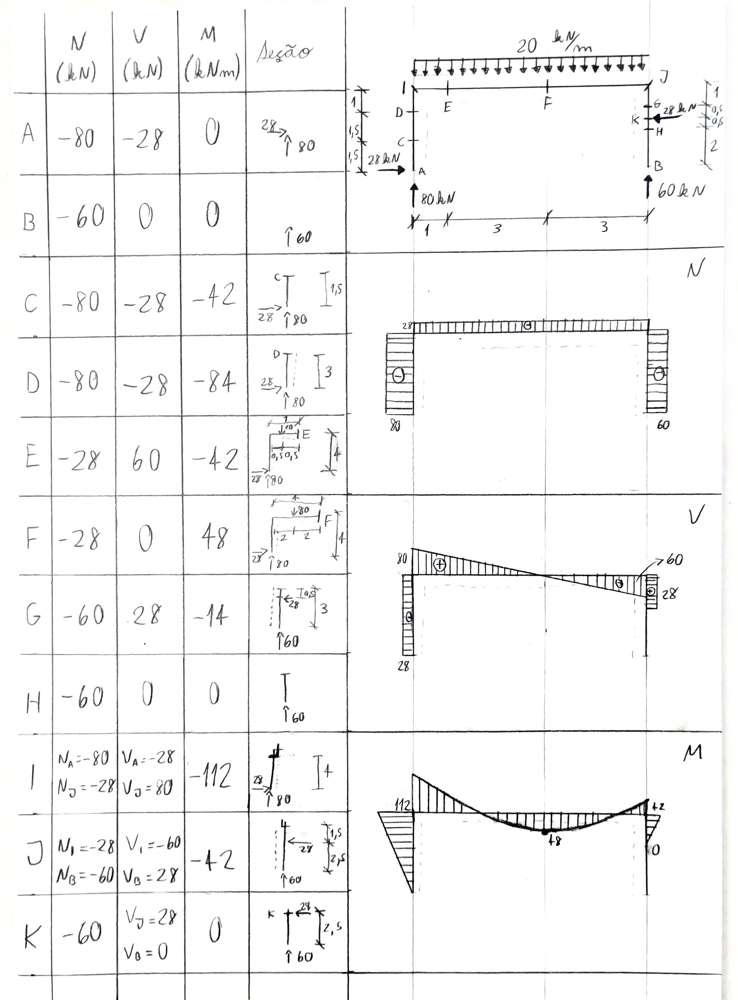

---
Classification	        :	Formula-Based Exercise
Discipline				:	EES039 Análise Estrutural
Source					:	Aula 9 e 10 - 2026-04-09 e 2026-04-14
Description				:	Esforços solicitantes em pórtico
---

# Proposition
Calcule os esforços solicitantes em todas as seções listadas (A, B, C, D, E, F, G, H, I, J, K).
Desenhe o diagrama de esforços solicitantes para a estrutura (esforços axiais, cortantes e momentos fletores).

# Step-by-step
No diagrama de momentos fletores, os momentos com valor positivo são desenhados no lado de referência da estrutura (ao contrário da norma norte-americana).

# Answer

# Attempts
2026-04-09T23:00:00Z 0
2026-04-13T21:55:12Z 0
2026-04-15T18:59:10Z 0
