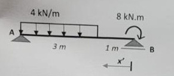
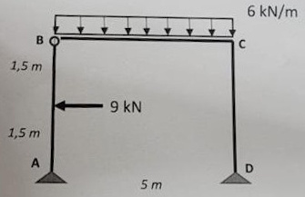
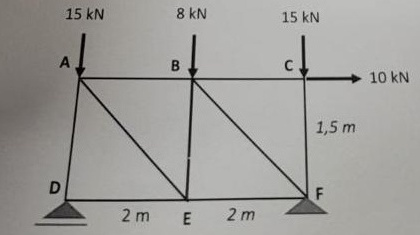
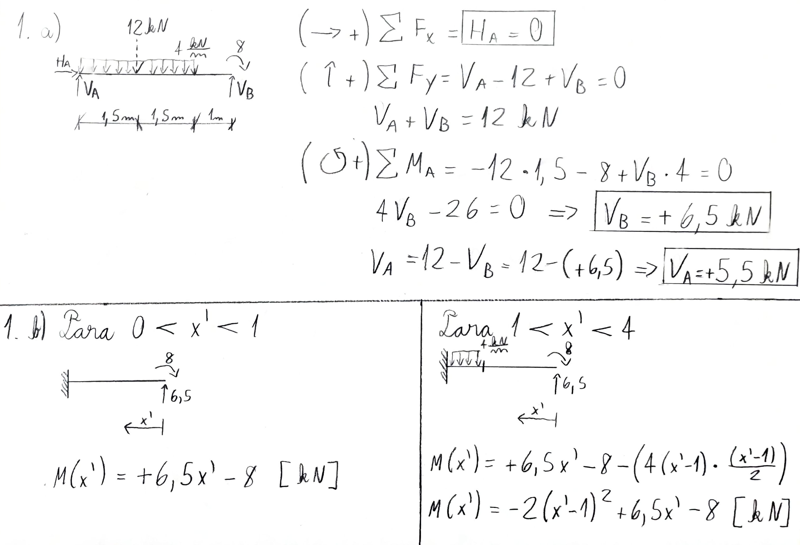
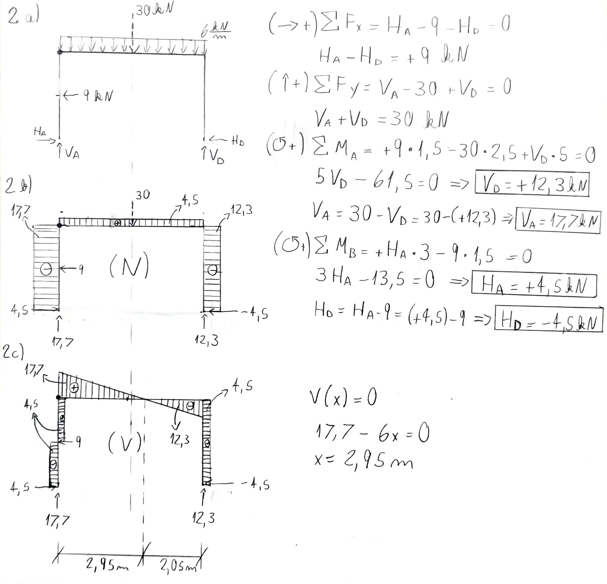
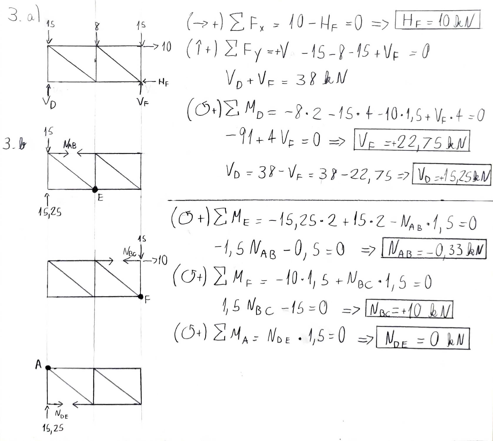

---
Classification	        :	Formula-Based Exercise
Discipline				:	EES039 Análise Estrutural
Source					:	2025-1_P1
Description				:	
---

# Proposition
## Questão 1
Para a viga indicada na figura:

a) Calcular as reações de apoio
b) Formular a(s) equação(ões) de momentos fletores tomando-se como referência a coordenada $x'$.

**Gemini description: ** A diagram shows a horizontal beam with supports at points A and B. Support A is a pin support on the left end. Support B is a roller support on the right end. A uniformly distributed downward load of $4\text{ kN/m}$ acts on the beam starting from A and extending $3\text{ m}$ to the right. The remaining $1\text{ m}$ to point B has no distributed load. At point B, there is a concentrated clockwise moment of $8\text{ kN.m}$. A coordinate axis $x'$ is shown pointing to the left, with its origin at B.

## Questão 2
Para o pórtico triarticulado da figura, onde as barras AB e BC se unem através de uma articulação em B:

a) Calcular as reações de apoio
b) traçar o diagrama de forças axiais ($N$)
c) traçar o diagrama de esforço cortante ($V$).

**Gemini description: ** A diagram shows a portal frame with nodes A, B, C, and D. Support A is a pin support at the bottom left. Member AB goes vertically upwards from A to B. An internal hinge connects member AB and the horizontal member BC at node B. Member BC goes horizontally to the right from B to C. Member CD goes vertically downwards from C to D. Support D is a pin support at the bottom right. The vertical member AB has a height of $3\text{ m}$, split into two $1,5\text{ m}$ segments. A horizontal point load of $9\text{ kN}$ acts to the left at the midpoint of member AB, which is $1,5\text{ m}$ above support A. The horizontal member BC has a length of $5\text{ m}$ and carries a uniformly distributed downward load of $6\text{ kN/m}$ over its entire length.

## Questão 3
Para a treliça plana da figura:

a) Calcular as reações de apoio; 
b) Determinar a força axial nas barras AB, BC e DE.

**Gemini description: ** A diagram shows a planar truss with six nodes. The top horizontal chord has nodes A, B, and C from left to right. The bottom horizontal chord has nodes D, E, and F from left to right. Vertical members connect nodes A to D, B to E, and C to F. Diagonal members connect node D to B, and node E to C. The horizontal distances are DE equals $2\text{ m}$ and EF equals $2\text{ m}$. The vertical height of the truss is $1,5\text{ m}$ as indicated for member CF. Support D is a pin support. Support F is a roller support. Downward vertical point loads are applied at the top nodes, $15\text{ kN}$ at A, $8\text{ kN}$ at B, and $15\text{ kN}$ at C. A horizontal point load of $10\text{ kN}$ is applied at node C acting to the right.

# Step-by-step
## Questão 1

### a
$$(\rightarrow +) \sum F_x = 0$$

$$\boxed{H_A = 0}$$

$$(\uparrow +) \sum F_y = V_A + V_B - 12 = 0$$

$$V_A + V_B = 12 [kN]$$

$$(\circlearrowleft +) \sum M_B = -8 - V_A \cdot 4 + 12 \cdot 2.5 = 0$$

$$- 8 - 4V_A + 30 = 0$$

$$4V_A = 22$$

$$\boxed{V_A = 5.5 [kN]}$$

$$V_B = 12 - V_A = 12 - 5.5$$

$$\boxed{V_B = 6.5 [kN]}$$

### b

**Para $0 < x' < 1$:**
$$\boxed{M(x') = -8 + 6.5 \cdot x' [kNm]}$$

**Para $1 < x' < 4$:**
$$M(x') = -8 + 6.5 \cdot x' - \left(\underbrace{4(x' -1)}_{\text{Carga pontual equivalente}} \cdot \underbrace{\frac{(x' - 1)}{2}}_{\text{Braço de alavanca}}\right) [kNm]$$

$$\boxed{M(x') = -8 + 6.5 \cdot x' - 2(x' - 1)^2 [kNm]}$$

## Questão 2

### a
$$(\rightarrow +) \sum F_x = H_A - H_B - 9 = 0$$

$$H_A - H_B = 9 [kN]$$

$$(\uparrow +) \sum F_y = V_A + V_B - 30 = 0$$

$$V_A + V_B = 30 [kN]$$

$$(\circlearrowleft +) \sum M_A = 9 \cdot 1.5 - 30 \cdot 2.5 + V_B \cdot 5 = 0$$

$$13.5 - 75 + 5V_B = 0$$

$$\boxed{V_B = 12.3 [kN]}$$

$$V_A = 30 - V_B = 30 - 12.3$$

$$\boxed{V_A = 17.7 [kN]}$$

$$(\circlearrowleft +) \sum M_C = H_A \cdot 3 - 9 \cdot 1.5 = 0$$

$$3H_A = 13.5$$

$$\boxed{H_A = 4.5 [kN]}$$

$$H_B = H_A - 9 = 4.5 - 9$$

$$\boxed{H_B = -4.5 [kN]}$$

### b

### c
$$V(x) = 0$$

$$17.7 - 6 \cdot x = 0$$

$$x = 2.95 [m]$$

## Questão 3

### a
$$(\rightarrow +) \sum F_x = 0$$

$$\boxed{H_F = -10 [kN]}$$

$$(\uparrow +) \sum F_y = V_D + V_F = 38 [kN]$$

$$(\circlearrowleft +) \sum M_F = - V_D \cdot 4 + 15 \cdot 4 + 8 \cdot 2 - 10 \cdot 1.5 = 0$$

$$- 4V_D + 60 + 16 - 15 = 0$$

$$4V_D = 61$$

$$\boxed{V_D = 15.25 [kN]}$$

$$V_F = 38 - V_D = 38 - 15.25$$

$$\boxed{V_F = 22.75 [kN]}$$

### b
$$(\circlearrowleft +) \sum M_E = -15.25 \cdot 2 + 15 \cdot 2 - N_{AB} \cdot 1.5 = 0$$

$$-30.5 + 30 - 1.5N_{AB} = 0$$

$$1.5N_{AB} = -0.5$$

$$\boxed{N_{AB} = -\frac{1}{3} [kN]}$$

---

$$(\circlearrowleft +) \sum M_F = -10 \cdot 1.5 + N_{BC} \cdot 1.5 = 0$$

$$-15 + 1.5N_{BC} = 0$$

$$1.5N_{BC} = 15$$

$$\boxed{N_{BC} = 10 [kN]}$$

---

$$(\circlearrowleft +) \sum M_A = N_{DE} \cdot 1.5 = 0$$

$$\boxed{N_{DE} = 0 [kN]}$$

# Answer

> Última tentativa sem ajuda (2026-04-25T16:44:24Z) feita em 1h13min

# Attempts
2026-04-20T15:09:57Z 0
2026-04-22T16:27:09Z 0
2026-04-25T16:44:24Z 1
