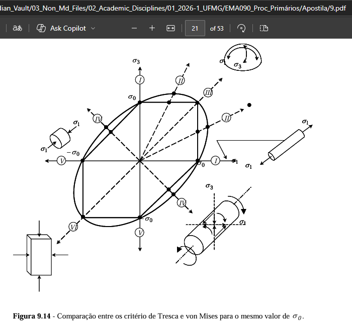
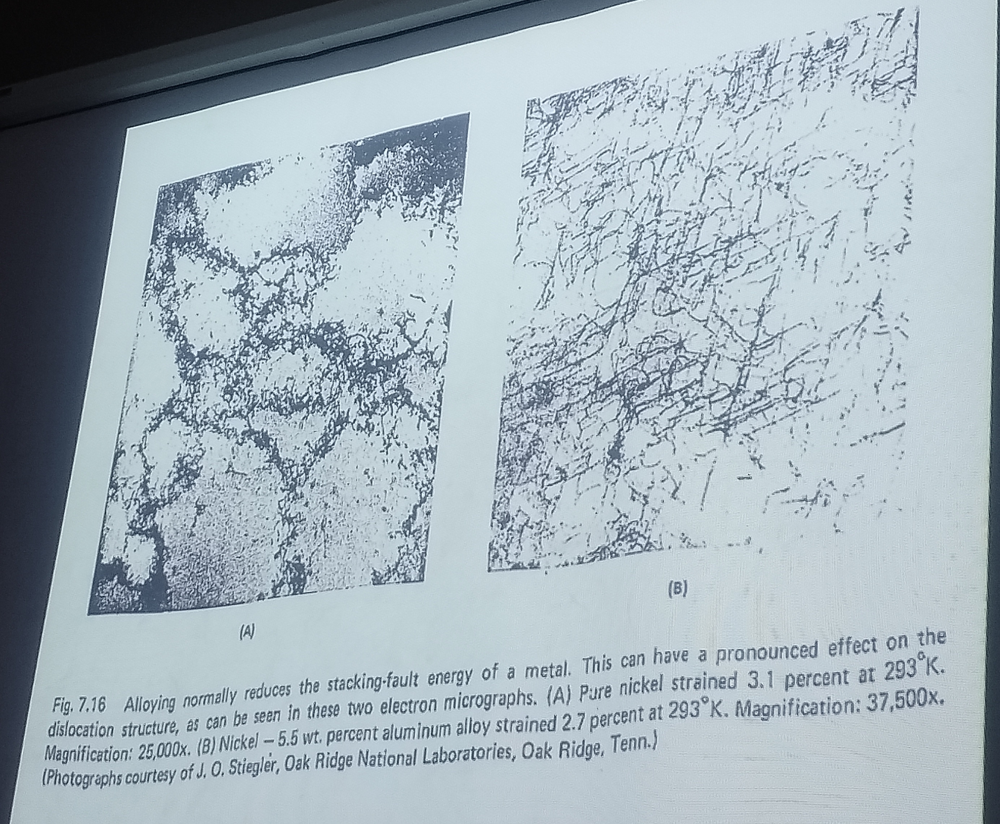

---
Classification	        :	Notes
Discipline				:	EMA090 Processos Primários de Fabricação
Source					:	Aulas para P2
Description				:	2026-04-13, 2026-04-27, 2026-05-04, 2026-05-11
---

# 2026-04-13
Introdução de algumas fórmulas ou assuntos já abordados nas aulas seguintes, ou em outros em outros documentos relacionados à prova 2 anterior.

> Veja documento 240 e 241

# 2026-04-27
## Equação de Hollomon
$$\sigma = K \epsilon^n$$

Essa é a **Equação de Hollomon**, também conhecida como a lei de potência para o encruamento. No contexto de processos primários de fabricação (como laminação, forjamento, extrusão e trefilação), ela é fundamental para descrever o comportamento dos metais durante a deformação plástica a frio.

Aqui está o que cada termo significa:

*   **$\sigma$ (Tensão Verdadeira):** Representa a carga aplicada dividida pela área da seção transversal instantânea do material.
*   **$\epsilon$ (Deformação Verdadeira):** Mede o quanto o material se alongou ou comprimiu de forma permanente.
*   **$K$ (Coeficiente de Resistência):** É uma constante que representa a tensão necessária para causar uma deformação unitária ($\epsilon = 1$).
*   **$n$ (Expoente de Encruamento):** É um valor que indica a capacidade do metal de se tornar mais resistente à medida que é deformado. Geralmente varia entre **0,1 e 0,5** para a maioria dos metais.

---

**Por que isso é importante na fabricação?**

Nos processos primários, você está forçando o metal a mudar de forma. Esta fórmula ajuda os engenheiros a:

1.  **Calcular Força e Potência:** Saber quanta pressão uma prensa de forjamento ou os rolos de uma laminadora precisam aplicar para deformar o material.
2.  **Prever o Encruamento:** Como o material fica mais duro enquanto é trabalhado, a fórmula diz o quanto a resistência dele aumentou após cada passe de laminação, por exemplo.
3.  **Avaliar a Formabilidade:** Materiais com um alto valor de $n$ (como o aço inoxidável) distribuem melhor a deformação antes de romperem ou afinarem (pescoçamento), o que é ideal para processos de estiramento.

Em resumo, ela é o "manual de instruções" matemático que diz como o metal vai reagir quando você começar a esmagá-lo ou puxá-lo na fábrica.

## Comparação entre os critérios de Tresca e von Mises

> Hexágono de Tresca e Elipse de von Mises. O critério de Tresca é mais conservador, pois considera que a falha ocorre quando a diferença entre as tensões principais atinge um valor crítico, enquanto o critério de von Mises considera a energia de distorção no material, permitindo uma maior margem antes da falha. Por isso, o critério de von Mises é mais utilizado em projetos de engenharia, pois é mais realista e menos conservador do que o critério de Tresca.

## Comparação do livre percurso médio das discordâncias no alumínio e no aço

## Categorização do tipo de trabalho de acordo com a temperatura
Tabela 9.4 - Valores típicos de temperatura, sensibilidade à taxa de deformação e coeficiente de atrito durante trabalho a frio, a morno e a quente

| Categoria         | Faixa de Temperatura | Expoente de Sensibilidade à Taxa de Deformação | Coeficiente de Atrito |
| :---------------- | :------------------- | :--------------------------------------------- | :-------------------- |
| Trabalho a Frio   | $\le 0.3 T_m$        | $0 \le m \le 0.05$                             | $0.1$                 |
| Trabalho a Morno  | $0.3 T_m - 0.5 T_m$  | $0.05 \le m \le 0.1$                           | $0.2$                 |
| Trabalho a Quente | $0.5 T_m - 0.75 T_m$ | $0.05 \le m \le 0.4$                           | $0.4 - 0.5$           |

O **encruamento** é o aumento da resistência do material devido ao acúmulo de discordâncias (defeitos na rede cristalina) durante a deformação plástica.

* **No trabalho a frio:** As discordâncias se acumulam e se "emaranham", tornando o material mais duro e resistente à medida que ele é deformado.
* **No trabalho a quente:** A energia térmica é alta o suficiente para permitir processos de **recuperação** e **recristalização** simultâneos à deformação. Esses processos "aniquilam" as discordâncias conforme elas são criadas.

Embora o material quente seja mais "sensível" à velocidade (se você for rápido, a força sobe), ele possui uma capacidade de "auto-reparo" (recristalização) que impede o encruamento.

Portanto, para uma mesma taxa de deformação:

1. O material **frio** ficará cada vez mais duro conforme você o deforma (encrua).
2. O material **quente** manterá uma resistência quase constante, permitindo deformações muito maiores sem romper ou exigir forças astronômicas.

**Observação:** Trabalho à quente demais $(> 0,75 T_f)$ há um crescimento excessivo dos grãos, diminuindo muito a resistência.

## Mecanismos de deformação plástica
Na ciência dos materiais, a deformação permanente das estruturas ocorre fundamentalmente através de três mecanismos microscópicos. Aqui estão eles:

**Deslizamento (Escorregamento):** É o mecanismo de deformação plástica mais comum, ocorrendo na grande maioria dos metais em temperatura ambiente.  Ele acontece quando planos de átomos deslizam uns sobre os outros através da propagação de imperfeições na rede cristalina, conhecidas como "discordâncias". Esse escorregamento se dá ao longo de planos e direções cristalográficas específicas (sistemas de deslizamento) que oferecem a menor resistência ao cisalhamento, funcionando de forma análoga a empurrar um grande tapete fazendo uma dobra se mover por ele, o que exige muito menos força do que tentar arrastar a peça inteira de uma só vez.

**Maclação:** Trata-se de um mecanismo em que uma região da rede atômica se deforma simultaneamente por cisalhamento, criando uma nova estrutura que é uma imagem espelhada (macla) da rede original não deformada.  Esse tipo de deformação costuma ser ativado quando o deslizamento normal é dificultado, como em situações de baixas temperaturas, altas taxas de deformação (impactos rápidos) ou em metais com estruturas cristalinas que possuem poucos sistemas de deslizamento naturais. Embora contribua fisicamente para a mudança de forma, o principal papel da maclação é reorientar a rede cristalina do material para facilitar que o deslizamento convencional volte a ocorrer na sequência.

**Deslizamento de Contorno de Grão:** Diferente dos dois primeiros mecanismos, que operam no interior dos grãos do material, este tipo de deformação atua na fronteira microscópica (contorno) que separa os diversos cristais adjacentes que compõem a estrutura.  Ele é ativado de forma significativa apenas em altas temperaturas (geralmente acima de 40% da temperatura de fusão do material), onde a energia térmica adicional permite que os grãos inteiros escorreguem uns em relação aos outros sob uma tensão constante. Esse fenômeno é o principal causador da fluência (*creep*), uma deformação plástica progressiva e lenta que pode levar uma peça estrutural à falha ao longo do tempo, mesmo que a carga aplicada seja consideravelmente inferior ao seu limite de escoamento.

## Outros
- Durante o cisalhamento, não são os átomos que se movimentam, mas sim as ligações químicas que se quebram e de refazem
- Alta energia de falha de empilhamento = Maior livre percurso médio das discordâncias = Baixo potencial de encruamento = Alumínio

# 2026-05-04
## Temperatura de não recristalização
A $T_{nr}$ (Temperatura de não recristalização) é uma função dos elementos de liga presentes no material, $f(C, Nb, V, Ti, Si). Quanto **mais elementos de liga**, **maior** a $T_{nr}$, pois eles formam precipitados que "travam" o movimento dos contornos de grão, impedindo a recristalização.

A **temperatura de não recristalização ($T_{nr}$)** define o limite térmico abaixo do qual os processos de recristalização (a renovação dos grãos do metal) são severamente inibidos durante a deformação plástica, geralmente devido à presença de elementos de liga que formam precipitados que "travam" o movimento dos contornos de grão. Ao processar o metal abaixo dessa temperatura, os grãos não conseguem se regenerar e acabam se tornando **alongados e achatados**, um fenômeno conhecido como ***pancaking***. Esse estado é estrategicamente buscado em tratamentos termomecânicos, pois o acúmulo de deformação nesses grãos "amassados" cria uma altíssima densidade de locais para a nucleação de novas fases, resultando em uma microestrutura final de grãos extremamente finos e com propriedades mecânicas de tenacidade e resistência superiores.

A $T_{nr}$ é o parâmetro mais importante para que se determine o tempo que será possível de trabalhar o material após a retiradas do forno, pois abaixo dela o material começa a encruar.

## Considerações para cálculos para fundição
Se Temperatura de vazamento não for fornecida, considera-se $1,05 T_f$

$T_{v, m} = 1,20 T_{s, p}$

Professor disse que é para utilizar a área da peça e do massalote completamente na regra de Chronovik

## Sensibilidade à taxa de deformação
Quanto maior a temperatura, maior a sensibilidade do material à taxa de deformação. 

Em altas temperaturas (geralmente acima de $0,5 \cdot T_m$, onde $T_m$ é a temperatura de fusão em Kelvin), o material se comporta de forma mais "viscosa". Isso significa que a tensão necessária para deformar o metal depende fortemente da **velocidade** com que você o deforma.

A relação é expressa pela equação:

$$\sigma = C \cdot \dot{\varepsilon}^m$$

* **$\sigma$:** Tensão de escoamento.
* **$\dot{\varepsilon}$:** Taxa de deformação (velocidade).
* **$m$:** Expoente de sensibilidade à taxa de deformação.

No trabalho a frio, $m$ é quase zero. No trabalho a quente, $m$ aumenta significativamente. Ou seja, se você tentar deformar um metal quente muito rápido, ele oferecerá uma resistência muito maior do que se o fizesse devagar. Em outras palavras, enquanto a tensão de escoamento de um **metal frio** aumenta **linearmente** com a taxa de deformação, a tensão de escoamento de um **metal quente** aumenta **exponencialmente**.

## Recuperação, Recristalização e Crescimento de Grão
**Recuperação:** A recuperação é a fase inicial do aquecimento onde o metal alivia suas tensões internas acumuladas durante a deformação plástica, sem alterar a forma achatada e deformada dos grãos originais. Neste estágio, a energia térmica permite que os defeitos cristalinos (discordâncias) se movimentem levemente e se reorganizem em configurações de menor energia, o que melhora a condutividade elétrica e térmica do material, mas mantém a sua dureza e resistência mecânica praticamente inalteradas.

**Recristalização:** A recristalização é o processo de renovação total da microestrutura do material, caracterizado pelo nascimento (nucleação) e crescimento de novos grãos microscópicos, esféricos e totalmente livres de deformação, que "engolem" a antiga matriz encruada. É nesta etapa crítica que ocorre uma queda brusca na dureza e resistência do metal, fazendo com que ele recupere sua ductilidade original e volte a ser "macio", permitindo que o trabalho a quente continue sem fraturar a peça.

**Crescimento de Grão:** O crescimento de grão é um fenômeno que ocorre se o material continuar exposto a altas temperaturas após a recristalização já estar 100% concluída, fazendo com que os novos grãos absorvam uns aos outros (grãos maiores engolem os menores) para reduzir a energia interna. Esse aumento excessivo no tamanho dos cristais é geralmente indesejado na engenharia, pois causa uma queda drástica na tenacidade e na resistência mecânica da peça final, tornando estritamente necessário o controle do tempo e da temperatura no forno.

## Outros
O que acontece após o material ter passado pelos três mecanismos de deformação plástica

---

À quente existe o processo de recuperação e recristalização, por isso é necessário conformar à quente quando a dimensão de projeto é muito diferente do lingote bruto.

---

Presença de defeitos: $\rho_f \approx 10^6 \frac{\text{cm}^2}{\text{cm}^3}$ planos extras por volume
$\rho_{\text{encruado}} \approx 10^{14} \frac{\text{cm}^2}{\text{cm}^3}$

- Trabalho à frio: Encruamento $\rightarrow$ só usar no final
- Trabalho à morno: Recozimento de alívio de tensões / recuperação
- Trabalho à quente: Recozimento pleno

---

No forjamento, se uma relação $r$ é alta demais trinca/quebra, se for baixa trinca/quebra

---

$\sigma = f(\epsilon^n, \dot{\epsilon}^m)$

$n$: não varia muito com temperatura
$m$: é função da temperatura

# 2026-05-11
## Defeitos em peças laminadas
Com base nas informações do slide, aqui está um resumo enumerado dos principais defeitos e problemas que ocorrem em peças laminadas:

1. **Espessura final maior que o esperado:** Ocorre porque o laminador possui uma "baixa constante elástica", ou seja, a estrutura do equipamento cede (abre um pouco mais) durante a passagem do material.
2. **Limite de redução da chapa:** Relacionado à deformação elástica (achatamento) dos próprios cilindros durante o esforço da laminação.
3. **Curvatura da placa:** Acontece quando os cilindros não estão perfeitamente paralelos. Um lado da placa fica mais fino, sofre maior deformação, alonga-se mais e acaba curvando a peça.
4. **Falta de uniformidade na espessura (largura/comprimento):**
* *Se os cilindros sofrerem flambagem (flexão) côncava:* Geram ondulações nas bordas da chapa ou trincas transversais no centro.
* *Se os cilindros sofrerem flambagem convexa:* Geram ondulações transversais no centro e deixam as arestas apertadas.

5. **Problemas de planicidade:** Causados principalmente pelo espalhamento lateral não uniforme do material, resultando em:
* Abaulamento das extremidades.
* Trincas nas bordas.
* Fendilhamento (rasgo) no centro da chapa (em condições extremas).

6. **Defeitos de forma e dobras:** Formas incorretas oriundas de etapas anteriores (laminação a quente) e presença de dobras no centro da peça.
7. **Deformação heterogênea ao longo da espessura:**
* Trincas nas arestas.
* *Embarrilamento* (arestas abauladas) na direção transversal.
* Fratura tipo "rabo de peixe", que ocorre devido ao embarrilamento longitudinal combinado com cilindros fora de posição.

8. **Fissuras internas:** Defeitos gerados por falhas na própria matéria-prima, como a presença de cordões de escória ou bolhas formadas durante a fusão do metal.