---
Classification	        :	Notes
Discipline				:	ULFN
Source					:	
Description				:	Mermaid showcase
---

# Flowcharts
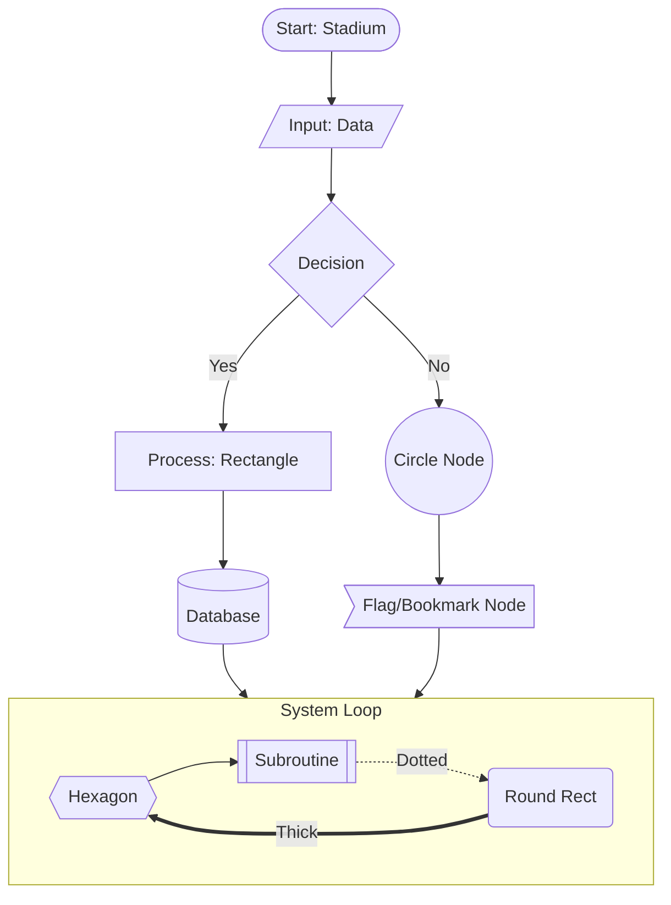

# Sequence Diagrams
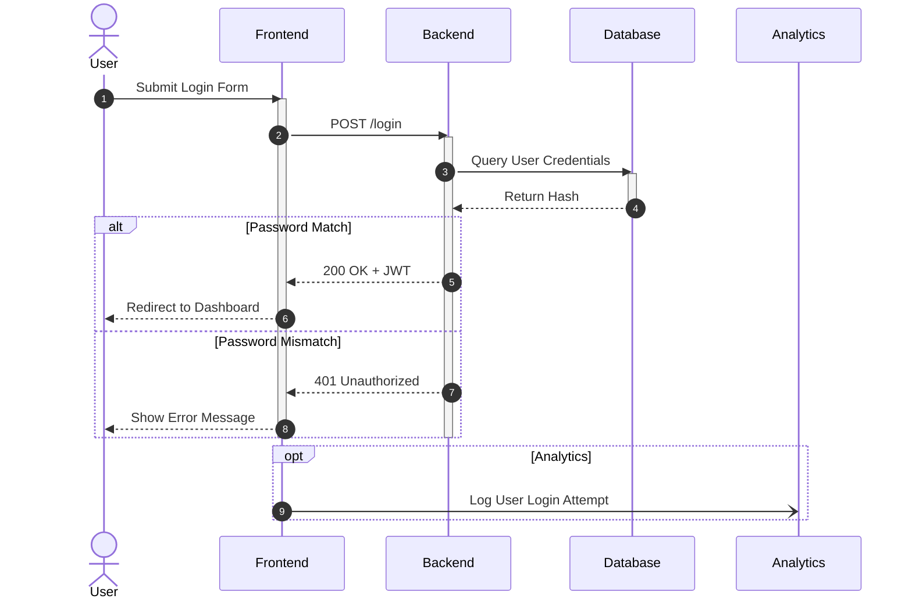

# Gantt Charts
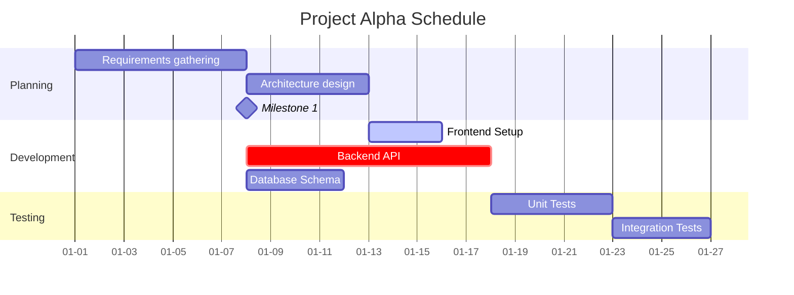

# Class Diagrams
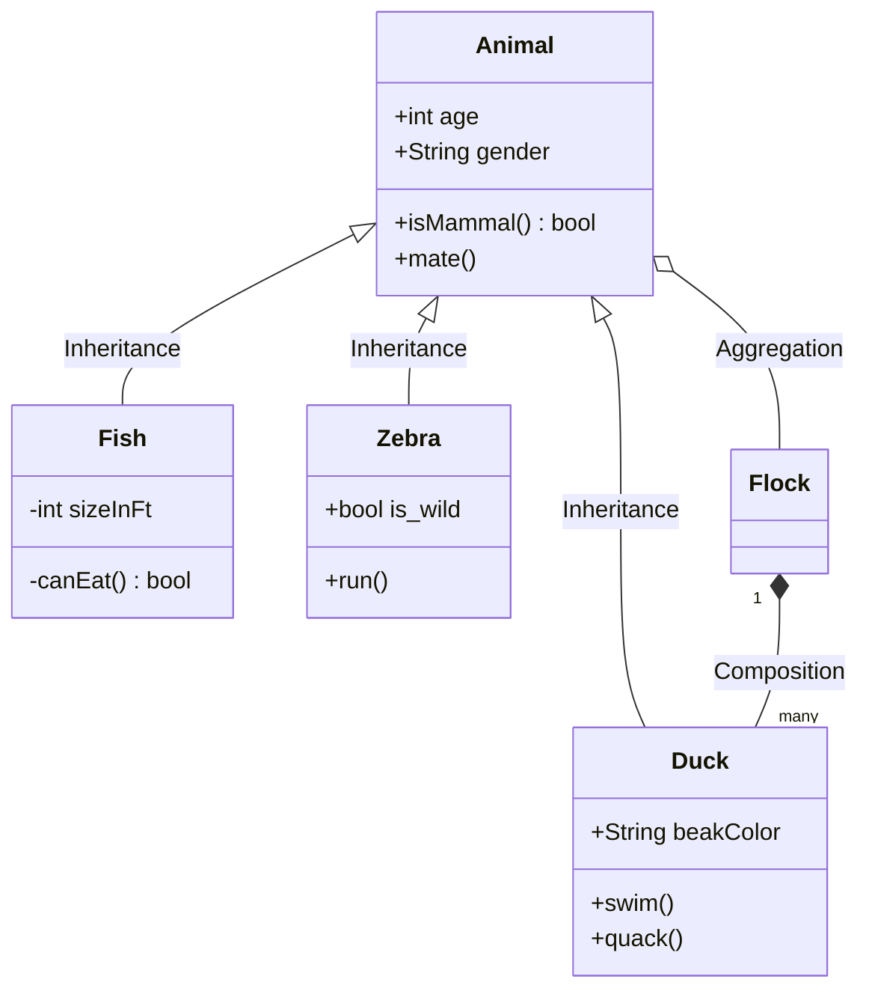

# State Diagrams
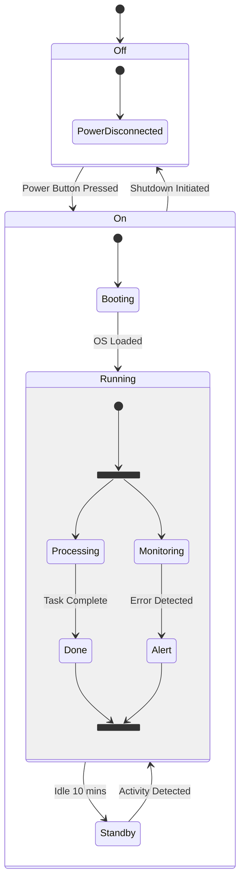

# Entity Relationship Diagrams (ERD)
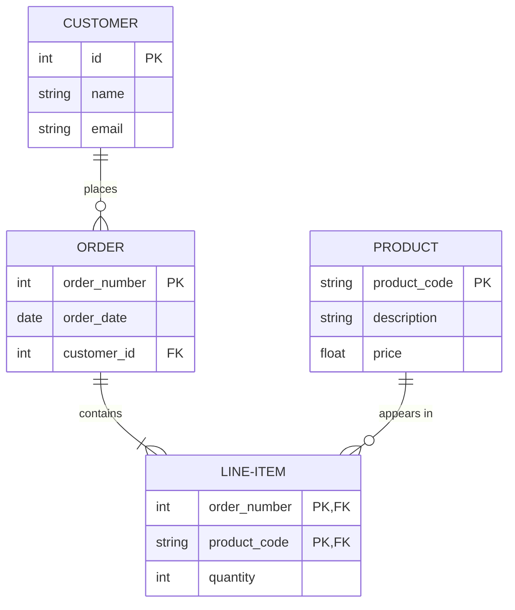

# Git Graphs
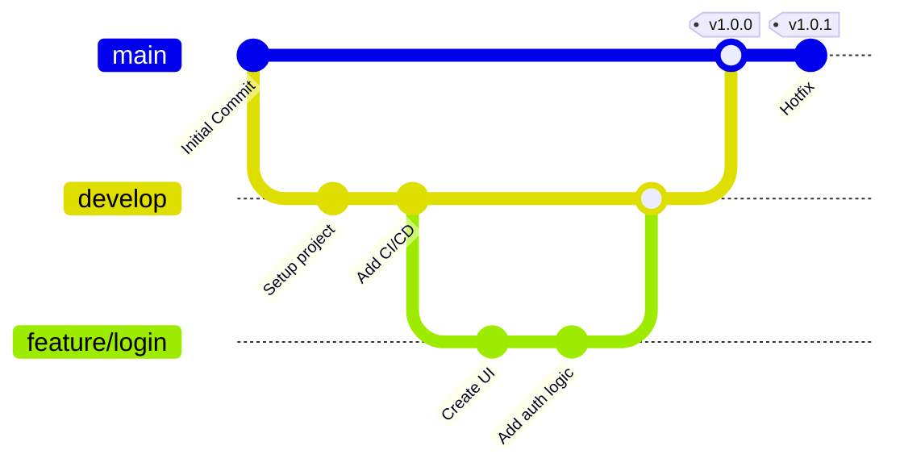

# Pie Charts
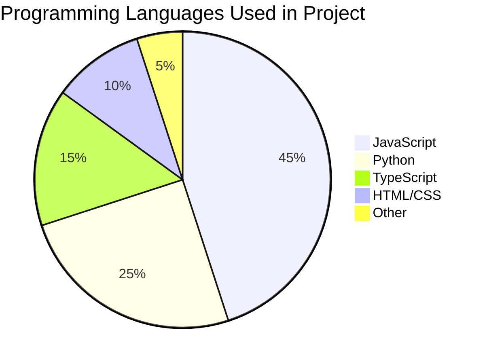

# Mindmaps
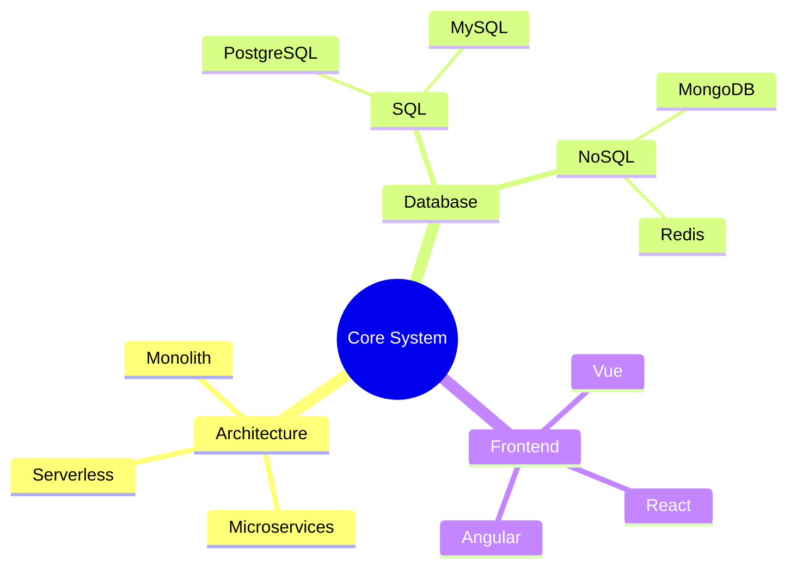

# Timelines
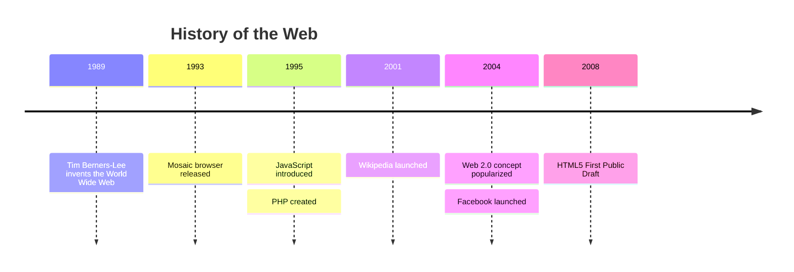

# Sankey Diagrams
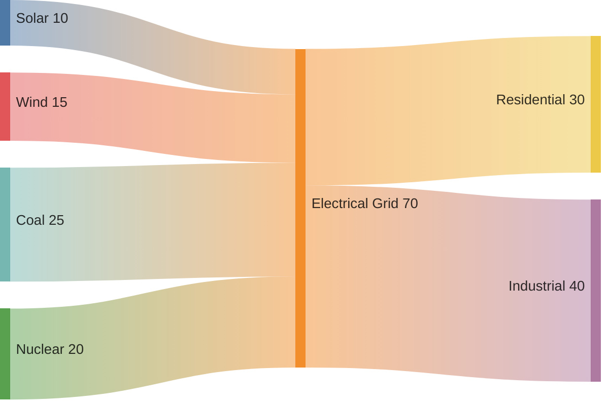

# Quadrant Charts
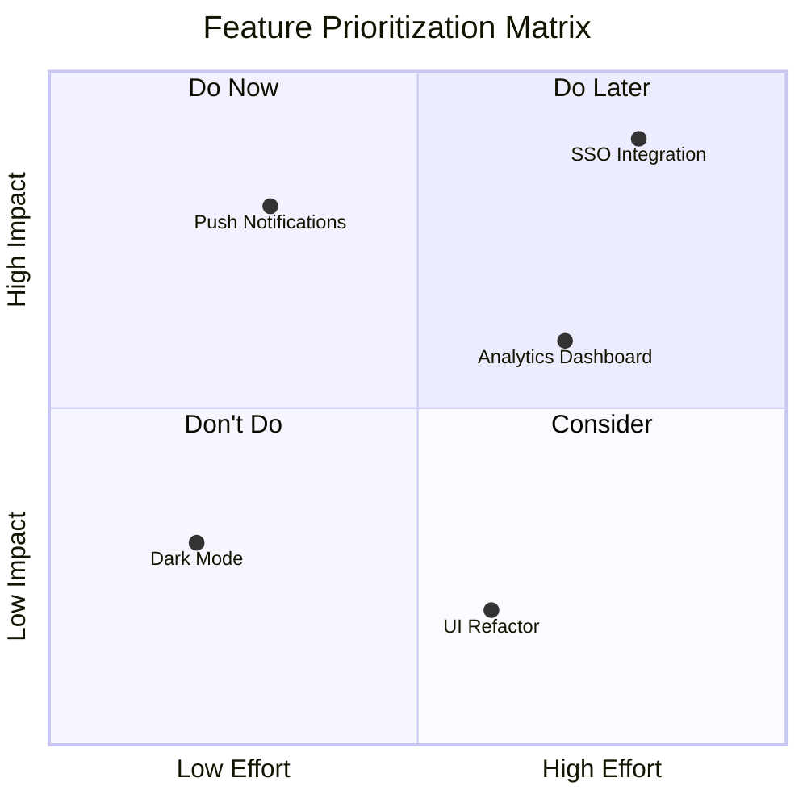
