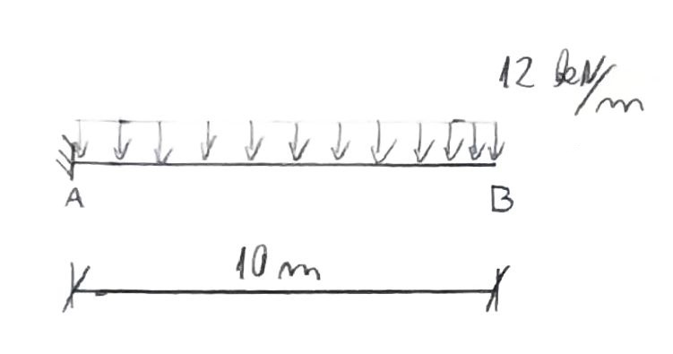
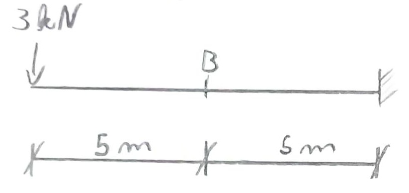
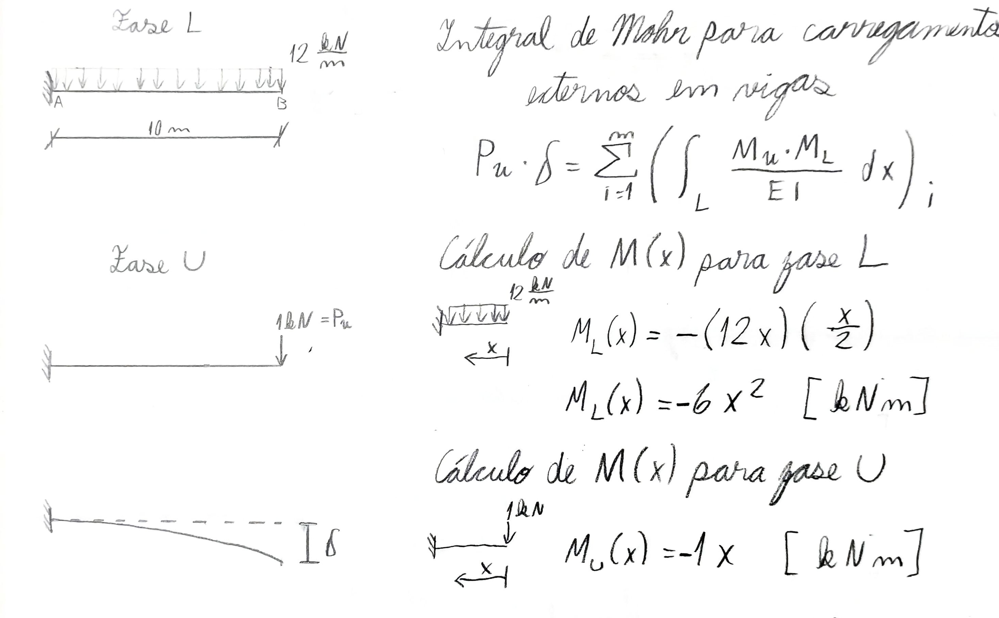
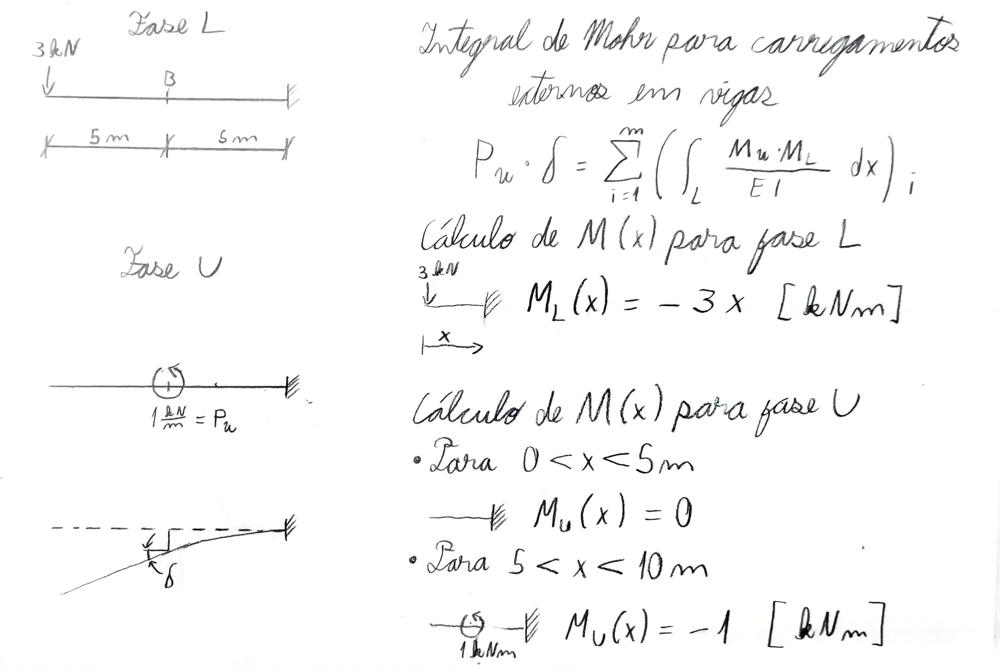

---
Classification	        :	Formula-Based Exercise
Discipline				:	EES039 Análise Estrutural
Source					:	Aula 2026-05-05
Description				:	Aplicação do método da carga unitária em vigas
---

# Proposition
## Questão 1 - Deslocamento vertical em viga engastada
Calcule o deslocamento vertical da seção B.

{width="50%"}

$$E = 200 \text{GPA} \qquad I = 500 \times 10^6 \text{mm}^4$$

## Questão 2 - Rotação em viga engastada
Calcule a rotação da seção B.

{width="50%"}

$$E = 200 \text{GPA} \qquad I = 60 \times 10^6 \text{mm}^4$$

# Notes
## Roteiro de cálculo usando o MCU (Método da Carga Unitária)

Para a estrutura em análise:

1. sujeita ao carregamento que dá origem ao deslocamento procurado (Fase L), obter os esforços solicitantes ($N_L, M_L, V_L$ e $T_L$);
2. sujeita a uma carga unitária correspondente ao deslocamento procurado (Fase U), obter os esforços solicitantes ($N_U, M_U, V_U$ e $T_U$).
3. inserir as equações dos esforços internos na Fase L e na Fase U na expressão e proceder com a integração das distintas parcelas.

**Observação:** Se o deslocamento procurado for translacional (horizontal ou vertical), a carga unitária aplicada na Fase U deve ser uma força unitária ($P_u = 1$). Se o deslocamento procurado for rotacional, a carga unitária aplicada na Fase U deve ser um momento unitário ($M_u = 1$).

## Equação do Método da Carga Unitária para vigas esbeltas
**Equação do Método da Carga Unitária ou Integral de Mohr**
$$P_u \cdot \delta = \sum_{i=1}^{m} \left( \int_{L} \frac{N_u \cdot N_L}{EA} dx + \int_{L} \frac{V_u \cdot f V_L}{GA} dx + \int_{L} \frac{M_u \cdot M_L}{EI} dx + \int_{L} \frac{T_u \cdot T_L}{GJ} dx \right)_i$$

Em vigas sob carregamento transversal comum o esforço axial $(N)$ e momento torsor $(T)$ são nulos por definição do modelo físico de viga. Além disso: 

*   **Vigas Esbeltas (Longas):** Em vigas onde o comprimento $L$ é muito maior que a altura $h$ (geralmente $L/h > 10$), a deformação causada pelo momento fletor domina completamente o deslocamento total. A contribuição da integral do cortante $\left(\frac{V_u V_L}{GA}\right)$ costuma representar menos de 1% a 3% do deslocamento total. Por isso, ela é omitida.
*   **Vigas Curtas ou Paredes:** Se a viga for muito "alta" e "curta" (viga parede), o esforço cortante passa a ter uma importância enorme, e aí não poderíamos cortá-lo da equação.

$$P_u \cdot \delta = \sum_{i=1}^{m} \left( \cancel{\int_{L} \frac{N_u \cdot N_L}{EA} dx} + \cancel{\int_{L} \frac{V_u \cdot V_L}{GA} dx} + \int_{L} \frac{M_u \cdot M_L}{EI} dx + \cancel{\int_{L} \frac{T_u \cdot T_L}{GJ} dx} \right)_i$$

$$\boxed{P_u \cdot \delta = \sum_{i=1}^{m} \left( \int_{L} \frac{M_u \cdot M_L}{EI} dx \right)_i}$$

# Step-by-step
## Questão 1

---

$$E = 200\text{ GPa} = 200 \cdot 10^9 \frac{\text{N}}{\text{m}^2} = 200 \cdot 10^6 \frac{\text{kN}}{\text{m}^2} = 2 \cdot 10^8 \frac{\text{kN}}{\text{m}^2}$$
$$I = 500 \cdot 10^6\text{ mm}^4 = 500 \cdot 10^6\text{ mm}^4 \cdot \left( \frac{\text{(m)}^4}{\left(1000\text{mm}\right)^4} \right)$$
$$I = 500 \cdot 10^6 \cdot \frac{1}{10^{12}}\text{ m}^4 = 5 \cdot 10^{-4}\text{ m}^4$$

**Substituindo na integral de Mohr para vigas**

$$(1\text{ [kN]}) \cdot \delta = \int_0^{10\text{m}} \frac{(-x\text{ [kNm]})(-6x^2\text{ [kNm]})}{(2 \cdot 10^8\text{ [}\frac{\text{kN}}{\text{m}^2}\text{]})(5 \cdot 10^{-4}\text{ [m}^4\text{]})} dx$$

$$(1\text{ [kN]}) \cdot \delta = \int_0^{10\text{m}} (6 \cdot 10^{-5}) x^3\text{ [kN]} dx$$

$$(1\text{ [kN]}) \cdot \delta = (6 \cdot 10^{-5}) \int_0^{10\text{m}} x^3 dx \text{ [kN]}$$

$$(1\text{ [kN]}) \cdot \delta = (6 \cdot 10^{-5}) \left[ \frac{x^4}{4} \right]_0^{10\text{m}}\text{ [kN]} = 1,5 \cdot 10^{-1}\text{ [kNm]}$$

$$\delta = \frac{1,5 \cdot 10^{-1}\text{ [kNm]}}{1\text{ [kN]}} = 1,5 \cdot 10^{-1}\text{ [m]} = 0,15\text{ m}$$

$$\boxed{\delta = 0,15\text{ m}}$$

## Questão 2
$$P_u \cdot \delta = \sum_{i=1}^{m} \left( \int_{L} \frac{M_u \cdot M_L}{EI} dx \right)_i$$

---

$$E = 200\text{ GPa} = 200 \cdot 10^9 \frac{\text{N}}{\text{m}^2} = 200 \cdot 10^6 \frac{\text{kN}}{\text{m}^2} = 2 \cdot 10^8 \frac{\text{kN}}{\text{m}^2}$$
$$I = 60 \cdot 10^6\text{ mm}^4 = 60 \cdot 10^6\text{ mm}^4 \cdot \left( \frac{\text{(m)}^4}{\left(1000\text{mm}\right)^4} \right)$$
$$I = 60 \cdot 10^6 \cdot \frac{1}{10^{12}}\text{ m}^4 = 6 \cdot 10^{-5}\text{ m}^4$$

---

Como o produto $M_u M_1 = 0$ para $0 < x < 5\text{ m}$, podemos avaliar a integral de $5$ a $10\text{ m}$ em vez de $0$ a $10\text{ m}$.

**Substituindo na integral de Mohr para vigas**

$$(1 \text{ [kNm]}) \cdot \delta = \int_{5\text{m}}^{10\text{m}} \frac{(-1 \text{ [kNm]})(-3x \text{ [kNm]})}{(2 \cdot 10^8 \text{ [}\frac{\text{kN}}{\text{m}^2}\text{]})(6 \cdot 10^{-5} \text{ [m}^4\text{]})} \, dx$$

$$(1 \text{ [kNm]}) \cdot \delta = \int_{5\text{m}}^{10\text{m}} \frac{1}{4} \cdot 10^{-3} \cdot x \, dx \left[ \text{kN} \right]$$

$$(1 \text{ [kNm]}) \cdot \delta = \frac{1}{8} \cdot 10^{-3} \left[ x^2 \right]_{5\text{m}}^{10\text{m}} \left[ \text{kN} \right]$$

$$(1 \text{ [kNm]}) \cdot \delta = \frac{1}{8} \cdot 10^{-3} \cdot 74 \left[ \text{m} \right] \left[ \text{kN} \right]$$

$$\boxed{\delta = 9,375 \cdot 10^{-3} \text{ rad}}$$

# Answer
## Questão 1
$$\boxed{\delta = 0,15\text{ m}}$$

## Questão 2
$$\boxed{\delta = 9,375 \cdot 10^{-3} \text{ rad}}$$

# Attempts
2026-05-05T23:00:00Z 0
2026-05-07T23:27:23Z 0
2026-05-20T19:07:11Z 0
