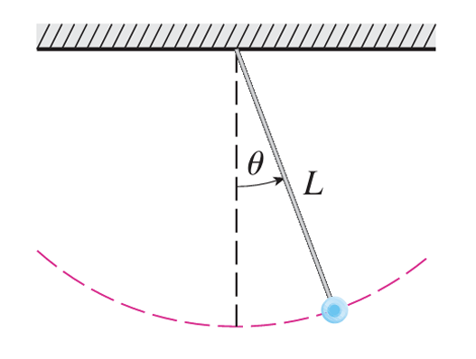

---
Classification	        :	Formula-Based Exercise
Discipline				:	MAT015 Equações Diferenciais A
Source					:	Trabalho Avaliativo
Description				:	Exercício 4
---

# Proposition
A figura exibe um pêndulo com comprimento $L$ e o ângulo $\theta$ a partir da vertical do pêndulo. Pode ser mostrado que $\theta$, como uma função do tempo, satisfaz a equação diferencial não linear

$$\frac{d^2 \theta}{dt^2} + \frac{g}{L} \text{sen } \theta = 0$$

onde $g$ é a aceleração da gravidade. Para valores pequenos de $\theta$ podemos usar a aproximação linear $\text{sen } \theta \approx \theta$ e então a equação diferencial se torna linear.

(a) Determine a equação do movimento de um pêndulo com comprimento $1 \text{ m}$ se $\theta$ é inicialmente $0, 2 \text{ rad}$ e a velocidade angular inicial é $d\theta/dt = 1 \text{ rad/s}$.

(b) Qual o ângulo máximo a partir da vertical?

(c) Qual o período do pêndulo (isto é, o tempo necessário para uma oscilação completa)?

(d) Quando o pêndulo estará pela primeira vez na vertical?

(e) Qual a velocidade angular do pêndulo quando ele está na vertical?

{width="50%"}

# Notes

# Step-by-step
## Gemini
Para resolvermos este problema, vamos usar a equação linearizada do pêndulo, assumindo a aproximação para pequenos ângulos $\text{sen } \theta \approx \theta$. A equação diferencial se torna:

$$\frac{d^2 \theta}{dt^2} + \frac{g}{L} \theta = 0$$

Sabemos que a solução geral para esta equação diferencial linear de segunda ordem (que descreve um Movimento Harmônico Simples) é:

$$\theta(t) = c_1 \cos(\omega t) + c_2 \text{sen}(\omega t)$$

Onde $\omega = \sqrt{\frac{g}{L}}$ é a frequência angular.
Para obtermos valores numéricos nas respostas, vamos adotar a aceleração da gravidade como **$g = 9,8 \text{ m/s}^2$**.

### (a) Determine a equação do movimento

Temos os seguintes dados:

* $L = 1 \text{ m}$
* $\theta(0) = 0,2 \text{ rad}$
* $\theta'(0) = 1 \text{ rad/s}$

Primeiro, calculamos $\omega$:

$$\omega = \sqrt{\frac{g}{L}} = \sqrt{\frac{9,8}{1}} \approx 3,13 \text{ rad/s}$$

Usando a condição inicial da posição $\theta(0) = 0,2$:

$$\theta(0) = c_1 \cos(0) + c_2 \text{sen}(0) \implies c_1 = 0,2$$

A derivada da posição nos dá a velocidade angular:

$$\frac{d\theta}{dt} = -\omega c_1 \text{sen}(\omega t) + \omega c_2 \cos(\omega t)$$

Usando a condição inicial da velocidade $\theta'(0) = 1$:

$$1 = -\omega c_1 \text{sen}(0) + \omega c_2 \cos(0) \implies \omega c_2 = 1 \implies c_2 = \frac{1}{\omega} = \frac{1}{\sqrt{9,8}} \approx 0,319$$

Substituindo $c_1$ e $c_2$ na solução geral, temos a equação do movimento:

$$\theta(t) = 0,2 \cos(\sqrt{9,8} t) + \frac{1}{\sqrt{9,8}} \text{sen}(\sqrt{9,8} t)$$

### (b) Qual o ângulo máximo a partir da vertical?

O ângulo máximo é a **amplitude** ($A$) do movimento. Ela pode ser encontrada combinando os coeficientes $c_1$ e $c_2$:

$$A = \sqrt{c_1^2 + c_2^2}$$

$$A = \sqrt{0,2^2 + \left(\frac{1}{\sqrt{9,8}}\right)^2} = \sqrt{0,04 + \frac{1}{9,8}} = \sqrt{0,04 + 0,102}$$

$$A = \sqrt{0,142} \approx 0,377 \text{ rad}$$

### (c) Qual o período do pêndulo?

O período $T$ é o tempo de uma oscilação completa e depende apenas do comprimento $L$ e da gravidade $g$:

$$T = \frac{2\pi}{\omega} = 2\pi \sqrt{\frac{L}{g}}$$

$$T = 2\pi \sqrt{\frac{1}{9,8}} \approx \frac{2\pi}{3,13} \approx 2,01 \text{ segundos}$$

### (d) Quando o pêndulo estará pela primeira vez na vertical?

O pêndulo passa pela vertical quando $\theta(t) = 0$.

$$0,2 \cos(\sqrt{9,8} t) + \frac{1}{\sqrt{9,8}} \text{sen}(\sqrt{9,8} t) = 0$$

Dividindo ambos os lados por $\cos(\sqrt{9,8} t)$ para isolar a tangente:

$$0,2 + \frac{1}{\sqrt{9,8}} \tan(\sqrt{9,8} t) = 0$$

$$\tan(\sqrt{9,8} t) = -0,2 \sqrt{9,8} \approx -0,626$$

Para encontrar o *primeiro* tempo positivo ($t > 0$), precisamos considerar que o pêndulo começou num ângulo positivo e com velocidade positiva (indo mais para a direita). Ele atinge o ângulo máximo e depois volta para o zero.
A solução principal de $\arctan(-0,626)$ é $\approx -0,56 \text{ rad}$ (no quarto quadrante). A próxima solução ocorre somando $\pi$ (pois o período da tangente é $\pi$):

$$\sqrt{9,8} t = -0,56 + \pi \approx 2,58 \text{ rad}$$

$$t = \frac{2,58}{\sqrt{9,8}} \approx \frac{2,58}{3,13} \approx 0,825 \text{ segundos}$$

### (e) Qual a velocidade angular quando ele está na vertical?

Na vertical ($\theta = 0$), toda a energia potencial foi convertida em energia cinética, então a velocidade é máxima em módulo. O módulo da velocidade máxima é $v_{max} = \omega A$.
Como o pêndulo estava voltando de seu ângulo máximo positivo, sua velocidade nesse instante será negativa:

$$\theta'(t_{\text{vertical}}) = -\omega A = -\sqrt{9,8} \times 0,377$$

$$\theta'(t_{\text{vertical}}) = -\sqrt{0,04(9,8) + 1} = -\sqrt{1,392} \approx -1,18 \text{ rad/s}$$

# Answer

# Attempts
