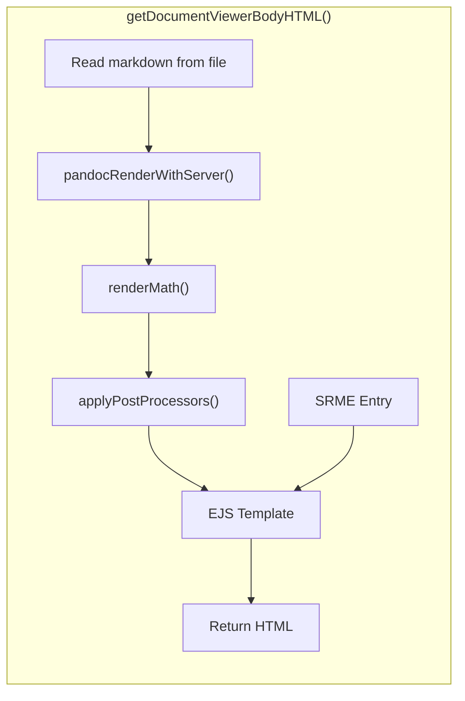

---
Classification	        :	Notes
Discipline				:	ULFN
Source					:	
Description				:	Software Requirements Document (SRS)
---

# Introduction

## User and Technology
- The system shall have a single user, that is also the developer
- The user shall use the web application alongside VSCode
- The web application shall support LaTeX math rendering using KaTeX

### Framework
- The application shall not use any framework
- The web application shall use Vite as the build tool

# Types of post-processing

# Markdown to HTML pipeline

