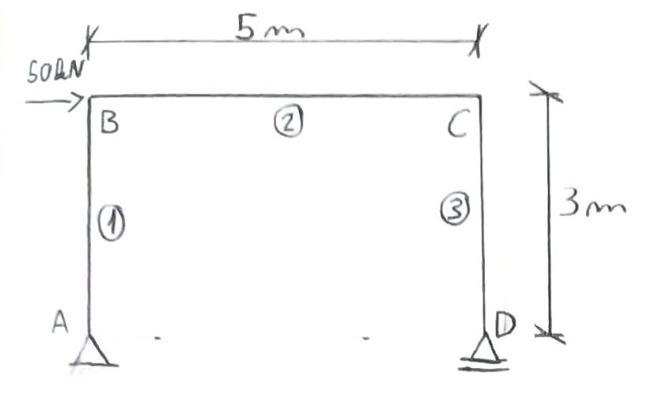
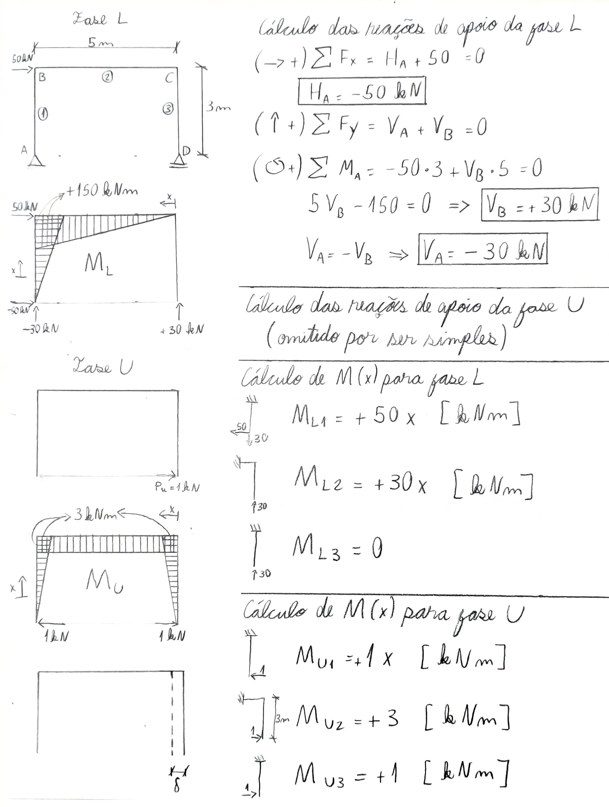

---
Classification	        :	Formula-Based Exercise
Discipline				:	EES039 Análise Estrutural
Source					:	Aula 2026-05-12
Description				:	Aplicação do método da carga unitária em pórticos
---

# Proposition
Calcular o deslocamento horizontal no nó D.

{width="50%"}

$EI = 2 \times 10^5 \text{ kN}\cdot\text{m}^2$

# Notes

# Step-by-step

Substituindo na integral de Mohr para vigas:

$$1 \cdot \delta = \int_{0}^{3} \frac{M_{L1} M_{u1}}{EI} dx + \int_{0}^{5} \frac{M_{L2} M_{u2}}{EI} dx + \int_{0}^{3} \frac{M_{L3} M_{u3}}{EI} dx$$

- $M_{L3} = 0$, portanto a última integral é nula.
- $\frac{1}{EI}$ é comum às integrais e constante ao longo do comprimento, portanto pode ser fatorado.

$$\delta = \frac{1}{EI} \left( \int_{0}^{3} M_{L1} M_{u1} dx + \int_{0}^{5} M_{L2} M_{u2} dx \right)$$

$$\delta = \frac{1}{2 \cdot 10^5} \left( \int_{0}^{3} (+50x)(+1x) dx + \int_{0}^{5} (+30x)(+3) dx \right)$$

$$\delta = \frac{1}{2 \cdot 10^5} \left( 50 \left[ \frac{x^3}{3} \right]_{0}^{3} + 90 \left[ \frac{x^2}{2} \right]_{0}^{5} \right)$$

$$\delta = \frac{1}{2 \cdot 10^5} \left( 450 + 1125 \right)$$

$$\boxed{\delta = 7,875 \cdot 10^{-3} \text{ [m]}}$$

# Answer
$$\boxed{\delta = 7,875 \cdot 10^{-3} \text{ [m]}}$$

# Attempts
2026-05-12T23:00:00Z 0
2026-05-20T21:55:13Z 0
