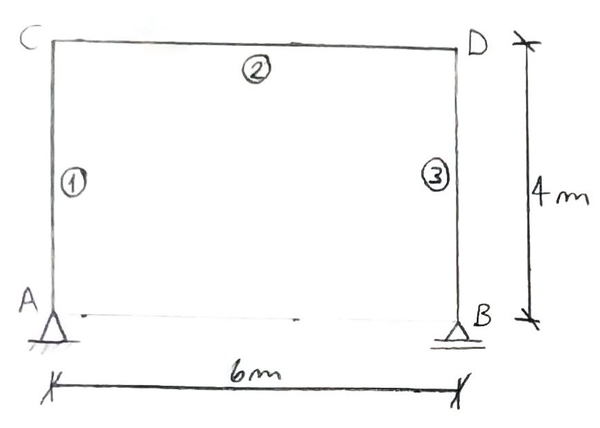
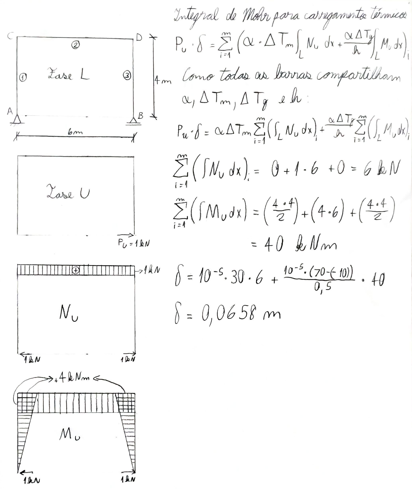

---
Classification	        :	Formula-Based Exercise
Discipline				:	EES039 Análise Estrutural
Source					:	Aula 2026-05-14
Description				:	Variação térmica em pórtico
---

# Proposition
Calcule o deslocamento horizontal do nó B.

{width=50%}

Dados:

$\alpha = 10^{-5} / ^\circ C \qquad h = 0.5m$

$\Delta T_1 = 70^\circ C \qquad \Delta T_2 = -10^\circ C$

$\Delta T_m = \frac{\Delta T_1 + \Delta T_2}{2} = 30^\circ C$

## Formulário
$$P_u \cdot \delta = \sum_{i=1}^{m} \left( \alpha \cdot \Delta T_m \int_{L} N_u \, dx + \frac{\alpha \cdot \Delta T_g}{h} \int_{L} M_u \, dx \right)_i$$

> Veja documento 255 para a dedução dessa fórmula.

# Notes

# Step-by-step

# Answer

# Attempts
2026-05-14T23:00:00Z 0
