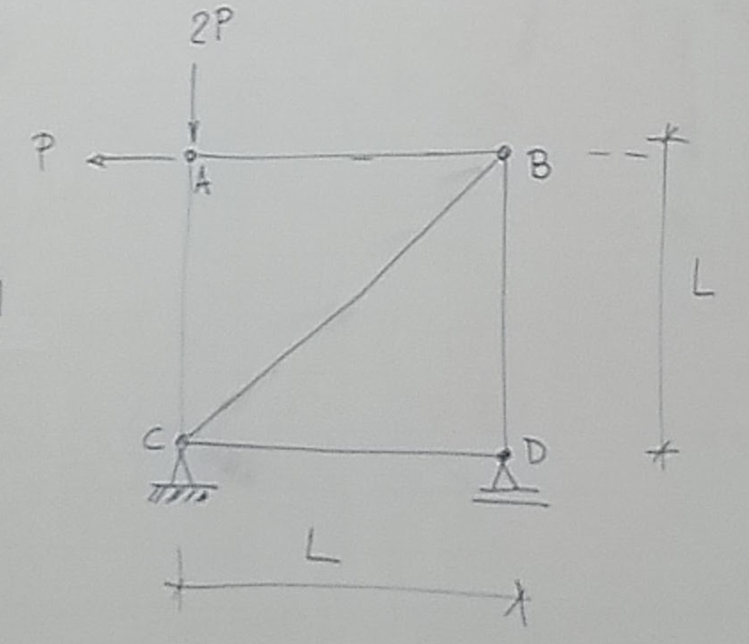

---
Classification	        :	Formula-Based Exercise
Discipline				:	EES039 Análise Estrutural
Source					:	Aula 2026-05-19
Description				:	Aplicação do método da carga unitária em treliças
---

# Proposition

{width=50%}

a) Calcule o deslocamento horizontal da seção B.

b) Calcule o deslocamento relativo entre os nós A e D.

## Formulário
$$\boxed{P_u \cdot \delta = \frac{1}{EA} \sum_{i=1}^{m} \left( N_u \cdot N_L \cdot L \right)_i}$$

# Notes
> Conforme deduzido no documento 255:
> $$\boxed{P_u \cdot \delta = \sum_{i=1}^{m} \left( \int_{L} \frac{N_u \cdot N_L}{EA} dx + \int_{L} \frac{V_u \cdot V_L}{GA} dx + \int_{L} \frac{M_u \cdot M_L}{EI} dx + \int_{L} \frac{T_u \cdot T_L}{GJ} dx \right)_i}$$

Porém, em treliças, os esforços de corte ($V$), momento fletor ($M$) e torção ($T$) são nulos por definição do modelo físico de treliça. Assim, a equação do Método da Carga Unitária para treliças se reduz a:

$$P_u \cdot \delta = \sum_{i=1}^{m} \left( \int_{L} \frac{N_u \cdot N_L}{EA} dx \right)_i$$ 

Como o esforço normal ($N$) é constante ao longo do comprimento de cada barra, a integral se simplifica para:

$$P_u \cdot \delta = \sum_{i=1}^{m} \left( \frac{N_u \cdot N_L \cdot L}{EA} \right)_i$$

Como o módulo de elasticidade ($E$) e a área da seção transversal ($A$) são constantes para cada barra, a equação final para o deslocamento em treliças é:

$$\boxed{P_u \cdot \delta = \frac{1}{EA} \sum_{i=1}^{m} \left( N_u \cdot N_L \cdot L \right)_i}$$

# Step-by-step
## a) Deslocamento horizontal da seção B
| Barra | Comp. | $N_L$ | $N_U$ | $N_U \cdot N_L \cdot L$ |
| :---: | :---: | :---: | :---: | :---: |
| AB | $L$ | $P$ | $0$ | $0$ |
| AC | $L$ | $-2P$ | $0$ | $0$ |
| BD | $L$ | $P$ | $-1$ | $-PL$ |
| CD | $L$ | $0$ | $0$ | $0$ |
| BC | $\sqrt{2} L$ | $-\sqrt{2} P$ | $\sqrt{2}$ | $-2\sqrt{2} PL$ |

$$\sum_{i=1}^{m} \left( N_u \cdot N_L \cdot L \right)_i = -(2\sqrt{2} + 1) PL$$

$$\delta = -\frac{(2 \sqrt{2} + 1) PL}{EA}$$

## b) Deslocamento relativo entre os nós A e D
| Barra | Comp. | $N_L$ | $N_U$ | $N_U \cdot N_L \cdot L$ |
| :---: | :---: | :---: | :---: | :---: |
| AB | $L$ | $P$ | $-1/\sqrt{2}$ | $-PL/\sqrt{2}$ |
| AC | $L$ | $-2P$ | $-1/\sqrt{2}$ | $2PL/\sqrt{2}$ |
| BD | $L$ | $P$ | $-1/\sqrt{2}$ | $-PL/\sqrt{2}$ |
| CD | $L$ | $0$ | $-1/\sqrt{2}$ | $0$ |
| BC | $\sqrt{2} L$ | $-\sqrt{2} P$ | $1$ | $-2PL$ |

$$\sum_{i=1}^{m} \left( N_u \cdot N_L \cdot L \right)_i = 2PL$$

$$\delta = \frac{2PL}{EA}$$

# Answer

# Attempts
2026-05-19T23:00:00Z 0
