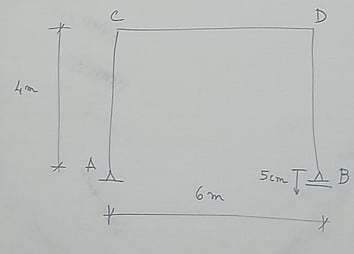

---
Classification	        :	Formula-Based Exercise
Discipline				:	EES039 Análise Estrutural
Source					:	Aula 2026-05-26
Description				:	Finalização da matéria para TP1 e início da matéria para TP2
---

# Proposition
Calcular a rotação da seção B considerando que o apoio em B sofre um recalque igual a 5cm.

# Notes
## Equações da flexibilidade e rigidez
A professora vai falar brevemente sobre a equação da rigidez, mas o método que usaremos é o método da flexibilidade, que é o mais simples.

# Step-by-step

# Answer

# Attempts

