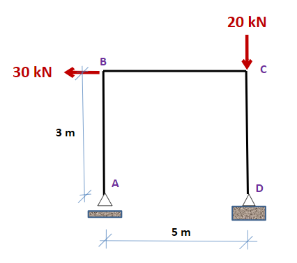

---
Classification	        :	Formula-Based Exercise
Discipline				:	EES039 Análise Estrutural
Source					:	2026-1 TP1
Description				:	Questão 1
---

# Proposition
Para o pórtico da figura, calcule:

a) a rotação do nó A.
b) o deslocamento horizontal do nó B.

$EI = 3 \times 10^5 \, \text{kN}\cdot\text{m}^2$

**Descrição da figura:** O diagrama apresenta um pórtico plano com dimensões de $3\text{ m}$ de altura e $5\text{ m}$ de largura, sustentado por um apoio móvel no ponto A (à esquerda) e um apoio fixo no ponto D (à direita). A estrutura está sujeita a duas forças concentradas: uma carga horizontal de $30\text{ kN}$ direcionada para a esquerda no nó superior B, e uma carga vertical de $20\text{ kN}$ atuando para baixo diretamente no nó superior C.

# Notes

> Veja documentos 256 e 270

Desenhar:

1. Primeira linha: Fase $L$, DCL Fase $L$, Diagrama de momento fletor $M_L$
2. Segunda linha: Cálculo das reações de apoio
3. Terceira Linha: DCL fase $U_1$, Diagrama de momento fletor $M_{U1}$

- Fase L
- Fase U para rotação no nó A
- Fase U para deslocamento horizontal no nó B

# Step-by-step

## Gemini
Para resolver este problema, utilizaremos o **Princípio dos Trabalhos Virtuais (PTV)** (ou Método da Carga Unitária). O processo consiste em calcular os esforços internos (momentos fletores) para o sistema real com as cargas aplicadas e, em seguida, para sistemas virtuais correspondentes aos deslocamentos que queremos encontrar.

---

### 1. Análise do Sistema Real ($E_0$)

Primeiro, calculamos as reações de apoio e os momentos fletores causados pelas cargas reais.

* **Apoio A:** Móvel (apenas reação vertical $V_A$).
* **Apoio D:** Fixo (reações $V_D$ e $H_D$).

**Equilíbrio global:**

1. $\sum F_x = 0 \Rightarrow -30 + H_D = 0 \Rightarrow \mathbf{H_D = 30 \, \text{kN}}$ (para a direita)
2. $\sum M_D = 0 \Rightarrow V_A \cdot 5 - 30 \cdot 3 - 20 \cdot 0 = 0 \Rightarrow 5 V_A = 90 \Rightarrow \mathbf{V_A = 18 \, \text{kN}}$ (para cima)
3. $\sum F_y = 0 \Rightarrow V_A + V_D - 20 = 0 \Rightarrow 18 + V_D = 20 \Rightarrow \mathbf{V_D = 2 \, \text{kN}}$ (para cima)

**Equações de Momento Fletor ($M$):**
Vamos definir a origem e o sentido para cada barra:

* **Barra AB** ($y$ de $A$ para $B$, $0 \le y \le 3$):
Não há forças horizontais em A, logo o momento é nulo.
$M_{AB}(y) = 0$
* **Barra BC** ($x$ de $B$ para $C$, $0 \le x \le 5$):
Cortando a uma distância $x$ de B e olhando para a esquerda, a única força que gera momento é a reação $V_A = 18$ kN.
$M_{BC}(x) = 18x$  *(tração na face inferior; no ponto C: $M = 90 \, \text{kNm}$)*
* **Barra DC** ($y$ de $D$ para $C$, $0 \le y \le 3$):
Cortando a uma distância $y$ de D e olhando para baixo, a força que gera momento é $H_D = 30$ kN.
$M_{DC}(y) = 30y$  *(tração na face externa à direita; no ponto C: $M = 90 \, \text{kNm}$)*

---

### 2. Cálculo da Rotação no Nó A ($\theta_A$)

Criamos o **Sistema Virtual 1 ($E_1$)**, removendo as cargas reais e aplicando um momento unitário no nó A. Assumiremos o sentido **horário** ($M_A = 1$).

**Reações do Sistema $E_1$:**

* $\sum F_x = 0 \Rightarrow H_D = 0$
* $\sum M_D = 0 \Rightarrow V_A \cdot 5 + 1 = 0 \Rightarrow V_A = -0,2$ (para baixo)
* $\sum F_y = 0 \Rightarrow V_A + V_D = 0 \Rightarrow V_D = 0,2$ (para cima)

**Equações de Momento Fletor Virtual ($m_1$):**

* **Barra AB:** O momento é constante e igual ao momento aplicado.
$m_{1,AB}(y) = 1$
* **Barra BC:** Momento da força $V_A$ e do momento concentrado.
$m_{1,BC}(x) = 1 - 0,2x$ *(em B: 1; em C: 0)*
* **Barra DC:** Sem forças horizontais, o momento é nulo.
$m_{1,DC}(y) = 0$

**Aplicação do PTV (Integração):**

$$1 \cdot \theta_A \cdot EI = \int M \cdot m_1 \, ds$$

Apenas a barra BC possui sobreposição de momentos não nulos:

$$\theta_A \cdot EI = \int_{0}^{5} (18x) \cdot (1 - 0,2x) \, dx = \int_{0}^{5} (18x - 3,6x^2) \, dx$$

$$\theta_A \cdot EI = \left[ 9x^2 - 1,2x^3 \right]_{0}^{5} = 9(25) - 1,2(125) = 225 - 150 = 75$$

Substituindo $EI = 3 \times 10^5 \, \text{kN}\cdot\text{m}^2$:

$$\theta_A = \frac{75}{3 \times 10^5} = \mathbf{2,5 \times 10^{-4} \, \text{rad}}$$

*(O sinal positivo indica que a rotação ocorre no sentido adotado: **horário**).*

---

### 3. Cálculo do Deslocamento Horizontal no Nó B ($\delta_{Bx}$)

Criamos o **Sistema Virtual 2 ($E_2$)**, aplicando uma força horizontal unitária no nó B. Assumiremos o sentido para a **direita** ($P = 1$).

**Reações do Sistema $E_2$:**

* $\sum F_x = 0 \Rightarrow 1 + H_D = 0 \Rightarrow H_D = -1$ (para a esquerda)
* $\sum M_D = 0 \Rightarrow V_A \cdot 5 + 1 \cdot 3 = 0 \Rightarrow V_A = -0,6$ (para baixo)
* $\sum F_y = 0 \Rightarrow V_A + V_D = 0 \Rightarrow V_D = 0,6$ (para cima)

**Equações de Momento Fletor Virtual ($m_2$):**

* **Barra AB:** Sem forças horizontais em A, momento nulo.
$m_{2,AB}(y) = 0$
* **Barra BC:** Força vertical $V_A$ atuando. Em relação ao momento de $E_0$ (tração embaixo), este gera tração em cima (sinal negativo).
$m_{2,BC}(x) = -0,6x$ *(em B: 0; em C: -3)*
* **Barra DC:** Força horizontal $H_D = -1$ atua tracionando a face interna (oposto ao sistema $E_0$).
$m_{2,DC}(y) = -1y = -y$ *(em D: 0; em C: -3)*

**Aplicação do PTV (Integração):**

$$1 \cdot \delta_{Bx} \cdot EI = \int M \cdot m_2 \, ds$$

Integramos as barras BC e DC (podemos usar a Tabela de Kurtz/Vereshchagin para multiplicar os diagramas triangulares):

$$\delta_{Bx} \cdot EI = \int_{0}^{5} (18x)(-0,6x) \, dx + \int_{0}^{3} (30y)(-y) \, dy$$

$$\delta_{Bx} \cdot EI = \int_{0}^{5} -10,8x^2 \, dx + \int_{0}^{3} -30y^2 \, dy$$

$$\delta_{Bx} \cdot EI = \left[ -3,6x^3 \right]_{0}^{5} + \left[ -10y^3 \right]_{0}^{3} = -3,6(125) - 10(27)$$

$$\delta_{Bx} \cdot EI = -450 - 270 = -720$$

Substituindo $EI$:

$$\delta_{Bx} = \frac{-720}{3 \times 10^5} = -240 \times 10^{-5} = \mathbf{-2,4 \times 10^{-3} \, \text{m}}$$

*(O sinal negativo indica que o deslocamento é no sentido oposto à carga virtual aplicada, ou seja, **para a esquerda**. Fica $\mathbf{2,4 \, \text{mm}}$ para a esquerda).*

---

### Resumo das Respostas

* **a)** A rotação do nó A é de **$2,5 \times 10^{-4} \, \text{rad}$** (sentido horário).
* **b)** O deslocamento horizontal do nó B é de **$2,4 \, \text{mm}$** (para a esquerda).

# Answer

# Attempts
