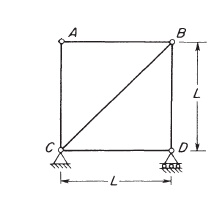
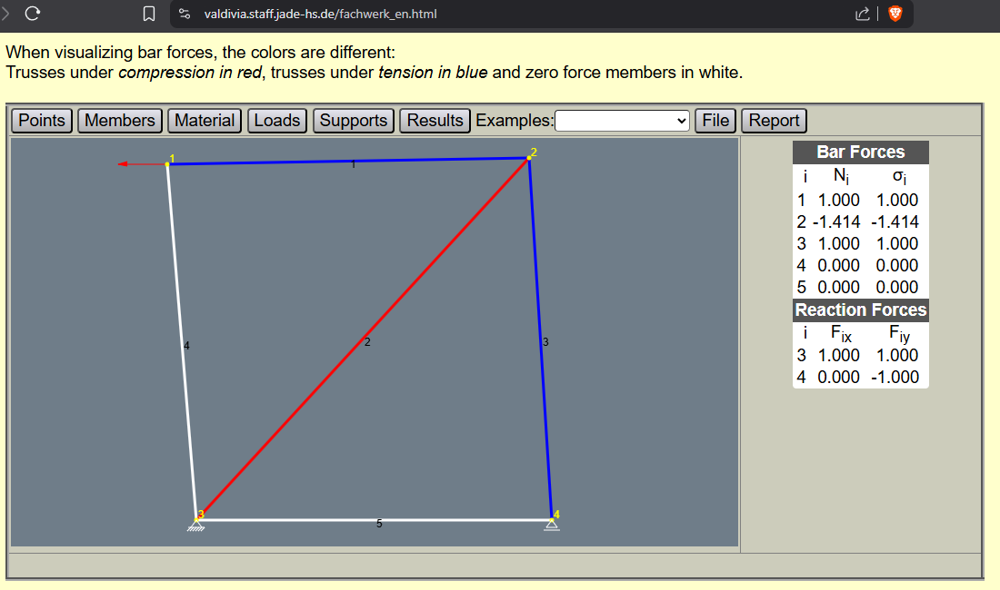

---
Classification	        :	Formula-Based Exercise
Discipline				:	EES039 Análise Estrutural
Source					:	2026-1 TP1
Description				:	Questão 2
---

# Proposition
Para a treliça da figura:

a) Calcule o deslocamento horizontal do nó A, para uma redução de $T_1$ graus na barra BD e um aumento de temperatura de $T_2$ graus nas barras AB e CD.

b) Calcule o deslocamento vertical do nó B, considerando que as barras AB e AC têm comprimento (L + e) e a barra BD (L - e).

# Notes

# Step-by-step
{width="80%"}

## Gemini
Para resolver este problema, utilizaremos o **Princípio dos Trabalhos Virtuais (PTV)**, também conhecido como Método da Carga Unitária. A fórmula geral para treliças é:

$$1 \cdot \Delta = \sum (\bar{N}_i \cdot \Delta L_i)$$

Onde $\bar{N}_i$ são os esforços normais virtuais nas barras gerados por uma carga unitária na direção do deslocamento desejado, e $\Delta L_i$ são as deformações reais de cada barra.

Assumiremos um coeficiente de dilatação térmica genérico $\alpha$ para os cálculos de temperatura.

---

### **a) Deslocamento horizontal do nó A**

Queremos encontrar o deslocamento horizontal em A ($\Delta_{Ax}$). Para isso, aplicamos uma carga virtual horizontal $\bar{P} = 1$ no nó A, apontando para a direita.

**1. Esforços Virtuais ($\bar{N}_i$):**
Calculando as reações de apoio para essa carga em A(0,L):

* $\sum M_C = 0 \Rightarrow 1 \cdot L - V_D \cdot L = 0 \Rightarrow V_D = 1$ (para cima)
* $\sum F_y = 0 \Rightarrow V_C + V_D = 0 \Rightarrow V_C = -1$ (para baixo)
* $\sum F_x = 0 \Rightarrow H_C + 1 = 0 \Rightarrow H_C = -1$ (para a esquerda)

Analisando o equilíbrio de cada nó (adotando tração como positivo):

* **Nó A:** A carga unitária empurra para a direita. Para equilibrar em $x$, a barra AB deve estar comprimida.
* $\bar{N}_{AB} = -1$
* $\bar{N}_{AC} = 0$

* **Nó D:** A reação $V_D = 1$ empurra o nó para cima. Para equilibrar em $y$, a barra BD deve estar comprimida.
* $\bar{N}_{BD} = -1$
* $\bar{N}_{CD} = 0$ (não há forças horizontais atuando no nó D além da barra CD)

* **Nó B:** (Por verificação) Com $\bar{N}_{AB} = -1$ e $\bar{N}_{BD} = -1$, o equilíbrio em $x$ e $y$ resulta em uma tração na diagonal CB.
* $\bar{N}_{CB} = \sqrt{2}$

**2. Deformações Reais ($\Delta L_i$) por Temperatura:**
A variação de comprimento térmica é dada por $\Delta L = \alpha \cdot \Delta T \cdot L$.

* Barra BD (redução de $T_1$): $\Delta L_{BD} = -\alpha \cdot T_1 \cdot L$
* Barra AB (aumento de $T_2$): $\Delta L_{AB} = \alpha \cdot T_2 \cdot L$
* Barra CD (aumento de $T_2$): $\Delta L_{CD} = \alpha \cdot T_2 \cdot L$
* Barras AC e CB: $\Delta T = 0 \Rightarrow \Delta L = 0$

**3. Cálculo do Deslocamento ($\Delta_{Ax}$):**
Aplicando a equação do PTV (somando apenas as barras que possuem tanto esforço virtual quanto deformação real não nulos):

$$1 \cdot \Delta_{Ax} = (\bar{N}_{AB} \cdot \Delta L_{AB}) + (\bar{N}_{BD} \cdot \Delta L_{BD})$$

$$\Delta_{Ax} = (-1)(\alpha \cdot T_2 \cdot L) + (-1)(-\alpha \cdot T_1 \cdot L)$$

$$\Delta_{Ax} = \alpha L (T_1 - T_2)$$

**Resposta (a):** O deslocamento horizontal do nó A é **$\alpha L (T_1 - T_2)$** para a direita (se $T_1 > T_2$).

---

### **b) Deslocamento vertical do nó B**

Queremos o deslocamento vertical de B ($\Delta_{By}$). Aplicamos uma carga virtual vertical $\bar{P} = 1$ no nó B, apontando para baixo.

**1. Esforços Virtuais ($\bar{N}_i$):**
Nesta configuração, o nó A não possui cargas aplicadas, logo:

* **Nó A:** $\bar{N}_{AB} = 0$ e $\bar{N}_{AC} = 0$

Analisando o **Nó B**:
Como $\bar{N}_{AB} = 0$, não existe força horizontal para equilibrar a componente horizontal da diagonal CB. Logo, a barra diagonal não pode ter esforço:

* $\bar{N}_{CB} = 0$

Assim, toda a carga vertical aplicada no nó B é resistida integralmente pela barra BD que está logo abaixo:

* $\bar{N}_{BD} = -1$ (Compressão)

*(As demais barras também têm esforço virtual nulo: $\bar{N}_{CD} = 0$).*

**2. Deformações Reais ($\Delta L_i$) por Erro de Fabricação:**
O enunciado fornece as diferenças de comprimento iniciais:

* Barra AB: $\Delta L_{AB} = +e$
* Barra AC: $\Delta L_{AC} = +e$
* Barra BD: $\Delta L_{BD} = -e$
* Barras CD e CB: sem erro, $\Delta L = 0$

**3. Cálculo do Deslocamento ($\Delta_{By}$):**
Aplicando novamente o PTV:

$$1 \cdot \Delta_{By} = (\bar{N}_{AB} \cdot \Delta L_{AB}) + (\bar{N}_{AC} \cdot \Delta L_{AC}) + (\bar{N}_{BD} \cdot \Delta L_{BD})$$

$$\Delta_{By} = (0)(+e) + (0)(+e) + (-1)(-e)$$

$$\Delta_{By} = e$$

**Resposta (b):** O deslocamento vertical do nó B é de magnitude **$e$ para baixo**.

*Nota: É interessante observar que os erros de comprimento nas barras AB e AC afetam a posição final do nó A, mas não causam nenhuma interferência na posição vertical do nó B, que é ditada estritamente pela barra BD e o suporte triangular formado por C, D e B.*

# Answer

# Attempts
