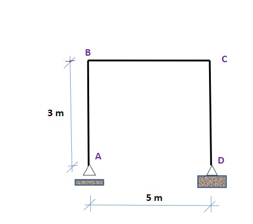
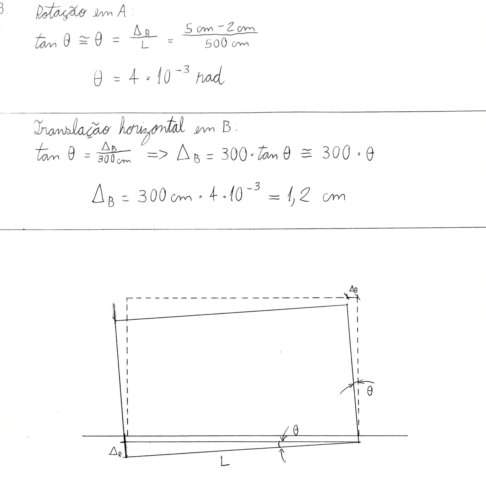

---
Classification	        :	Formula-Based Exercise
Discipline				:	EES039 Análise Estrutural
Source					:	2026-1 TP1
Description				:	Questão 3
---

# Proposition
Para o pórtico da figura, considere que o apoio A sofreu um recalque igual a 5 cm (↓) e o apoio D sofreu um recalque igual a 3 cm (↓). Calcule, considerando apenas os efeitos dos recalques de apoio:

a) a translação horizontal em B
b) a rotação em A

**Descrição da figura:** O diagrama apresenta um pórtico plano com dimensões de $3\text{ m}$ de altura e $5\text{ m}$ de largura, sustentado por um apoio móvel no ponto A (à esquerda) e um apoio fixo no ponto D (à direita). 

# Notes

# Step-by-step
## My solution

## Gemini

Para resolver este problema, o primeiro passo é compreender o comportamento estático da estrutura.

### Análise Inicial

O pórtico apresentado é uma **estrutura isostática**. Ele possui 3 reações de apoio no total (uma no apoio móvel A e duas no apoio fixo D) para as 3 equações de equilíbrio da estática.

Em estruturas isostáticas, os recalques de apoio não causam deformações internas ou esforços (como momento fletor, esforço cortante ou normal); eles provocam apenas um **movimento de corpo rígido**. Isso significa que todo o pórtico vai se mover e girar perfeitamente intacto, sem entortar.

Vamos calcular a rotação primeiro, pois ela afeta toda a estrutura e nos ajudará a encontrar a translação.

---

### b) Rotação em A

Como o pórtico se move como um único corpo rígido, a rotação será exatamente a mesma em qualquer ponto da estrutura (inclusive no ponto A). Podemos encontrá-la pela diferença de recalque vertical entre os dois apoios.

* **Recalque em A:** 5 cm (para baixo)
* **Recalque em D:** 3 cm (para baixo)
* **Diferença de recalque ($\Delta v$):** 5 cm - 3 cm = 2 cm
* **Distância horizontal entre os apoios ($L$):** 5 m (ou 500 cm)

A rotação da estrutura ($\theta$) para pequenos deslocamentos é calculada por:

$$\theta = \frac{\Delta v}{L}$$

Substituindo os valores:

$$\theta = \frac{2}{500} = 0.004 \text{ rad}$$

**Sentido do giro:** Como o apoio A (à esquerda) afundou mais do que o apoio D (à direita), o pórtico inteiro "tombou" para a esquerda, ou seja, sofreu um giro no **sentido anti-horário**.

**Resposta (b):** A rotação no ponto A é de **0.004 rad** (sentido anti-horário).

---

### a) Translação horizontal em B

O apoio D é um apoio fixo, o que significa que ele impede movimentos horizontais na base direita. Podemos usar o apoio D como nossa referência para calcular o quanto o topo do pórtico se deslocou para os lados.

A translação horizontal de um ponto na estrutura se dá pela rotação de corpo rígido multiplicada pela altura desse ponto em relação ao apoio fixo.

* **Altura do ponto B em relação ao apoio D ($h$):** 3 m (ou 300 cm)
* **Rotação da estrutura ($\theta$):** 0.004 rad

A translação horizontal em B ($u_B$) é calculada por:

$$u_B = \theta \cdot h$$

Substituindo os valores:

$$u_B = 0.004 \cdot 300 = 1.2 \text{ cm}$$

**Sentido do movimento:** Como o giro da estrutura é no sentido anti-horário e o ponto B está acima do nível dos apoios, o movimento joga o ponto B para a esquerda.

**Resposta (a):** A translação horizontal em B é de **1.2 cm** (para a esquerda).

# Answer

# Attempts
